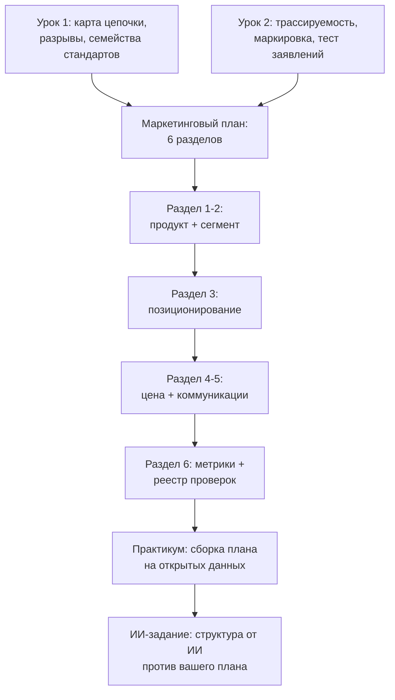

# Собираем маркетинговый план продвижения «зелёной» продукции

> ⏱ **Трудозатраты:** ~14 мин чтения + ~20 мин практики
> Модуль **П15: Устойчивые цепочки и маркетинг**, урок 3 из 3.
> Профессиональный уровень (МСБ). Проект UNDP-KAZ FOLUR. Компоненты FOLUR: **2**, **4**.

## Цели урока и место в модуле

У вас есть карта цепочки с помеченными разрывами ([Урок 1](01-karta-cepochki-stoimosti.md)) и документы, которыми «зелёный» статус передаётся и заявляется ([Урок 2](02-trassiruemost-i-markirovka.md)). Заключительный урок складывает их в **маркетинговый план продвижения «зелёной» продукции** — прикладной продукт модуля: кому продаём, что именно обещаем, по какой ценовой логике, через какие каналы и как измеряем, что план работает. План вы соберёте своими руками в [практикуме](../practicum/01-marketingovyj-plan.md); структуру от ИИ-ассистента получите и проверите в [ИИ-задании](../ai-assistant.md).

После изучения урока слушатель сможет:

1. **[Bloom: знать]** перечислять шесть разделов маркетингового плана «зелёной» продукции по шаблону модуля и типы покупателей устойчивой продукции.
2. **[Bloom: понимать]** объяснять, почему позиционирование «зелёной» продукции строится на документах, а не на эпитетах, и как ценовая логика зависит от выбранного сегмента и канала.
3. **[Bloom: применять]** формулировать позиционирование, выбирать каналы продвижения и собирать план по шаблону для конкретного хозяйства СКО, Костанайской или Акмолинской области.
4. **[Bloom: анализировать]** проверять готовый план — свой или чужой — на разрывы с реальной цепочкой, неподтверждённые заявления и выдуманные рыночные «факты».

> **Границы урока.** Внутри: сегменты и покупатели «зелёной» продукции, позиционирование на документах, каналы и коммуникации, ценовая логика, шаблон плана и его метрики. За рамками: механика трассируемости и маркировки — [Урок 2](02-trassiruemost-i-markirovka.md); финансирование маркетинговых шагов и заявки на поддержку — [П14](../../p14/index.md); сертификация как таковая — [П10](../../p10/index.md). Урок не даёт готовых цифр премий, ёмкостей и бюджетов — он даёт структуру, в которую вы подставите цифры из своих документов и переговоров.

---

## 1. Сегменты: кто на самом деле покупает устойчивость

Маркетинг начинается не с продукта, а с покупателя — для «зелёной» продукции это правило жёстче обычного, потому что «покупателя вообще» у неё нет: есть четыре разных сегмента с разной мотивацией, и каждому нужно разное подтверждение.

**Сегмент 1 — экспортные покупатели регулируемых «зелёных» рынков** (трейдеры и переработчики органики, импортёры устойчивого сырья). Мотивация: обязательства перед своим регулятором и своим потребителем. Требуют максимум: признаваемый сертификат, партионный документооборот, баланс масс ([Урок 2](02-trassiruemost-i-markirovka.md)). Взамен — как правило, наибольшая надбавка (её размер существует только в вашем договоре) и объёмный спрос.

**Сегмент 2 — программные и корпоративные «зелёные» цепочки** (кооперационные платформы, экспортёры и ритейл с обязательствами устойчивости). Мотивация: собственные программы устойчивых закупок. Требуют документированные практики и право проверки; сертификат часто не обязателен. Региональный пример — платформа «зелёной пшеницы» проекта FOLUR ([Урок 1, §2](01-karta-cepochki-stoimosti.md)); это сегмент входа для большинства хозяйств региона.

**Сегмент 3 — переработчики и ритейл внутреннего рынка** с «зелёной» линейкой. Мотивация: дифференциация на полке. Требования разнородны — от сертификата до «истории продукта» с документами; проверяются только переговорами.

**Сегмент 4 — конечный потребитель напрямую** (фермерские форматы, локальные бренды, онлайн). Мотивация: доверие конкретному хозяйству. Требует не столько сертификата, сколько прозрачности и истории; зато вся маркетинговая работа (упаковка, коммуникации, логистика малых партий) ложится на само хозяйство.

Правило выбора — по вашей карте цепочки: сегмент реалистичен, если до него существует путь без разрывов (или разрывы устранимы за понятные деньги) и если его требования к подтверждению вы уже умеете закрывать документами. «Хочу сразу в экспорт органики» при несертифицированном хозяйстве с общим током — не план, а разрыв 1 плюс разрыв 3 из [Урока 1, §3](01-karta-cepochki-stoimosti.md). Реалистичная лестница для типового зернового хозяйства региона: сегмент 2 сейчас → сегмент 1 или 3 по мере готовности документов и статусов.

Кандидата-сегмента недостаточно назвать — его нужно **разведать**, и это делается за неделю без бюджета. Три источника разведки: документы (требования программ и схем — из их публичных материалов, каталога кейсов FOLUR и базы ITC Standards Map), события (региональные мероприятия по устойчивым цепочкам, дни поля, встречи программ — там покупатели сегмента 2 доступны для прямого разговора) и прямые запросы (письмо потенциальному покупателю с одним вопросом: «какие подтверждения устойчивости вы принимаете и в каком виде?»). Итог разведки — таблица «покупатель-кандидат → его требования (письменно) → что из этого у нас уже есть → чего не хватает». Заполненная таблица и есть обоснование выбора сегмента в разделе 2 плана; незаполненная означает, что сегмент выбран по слухам — самый дорогой способ выбора из существующих.

## 2. Позиционирование: обещание, к которому приложены документы

**Позиционирование** — одно короткое утверждение: что ваша продукция, для кого и чем подтверждённо отличается. Для «зелёной» продукции формула модуля такова:

> **[Продукт] для [сегмент] — [подтверждаемое отличие], что подтверждено [документ].**

Например (шаблонно, подставляются ваши данные): «Чечевица для экспортёров органики — сертифицированная по [стандарт] продукция степной зоны с партионной трассируемостью, что подтверждено сертификатом № и паспортами партий». Или для сегмента 2: «Пшеница для программы "зелёной" цепочки — зерно с документированным no-till с [год], что подтверждено журналами хозяйства и правом проверки».

Три следствия формулы. Первое: **каждое позиционирование проходит тест на проверяемость** [Урока 2, §3](02-trassiruemost-i-markirovka.md) — все четыре пункта, без исключений для «рекламных» текстов. Второе: у разных сегментов — разные позиционирования одной и той же продукции; это нормально и правильно, ненормально — одно размытое «мы за экологию» для всех. Третье: позиционирование задаёт **«историю продукта»** — развёрнутый рассказ, которым оно доносится: территория и ландшафт (материал даёт снимок Sentinel-2 и ландшафтный план [П5](../../p5/index.md)), практики и их смысл (no-till и влагосбережение — [П8](../../p8/index.md); севооборот с бобовыми — [П9](../../p9/index.md); связь с восстановлением земель — рамки FAO 10 Elements и LDN из [библиографии](../index.md)), люди и документы. История продукта — это не «легенда», а документированная биография: каждый её факт должен иметь тот же носитель-документ, что и заявления на этикетке.

Проверяется позиционирование не в кабинете, а на живом контрагенте. Быстрый полевой тест: произнесите формулировку закупщику, соседу-фермеру и человеку вне отрасли и задайте каждому два вопроса — «что именно вам здесь обещают?» и «чем это доказано?». Если закупщик пересказывает обещание своими словами и правильно называет документ — формулировка рабочая; если переспрашивает или слышит то, чего вы не говорили, — размыта; если доказательство вспомнить не может — документ упомянут недостаточно явно. Три коротких разговора стоят дешевле любого фокус-исследования и почти всегда возвращают формулировку на доработку — это нормальная часть метода, а не провал.

## 3. Каналы и коммуникации: где план встречается с покупателем

Канал продаж вы выбрали вместе с сегментом (§1); каналы **коммуникации** — то, как позиционирование доходит до людей, принимающих решения. Для МСБ агросектора работают четыре недорогих инструмента, и все они опираются на уже созданные в модуле артефакты.

**Пакет покупателя** — главный инструмент сегментов 1–3: короткое коммерческое предложение + позиционирование + карта цепочки + образец паспорта партии + копии подтверждающих документов. Это буквально сшивка результатов Уроков 1–2; хозяйство с таким пакетом выделяется на переговорах сильнее, чем любой рекламой.

**Отраслевые события и программы** — дни поля, выставки, мероприятия программ устойчивого развития (включая события странового проекта FOLUR): именно там находятся покупатели сегмента 2 и партнёры по кооперации. Цель участия — не «засветиться», а собрать перечень контактов с требованиями каждого.

**Цифровое присутствие** — сайт или страница хозяйства с историей продукта и — принципиально — с разделом «наши подтверждения»: сертификаты, описание системы трассируемости, практики с датами. Для сегмента 4 это основной канал; для остальных — проверочный: покупатель, получивший ваш пакет, зайдёт убедиться, что публичные заявления совпадают с документами.

**Прямые коммуникации** — рассылка потенциальным покупателям сегментов 1–3 и переговоры. Дисциплина та же: ни одного заявления, не прошедшего тест на проверяемость, ни одной цифры «со слов».

Общий принцип бюджета коммуникаций для МСБ: сначала бесплатные и дешёвые инструменты на собственных документах (пакет, события, страница), затем — платные, и только под выбранный сегмент. Конкретные суммы — из ваших смет; если для маркетинговых шагов нужна внешняя поддержка, инструменты и заявки разбирает [П14](../../p14/index.md).

## 4. Ценовая логика и шаблон плана

**Ценовая логика.** Модуль сознательно не называет ни одной премии — но даёт структуру, которой считается любая: **цена канала = базовая рыночная цена продукции + надбавка канала − затраты соответствия − затраты канала**. Базовая цена — из обычной торговой практики хозяйства; надбавка — только из переговоров и договора (ориентиры по рынкам — свежий ежегодник FiBL/IFOAM, база ITC Standards Map — по требованиям схем); затраты соответствия — четыре статьи из [Урока 2, §4](02-trassiruemost-i-markirovka.md); затраты канала — логистика (плечо с вашей карты цепочки), упаковка, комиссии. Считается по каждому сегменту-кандидату отдельно; сегмент со скромной надбавкой и нулевыми новыми затратами часто выигрывает у сегмента с большой надбавкой и дорогим соответствием — это и есть главный расчёт плана.

**Шаблон маркетингового плана модуля** — шесть разделов:

1. **Продукт и подтверждения**: что продаём и какие «зелёные» свойства чем подтверждены (из [Урока 2](02-trassiruemost-i-markirovka.md)).
2. **Сегмент и канал**: выбранный сегмент (§1), конкретные покупатели-кандидаты, путь по карте цепочки без разрывов (из [Урока 1](01-karta-cepochki-stoimosti.md)).
3. **Позиционирование и история продукта** (§2) — по формуле, с приложенными документами.
4. **Ценовая логика** (§4) — формула с источником каждого слагаемого; невыясненные слагаемые уходят в реестр проверок, а не заполняются «примерно».
5. **Коммуникации** (§3): инструменты, календарь на сезон, ответственный.
6. **Метрики и реестр проверок**: как поймём, что план работает, и что обязаны проверить до запуска.

**Метрики** плана — проверяемые события, а не ощущения: получено письменных требований от покупателей-кандидатов (шт.); отправлено пакетов покупателя (шт.); проведено переговоров с протоколом (шт.); подписано протоколов о намерениях / договоров (шт.); доля партий сезона, прошедших с паспортом партии (%); замечания покупательских проверок (шт., с разбором). Плюс дисциплина пересмотра: план пересматривается после каждого сезона, каждой смены покупателя и каждой редакции стандарта — как дорожная карта в [П10, Урок 3](../../p10/lectures/03-rynok-i-dorozhnaya-karta.md).



*Рис. 1. Сборка прикладного продукта модуля: результаты Уроков 1–2 входят в шесть разделов маркетингового плана, план собирается в практикуме и проверяется против ИИ-структуры в ИИ-задании. Alt: блок-схема — карта цепочки и документы подтверждения сходятся в маркетинговый план из шести разделов (продукт и сегмент → позиционирование → цена и коммуникации → метрики и реестр проверок), который затем прорабатывается в практикуме и сверяется с черновиком ИИ-ассистента.*

Последний раздел шаблона — реестр проверок — делает план честным: туда сносится всё, что в момент написания известно «со слов» (условия покупателя, правила маркировки, надбавки, требования схем), с колонками «утверждение → где проверить → статус». Правило то же, что во всём экономическом блоке платформы: **план готов, когда в реестре не осталось непроверенных строк, влияющих на решение**.

Два слова о типовых ошибках, которые ломают планы чаще, чем плохая конъюнктура. **Ошибка «план ради плана»**: документ написан, положен в папку и не привязан к календарю сезона — тогда как каждое действие плана имеет естественное окно (разведка сегментов — зимой, пакеты покупателям — до посевной, паспорта партий — с уборки, пересмотр плана — после закрытия сезона продаж). Раздел 5 без дат — не план, а сочинение. **Ошибка «одного покупателя»**: план, в котором весь «зелёный» объём адресован единственному контрагенту, наследует все его риски; дисциплина модуля — минимум два независимых кандидата на сегмент, а для основной культуры — резервный обычный канал, чтобы срыв «зелёной» сделки не превращался в кризис хозяйства. И симметричное правило честности перед собой: если после расчёта ценовой логики все сегменты дают отрицательный итог, правильный вывод плана — «в этом сезоне продаём обычным каналом и снижаем затраты соответствия», а не подгонка слагаемых под желаемый ответ. Маркетинговый план, умеющий сказать «пока нет», — признак зрелости, и покупатели «зелёных» цепочек это видят и ценят.

---

## Региональный кейс

**Ситуация.** Хозяйство в Акмолинской области: пшеница и лён, второй год документированного no-till и диверсифицированного севооборота ([П9](../../p9/index.md)), учёт по [П1](../../p1/index.md), сертификатов нет. Карта цепочки (по [Уроку 1](01-karta-cepochki-stoimosti.md)) показала: раздельное хранение возможно на собственном складе, до элеватора и станции — рабочее плечо. Руководитель хочет за месяц собрать маркетинговый план: на столе идея маркетолога «делаем бренд эко-муки и продаём напрямую» и приглашение на региональное мероприятие по устойчивым цепочкам с участием экспортёров.

**Данные.** Карта цепочки хозяйства (Sentinel-2 + OpenStreetMap, из практикума); журналы полей; каталог кейсов FOLUR — механизмы «зелёных» цепочек региона; ежегодник FiBL/IFOAM — структура рынков для ориентира; шаблон плана из §4.

**Задача.**

1. Оцените по §1 оба предложения (бренд эко-муки в сегменте 4 против программной цепочки в сегменте 2): требования каждого сегмента против имеющихся документов и цепочки.
2. Сформулируйте позиционирование по формуле §2 для реалистичного сегмента.
3. Соберите разделы 2, 4 и 6 плана: канал, ценовая логика с источниками слагаемых, три метрики первого сезона и три строки реестра проверок.

**Разбор.** «Бренд эко-муки» проваливается на двух проверках сразу: сегмент 4 требует переработки (новое звено цепочки — мельница с собственными требованиями к статусу) и всей маркетинговой машины напрямую потребителю, а слово «эко» без стандарта не проходит тест на проверяемость и создаёт правовой риск ([Урок 2, §3](02-trassiruemost-i-markirovka.md)). Это не «плохая идея навсегда» — это идея не первого шага. Реалистичный первый сегмент — 2: у хозяйства уже есть его входной билет (документированные практики + учёт + раздельное хранение), а мероприятие с экспортёрами — готовый канал контакта. Позиционирование: «Пшеница и лён для программ устойчивых закупок — зерно с документированным no-till и диверсифицированным севооборотом со второго года, с партионной трассируемостью; подтверждено журналами хозяйства и паспортами партий, открыто для проверки покупателя». Раздел 2 плана: сегмент 2, покупатели-кандидаты — участники мероприятия и программы из каталога FOLUR; путь по цепочке: поле → собственный склад (раздельно) → прямой контракт/кооперативная партия. Раздел 4: базовая цена — из текущей торговой практики хозяйства; надбавка — «выяснить в переговорах» (строка реестра); затраты соответствия — время на паспорта партий и порядок на складе (оценить по своим часам); затраты канала — плечо по карте. Метрики сезона: ≥N писем-требований от покупателей-кандидатов собрано, 100% «зелёных» партий с паспортами, ≥1 протокол о намерениях подписан (конкретное N хозяйство ставит себе само — план обязывает к проверяемости, а не к героизму). Реестр проверок: требования конкретной программы (документы программы), условия и надбавка покупателя (только письменно), правила публичного упоминания участия (соглашение с программой). Ни одна цифра в этом разборе не выдумана — и это не случайность, а метод модуля.

---

## Закрепление и применение

!!! tip "Что это даёт вашему хозяйству"
    Шесть разделов шаблона превращают «надо как-то продвигать» в план на сезон с проверяемыми событиями: кому отправлен пакет, что подписано, какая доля партий прошла с паспортом. Даже если первый сезон не даст надбавки, у хозяйства останутся активы: пакет покупателя, история продукта и дисциплина документов — они дорожают с каждым годом практик.

!!! warning "Границы применимости"
    Шаблон плана — структура, а не прогноз: он не гарантирует надбавку и не заменяет переговоры. Все рыночные величины (премии, ёмкости, требования) в момент чтения этого урока могли измениться — их место в вашем плане определяется только свежим первоисточником или подписанным документом. Для продукции переработки и животноводства сегментация §1 требует адаптации. Юридическую чистоту публичных заявлений на конкретном рынке проверяйте по действующему законодательству этого рынка, а не по учебному тексту.

!!! example "Попробуйте в Colab"
    Табличную часть плана (ценовая логика по сегментам, метрики, реестр проверок) удобно вести в таблице с формулами — от Google Sheets до простого ноутбука: `<URL будет назначен при создании репозитория ноутбуков>`. Смысл не в инструменте, а в пересчитываемости: изменилось одно слагаемое — пересчитались все сегменты.

!!! question "Кейс для размышления"
    Через год после запуска плана хозяйство из кейса получает предложение сразу от двух покупателей: программная цепочка со скромной надбавкой и «длинным» договором на три сезона — и разовый экспортный контракт с надбавкой заметно выше, но с требованием сертификата, которого пока нет. Как ценовая логика §4 и карта цепочки помогают сравнить эти предложения корректно — и почему «где больше процент» здесь неправильный вопрос?

### Проверь себя

```quiz
[
  {
    "q": "Несертифицированное хозяйство с документированным no-till и собственным раздельным складом выбирает первый сегмент для «зелёной» продукции. Какой выбор соответствует методике урока?",
    "options": ["Сегмент 2 (программные «зелёные» цепочки): его требования — документированные практики и право проверки — хозяйство уже закрывает", "Сегмент 1 (экспорт органики): там наибольшая надбавка", "Сегмент 4 (прямой бренд для потребителя): не нужны никакие документы", "Любой: сегменты отличаются только ценой"],
    "answer": 0,
    "explain": "§1: сегмент реалистичен, когда его требования уже закрываются документами и путь по цепочке без разрывов; экспорт органики требует сертификата, прямой бренд — переработки и маркетинговой машины."
  },
  {
    "q": "Что обязательного добавляет формула позиционирования модуля к обычному «продукт — для кого — отличие»?",
    "options": ["Компонент «что подтверждено [документ]»: позиционирование обязано проходить тест на проверяемость", "Требование упомянуть всех конкурентов", "Указание цены со скидкой", "Слоган из трёх слов"],
    "answer": 0,
    "explain": "§2: каждое позиционирование проверяется по четырём пунктам теста Урока 2, §3; у разных сегментов — разные позиционирования, но документ обязателен в каждом."
  },
  {
    "q": "По какой структуре урок предлагает считать ценовую логику каждого канала?",
    "options": ["Базовая цена + надбавка канала − затраты соответствия − затраты канала, с указанием источника каждого слагаемого", "Средняя мировая премия за органику, применённая ко всем каналам", "Только размер надбавки: остальное несущественно", "Цена конкурента минус 10%"],
    "answer": 0,
    "explain": "§4: сегмент со скромной надбавкой и нулевыми новыми затратами часто выигрывает — увидеть это можно только полной формулой; неизвестные слагаемые уходят в реестр проверок."
  },
  {
    "q": "Какая из формулировок — корректная метрика маркетингового плана по уроку?",
    "options": ["«Доля партий сезона, отгруженных с паспортом партии, — 100%» — проверяемое событие с документальным следом", "«Узнаваемость нашей экологичности выросла»", "«Покупатели стали лояльнее»", "«Рынок оценил нашу устойчивость»"],
    "answer": 0,
    "explain": "§4: метрики плана — проверяемые события (пакеты, протоколы, паспорта партий, замечания проверок), а не ощущения."
  },
  {
    "q": "Когда маркетинговый план по правилу модуля считается готовым?",
    "options": ["Когда в реестре проверок не осталось непроверенных строк, влияющих на решение", "Когда написаны все шесть разделов, независимо от источников цифр", "Когда план одобрил ИИ-ассистент", "Когда в плане появились конкретные суммы премий из лекций модуля"],
    "answer": 0,
    "explain": "§4: реестр проверок делает план честным — всё «со слов» либо подтверждается первоисточником, либо не влияет на решение; лекции модуля цифр премий не содержат сознательно."
  }
]
```

## Что дальше?

Теория модуля закрыта — дальше руки. [Практикум](../practicum/01-marketingovyj-plan.md): за 60–90 минут соберите карту цепочки и маркетинговый план модельного (или своего) хозяйства на открытых данных. Затем [ИИ-задание](../ai-assistant.md): получите структуру плана от ИИ-ассистента и проверьте её против собственной. Финал — [итоговая аттестация](../assessment/final.md) (11 MCQ + сценарный кейс, порог 75%). Смежные маршруты: финансирование шагов плана — [П14](../../p14/index.md), путь к органическому статусу — [П10](../../p10/index.md).
