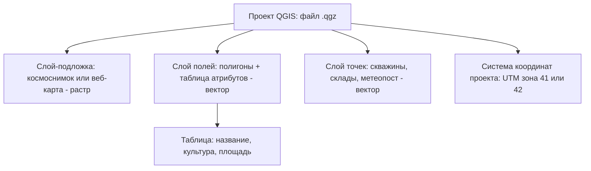

# Устанавливаем QGIS и собираем первый проект хозяйства

> ⏱ **Трудозатраты:** ~17 мин чтения + ~30 мин практики
>
> Модуль **[П2: Введение в ГИС и открытые геоданные](../index.md)**, урок 1.
> Профессиональный уровень (практики). Проект UNDP-KAZ-00683, FOLUR. Компоненты FOLUR: **1**, **2**.

## Цели урока и место в модуле

Этот урок — точка входа в геоинформационные системы для человека, который никогда с ними не работал. К концу урока на вашем компьютере будет стоять бесплатная программа QGIS, а в ней — сохранённый проект вашего хозяйства с картографической подложкой, на которой вы находите свои поля. Всё остальное в модуле — космоснимки в уроке 2, оцифровка границ и выпуск карты в уроке 3 — будет надстраиваться над этим проектом.

После изучения урока вы сможете:

1. **[Bloom: знать]** называть, что такое ГИС, слой, проект и подложка, и где взять QGIS бесплатно и легально.
2. **[Bloom: понимать]** объяснять, чем векторный слой (границы, точки) отличается от растрового (снимок), и зачем проекту нужна правильная система координат.
3. **[Bloom: применять]** устанавливать QGIS, подключать картографическую подложку и сохранять проект хозяйства со своей структурой папок.
4. **[Bloom: анализировать]** определять по поведению карты типовые проблемы новичка — «всё уехало в океан», «площадь считается в градусах» — и понимать их причину.

> **Границы лекции.** Внутри: что такое ГИС и QGIS, установка, интерфейс, слои и подложки, минимум о системах координат, сохранение проекта. Снаружи: откуда брать космоснимки и другие открытые данные — это [урок 2](02-open-data-sentinel.md); рисование границ полей и выпуск карты — [урок 3](03-digitize-and-map.md); строгая теория проекций и топологии — академический модуль [А2](../../a2/index.md), сюда мы берём из неё только практический минимум. Подробнее об организации файлов и журналов хозяйства — в [П1](../../p1/index.md).

---

## 1. Что такое ГИС и зачем она хозяйству

Геоинформационная система (ГИС) — это программа, которая работает с данными, привязанными к месту на Земле. Обычная таблица отвечает на вопрос «сколько»; ГИС добавляет вопрос «где». Поле № 3 — это не только «пшеница, 250 га», но и конкретный контур на местности, у которого есть соседи, рельеф, расстояние до тока и склада.

Для хозяйства это даёт три практические вещи. Во-первых, **единую картину**: все поля, дороги, колки и водоёмы видны на одном экране, а не в голове у одного человека. Во-вторых, **измерения**: площадь поля, длину объезда, расстояние до элеватора можно получить щелчком мыши. В-третьих, **язык общения**: карту понимает агроном, банк, партнёр и акимат — в отличие от устного «за лесополосой направо».

Ключевая идея любой ГИС — **слои**. Представьте стопку прозрачных плёнок над столом: на нижней — космоснимок, выше — контуры полей, ещё выше — точки скважин, сверху — подписи. Каждая плёнка — отдельный слой: его можно включить, выключить, перекрасить или отдать коллеге, не трогая остальные. Порядок в стопке важен: слой сверху закрывает то, что под ним.

Слои бывают двух типов, и различие стоит запомнить сразу:

- **векторный слой** — объекты с границами: точки (скважина, метеопост), линии (дорога, канал), полигоны (поле, контур озера). У каждого объекта есть строка в таблице: название, культура, год;
- **растровый слой** — сплошная сетка ячеек-пикселей: космоснимок, карта высот. У растра нет «объектов», есть значения в каждой ячейке.

Практическое правило: то, что вы будете *рисовать* (границы полей), — вектор; то, что вы будете *подкладывать* для ориентировки (снимок), — растр. Подробное сравнение двух моделей — в [А2, урок 1](../../a2/lectures/01-vector-raster-projections.md); для нашего модуля достаточно этого правила.



*Рис. 1. Устройство проекта QGIS: один файл проекта собирает стопку слоёв над общей системой координат. Alt: схема — проект QGIS связывает растровую подложку, векторный слой полей с таблицей атрибутов, векторный слой точек и общую систему координат UTM.*

## 2. Устанавливаем QGIS: бесплатно и без лицензий

**QGIS** — свободная геоинформационная система с открытым кодом. Она бесплатна для любого использования, включая коммерческое: хозяйство не платит ни за установку, ни за обновления, ни за «рабочие места». Это принципиальный выбор платформы: весь стек модулей — открытый, чтобы навык не зависел от бюджета на лицензии.

Порядок установки:

1. Откройте официальный сайт <https://qgis.org> и перейдите в раздел загрузки (Download).
2. Выберите свою операционную систему. Для Windows скачивайте установщик **LTR** (Long Term Release — версия долгосрочной поддержки): она обновляется реже и стабильнее, что для рабочей машины важнее новинок.
3. Запустите установщик и соглашайтесь с настройками по умолчанию. Программа занимает несколько гигабайт — проверьте место на диске.
4. После установки запустите QGIS Desktop. Интерфейс автоматически подхватывает язык системы; если нужно — язык меняется в меню «Установки → Параметры → Общие».

!!! warning "Откуда не надо ставить"
    Скачивайте QGIS только с официального сайта qgis.org. Сторонние «сборки» с файлообменников могут быть устаревшими или заражёнными. Официальная версия не требует ключей, регистрации и активации — если установщик просит «купить лицензию», это не QGIS.

Если компьютер старый и версия LTR работает медленно, начните всё равно с неё: для задач нашего модуля — подложка, десяток полигонов, экспорт карты — производительности хватает почти на любой машине последних десяти лет.

## 3. Осматриваемся в интерфейсе

Запустите QGIS и создайте новый проект (Проект → Создать). Экран состоит из четырёх главных зон:

- **окно карты** — центральная область, где отображаются слои;
- **панель слоёв** (обычно слева) — та самая «стопка плёнок»: здесь слои включаются флажками и перетаскиваются по порядку;
- **панель браузера** — проводник по файлам и подключениям к данным;
- **панели инструментов** сверху — навигация, измерения, редактирование.

Три навигационных инструмента, которыми вы будете пользоваться постоянно: **лупа** (приблизить/отдалить, удобнее — колесо мыши), **рука** (перемещение по карте, зажатое колесо мыши) и **«Полный охват»** — кнопка, возвращающая карту к виду всех слоёв сразу. Последняя — спасательный круг новичка: если вы «улетели» неизвестно куда, нажмите её.

Внизу окна — **строка состояния**. В ней три важных индикатора: текущие координаты курсора, масштаб и код системы координат проекта (например, `EPSG:4326` или `EPSG:32641`). Что означают эти коды — через один раздел.

Ещё один инструмент первого дня — **измерение**. На панели инструментов есть линейка: ею можно измерить расстояние, а в выпадающем списке — площадь. Найдите на подложке знакомый объект (зерновой ток, машинный двор) и измерьте его: если результат правдоподобен, проект настроен верно. Это первый пример главного правила платформы — результат проверяется независимым знанием, в данном случае вашим знанием местности.

## 4. Подключаем подложку: карта мира одним щелчком

Пустой проект — это белый экран. Чтобы появилась карта, нужен первый слой — **подложка**: готовая веб-карта, которую QGIS подгружает из интернета по мере перемещения.

Самый удобный способ — плагин **QuickMapServices**:

1. Меню «Модули → Управление модулями…», в поиске наберите `QuickMapServices`, нажмите «Установить».
2. После установки в меню «Интернет» появится пункт QuickMapServices. Выберите в нём **OSM → OSM Standard** — это карта OpenStreetMap, свободная карта мира, которую наполняют сами пользователи.
3. В окне карты появится карта мира. Колесом мыши приблизьтесь к своему району — Северный Казахстан прорисован в OSM достаточно подробно: сёла, дороги, многие полевые массивы.

В том же плагине через «Настройки → Подключить дополнительные сервисы» доступны и **спутниковые мозаики** (например, Esri Imagery) — сшитые из космоснимков «фотографии» Земли. Для ориентировки они удобны, но у них есть два ограничения, о которых надо знать: дата съёмки в мозаике неизвестна и различается от места к месту, а условия использования сервисов ограничивают их применение за пределами подложки. Актуальный снимок с известной датой мы научимся получать в [уроке 2](02-open-data-sentinel.md) — из открытых источников Sentinel-2.

Подложка — это **растровый слой только для чтения**: рисовать по ней нельзя, редактировать её нельзя. Она нужна как основа для ориентировки и как «миллиметровка», по которой в уроке 3 мы будем обводить границы полей.

Два практических замечания про подложки. Первое: они требуют интернета. Если вы планируете работать с проектом в поле, где связи нет, — заранее приблизьтесь к нужной территории в офисе, чтобы фрагменты карты остались в кэше, или подготовьте офлайн-снимок (как это сделать — в [уроке 2](02-open-data-sentinel.md)). Второе: подложек в проекте может быть несколько — например, OSM для подписей дорог и спутниковая мозаика для «фотографии» местности. Держите обе в проекте и переключайте флажками в панели слоёв по задаче: сверить название села — OSM, посмотреть контур залежи — снимок.

### 4.1 Первичное оформление слоёв

Каждый слой можно оформить под себя — это не украшательство, а читаемость будущей карты. Двойной щелчок по слою в панели слоёв открывает его **свойства**; вкладка «Символика» отвечает за внешний вид. Для будущего слоя полей типичная настройка такая: заливка полупрозрачная или отключена, обводка — яркая контрастная линия толщиной 0,5–1 мм. Тогда границы видны, а снимок под ними — не закрыт.

Здесь же, на вкладке «Прозрачность», регулируется общая прозрачность слоя. Приём, которым пользуются постоянно: полупрозрачный тематический слой поверх снимка позволяет видеть и то и другое одновременно. А вкладка «Подписи» умеет подписывать объекты значением из таблицы атрибутов — например, именем поля. К подписям мы вернёмся в [уроке 3](03-digitize-and-map.md), когда таблица атрибутов появится.

## 5. Система координат: минимум, без которого нельзя

Земля круглая, экран плоский. Любая карта — это способ «развернуть» круглую поверхность на плоскость, и способов таких много. Каждый способ — **система координат** (СК); в QGIS они обозначаются кодами EPSG.

Практику достаточно различать две:

- **EPSG:4326 (WGS 84)** — географические координаты, градусы широты и долготы. Это «язык GPS»: именно в градусах отдают координаты навигатор и смартфон. Для хранения и обмена — отлично; для измерения площадей — плохо, потому что «квадратный градус» не является нормальной единицей площади.
- **UTM — метровые зоны**. Мир нарезан на вертикальные зоны по 6° долготы, внутри каждой координаты считаются в метрах. Для Северного Казахстана рабочие зоны две: **EPSG:32641 (зона 41N)** — западнее меридиана 66° в.д. (большая часть Костанайской области) и **EPSG:32642 (зона 42N)** — восточнее (СКО, Акмолинская область). Площади и расстояния в этих СК считаются в привычных метрах и гектарах.

Правило модуля простое: **система координат проекта — метровая зона UTM вашей области**. Установить её — меню «Проект → Свойства → Система координат», в поиске набрать `32641` или `32642`. QGIS умеет перепроецировать слои «на лету», поэтому подложка в другой СК всё равно отобразится правильно — но измерения и будущая оцифровка должны жить в метрах.

Как понять, какая зона ваша? Посмотрите долготу своего хозяйства в строке состояния (наведя курсор на свои поля при СК проекта EPSG:4326) или в смартфоне. Долгота меньше 66° — зона 41N; больше — зона 42N. Хозяйство ровно на границе зон — редкий случай; берите зону, где лежит большая часть земель.

Существуют и государственные системы координат Казахстана — в них ведётся официальная геодезия и картография (единая государственная система QazTRS-22 введена постановлением Правительства РК № 208 от 14.03.2023). Для внутренних рабочих карт хозяйства они не нужны: зоны UTM на открытых данных полностью закрывают задачи модуля, а официальные системы остаются сферой лицензированных геодезистов. Если когда-нибудь подрядчик передаст вам данные «в государственной системе координат» — это повод для консультации со специалистом, а не для самостоятельных преобразований.

Симптомы неправильной СК узнаются сразу. Если слой «уехал в океан» у берегов Африки — координаты в градусах прочитаны как метры (точка 63° долготы превратилась в 63 метра от нулевого меридиана). Если измеренная площадь поля — крошечная дробь врода 0,0003 — вы измеряете в квадратных градусах. В обоих случаях лечение одно: проверить СК проекта и слоя.

## 6. Сохраняем проект и наводим порядок в файлах

**Проект QGIS** — файл с расширением `.qgz`. Важно понимать: проект хранит не сами данные, а *ссылки* на них плюс оформление — какие слои подключены, как раскрашены, какая СК. Если переместить или удалить файл данных, проект при открытии сообщит о «потерянном слое».

Отсюда — дисциплина, которая сэкономит вам часы:

1. Создайте папку хозяйства, например `moya-ferma-gis/`, а в ней подпапки `data/` (данные) и `maps/` (готовые карты).
2. Сохраните проект в корень этой папки: «Проект → Сохранить как…» → `ferma.qgz`.
3. Все файлы данных, которые появятся в уроках 2–3 (снимки, слой полей), складывайте только в `data/` — тогда папку можно целиком копировать на флешку или другой компьютер, и проект откроется без потерь.
4. Возьмите за правило сохранять проект после каждого осмысленного шага (Ctrl+S) — QGIS не всегда напоминает об этом сам.

Такая структура — младшая сестра системы учёта данных из модуля [П1](../../p1/index.md): один источник правды, понятные имена, резервная копия. Если вы прошли П1 — просто добавьте ГИС-папку в свою схему резервного копирования.

И последнее в этом уроке — про имена файлов. Называйте файлы латиницей, без пробелов, с датой там, где она важна: `polya-2026.gpkg` лучше, чем «Новая папка (2) / поля ИТОГ окончат.shp». Кириллица и пробелы в путях — исторический источник трудноуловимых ошибок в геоинструментах; дисциплина имён бесплатна, а экономит часы. Через год, когда снимков и версий слоёв накопится десяток, вы скажете себе спасибо.

> **Подробнее** — про форматы файлов геоданных (GeoPackage, GeoTIFF, KML) мы поговорим в [уроке 3](03-digitize-and-map.md), когда они вам реально понадобятся.

---

## Региональный кейс

**Ситуация.** Фермерское хозяйство в Кызылжарском районе Северо-Казахстанской области обрабатывает несколько полевых массивов вокруг села. Руководитель до сих пор ориентируется по бумажной схеме, унаследованной от прежнего хозяйства: она истёрлась, новых полей на ней нет, а копий не существует. Нужно завести цифровую основу — проект QGIS, в котором видно все земли хозяйства.

**Данные:** подложка OpenStreetMap через плагин QuickMapServices (бесплатно, без регистрации); собственное знание местности. Дополнительно для сверки: <https://www.openstreetmap.org> в браузере.

**Задача:**

1. Создать проект QGIS с системой координат EPSG:32642 (СКО — восточнее 66° в.д., зона 42N) и подложкой OSM.
2. Найти на подложке своё село и полевые массивы; измерить инструментом линейки расстояние от машинного двора до самого дальнего поля.
3. Проверить: прорисованы ли в OSM полевые дороги, которыми реально пользуется хозяйство.

**Разбор.** Кейс намеренно прост — это первый самостоятельный проект. Главные ожидаемые наблюдения: село и основные дороги в OSM есть, часть полевых дорог — отсутствует (OSM наполняют пользователи, и степные просёлки прорисованы неравномерно — это нормальное свойство открытых данных, а не дефект). Расстояние, измеренное линейкой при метровой СК проекта, должно совпасть с показаниями одометра машины с точностью до изгибов дороги — это и есть независимая проверка настройки проекта. Отсутствующие контуры полей — не проблема: в уроке 3 вы нарисуете их сами, и точнее любой публичной карты.

---

## Закрепление и применение

!!! example "Попробуйте в QGIS"
    Прямо сейчас, за 15 минут: установите QGIS LTR с qgis.org → создайте проект → установите СК вашей зоны UTM (32641 или 32642) → подключите OSM через QuickMapServices → найдите своё хозяйство → измерьте площадь одного знакомого поля линейкой → сохраните проект в папку `moya-ferma-gis/`. Если площадь получилась правдоподобной (сравните с документами хозяйства) — урок усвоен.

!!! warning "Границы применимости"
    Подложки — OSM и спутниковые мозаики — это ориентировка, а не документ. Дата съёмки мозаики неизвестна, полнота OSM в степной зоне неравномерна, а измерение по экрану не заменяет межевание: юридические границы участка определяет земельная документация, а не ваш контур в QGIS. Карта из этого модуля — рабочий инструмент хозяйства, не кадастровый документ.

!!! tip "Что это даёт вашему хозяйству"
    Один сохранённый проект QGIS заменяет истёршуюся бумажную схему и «карту в голове». Уже после первого урока вы можете: измерять расстояния и площади без выезда в поле, показывать землю партнёру на экране, а не на пальцах, и готовить основу, на которую в П3 ляжет NDVI-мониторинг состояния посевов.

!!! question "Кейс для размышления"
    Агроном соседнего хозяйства измерил площадь поля в QGIS и получил 0,00021 вместо ожидаемых ~180 га. Программа «сломалась»? Сформулируйте диагноз (в какой системе координат живёт его проект и в каких единицах посчитана площадь) и лечение — прежде чем свериться с §5.

### Проверь себя

```quiz
[
  {
    "q": "Что хранит файл проекта QGIS (.qgz)?",
    "options": [
      "Ссылки на файлы данных и оформление: состав слоёв, их порядок, стили, систему координат",
      "Копии всех данных: снимки и слои упакованы внутрь файла проекта",
      "Только последний экспортированный PDF карты",
      "Лицензионный ключ и настройки учётной записи пользователя"
    ],
    "answer": 0,
    "explain": "§6: проект — это ссылки на данные плюс оформление; сами данные живут отдельными файлами, поэтому папку хозяйства переносят целиком."
  },
  {
    "q": "Границы полей, которые вы собираетесь рисовать, и космоснимок под ними — это соответственно:",
    "options": [
      "Оба векторные слои — всё, что видно на карте, вектор",
      "Векторный слой (полигоны с таблицей атрибутов) и растровый слой (сетка пикселей)",
      "Растровый слой и векторный слой",
      "Оба растровые слои — всё, что скачано из интернета, растр"
    ],
    "answer": 1,
    "explain": "§1: то, что рисуем, — вектор (объекты с границами и атрибутами); то, что подкладываем для ориентировки, — растр (сетка пикселей)."
  },
  {
    "q": "Хозяйство в Костанайской области, долгота полей около 63° в.д. Какую систему координат выбрать для проекта?",
    "options": [
      "EPSG:4326 — ведь GPS выдаёт координаты именно в ней",
      "EPSG:32642 — зона 42N, как в примере урока для СКО",
      "EPSG:32641 — зона 41N: долгота меньше 66° в.д.",
      "Любую: QGIS перепроецирует на лету, разницы нет"
    ],
    "answer": 2,
    "explain": "§5: правило — метровая зона UTM своей области; западнее 66° в.д. это зона 41N (EPSG:32641). «На лету» решает только отображение, но не корректность измерений и оцифровки."
  },
  {
    "q": "После добавления слоя карта «уехала» к берегам Африки, хотя данные — по СКО. Наиболее вероятная причина:",
    "options": [
      "Слой повреждён и его надо скачать заново",
      "Координаты в градусах прочитаны как метры: слою назначена неверная система координат",
      "QGIS не поддерживает территорию Казахстана",
      "Слишком мелкий масштаб — надо просто приблизиться колесом мыши"
    ],
    "answer": 1,
    "explain": "§5: классический симптом перепутанной СК — значения долготы/широты (десятки градусов) интерпретируются как десятки метров от нулевой точки, и слой оказывается у пересечения экватора и нулевого меридиана."
  },
  {
    "q": "Почему модуль рекомендует версию QGIS LTR, а не самую свежую?",
    "options": [
      "LTR — единственная бесплатная версия, остальные платные",
      "LTR — версия долгосрочной поддержки: стабильнее для рабочей машины, что важнее новинок",
      "Только LTR имеет русский интерфейс",
      "Свежие версии не работают в Казахстане"
    ],
    "answer": 1,
    "explain": "§2: все версии QGIS бесплатны и локализованы; LTR выбирается за стабильность — для производственной работы это ценнее свежих функций."
  }
]
```

## Что дальше?

Проект создан, подложка есть — но подложка не отвечает на вопрос «как моё поле выглядит *сейчас*». В **[уроке 2 «Находим своё хозяйство на космоснимке»](02-open-data-sentinel.md)** мы разберём открытые источники спутниковых данных — Sentinel-2, Landsat, ESA WorldCover — и добавим в проект настоящий снимок с известной датой. Затем в [уроке 3](03-digitize-and-map.md) по этому снимку будут оцифрованы границы полей. Если хотите глубже понять слои, форматы и проекции — параллельно читайте [урок 1 модуля А2](../../a2/lectures/01-vector-raster-projections.md): это тот же материал на академической глубине.
