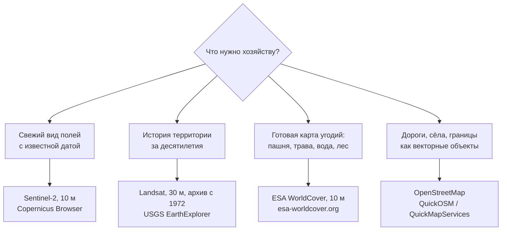

# Находим своё хозяйство на космоснимке: открытые данные Sentinel и Landsat

> ⏱ **Трудозатраты:** ~17 мин чтения + ~30 мин практики
>
> Модуль **[П2: Введение в ГИС и открытые геоданные](../index.md)**, урок 2.
> Профессиональный уровень (практики). Проект UNDP-KAZ-00683, FOLUR. Компоненты FOLUR: **1**, **2**.

## Цели урока и место в модуле

В [уроке 1](01-qgis-first-project.md) вы собрали проект с веб-подложкой — картинкой неизвестной даты. Этого мало: хозяйству нужен снимок, про который известно, *когда* он сделан и *что* на нём видно. Хорошая новость: человечество бесплатно раздаёт космоснимки всей планеты, снятые каждые несколько дней. Этот урок — о том, где их брать, как выбирать и как положить в свой проект QGIS. К концу урока в вашем проекте будет безоблачный снимок Sentinel-2 вашего района со свежей датой.

После изучения урока вы сможете:

1. **[Bloom: знать]** перечислять главные открытые источники геоданных: Sentinel-2, Landsat, OpenStreetMap, ESA WorldCover, data.gov.kz — и что именно даёт каждый.
2. **[Bloom: понимать]** объяснять, что такое пространственное разрешение и периодичность съёмки, и что реально видно на пикселе 10 м.
3. **[Bloom: применять]** находить в Copernicus Browser безоблачный снимок своего района, скачивать его и добавлять в проект QGIS.
4. **[Bloom: анализировать]** выбирать источник данных под задачу хозяйства: свежий обзор полей, история за 30 лет или карта земного покрова — и оценивать пригодность конкретного снимка (облака, сезон, дата).

> **Границы лекции.** Внутри: источники открытых данных, разрешение и периодичность, поиск и скачивание снимка Sentinel-2, лицензии простыми словами. Снаружи: рисование границ по снимку — [урок 3](03-digitize-and-map.md); анализ состояния посевов по снимкам (NDVI и другие индексы) — модуль [П3](../../p3/index.md); съёмка с дрона, когда спутника не хватает, — [П7](../../p7/index.md); программный доступ к каталогам данных — академические модули [А1–А3](../../a1/index.md).

---

## 1. Почему космоснимки бесплатны и кто их раздаёт

Две крупнейшие космические программы наблюдения Земли — европейская **Copernicus** и американская **Landsat** — публикуют данные открыто: любой человек может скачать снимок без оплаты, для любых целей, включая коммерческие. Это осознанная политика: открытые данные окупаются через развитие сельского хозяйства, страхования, экологического мониторинга.

Для практика Северного Казахстана важны три источника:

- **Sentinel-2** (программа Copernicus, Европейский союз) — оптические снимки с разрешением основных каналов **10 метров**. Пара спутников снимает одну и ту же территорию раз в несколько дней. Доступ — через **Copernicus Data Space Ecosystem** (<https://dataspace.copernicus.eu/>): бесплатная регистрация, встроенный просмотрщик Copernicus Browser.
- **Landsat** (USGS/NASA, США) — разрешение 30 метров, зато архив ведётся **с 1972 года**. Это машина времени: как выглядела ваша степь до распашки залежей, где стояла вода в многоводные годы. Доступ — USGS EarthExplorer (<https://earthexplorer.usgs.gov/>), бесплатная регистрация.
- **ESA WorldCover** — не снимок, а готовая **карта земного покрова** с разрешением 10 м: пашня, травянистые угодья, вода, древесная растительность, застройка. Скачивается свободно (<https://esa-worldcover.org/>, лицензия CC BY 4.0).

К ним добавляются два негеокосмических источника из урока 1 и один казахстанский:

- **OpenStreetMap** — свободная векторная карта: дороги, сёла, границы. Кроме подложки, из OSM можно выгружать сами объекты (этим займёмся в практикуме через плагин QuickOSM);
- **data.gov.kz** — портал открытых данных РК: ведомственные наборы (справочники, реестры), которые полезны как атрибутивная информация к карте.

## 2. Разрешение: что видно с высоты 10 метров на пиксель

**Пространственное разрешение** — размер одного пикселя снимка на местности. Это первое число, которое надо узнавать о любом снимке, потому что оно определяет, что вы вообще способны разглядеть.

Правило большого пальца: уверенно различим объект размером в несколько пикселей. Отсюда практическая таблица для агроландшафта Северного Казахстана:

| Объект | Sentinel-2 (10 м) | Landsat (30 м) |
|---|---|---|
| Полевой массив 100–400 га | отлично виден, границы читаются | виден, границы грубее |
| Лесополоса шириной 15–30 м | видна как линия | на пределе, местами пропадает |
| Колок, западина, солонцовое пятно от ~0,5 га | видны | видны только крупные |
| Отдельная машина, посевной рядок, куст | не видны | не видны |

Вывод для модуля: для карты хозяйства с границами полевых массивов **Sentinel-2 достаточно**. Если задача мельче — пересчитать всходы, найти очаг сорняка — нужен дрон с сантиметровым разрешением: это тема модуля [П7](../../p7/index.md), и спутник там не конкурент, а напарник.

Полезно сразу привыкнуть к переводу «пиксели → гектары»: пиксель Sentinel-2 размером 10×10 м — это 0,01 га, то есть в одном гектаре — сто пикселей. Поле в 200 га на снимке — примерно двадцать тысяч пикселей: более чем достаточно, чтобы уверенно вести по нему границу. А вот западина в пять соток — половина пикселя: она в лучшем случае чуть изменит тон одной ячейки.

Второй параметр — **периодичность**: как часто спутник возвращается к вашей точке. Sentinel-2 проходит над одним местом раз в несколько дней, Landsat — реже. Но снимок полезен, только если в момент съёмки не было облаков: реальная частота «хороших» снимков в сезон — величина переменная, и именно поэтому просмотрщики показывают процент облачности каждой сцены.



*Рис. 1. Выбор открытого источника геоданных по задаче хозяйства. Alt: блок-схема — четыре типовые задачи (свежий вид полей, история, карта угодий, векторные объекты) ведут к четырём источникам: Sentinel-2, Landsat, ESA WorldCover, OpenStreetMap.*

## 3. Copernicus Browser: ищем безоблачный снимок своего района

**Copernicus Browser** — веб-просмотрщик на <https://dataspace.copernicus.eu/>: он позволяет листать снимки Sentinel-2 как ленту, не скачивая гигабайты. Порядок работы:

1. Зарегистрируйтесь (бесплатно) и войдите в Browser.
2. Найдите свой район: строка поиска понимает названия населённых пунктов; можно просто прокрутить карту к своему хозяйству.
3. Выберите набор данных **Sentinel-2 L2A** — это снимки с уже выполненной атмосферной коррекцией, «чистые» цвета.
4. Задайте диапазон дат (например, последний месяц вегетации) и **фильтр облачности** — начните с порога около 10–20%.
5. Листайте доступные даты. Визуализация True color показывает снимок в естественных цветах — как видел бы глаз.

Как выбрать «правильную» дату? Три вопроса к сцене:

- **Облака.** Даже при низкой общей облачности проверьте глазами именно свои поля: сцена огромна, и облако может стоять ровно над вами. Ищите также тени облаков — тёмные пятна, сдвинутые вбок от белых.
- **Сезон.** Для оцифровки границ полей лучше всего работают снимки, где поля контрастны между собой: разгар вегетации (поля разной культуры и сроков сева различаются тоном) или период после уборки (стерня против паров). Снежный покров прячет границы — зимние снимки для нашей задачи почти бесполезны.
- **Дата.** Для рабочей карты берите свежий снимок; для сравнения «было–стало» — пару снимков разных лет, близких по сезону.

Этот навык — листать календарь снимков и оценивать их пригодность — сам по себе ценен: вы сможете раз в неделю за пять минут визуально осматривать все свои поля, не выезжая из конторы.

### 3.1 Сравнение во времени: приём «два окна»

Одиночный снимок отвечает на вопрос «как сейчас», пара снимков — на вопрос «что изменилось». В Copernicus Browser удобно открыть одну и ту же территорию на две даты и переключаться между ними: глаз мгновенно ловит различия, которые в цифрах пришлось бы искать долго. Типовые пары для хозяйства: начало и разгар вегетации (равномерность развития), до и после сильного дождя (вымочки и стоячая вода в западинах), этот год и прошлый в ту же декаду (сравнение сезонов).

Здесь же формируется полезная привычка: записывать даты просмотренных сцен в журнал наблюдений хозяйства (шаблоны журналов — модуль [П1](../../p1/index.md)). Запись «поле 7 неоднородно на снимке от такой-то даты, осмотрено на месте, причина — вымочка» через сезон превращается в историю поля, которая стоит дороже любой памяти.

## 4. Забираем снимок в QGIS

Просмотрщик хорош для осмотра, но карта хозяйства строится в QGIS. Есть два пути затащить снимок в проект.

**Путь A — скачать фрагмент из Copernicus Browser.** В Browser есть функция выгрузки текущего вида (иконка загрузки): она сохраняет видимую область как изображение, в том числе **GeoTIFF с геопривязкой** — тогда файл ляжет в QGIS точно на своё место. Порядок: приблизьтесь так, чтобы всё хозяйство и ближайшие ориентиры попали в кадр → выберите формат TIFF (высокое разрешение) → скачайте → перетащите файл в окно QGIS. Проверьте в свойствах слоя, что у него есть система координат. Для задач модуля этого пути достаточно, и он не требует тяжёлых загрузок.

**Путь B — скачать сцену целиком.** Полная сцена Sentinel-2 — архив в несколько сотен мегабайт со всеми спектральными каналами. Он нужен, когда вы перерастёте «картинку»: индексы вегетации, свои композиты каналов. В нашем модуле полную сцену не используем; когда понадобится — этому учат [П3](../../p3/index.md) (через готовые сервисы) и [А2/А3](../../a2/index.md) (через работу с каналами).

Скачанный GeoTIFF положите в папку `data/` проекта (дисциплина из [урока 1, §6](01-qgis-first-project.md)) и дайте имя с датой: `sentinel2-2026-06-15.tif` (дата — из метаданных сцены в Browser). Через год таких файлов будет много, и дата в имени — единственное, что спасёт от путаницы.

Теперь в панели слоёв у вас два растровых слоя: веб-подложка и собственный снимок с известной датой. Подложку можно выключить — «миллиметровкой» для оцифровки в уроке 3 будет именно ваш снимок.

### 4.1 Проверяем, что снимок лёг на место

Любые данные, попавшие в проект, проходят входной контроль — привычка, которая в этом модуле важнее любой отдельной кнопки. Для скачанного снимка контроль занимает минуту и состоит из трёх сверок:

1. **Совпадение с подложкой.** Включите веб-подложку поверх снимка с прозрачностью около 50% (урок 1, §4.1): дороги и контуры сёл на снимке и подложке должны совпадать. Сдвиг на сотни метров — признак файла без геопривязки или с неверной СК.
2. **Известный объект.** Найдите на снимке объект, положение которого знаете точно: перекрёсток у конторы, плотину пруда. Он должен быть там, где ему положено быть.
3. **Свойства слоя.** В свойствах растра проверьте, что система координат указана (не «неизвестная»), а размер пикселя после пересчёта в метры близок к заявленным 10 м.

Если контроль не пройден — не «подтягивайте» снимок вручную: скачайте заново, выбрав в Browser именно геопривязанный формат TIFF. Ошибка на этом шаге молча испортит всю оцифровку урока 3, поэтому дешевле переделать скачивание, чем искать причину позже.

## 5. WorldCover и OSM: готовые слои, которые не надо рисовать

Прежде чем рисовать что-то самому, проверьте — не нарисовано ли уже.

**ESA WorldCover** отвечает на вопрос «что где растёт» в масштабе района: пашня, травянистые угодья, кустарник, вода, застройка. Слушателю П2 он полезен двумя способами: как проверка собственной карты (ваши поля должны попадать в класс «пашня») и как обзорный слой окружения хозяйства — где ближайшие естественные угодья, сколько вокруг воды. Скачивается тайлами с <https://esa-worldcover.org/>; тайл кладётся в QGIS так же, как снимок.

**OpenStreetMap как источник векторных объектов.** Плагин **QuickOSM** (ставится через «Управление модулями», как QuickMapServices) выгружает из OSM объекты по типу: все дороги района, границы населённых пунктов, водные объекты. Эти слои — настоящий вектор: их можно перекрашивать, подписывать и класть на свою карту. Помните ограничение из урока 1: полнота OSM в степной зоне неравномерна, поэтому выгруженный слой — черновик, который сверяют со снимком.

**data.gov.kz** — портал открытых данных государственных органов РК. Геоданных в привычном смысле там немного, но есть ведомственные справочники и реестры, которые становятся атрибутами вашей карты: перечни населённых пунктов, данные по районам. Практический приём работы с порталом: ищите по названию своей области и оценивайте каждый набор критически — дату актуализации, полноту, формат. Навык критической оценки чужого датасета — из тех, что пригодятся далеко за пределами ГИС; системно он ставится в [П1](../../p1/index.md).

И общее правило для всех готовых слоёв: **дата важнее красоты**. Красивый, но пятилетний слой дорог хуже свежего чернового: за пять лет в районе появились новые массивы, а старые дороги распаханы. У любого скачанного слоя первым делом выясняйте год данных — в метаданных, в описании на сайте источника, в имени файла.

## 6. Лицензии простыми словами: что можно и что положено

Открытые данные — не «ничейные» данные. У каждого источника есть лицензия, и для практика она сводится к одному действию — **указать источник**:

- данные Copernicus/Sentinel — свободное использование и распространение с указанием источника (например, «Contains modified Copernicus Sentinel data 2026»);
- ESA WorldCover — лицензия **CC BY 4.0**: используйте как угодно, указывайте авторство (© ESA WorldCover project);
- OpenStreetMap — лицензия **ODbL**: указывайте «© участники OpenStreetMap»; производные *базы данных* из OSM наследуют лицензию;
- Landsat — открытые данные USGS; принято указывать «Landsat imagery courtesy of the U.S. Geological Survey».

Строка источников на итоговой карте (мы добавим её в компоновке в [уроке 3](03-digitize-and-map.md)) — это одновременно юридическая корректность и профессиональная честность: читатель карты видит, на чём она основана и какой давности данные.

> **Подробнее** — правовой режим собственных данных платформы (батиметрия уровней A/B/C) описан в [политике датасетов](../../../datasets.md); к открытым мировым источникам этого урока он отношения не имеет, но показывает ту же логику: у каждого набора данных есть свой режим использования.

---

## Региональный кейс

**Ситуация.** Агроном хозяйства в Атбасарском районе Акмолинской области в конце июня замечает с дороги неравномерность всходов на дальнем массиве. Объезжать весь массив — полдня. Прежде чем ехать, он решает посмотреть на поле «сверху»: найти свежий безоблачный снимок Sentinel-2 и оценить, где именно всходы слабее.

**Данные:** Copernicus Browser (<https://dataspace.copernicus.eu/>, бесплатная регистрация), набор Sentinel-2 L2A, визуализация True color; для сравнения — снимок той же территории месячной давности.

**Задача:**

1. Найти в Copernicus Browser последний снимок района с облачностью, при которой массив виден целиком.
2. Сравнить тон массива на свежем снимке и на снимке месячной давности: однороден ли он, где выделяются светлые пятна.
3. Решить, какую часть массива осматривать на месте в первую очередь, и скачать фрагмент снимка GeoTIFF для проекта QGIS.

**Разбор.** Ожидаемый ход решения: фильтр облачности в Browser отсеивает большинство дат; из оставшихся выбирается свежайшая, где массив не закрыт ни облаком, ни его тенью. Светлые пятна на фоне тёмной зелени вегетирующего поля — кандидаты в проблемные зоны (изреженные всходы, вымочки, солонцы); их положение и запоминается для адресного объезда. Важная граница метода: True color-снимок показывает, *что* тон неоднороден, но не говорит, *почему* — диагноз ставится на месте или инструментами NDVI-мониторинга из [П3](../../p3/index.md). Экономика кейса честна и без цифр: один просмотр в браузере заменяет разведочный объезд и делает выезд адресным.

---

## Закрепление и применение

!!! example "Попробуйте в QGIS"
    За 20 минут: зарегистрируйтесь на dataspace.copernicus.eu → найдите в Copernicus Browser свой район → выберите безоблачный снимок Sentinel-2 L2A этого сезона → скачайте фрагмент GeoTIFF с вашим хозяйством → перетащите в проект из урока 1 → убедитесь, что снимок лёг точно под веб-подложку (включите/выключите её для сравнения). Файл назовите с датой и положите в `data/`.

!!! warning "Границы применимости"
    Пиксель 10 м честно показывает массивы и крупные пятна, но не всходы, не рядки и не отдельные машины — обещания «разглядеть всё со спутника бесплатно» проверяйте таблицей разрешений из §2. Облачность делает часть дат бесполезными, зимние снимки прячут границы полей под снегом. И главное: снимок показывает состояние поверхности, а не причину — диагноз «почему пятно» требует выезда или инструментов П3/П7.

!!! tip "Что это даёт вашему хозяйству"
    Привычка раз в неделю открывать Copernicus Browser — это бесплатный «облёт» всех полей за пять минут: где неоднородность, где вода стоит, как сосед убрал пары. Скачанный снимок с датой — документ наблюдения: через год вы сможете показать, как выглядело поле до и после смены технологии. А снимок в проекте QGIS — основа, по которой в следующем уроке появятся границы ваших полей.

!!! question "Кейс для размышления"
    Хозяйству нужно понять, была ли вода в степной западине на его землях 25 лет назад — от этого зависит, стоит ли распахивать участок. Какой из источников урока способен ответить на этот вопрос и какое ограничение по детальности придётся принять? Сверьтесь с §1 и §2.

### Проверь себя

```quiz
[
  {
    "q": "Хозяйству нужен свежий снимок полей с известной датой съёмки. Правильный источник:",
    "options": [
      "Спутниковая мозаика-подложка из QuickMapServices — она уже в проекте",
      "Sentinel-2 через Copernicus Browser: дата известна, разрешение 10 м, доступ бесплатный",
      "ESA WorldCover — там самое свежее состояние полей",
      "Купить коммерческий снимок — бесплатных источников с известной датой не существует"
    ],
    "answer": 1,
    "explain": "§1, §3: мозаика-подложка не имеет известной даты; WorldCover — карта классов покрова, а не снимок; Sentinel-2 бесплатно даёт сцены с точной датой и метаданными."
  },
  {
    "q": "Что из перечисленного реально различить на снимке Sentinel-2 (10 м)?",
    "options": [
      "Отдельные посевные рядки на поле",
      "Границы полевого массива в 200 га и крупное солонцовое пятно",
      "Количество машин на машинном дворе",
      "Породу деревьев в лесополосе"
    ],
    "answer": 1,
    "explain": "§2: уверенно различимы объекты в несколько пикселей и крупнее — массивы, крупные пятна, лесополосы как линии; рядки, машины и породы деревьев — задачи дрона (П7)."
  },
  {
    "q": "Зачем нужен архив Landsat, если Sentinel-2 новее и детальнее?",
    "options": [
      "Landsat снимает сквозь облака",
      "Landsat бесплатный, а Sentinel-2 платный",
      "Архив Landsat ведётся с 1972 года — только он показывает историю территории за десятилетия",
      "Landsat имеет разрешение выше, чем Sentinel-2"
    ],
    "answer": 2,
    "explain": "§1: у Landsat разрешение грубее (30 м против 10 м), оба источника бесплатны, сквозь облака оптика не видит; уникальная ценность Landsat — полувековой архив."
  },
  {
    "q": "Вы выбираете снимок для оцифровки границ полей. Какая сцена подходит лучше всего?",
    "options": [
      "Безоблачная сцена разгара вегетации, где поля контрастны между собой",
      "Любая зимняя сцена — снег подчёркивает рельеф",
      "Сцена с облачностью 60% — главное, что она самая свежая",
      "Сцена без указания даты — дата для оцифровки не важна"
    ],
    "answer": 0,
    "explain": "§3: критерии выбора сцены — облака (включая тени), сезон (контраст полей в вегетацию или по стерне), дата; снег прячет границы, облака закрывают поля."
  },
  {
    "q": "Вы кладёте на свою карту дороги, выгруженные QuickOSM, и фрагмент снимка Sentinel-2. Что обязательно должно появиться на итоговой карте?",
    "options": [
      "Ничего: открытые данные не требуют упоминания",
      "Строка источников: «© участники OpenStreetMap» и указание на данные Copernicus Sentinel с годом",
      "Номер платной лицензии на использование данных",
      "Согласование с поставщиком данных в письменном виде"
    ],
    "answer": 1,
    "explain": "§6: обе лицензии (ODbL и Copernicus) требуют указания источника — это строка атрибуции на карте, не платёж и не согласование."
  }
]
```

## Что дальше?

В проекте — снимок вашего хозяйства с известной датой. Пора превратить его в карту: в **[уроке 3 «Оцифровываем границы полей и выпускаем карту»](03-digitize-and-map.md)** вы обведёте по снимку контуры полей, заполните таблицу (название, культура, площадь) и выпустите два продукта — PDF для печати и KML для смартфона. Затем [практикум](../practicum/01-farm-map.md) соберёт весь модуль в одну работу. Если хочется понять, как из таких снимков считают состояние посевов, — загляните в программу [П3](../../p3/index.md); как устроены сами данные — в [А2](../../a2/index.md).
