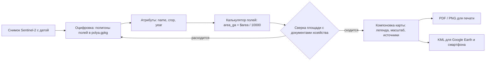

# Оцифровываем границы полей и выпускаем карту: PDF и KML

> ⏱ **Трудозатраты:** ~17 мин чтения + ~35 мин практики
>
> Модуль **[П2: Введение в ГИС и открытые геоданные](../index.md)**, урок 3.
> Профессиональный уровень (практики). Проект UNDP-KAZ-00683, FOLUR. Компоненты FOLUR: **1**, **2**.

## Цели урока и место в модуле

Это главный урок модуля: здесь появляется то, ради чего всё затевалось. В [уроке 1](01-qgis-first-project.md) вы собрали проект, в [уроке 2](02-open-data-sentinel.md) положили в него снимок с датой. Теперь вы обведёте по снимку границы своих полей, заполните таблицу — название, культура, площадь — и выпустите два готовых продукта: карту в PDF для печати и KML-файл, который откроется в Google Earth и на смартфоне агронома. После этого урока [практикум](../practicum/01-farm-map.md) станет повторением пройденного на полном цикле.

После изучения урока вы сможете:

1. **[Bloom: знать]** называть форматы, в которых живут ваши данные и продукты: GeoPackage для рабочего слоя, PDF/PNG для печати, KML для обмена.
2. **[Bloom: понимать]** объяснять, зачем полю атрибуты и почему площадь надо считать в метровой системе координат, а не «на глаз».
3. **[Bloom: применять]** создавать слой полигонов, оцифровывать границы полей по снимку, заполнять атрибуты, вычислять площадь и собирать компоновку карты с легендой и источниками.
4. **[Bloom: анализировать]** проверять собственную оцифровку: сверять вычисленную площадь с документами хозяйства и находить типовые ошибки контуров (самопересечения, недоводы, дубли вершин).

> **Границы лекции.** Внутри: создание слоя GeoPackage, оцифровка полигонов, атрибуты и расчёт площади, компоновка карты, экспорт PDF/PNG и KML, базовая проверка результата. Снаружи: строгая топология и валидация геометрии по правилам — [А2, урок 1](../../a2/lectures/01-vector-raster-projections.md); анализ оцифрованных полей (зональная статистика, NDVI) — [П3](../../p3/index.md) и [А2, урок 3](../../a2/lectures/03-spatial-analysis.md); автоматическая оцифровка ИИ-инструментами — обзорно в [ИИ-задании модуля](../ai-assistant.md).

---

## 1. Готовим слой для полей: GeoPackage и структура таблицы

Границы полей — векторный слой из полигонов. Прежде чем рисовать, слой надо создать, и здесь принимаются два решения: формат файла и состав атрибутов.

**Формат — GeoPackage (`.gpkg`).** Это современный открытый стандарт: один файл, внутри которого могут жить несколько слоёв, без ограничений на имена полей и кодировку. Вы можете встретить и старый формат Shapefile (`.shp` и свита файлов рядом) — читать его QGIS умеет, но новые данные создавайте в GeoPackage: меньше сюрпризов с кириллицей и длиной имён.

**Атрибуты — минимальный рабочий набор.** Каждому полигону — строка в таблице. Для карты хозяйства достаточно четырёх колонок:

| Колонка | Тип | Пример | Зачем |
|---|---|---|---|
| `name` | текст | Поле 7 | подпись на карте |
| `crop` | текст | пшеница | раскраска по культурам |
| `year` | целое | 2026 | сезон, к которому относится культура |
| `area_ga` | десятичное | — | вычислим автоматически в §3 |

Создание слоя: меню «Слой → Создать слой → Создать слой GeoPackage…». Укажите файл `data/polya.gpkg`, имя слоя `polya`, тип геометрии — **полигон**, систему координат — **СК проекта** (EPSG:32641 или 32642 — [урок 1, §5](01-qgis-first-project.md)), и добавьте перечисленные поля. Слой появится в панели слоёв пустым — это нормально.

Не заводите двадцать колонок «на всякий случай». Таблицу всегда можно расширить, а пустые колонки, которые никто не заполняет, — прямой путь к бардаку в данных (дисциплина атрибутов — тема [П1](../../p1/index.md)).

Обратите внимание на типы колонок. Текстовое поле стерпит что угодно, и это его слабость: если писать культуру то «пшеница», то «пшен.», то «Пшеница», раскраска по культурам в §2.1 создаст три разных класса вместо одного. Договоритесь с собой о словаре значений заранее и пишите одинаково. Число в текстовой колонке — другая классика: по нему нельзя ни отсортировать, ни посчитать. Год — целое число, площадь — десятичное, и никак иначе.

## 2. Оцифровка: обводим поля по снимку

**Оцифровка** — это рисование объектов поверх снимка-«миллиметровки». Включите слой снимка из урока 2, выключите лишние подложки, выберите слой `polya` и нажмите жёлтый карандаш — **режим редактирования**.

Порядок работы над одним полем:

1. Инструмент «Добавить полигон». Щелчками левой кнопки ставьте вершины вдоль границы поля; колесо мыши продолжает работать как зум — приближайтесь на сложных участках.
2. Замкните контур щелчком правой кнопки — QGIS попросит заполнить атрибуты: `name`, `crop`, `year` (колонку `area_ga` пока оставьте пустой).
3. Сохраните правки (иконка дискеты рядом с карандашом) и периодически — весь проект.

Приёмы, которые отличают аккуратную оцифровку от небрежной:

- **Масштаб оцифровки.** Обводите при масштабе, когда границе поля видно «в лицо» — примерно 1:10 000–1:25 000 для массивов Северного Казахстана. При слишком мелком масштабе контур выйдет грубым, при слишком крупном — утонете в пикселях.
- **Вершины по необходимости.** Прямой границе хватает двух вершин; плавному изгибу — нескольких. Сотни вершин на прямой — лишний вес и лишние ошибки.
- **Граница — по факту, не по памяти.** Обводите то, что видно на снимке: реальная кромка обработки. Расхождение с «бумажной» границей — не ошибка оцифровки, а информация (см. §4).
- **Смежные поля — с прилипанием.** Если поля граничат, включите **прилипание** (магнит на панели «Инструменты редактирования»; включите также «Избегать пересечений» для слоя): новая граница «прилипнет» к уже нарисованной, и между полями не останется щелей и нахлёстов.

Ошиблись вершиной — инструмент «Правка вершин» позволяет двигать и удалять отдельные точки уже нарисованного контура. Удалить полигон целиком: выделить и Delete в режиме редактирования.

### 2.1 Раскраска по культурам и подписи

Когда контуры готовы, слой стоит оформить так, чтобы карта читалась без вопросов. Откройте свойства слоя → «Символика» и переключите тип с «Обычный знак» на **«По значению»** (категоризированный): колонка — `crop`, кнопка «Классифицировать». QGIS создаст по цвету на каждую культуру — получите классическую карту севооборота. Цвета можно поменять вручную: традиционно зерновые — жёлто-охристые тона, пары — серые, кормовые — зелёные; главное, чтобы соседние культуры различались уверенно.

Затем вкладка «Подписи» → «Одиночные подписи», поле — `name`. Полезно собрать составную подпись выражением — имя поля и площадь в одну строку:

```text
name || '\n' || format_number("area_ga", 1) || ' га'
```

Подпись с площадью прямо на карте отвечает на самый частый вопрос читателя раньше, чем он его задал. Проверьте читаемость на том масштабе, в котором будет напечатана карта, — на экране подписи часто выглядят крупнее, чем выйдут на листе.



*Рис. 1. Конвейер урока: от снимка через оцифровку и проверку площади — к двум продуктам, PDF и KML. Alt: блок-схема — снимок ведёт к оцифровке полигонов, затем атрибуты, расчёт площади, проверка против документов (при расхождении — возврат к оцифровке), далее компоновка карты и экспорт в PDF и KML.*

## 3. Площадь: считаем честно, в метрах

Площадь — главный атрибут поля, и считать её вручную не нужно: геометрия полигона уже содержит ответ.

Откройте таблицу атрибутов слоя (ПКМ по слою → «Открыть таблицу атрибутов») и **Калькулятор полей** (иконка счётов). Настройка: «Обновить существующее поле» → `area_ga`, выражение:

```text
$area / 10000
```

`$area` возвращает площадь полигона в квадратных метрах (при метровой СК слоя), деление на 10 000 переводит её в гектары. Нажмите OK — колонка заполнится для всех полигонов сразу. После этого сохраните правки и выключите режим редактирования.

Два предупреждения:

- **Работает только в метровой СК.** Если слой создан в EPSG:4326, `$area` вернёт бессмыслицу в «квадратных градусах» — симптом из [урока 1, §5](01-qgis-first-project.md). Лечение: слой полей создаётся сразу в зоне UTM, как мы и сделали.
- **Площадь не обновляется сама.** Если вы потом двигали вершины — пересчитайте колонку заново. Привычка: пересчёт площади — последний шаг перед выпуском карты.

## 4. Проверяем себя: оцифровка против документов

Правило платформы — результат сверяется независимым источником. Для оцифровки таких источников два.

**Документы хозяйства.** Сравните `area_ga` каждого поля с площадью по документам (акт на землепользование, внутренний учёт). Ожидание: расхождение в единицы процентов. Оцифрованная по снимку площадь — это *фактически обрабатываемая* земля, и она законно отличается от документальной: кромки, разворотные полосы, обход мокрой западины, прирезка соседнего клина. Малое расхождение подтверждает и вашу аккуратность, и правильность СК; большое (десятки процентов) — сигнал ошибки: не тот контур, незамкнутая граница, слой в градусной СК.

**Сам снимок.** Пройдитесь по каждому контуру на крупном масштабе: граница лежит на кромке поля, а не рядом? Нет ли самопересечений («восьмёрка» из-за неудачной вершины), недоводов до соседнего поля, случайных дублей полигона? Инструмент «Проверка геометрии» (меню «Вектор») найдёт формальные ошибки автоматически; для десятка полей достаточно и внимательного глаза.

Расхождение «снимок против документов» — это не брак, а **знание**: вы впервые видите, сколько земли хозяйство обрабатывает фактически. Зафиксируйте обе цифры в таблице — пригодится в разговорах с партнёрами и в планировании.

## 5. Компоновка: собираем карту, которую не стыдно показать

Экран QGIS — рабочее место; продукт — **компоновка** (макет печати). Меню «Проект → Создать макет…», имя — например, `karta-hozyaystva`.

В редакторе макета соберите карту из элементов (кнопки на левой панели):

1. **Карта** — растяните главное окно карты на лист. Установите масштаб круглым числом (например, 1:50 000) в свойствах элемента.
2. **Заголовок** — текст: «Карта хозяйства … Сезон 2026». Название хозяйства — ваше; без грифов и лишних слов.
3. **Легенда** — автоматически перечислит слои; уберите из неё служебные подложки, оставьте поля (раскрашенные по культуре — символика «по значению» колонки `crop`) и снимок.
4. **Масштабная линейка и стрелка севера** — обязательные элементы любой карты, которую будут читать другие люди.
5. **Строка источников** — мелкий текст внизу: источник снимка с годом (например, «Contains modified Copernicus Sentinel data 2026»), «© участники OpenStreetMap» — если использованы данные OSM, дата составления и автор. Это требование лицензий из [урока 2, §6](02-open-data-sentinel.md) и признак профессиональной карты.

Хорошая карта отвечает на три вопроса без устных пояснений: *что* показано (заголовок и легенда), *где* это (подложка, подписи, стрелка севера), *насколько можно верить* (источники и даты). Проверьте свою компоновку этими тремя вопросами, прежде чем экспортировать. Лучший тест — показать черновик человеку, который не участвовал в работе: если он за минуту пересказал содержание карты без ваших комментариев, компоновка удалась.

**Экспорт:** в редакторе макета — «Макет → Экспорт в PDF…» (для печати и отправки) или «Экспорт в изображение…» (PNG для мессенджеров и презентаций). Файлы складывайте в папку `maps/` проекта. Компоновка сохраняется вместе с проектом: в следующем сезоне вы откроете тот же макет, и он соберёт карту уже из обновлённых данных — оформление делается один раз.

## 6. KML: карта в кармане

**KML** — формат, который понимают Google Earth и большинство мобильных карт. Экспортированный слой полей агроном откроет на смартфоне в поле — с вашими границами и подписями.

Экспорт из QGIS: ПКМ по слою `polya` → «Экспорт → Сохранить объекты как…» → формат **KML**, файл `maps/polya.kml`. Обратите внимание: КML по спецификации хранит координаты в WGS 84 — QGIS перепроецирует сам, ничего настраивать не надо. В параметрах экспорта задайте поле `name` как имя объекта — тогда подписи полей поедут вместе с геометрией.

Проверка продукта — по правилу независимой сверки: откройте KML в другой программе (Google Earth на компьютере или телефоне) и убедитесь, что поля легли на своё место поверх чужой подложки и подписи читаются. Если там всё сходится — файл можно отправлять кому угодно: KML самодостаточен.

Что можно передавать? Границы своих полей и атрибуты, которые вы сами создали, — ваши данные: делитесь по собственному усмотрению. Открытые данные в основе карты (снимки Sentinel, OSM) распространяются свободно при указании источника. Закон РК «О геодезии, картографии и пространственных данных» (№ 166-VII от 21.12.2022) допускает свободное распространение цифровой картографической продукции открытого пользования — при отсутствии в ней сведений, составляющих государственные секреты; карта полей на открытом снимке в этот режим укладывается. Единственная разумная осторожность коммерческого свойства: подумайте, кому именно вы показываете детальную структуру своего землепользования.

### 6.1 Карта живёт дальше: обновление в следующем сезоне

Карта хозяйства — не разовый документ, а живой слой. В следующем сезоне не рисуйте всё заново: геометрия полей меняется редко, меняются культуры. Рабочий цикл обновления выглядит так: скачать свежий снимок сезона (урок 2) → просмотреть контуры по нему и поправить только то, что реально изменилось (разделённый массив, новая прирезка) → обновить `crop` и `year` в таблице атрибутов → пересчитать `area_ga` там, где двигали вершины → перевыпустить PDF и KML с новой датой в строке источников.

Чтобы история не терялась, перед обновлением сохраняйте копию прошлогоднего слоя (`polya-2026.gpkg` → копия остаётся, новая версия — `polya-2027.gpkg`). Через несколько лет эта стопка слоёв превратится в историю севооборота хозяйства — данные, которые пригодятся в [П9](../../p9/index.md) при планировании ротаций и в [П14](../../p14/index.md) как приложение к заявкам.

> **Подробнее** — та же логика «у каждого набора данных свой режим» на примере собственных датасетов платформы: [политика датасетов](../../../datasets.md).

---

## Региональный кейс

**Ситуация.** Хозяйство в Карабалыкском районе Костанайской области готовится к переговорам о совместном использовании техники с соседом. Нужен общий язык: карта, на которой видны все массивы хозяйства с культурами сезона и фактическими площадями, — в бумажном виде для встречи и в KML для агрономов обеих сторон.

**Данные:** безоблачный снимок Sentinel-2 L2A текущего сезона (Copernicus Browser, [урок 2](02-open-data-sentinel.md)); подложка OSM; документы хозяйства с учётными площадями полей — внутренний источник для сверки.

**Задача:**

1. Оцифровать по снимку все массивы хозяйства в слой GeoPackage (СК — EPSG:32641: Карабалыкский район лежит западнее 66° в.д.), заполнить `name`, `crop`, `year`.
2. Вычислить `area_ga` калькулятором полей и сверить с учётными площадями; расхождения больше нескольких процентов — проверить контур.
3. Собрать компоновку: поля, раскрашенные по культурам, легенда, масштаб, строка источников — экспортировать PDF; слой полей экспортировать в KML и проверить в Google Earth.

**Разбор.** Ключевые точки кейса: выбор зоны UTM по долготе района (западная Костанайская область — зона 41N), сверка вычисленных площадей с документами как обязательный шаг (типичный улов — один контур, обведённый по старой границе массива до его разделения), и две аудитории продукта — печатный PDF для переговоров и KML для полевой работы. Показательный побочный результат: суммарная фактическая площадь почти всегда отличается от «бумажной», и карта делает это различие видимым и обсуждаемым. Цифры площадей в кейсе намеренно не приводятся: они у каждого хозяйства свои, а метод один.

---

## Закрепление и применение

!!! example "Попробуйте в QGIS"
    Мини-версия урока за 30 минут: создайте `polya.gpkg` с полями `name`, `crop`, `year`, `area_ga` → оцифруйте по своему снимку три поля → посчитайте `area_ga` выражением `$area / 10000` → сверьте одну площадь с документами → соберите простейшую компоновку (карта + заголовок + легенда + источники) → экспортируйте PDF и KML → откройте KML в Google Earth. Это ровно половина [практикума](../practicum/01-farm-map.md) — дальше будет легче.

!!! warning "Границы применимости"
    Оцифрованный контур — рабочий инструмент, а не межевание: юридические границы участка устанавливает земельная документация, и ваш полигон их не заменяет и не оспаривает. Точность контура ограничена пикселем снимка (10 м) и вашей аккуратностью; для задач точнее (границы под договор, спорная межа) нужны геодезические измерения лицензированных специалистов. Площадь `$area` честна ровно настолько, насколько честны СК слоя и сам контур.

!!! tip "Что это даёт вашему хозяйству"
    Слой полей с атрибутами — это цифровой двойник землепользования: раскраска по культурам заменяет амбарную тетрадь, `area_ga` даёт фактические площади для планирования семян и ГСМ, KML кладёт границы в карман каждому агроному. А главное — этот слой одноразово создаётся и многократно используется: в П3 на него ляжет NDVI-мониторинг, в П5 — ландшафтный план, в П14 — приложение к заявке.

!!! question "Кейс для размышления"
    После оцифровки поле «Дальнее» показало `area_ga` на треть меньше документальной площади. Агроном предлагает «подтянуть контур, чтобы сошлось с бумагой». Назовите три возможные причины расхождения (подсказка: одна — в данных, одна — в геометрии, одна — в жизни) и объясните, почему «подтянуть до бумаги» — худший из вариантов. Сверьтесь с §4.

### Проверь себя

```quiz
[
  {
    "q": "В каком формате модуль рекомендует создавать слой границ полей?",
    "options": [
      "Shapefile — самый распространённый исторический формат",
      "GeoPackage — современный открытый стандарт: один файл, без проблем с кириллицей и именами полей",
      "KML — ведь его понимает и телефон",
      "PDF — его можно сразу печатать"
    ],
    "answer": 1,
    "explain": "§1: рабочий слой — GeoPackage; Shapefile читаем, но для новых данных не рекомендуется; KML — формат обмена (§6), PDF — формат печати, не данных."
  },
  {
    "q": "Выражение $area / 10000 в калькуляторе полей вернуло для поля значение 0,00019. Что это значит?",
    "options": [
      "Поле действительно крошечное",
      "Слой живёт в градусной СК (EPSG:4326): площадь посчитана в «квадратных градусах», а не в метрах",
      "Калькулятор полей сломан, нужно переустановить QGIS",
      "Выражение написано с ошибкой: правильно умножать на 10000"
    ],
    "answer": 1,
    "explain": "§3: $area даёт квадратные метры только в метровой СК; в градусной системе результат — бессмысленная малая дробь. Лечение — слой в зоне UTM (урок 1 §5)."
  },
  {
    "q": "Оцифрованная площадь поля отличается от документальной на 2–3%. Правильная реакция:",
    "options": [
      "Немедленно перерисовать контур, чтобы совпало с документами",
      "Считать оцифровку негодной и заказать геодезистов",
      "Нормально: снимок показывает фактически обрабатываемую землю — зафиксировать обе цифры",
      "Исправить документы хозяйства по данным снимка"
    ],
    "answer": 2,
    "explain": "§4: расхождение в единицы процентов ожидаемо (кромки, разворотные полосы) и информативно; тревожный сигнал — десятки процентов. Подгонка под бумагу уничтожает знание о фактическом землепользовании."
  },
  {
    "q": "Что обязано присутствовать на итоговой компоновке карты, помимо самих полей?",
    "options": [
      "Легенда, масштаб, стрелка севера и строка источников данных с датами",
      "Логотип QGIS и версия программы",
      "Координаты всех вершин каждого полигона",
      "Гриф «Для служебного пользования»"
    ],
    "answer": 0,
    "explain": "§5: карта отвечает на вопросы «что, где, насколько верить» — за это отвечают заголовок, легенда, масштаб, стрелка севера и атрибуция источников; лицензии открытых данных требуют указания источника."
  },
  {
    "q": "Зачем открывать экспортированный KML в Google Earth перед отправкой агроному?",
    "options": [
      "Google Earth улучшает точность координат файла",
      "Это независимая проверка продукта: поля должны лечь на место поверх чужой подложки, подписи — читаться",
      "Без открытия в Google Earth файл KML не активируется",
      "Чтобы преобразовать KML в метровую систему координат"
    ],
    "answer": 1,
    "explain": "§6: правило платформы — результат сверяется независимым способом; другая программа с другой подложкой — простейшая независимая проверка экспортированного файла."
  }
]
```

## Что дальше?

Все навыки модуля собраны. Теперь — **[практикум «Карта вашего хозяйства на подложке Sentinel-2»](../practicum/01-farm-map.md)**: полный цикл от пустого проекта до PDF и KML на реальных данных, с чек-листом самопроверки. После него выполните [задание ИИ-ассистента](../ai-assistant.md) — научите GIS Copilot делать часть этой работы за вас и проверьте его по своему ручному образцу. Завершает модуль [итоговая аттестация](../assessment/final.md) (порог 75%). Дальше по карте платформы: [П3](../../p3/index.md) — мониторинг состояния оцифрованных полей, [П7](../../p7/index.md) — дрон там, где спутнику не хватает деталей, [А2](../../a2/index.md) — та же геоинформатика на академической глубине.
