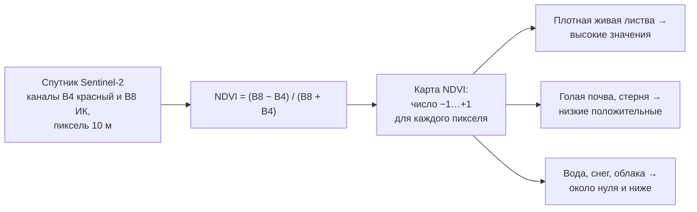

# Читаем карту NDVI: что спутник видит на вашем поле

> ⏱ **Трудозатраты:** ~15 мин чтения + ~25 мин практики
>
> Модуль **[П3: ИИ-инструменты без программирования](../index.md)**, урок 1.
> Профессиональный уровень (технические специалисты, фермеры, агрономы, МСБ). Проект UNDP-KAZ-00683, FOLUR. Компоненты FOLUR: **1**, **2**, **3**.

## Цели урока и место в модуле

Весь модуль П3 построен на одной идее: готовые ИИ-сервисы уже умеют следить за вашими полями из космоса — бесплатно или за небольшие деньги, без единой строчки кода. Но сервис выдаёт не «ответ», а карту и график, и ценность этой картинки целиком зависит от того, умеете ли вы её читать. Этот урок ставит базовый навык: понять, что такое NDVI, откуда он берётся, что означают его значения на поле Северного Казахстана — и, что не менее важно, чего он показать не может. Без этого навыка любой сервис мониторинга — красивая, но немая картинка; с ним — рабочий инструмент агронома.

После изучения урока вы сможете:

1. **[Bloom: знать]** называть, из каких спутниковых измерений складывается NDVI, кто и как часто снимает ваши поля (Sentinel-2) и где эти данные доступны бесплатно.
2. **[Bloom: понимать]** объяснять простыми словами, почему здоровая листва «зажигает» индекс, а голая почва, стерня и вода — нет, и почему одно и то же значение NDVI в мае и в июле означает разное.
3. **[Bloom: применять]** читать NDVI-карту и график сезонной кривой конкретного поля: находить неоднородности, отличать сигнал от артефакта (облако, тень, край пикселя).
4. **[Bloom: анализировать]** разбирать типовые ситуации неверного чтения индекса — насыщение на плотном посеве, влияние почвенного фона на всходах, «проблемное пятно», оказавшееся тенью облака, — и формулировать, какие проверки нужны прежде, чем принимать решение.

> **Границы лекции.** Внутри: физический смысл NDVI, чтение карты и сезонной кривой, честные ограничения индекса. Снаружи: настройка мониторинга в конкретных сервисах — [урок 2](02-nastraivaem-monitoring.md); проверка «проблемных зон» в поле, прогноз урожайности и сравнение платных/бесплатных платформ — [урок 3](03-proveryaem-servisy.md); как найти и скачать сам снимок Sentinel-2 — [П2, урок 2](../../p2/lectures/02-open-data-sentinel.md); как модели машинного обучения обрабатывают такие данные «изнутри» — академический модуль [А3](../../a3/index.md); съёмка с дрона, когда 10-метрового пикселя мало, — [П7](../../p7/index.md).

---

## 1. Зачем агроному индекс, если есть глаза

Опытный агроном отличает хорошее поле от плохого с обочины. Но у взгляда с обочины три ограничения, которые в масштабах хозяйства Северного Казахстана становятся дорогими. Во-первых, охват: массивы по несколько сотен гектаров не осмотреть целиком даже с машины — видна только кромка. Во-вторых, регулярность: объехать все поля раз в неделю в разгар сезона — это день работы, и в горячие недели именно объезды выпадают первыми. В-третьих, память: глаз не хранит историю, и через месяц уже не восстановить, где именно посев отставал в начале июня.

Спутниковый мониторинг снимает все три ограничения разом: спутник видит каждое поле целиком, возвращается каждые несколько дней и бесплатно хранит архив наблюдений. Плата за это — язык, на котором спутник отвечает. Он не говорит «пшеница угнетена на северном клину»; он отдаёт число для каждого пикселя размером 10×10 метров. Самое употребительное из таких чисел — **NDVI**, нормализованный разностный вегетационный индекс. Все сервисы, которые вы встретите в этом модуле — от бесплатного браузера Copernicus до платных агроплатформ, — рисуют свои «карты здоровья полей» в первую очередь из него.

Отсюда правило модуля: **сначала научиться читать индекс, потом доверять сервису**. Сервисы различаются интерфейсами и ценой, но смотрят на одни и те же спутниковые данные; умение читать NDVI переносится между ними, как умение читать — между книгами.

## 2. Как устроен NDVI: красный свет, инфракрасный и живая листва

Физика индекса укладывается в два наблюдения о живом растении.

Первое: **хлорофилл жадно поглощает красный свет** — он нужен фотосинтезу. От здоровой зелёной листвы красного света отражается обратно мало.

Второе: **клеточная структура листа сильно отражает ближний инфракрасный свет** (его глаз не видит, а спутниковый сенсор — видит). Здоровая, наполненная влагой листва в инфракрасном диапазоне «сияет».

У голой почвы, стерни, сухостоя и воды такого контраста нет: они отражают красный и инфракрасный примерно одинаково. Значит, само **соотношение** двух каналов отличает живую вегетацию от всего остального. NDVI сводит его в одно число:

**NDVI = (ИК − Красный) / (ИК + Красный)**

где ИК — отражение в ближнем инфракрасном канале, Красный — в красном. Деление на сумму нормирует результат: индекс всегда лежит в пределах от −1 до +1 и меньше зависит от общей освещённости сцены — снимки разных дней становятся сравнимыми.



*Рис. 1. Путь от спутникового снимка к карте NDVI. Alt: блок-схема — спутник Sentinel-2 измеряет отражение в красном (B4) и ближнем инфракрасном (B8) каналах с пикселем 10 м; формула (B8 − B4)/(B8 + B4) даёт для каждого пикселя число от −1 до +1; высокие значения соответствуют плотной живой листве, низкие положительные — голой почве и стерне, около нуля и ниже — воде, снегу и облакам.*

Индекс придуман давно — его предложила команда Дж. Роуза в работах по данным первого спутника серии Landsat ещё в первой половине 1970-х, — и именно проверенность полувековой практикой делает его «валютой» всех агросервисов.

### 2.1 У индекса есть родственники

Открыв любой сервис, вы увидите рядом с NDVI целое меню индексов. Логика у всех одна — комбинация спектральных каналов под конкретный вопрос. Два примера, которые встретятся чаще всего: индексы влажности растительности (типа NDMI) используют вместо красного канала коротковолновый инфракрасный и реагируют на водный стресс раньше, чем пожелтеет лист; почвенно-скорректированные индексы (семейство SAVI/MSAVI) вводят поправку на яркость почвы и честнее работают на редких всходах, где обычный NDVI «врёт» из-за фона. Углубляться в них в этом модуле не нужно: все навыки чтения — сравнение во времени, поиск неоднородностей, фильтр артефактов — переносятся на любой индекс без изменений. NDVI остаётся общим знаменателем: он есть в каждом сервисе, и именно по нему сервисы можно сверять между собой.

Откуда данные берут сервисы, с которыми мы будем работать? Главный источник — **Sentinel-2** программы Copernicus, уже знакомый вам по [П2](../../p2/lectures/02-open-data-sentinel.md): красный канал B4 и ближний инфракрасный B8 сняты с разрешением **10 метров**, пара спутников проходит над одной территорией раз в несколько дней, данные открыты и бесплатны. Всё, что сервис добавляет от себя, — обработка, интерфейс и аналитика поверх этих общедоступных измерений. Это стоит запомнить до урока 3: платите вы не за «особый спутник», а за удобство и интерпретацию.

## 3. Читаем значения: от голой почвы до плотного посева

Точные пороги «хорошо/плохо» для NDVI не существуют — они зависят от культуры, фазы и сезона. Но качественная шкала устойчива, и для степного агроландшафта она выглядит так:

| Что на земле | NDVI (ориентировочно) | Как выглядит на карте сервиса |
|---|---|---|
| Открытая вода, снег | около нуля и ниже | синие/серые тона |
| Голая почва, свежая пашня | низкие положительные значения | коричнево-жёлтые тона |
| Стерня, сухая степь, созревший хлеб | низкие–умеренные | жёлтые тона |
| Всходы, изреженный посев | умеренные | салатовые тона |
| Активно вегетирующий плотный посев | высокие | насыщенно-зелёные тона |

Три практических следствия из этой шкалы.

**Следствие 1: NDVI читается только вместе с календарём.** «Жёлтое» поле в конце августа — это нормальное созревание: хлорофилл уходит из колоса, индекс закономерно падает, и это не тревога, а фенология. То же «жёлтое» поле в конце июня — повод для выезда. Одно и то же число в разные фазы означает противоположные вещи, поэтому сервисы всегда показывают не только карту на дату, но и **график по времени** — и график важнее одиночной карты.

**Следствие 2: сравнивайте поле с самим собой и с соседями по культуре.** Абсолютное значение NDVI у пшеницы и у льна в одну и ту же декаду будет разным — и это различие сортовое и видовое, а не «проблема». Осмысленные сравнения: это поле сегодня против него же неделю назад; северная часть массива против южной; два соседних поля одной культуры и одного срока сева. Именно на таких сравнениях построена вся аналитика сервисов из урока 2.

**Следствие 3: главная ценность карты — неоднородность.** Среднее значение NDVI по полю скрывает всё интересное. Смотреть надо на **пятна**: клин с заметно меньшим индексом на фоне ровного массива — вот сигнал. Что это — вымочка, солонец, огрех сева, очаг вредителя — карта не скажет (об этом §5 и весь [урок 3](03-proveryaem-servisy.md)), но она точно скажет, **куда идти смотреть**.

### 3.1 Сезонная кривая: биография поля в одном графике

Если выстроить средний NDVI поля по всем безоблачным датам сезона, получится **сезонная кривая** — «биография» посева. Для яровой пшеницы Северного Казахстана её характерная форма такова: низкий старт по голой почве после сева → рост по мере кущения и выхода в трубку → максимум (смыкание, колошение) → плавный спад к созреванию → резкая ступенька вниз в уборку.

Читать кривую удобно по четырём вопросам:

1. **Когда начался рост?** Поздний подъём кривой относительно соседних полей — поздние или недружные всходы.
2. **Какой высоты плато?** Максимум сезона ниже, чем у аналогичных полей, — посев так и не набрал плотность: изреженность, засуха, питание.
3. **Нет ли провалов среди сезона?** Резкая просадка и восстановление — стресс (например, повреждение и отрастание); просадка без восстановления — потеря части листового аппарата.
4. **Когда кривая упала?** Ранний обвал — преждевременное усыхание; ступенька в дату уборки — норма.

Одиночное значение NDVI почти ни о чём; кривая — почти обо всём. Поэтому в практикуме модуля мы первым делом строим именно её.

## 4. Артефакты: что на карте не про ваше поле

Прежде чем искать на карте агрономию, надо отсеять артефакты — пятна, за которые отвечает не поле, а атмосфера и геометрия съёмки.

**Облака и их тени.** Облако на карте NDVI выглядит пятном с низким индексом, а его тень — пятном потемнее и «попроблемнее». Хорошие сервисы фильтруют облачные даты автоматически, но фильтр несовершенен: полупрозрачная дымка и рваная тень регулярно просачиваются. Первый рефлекс при виде внезапного «провала» на одну дату — открыть обычный цветной снимок этой даты и посмотреть, не облако ли это. Провал на одну дату при нормальных соседних — почти всегда атмосфера, а не поле.

**Краевые пиксели.** Пиксель 10×10 м на границе поля захватывает и посев, и дорогу, и лесополосу — его значение смешанное и «грязное». Кромка любого поля на карте NDVI всегда выглядит хуже центра; это геометрия, а не агрономия. Аналитика сервисов обычно отступает от границы внутрь; читая карту глазами, делайте ту же поправку.

**Разные даты — разные условия.** Сравнивая две карты, проверьте, что даты сопоставимы: снимок после дождя по влажной почве и снимок по сухой дадут разный фон на изреженных участках, где почва просвечивает сквозь посев.

**Молодые всходы и почвенный фон.** Пока проективное покрытие мало, большую часть пикселя занимает почва, и NDVI отражает скорее её цвет и влажность, чем состояние растений. Тёмная влажная почва и светлый солонцовый фон дадут разный индекс при одинаковых всходах. Вывод: в первые недели вегетации карта NDVI — грубый инструмент, и «пятна» этого периода перепроверяются особенно строго.

## 5. Пять честных ограничений NDVI

Продавцы платных платформ любят слово «здоровье посевов в реальном времени». Прежде чем платить (урок 3), зафиксируем пять границ, внутри которых индекс действительно работает.

1. **NDVI видит симптом, а не причину.** Низкий индекс говорит «биомассы меньше/листва угнетена», но не различает засуху, вымочку, солонец, сорняк, вредителя и огрех сеялки. Диагноз ставится в поле; карта лишь делает выезд адресным.
2. **Оптика не видит сквозь облака.** В облачную декаду данных просто нет. Для степной зоны это мягче, чем для влажных регионов, но разрывы в кривой на 1–2 недели — рабочая реальность, и мониторинг планируется с учётом «слепых» окон.
3. **Индекс насыщается на плотном посеве.** Когда листва полностью смыкается, NDVI упирается в потолок и перестаёт различать «хорошо» и «отлично»: два поля с заметно разной биомассой могут показывать почти одинаковый высокий индекс. На пике вегетации карта различает проблемные места, но плохо ранжирует лучшие.
4. **Пиксель 10 м — это 1 сотка.** Отдельный рядок, полоса огреха шириной в метр, первые очаги вредителя меньше пикселя не видны. Порог обнаружения — пятна от десятков квадратных метров; всё мельче — задача осмотра или дрона ([П7](../../p7/index.md)).
5. **NDVI — не урожайность.** Индекс коррелирует с биомассой, а не с центнерами в бункере: налив, качество зерна, потери на уборке остаются за кадром. Что на самом деле умеют «прогнозы урожайности по спутнику» и как их проверять — разберём в [уроке 3](03-proveryaem-servisy.md).

Эти пять пунктов — не приговор методу, а его паспорт. Внутри своих границ NDVI-мониторинг честно делает главное: **дёшево и регулярно указывает, где на тысячах гектаров стоит побывать человеку**.

> **Подробнее** — устройство спутниковых данных и каналов: [П2, урок 2](../../p2/lectures/02-open-data-sentinel.md); как из тех же данных модели машинного обучения извлекают больше, чем один индекс, — [А3](../../a3/index.md).

---

## Региональный кейс

**Ситуация.** Агроном хозяйства в Есильском районе Северо-Казахстанской области в начале июля открывает карту NDVI своего пшеничного массива в бесплатном сервисе. Массив в целом ровный, но на карте видны два отклонения: широкое пятно пониженного индекса в юго-западном углу поля, повторяющееся на снимках трёх последних дат, и тёмная полоса через середину поля, которая есть только на самой свежей карте, а неделей раньше её не было.

**Данные:** Sentinel-2 L2A, визуализация NDVI и True color в Copernicus Browser (<https://dataspace.copernicus.eu/>, бесплатная регистрация); те же даты доступны в любом сервисе мониторинга из урока 2.

**Задача:**

1. Для каждого из двух отклонений решить: это сигнал с поля или артефакт данных? Какой проверкой это устанавливается, не выезжая?
2. Сформулировать, что агроном должен посмотреть на месте в юго-западном углу и почему карта сама не даст диагноз.
3. Объяснить, почему устойчивость пятна на нескольких датах — ключевой критерий.

**Разбор.** Ход решения: тёмная полоса, существующая только на одной дате, — кандидат в артефакт; открываем True color-снимок той же даты и почти наверняка находим облако или его тень (§4). Пятно же, повторяющееся на трёх датах подряд, атмосферой не объяснить — это устойчивый сигнал с поля (§4, критерий устойчивости). Но NDVI видит симптом, а не причину (§5): пониженная биомасса в углу может означать вымочку в западине, солонцовое пятно, огрех сева или очаг сорняка — различить это способен только осмотр на месте. Итог кейса: карта не поставила диагноз, но превратила объезд «всего массива на всякий случай» в адресный выезд к одному углу — ровно та экономика, ради которой существует мониторинг.

---

## Закрепление и применение

!!! example "Попробуйте в браузере"
    За 15 минут, без регистрации в платных сервисах: откройте Copernicus Browser (<https://dataspace.copernicus.eu/>) → найдите свой район → набор Sentinel-2 L2A → переключите визуализацию с True color на **NDVI** → полистайте 3–4 безоблачные даты этого сезона. Найдите: поле с равномерно высоким индексом, поле с выраженным внутренним пятном и хотя бы один артефакт (облако/тень). Для пятна проверьте устойчивость на соседней дате — как в кейсе.

!!! warning "Границы применимости"
    NDVI показывает состояние листвы, а не диагноз и не урожайность: пятно на карте — повод для выезда, а не для решения об обработке (§5). Индекс слепнет под облаками, насыщается на сомкнутом посеве, «врёт» на всходах из-за почвенного фона и не видит ничего мельче пикселя 10 м. Любая одиночная карта без графика по времени и без сверки с True color — источник ложных тревог.

!!! tip "Что это даёт вашему хозяйству"
    Чтение NDVI — навык пятиминутного «облёта» всех полей с рабочего места: где посев отстал, где появилось пятно, куда направить агронома сегодня. Он же — ваша защита от маркетинга: понимая, что любой сервис рисует карты из одних и тех же бесплатных данных Sentinel-2, вы будете оценивать платформы по удобству и аналитике, а не по обещаниям «уникального спутника» (об этом урок 3).

!!! question "Кейс для размышления"
    В середине июля два соседних пшеничных поля одного срока сева показывают: первое — NDVI стабильно высокий уже третью неделю, второе — индекс на 15% ниже и медленно снижается. Хозяин второго поля говорит: «у меня сорт с более светлым листом, это нормально». Какие проверки по §3 и §4 позволят отличить сортовую особенность от реальной проблемы, не выезжая? Подсказка: сезонная кривая этого же поля в прошлые годы и сравнение с другими полями того же сорта.

### Проверь себя

```quiz
[
  {
    "q": "Почему у здоровой листвы NDVI высокий?",
    "options": [
      "Хлорофилл поглощает красный свет, а клеточная структура листа сильно отражает ближний инфракрасный — разность каналов велика",
      "Зелёная листва отражает больше красного света, чем почва",
      "Спутник измеряет температуру листа: живой лист холоднее почвы",
      "Здоровые растения выше, а NDVI измеряет высоту растительности"
    ],
    "answer": 0,
    "explain": "§2: индекс построен на контрасте — мало отражённого красного (поглощён фотосинтезом) и много ближнего инфракрасного (клеточная структура); высота и температура в формуле не участвуют."
  },
  {
    "q": "Поле пшеницы в конце августа «пожелтело» на карте NDVI. Правильное чтение:",
    "options": [
      "Посев погибает — срочно нужна обработка",
      "Сервис сломался: летом индекс не может падать",
      "Закономерное созревание: хлорофилл уходит, индекс падает — это фенология, а не тревога",
      "Спутник перепутал каналы местами"
    ],
    "answer": 2,
    "explain": "§3, следствие 1: NDVI читается только вместе с календарём — падение индекса к уборке нормально; то же «пожелтение» в июне было бы сигналом."
  },
  {
    "q": "На карте NDVI за вчера посреди ровного поля — резкое тёмное пятно, которого нет на картах недельной давности и нет через 5 дней. Наиболее вероятная причина:",
    "options": [
      "Очаг вредителя, который успел появиться и исчезнуть",
      "Облако или его тень на вчерашней сцене — артефакт проверяется по True color-снимку той же даты",
      "Поле за день потеряло и восстановило листву",
      "Сосед ночью убрал часть поля"
    ],
    "answer": 1,
    "explain": "§4: провал на одну дату при нормальных соседних — почти всегда атмосфера; первый рефлекс — открыть цветной снимок той же даты и найти облако/тень."
  },
  {
    "q": "Почему на пике вегетации два поля с заметно разной биомассой могут показывать почти одинаковый высокий NDVI?",
    "options": [
      "Спутник летом снимает реже",
      "Индекс насыщается: после смыкания листвы NDVI упирается в потолок и перестаёт различать «хорошо» и «отлично»",
      "Летом в формуле NDVI используются другие каналы",
      "Высокие значения индекса сервисы округляют"
    ],
    "answer": 1,
    "explain": "§5, ограничение 3: насыщение на сомкнутом посеве — фундаментальное свойство индекса, а не особенность сервиса или сезона съёмки."
  },
  {
    "q": "Что из перечисленного NDVI-карта Sentinel-2 сделать МОЖЕТ?",
    "options": [
      "Различить, чем вызвано пятно: солонцом, вымочкой или вредителем",
      "Показать урожайность поля в центнерах с гектара",
      "Указать устойчивое пятно пониженной вегетации от десятков квадратных метров, чтобы сделать выезд адресным",
      "Обнаружить первые единичные растения сорняка между рядками"
    ],
    "answer": 2,
    "explain": "§5: индекс видит симптом (пятно пониженной биомассы не мельче пикселя 10 м) и делает осмотр адресным; причина, урожайность и объекты мельче пикселя — за границами метода."
  }
]
```

## Что дальше?

Вы умеете читать язык, на котором говорят все агросервисы. В **[уроке 2 «Настраиваем еженедельный NDVI-мониторинг полей в готовом сервисе»](02-nastraivaem-monitoring.md)** мы перейдём от чтения к настройке: заведём границы полей в бесплатный сервис мониторинга, включим уведомления и соберём регламент еженедельного отчёта — без программирования. Затем [урок 3](03-proveryaem-servisy.md) научит проверять сервисы на честность, а [практикум](../practicum/01-ndvi-monitoring.md) соберёт всё в NDVI-паспорт вашего поля. Границы полей для мониторинга удобнее всего взять из карты, сделанной в [П2](../../p2/index.md); как те же данные обрабатывают «изнутри» — в академическом модуле [А3](../../a3/index.md).
