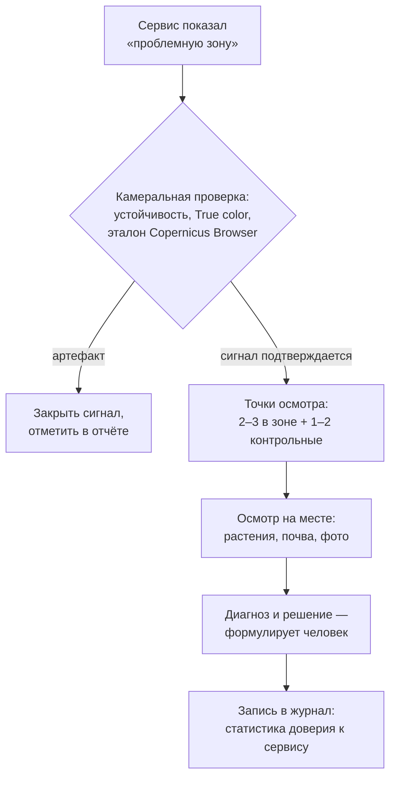

# Проверяем ИИ на честность: проблемные зоны, прогноз урожайности и выбор сервиса

> ⏱ **Трудозатраты:** ~15 мин чтения + ~30 мин практики
>
> Модуль **[П3: ИИ-инструменты без программирования](../index.md)**, урок 3.
> Профессиональный уровень (технические специалисты, фермеры, агрономы, МСБ). Проект UNDP-KAZ-00683, FOLUR. Компоненты FOLUR: **1**, **2**, **3**.

## Цели урока и место в модуле

Первые два урока дали вам чтение NDVI и настроенный мониторинг. Третий — самый важный для кошелька и для решений: агроплатформы поверх «сырых» карт продают **умную аналитику** — автоматически найденные «проблемные зоны», зоны продуктивности, прогнозы урожайности. Эти функции выглядят как ответы, но по природе своей — гипотезы, сгенерированные моделями на тех же открытых данных. Урок ставит два навыка: проверять выводы ИИ-аналитики независимыми способами (полевой осмотр по протоколу, сверка с эталонным источником, собственная статистика подтверждений) и критически сравнивать платные и бесплатные сервисы по матрице критериев — чтобы решение «платить или нет» опиралось на опыт вашего хозяйства, а не на рекламный буклет.

После изучения урока вы сможете:

1. **[Bloom: понимать]** объяснять, как сервисы получают «проблемные зоны», зоны продуктивности и прогнозы урожайности из спутниковых данных, и почему каждый такой вывод — гипотеза, а не факт.
2. **[Bloom: применять]** проверять «проблемную зону» полевым протоколом (точка, фото, диагноз, запись в журнал) и сверять аналитику платформы с независимым эталоном — Copernicus Browser.
3. **[Bloom: анализировать]** оценивать заявления сервисов о прогнозе урожайности: что модель реально измеряет, на чём обучена и какие проверки возможны в вашем хозяйстве.
4. **[Bloom: анализировать]** сравнивать платные и бесплатные сервисы по матрице критериев (данные, функции, экспорт, зависимость, цена) и обосновывать решение для конкретного хозяйства.

> **Границы лекции.** Внутри: устройство «умной» аналитики, полевой протокол проверки, честный разбор прогнозов урожайности, матрица сравнения сервисов и логика решения о покупке. Снаружи: чтение NDVI и артефакты — [урок 1](01-chitaem-ndvi.md); настройка мониторинга — [урок 2](02-nastraivaem-monitoring.md); как модели машинного обучения устроены математически — академический модуль [А3](../../a3/index.md) (там же — метрики качества моделей); детальная съёмка проблемной зоны дроном — [П7](../../p7/index.md); субсидии и обоснование затрат на цифровые инструменты — [П14](../../p14/index.md).

---

## 1. Как сервис находит «проблемные зоны» — и почему это гипотеза

Функция «проблемные зоны» (в разных платформах: productivity zones, зоны неоднородности, стресс-зоны) устроена проще, чем звучит. База — статистика по пикселям внутри границы вашего поля: алгоритм делит пиксели на группы по уровню индекса (за одну дату или накопленно за сезон/годы) и закрашивает группу с устойчиво низкими значениями как «проблемную». Более развитые версии добавляют другие индексы, погодные данные и историю поля, но логика та же: **зона — это область, статистически отличающаяся от остального поля по спутниковым измерениям**.

Что отсюда следует.

**Во-первых, зона наследует все ограничения NDVI** ([урок 1, §5](01-chitaem-ndvi.md)): она видит симптом, а не причину; она слепа к тому, что мельче пикселя; на неё влияют артефакты, просочившиеся сквозь облачный фильтр, и краевые пиксели при неточной границе поля.

**Во-вторых, «проблемная» — слово алгоритма, а не агронома.** Западина, где весной стоит вода, солонцовое пятно, песчаный лоб, старая дорога через массив — всё это даст устойчиво пониженный индекс. Иногда это действительно проблема, которую можно устранить; иногда — постоянное свойство поля, которое дешевле учитывать, чем «лечить». Отличить одно от другого способен только человек, знающий это поле.

**В-третьих, у алгоритма нет ответственности.** Сервис не выезжает в поле и не отвечает за решение об обработке. Ответственность остаётся на вас — значит, и последнее слово должно оставаться за вашей проверкой.

Полезно также различать два режима зональности, которые сервисы часто подают под одним названием. **Зоны одной даты** отвечают на вопрос «где полю плохо сейчас» — это оперативный сигнал для выезда на этой неделе. **Многолетние зоны продуктивности** строятся по накопленной истории сезонов и отвечают на другой вопрос — «какие части поля стабильно слабее из года в год»; они полезны для планирования (нормы высева и внесения, очерёдность улучшений), но бессмысленны как повод для срочного выезда. Смешение режимов — типовая ошибка чтения: устойчиво слабый по многолетней зональности участок не «заболел вчера», а оперативное пятно одной даты не повод перекраивать план внесения.

Правильное отношение к автозонам — как к **умному указателю**: они экономят время анализа карты (особенно когда полей десятки), но каждый вывод проходит проверку. Протокол проверки — в следующем разделе.

## 2. Полевой протокол: от пятна на карте до записи в журнале

Проверка «проблемной зоны» — короткая процедура, которая превращает гипотезу ИИ в знание хозяйства. Протокол из пяти шагов:

1. **Камеральная проверка (5 минут, до выезда).** Сигнал проходит фильтр [урока 1, §4](01-chitaem-ndvi.md): устойчив ли на нескольких датах, нет ли облака/тени на True color, не краевой ли эффект от неточной границы. Плюс сверка с независимым эталоном: откройте ту же территорию и дату в Copernicus Browser — видна ли зона на «сыром» NDVI, без обработки платформы? Зона, которая есть только в одном сервисе и не видна в эталоне, — повод для сомнений, а не для выезда.
2. **Точки осмотра.** Наметьте 2–3 точки внутри зоны и обязательно 1–2 контрольные точки на «нормальной» части поля — сравнение «внутри/снаружи» и есть смысл выезда. Координаты точек берутся прямо из сервиса или с вашей карты П2.
3. **Осмотр на месте.** В каждой точке: состояние растений (густота, фаза, цвет, повреждения), состояние почвы (влажность, корка, засоление по видимым признакам), фото с привязкой (смартфона достаточно). Сравнивайте пары «зона/контроль» — разница обычно видна сразу.
4. **Диагноз и решение.** Формулируется человеком: что это (вымочка, солонец, огрех, вредитель, постоянное свойство рельефа), что делаем (обработка, пересев, учёт в планировании, ничего) и почему.
5. **Запись в журнал.** Итог заносится в пятый блок еженедельного отчёта ([урок 2, §4](02-nastraivaem-monitoring.md)): «зона → выезд → диагноз → решение». Эта запись — единица вашей статистики доверия к платформе.

Через сезон таких записей у хозяйства появляется то, чего нет ни в одном буклете: **доля подтверждённых сигналов конкретного сервиса на конкретных полях**. Она и есть главный вход в решение о платном тарифе (§4).



*Рис. 1. Полевой протокол проверки «проблемной зоны». Alt: блок-схема — сигнал сервиса проходит камеральную проверку (устойчивость, True color, эталон Copernicus Browser); артефакт закрывается записью в отчёте, подтверждённый сигнал ведёт к выбору точек осмотра в зоне и на контроле, полевому осмотру, человеческому диагнозу и записи в журнал, накапливающей статистику доверия к сервису.*

## 3. Прогноз урожайности «по спутнику»: что внутри и как проверять

«Прогноз урожайности по готовой модели» — самая продаваемая и самая скользкая функция агроплатформ. Разберём её честно.

**Что модель измеряет на самом деле.** Спутник видит листву, а не зерно ([урок 1, §5](01-chitaem-ndvi.md)). Модели прогноза строят связь между спутниковыми показателями (форма и высота сезонной кривой, накопленные индексы), погодными данными и урожайностью — связь **статистическую, выученную на исторических данных** тех регионов и культур, где у разработчика была обучающая выборка. Прогноз для вашего поля — это, по сути, утверждение: «поля с похожими кривыми и похожей погодой в обучающих данных давали примерно столько».

**Где эта связь ломается.** Всё, что происходит между «листвой в июле» и «зерном в бункере», модель видит слабо или не видит: налив в жару, стеблевой вредитель на поздней фазе, полегание, потери на уборке, качество зерна. Добавьте вопрос переносимости: модель, обученная преимущественно на других агроклиматических условиях, на североказахстанской богаре может систематически ошибаться — и без публикации того, где и на чём модель обучалась и какова её ошибка, оценить это заранее невозможно. Если сервис не раскрывает такие сведения, к точности прогноза следует относиться как к неподтверждённой.

**Как проверять прогноз в своём хозяйстве.** Единственная надёжная проверка — ретроспективная, и она бесплатна:

1. Зафиксируйте прогноз письменно **до уборки** (скриншот с датой — в журнал).
2. После уборки сравните с фактом по данным весовой — по каждому полю, а не в среднем по хозяйству.
3. Повторите два-три сезона. Один удачный год — совпадение; устойчивая точность на ваших полях — свойство.

Пока такой личной статистики нет, прогнозу отводится роль **ориентира для сценарного планирования** («если сезон идёт как типичный из этого диапазона...»), но не основания для финансовых обязательств — под контракты и залоги идут ваши фактические данные, а не вывод модели.

**Красные флаги маркетинга.** Настораживать должны: точность, заявленная без указания региона, культуры и способа проверки; «ИИ определяет урожайность» без слов о том, на чём обучена модель; демонстрация только удачных примеров; обещание работать «на любом поле мира одинаково точно». Честный поставщик говорит об ошибке модели и её границах; нечестный — только о «точности до 95%» без методики. Сама формулировка «сервис не публикует методику проверки» — уже достаточный ответ.

## 4. Матрица сравнения: платное против бесплатного без эмоций

К концу модуля у вас есть всё для взвешенного выбора: понимание данных (урок 1), опыт настройки (урок 2), протоколы проверки (§1–3). Осталось свести сравнение в таблицу. Матрица критериев — шесть строк, по которым заполняется столбец на каждый кандидат-сервис:

| Критерий | Ключевые вопросы |
|---|---|
| 1. Данные | Те же открытые Sentinel-2 или реально больше (коммерческие снимки высокого разрешения, погодные станции)? Какая фактическая частота обновления по вашим полям? |
| 2. Функции против ваших задач | Что из платного вы реально будете использовать еженедельно? Зоны? Предписания? Прогнозы? (функция, нужная «на всякий случай», не считается) |
| 3. Проверяемость | Раскрывает ли сервис методику своей аналитики? Совпадают ли его карты с эталоном (Copernicus Browser)? Какова ВАША статистика подтверждения его сигналов (урок 2, §4)? |
| 4. Экспорт и независимость | Можно ли выгрузить границы, историю, отчёты? Что останется у хозяйства, если завтра отказаться от сервиса? |
| 5. Цена владения | Тариф на ваше число гектаров/полей, на сезон и на 3 года; что из нужного есть в бесплатном уровне; как менялись условия в прошлом |
| 6. Поддержка и жизнеспособность | Русскоязычная поддержка? Живое развитие продукта? Что будет с данными при закрытии сервиса? |

Три принципа работы с матрицей.

**Сравнивайте с бесплатной базой, а не с нулём.** Альтернатива платному тарифу — не «ничего», а связка «бесплатный уровень агроплатформы + Copernicus Browser + ваши протоколы проверки». Эта база уже закрывает еженедельный мониторинг, обнаружение зон и историю полей. Платный тариф должен обосновать преимущество **над ней**, а не над отсутствием мониторинга.

**Цифры цен — только с сайта поставщика на сегодня.** Тарифы агроплатформ меняются часто; любые суммы, услышанные на семинаре или прочитанные в статье прошлого года (и в этом курсе, если бы мы их привели), устаревают. В матрицу вносится актуальная цена с официального сайта, с датой фиксации.

**Ваша статистика весит больше чужих отзывов.** Доля подтверждённых сигналов из журнала (урок 2, §4; §2 этого урока) — единственная оценка качества сервиса, полученная на ваших полях. Сервис, чьи «проблемные зоны» у вас подтверждались редко, не станет лучше в платной версии.

**Считайте полную стоимость владения, а не только подписку.** В цену платного тарифа входит невидимая часть: время на освоение новых функций, обучение агронома, перестройка регламента отчётов, а при переезде с другой платформы — перенос полей и потеря накопленной там истории. И наоборот: у «бесплатного» тоже есть цена — ручные операции, которые платный тариф автоматизирует. Честное сравнение ставит по обе стороны и деньги, и часы: если сводка по всем полям вручную занимает у агронома два часа в неделю, это измеримая величина, которую можно противопоставить цене подписки — уже без всяких обещаний маркетинга.

### 4.1 Когда платить действительно стоит

Логика решения проста: платный тариф оправдан, когда **регулярно упираешься в потолок бесплатного** — и можешь назвать этот потолок словами. Типовые честные причины: полей стало много, и ручная сводка занимает часы (платите за автоматизацию отчётов); нужна карта-предписание под дифференцированное внесение, и техника хозяйства умеет её исполнять (платите за формат, который реально поедет в поле); нужно разрешение выше 10 м на постоянной основе, и дрон экономически не подходит (платите за коммерческие снимки — сравнив с [П7](../../p7/index.md)). Типовые нечестные причины: «у всех есть», «красивый интерфейс», «менеджер обещал точность». Решение оформляется на сезон с датой пересмотра: подписка — не брак, а инструмент, который ежегодно перепроверяется той же матрицей.

> **Подробнее** — если затраты на цифровые инструменты планируется включать в заявки на поддержку, требования к обоснованию разбираются в [П14](../../p14/index.md); внутренняя математика моделей и их метрики — в [А3](../../a3/index.md).

---

## Региональный кейс

**Ситуация.** Хозяйство в Атбасарском районе Акмолинской области второй сезон пользуется бесплатным тарифом агроплатформы. Менеджер сервиса предлагает перейти на платный: «зоны продуктивности, прогноз урожайности с высокой точностью, приоритетные снимки». За два сезона в журнале хозяйства накопились записи по сигналам платформы: часть «проблемных зон» подтвердилась выездами (в основном — известные агроному солонцовые пятна и западины), часть оказалась облачными артефактами; прогноз урожайности хозяйство ни разу не фиксировало до уборки.

**Данные:** журнал еженедельных отчётов хозяйства за два сезона (блоки «сигналы» и «итоги проверок» — [урок 2, §4](02-nastraivaem-monitoring.md)); фактическая урожайность по полям из данных весовой; Copernicus Browser как эталон; актуальные тарифы — с сайта сервиса.

**Задача:**

1. Посчитать по журналу долю подтверждённых сигналов сервиса и сформулировать, что она говорит о ценности его аналитики для этого хозяйства.
2. Спланировать честную проверку прогноза урожайности на предстоящий сезон (что, когда и как фиксируется).
3. Заполнить матрицу §4 и сформулировать решение: платить, не платить или отложить — с условиями пересмотра.

**Разбор.** Ожидаемый ход: доля подтверждений считается из пятого блока отчётов — и уже её вычисление показывает ценность дисциплины журнала: без него разговор с менеджером шёл бы на ощущениях. Если подтверждённые зоны — в основном постоянные свойства полей, которые агроном и так знает, платная «продвинутая зональность» добавит немного; если сервис находил новое — это аргумент «за». Прогноз урожайности до сих пор не проверялся — значит, по правилу §3 его точность для хозяйства неизвестна, и покупать её на слово нельзя: план проверки — фиксация прогноза скриншотом до уборки и сверка с весовой по каждому полю. Решение по матрице чаще всего получается условным: остаться на бесплатном тарифе ещё на сезон, провести ретроспективную проверку прогноза, зафиксировать актуальные цены с сайта и вернуться к вопросу после уборки — с собственными числами вместо обещаний. Это и есть зрелое поведение покупателя ИИ-услуг.

---

## Закрепление и применение

!!! example "Попробуйте в сервисе"
    За 25 минут: откройте в своей агроплатформе поле из урока 2 → найдите функцию зон (продуктивности/неоднородности) → получите карту зон → проведите камеральную проверку по §2: устойчивость на датах, True color, сверка с NDVI той же территории в Copernicus Browser → наметьте точки осмотра «зона + контроль» и внесите их в план ближайшего выезда. Результат — первая строка вашей статистики доверия.

!!! warning "Границы применимости"
    Автоматические зоны и прогнозы — статистические гипотезы на открытых данных, а не измерения: зона наследует все ограничения NDVI, прогноз не видит налив, полегание и уборку. Точность моделей, не подтверждённая методикой и вашей ретроспективной проверкой, считается неизвестной. Цены и составы тарифов меняются — матрица сравнения заполняется только актуальными данными с сайтов поставщиков, с датой фиксации.

!!! tip "Что это даёт вашему хозяйству"
    Протокол §2 превращает красивые карты в проверенные решения, а журнал подтверждений — в вашу личную метрику качества каждого сервиса. Матрица §4 экономит деньги дважды: удерживает от подписки «потому что у всех», и наоборот — даёт руководству обоснование затрат, когда платный тариф действительно закрывает узкое место. Хозяйство, которое проверяет ИИ, получает от него больше, чем хозяйство, которое ему верит.

!!! question "Кейс для размышления"
    Сервис показывает на вашем лучшем поле «зону пониженной продуктивности» ровно вдоль северной границы, полосой в один-два пикселя. Агроном в этой части поля проблем не видел. Назовите по материалам уроков 1–3 наиболее вероятное объяснение и проверку, которая закроет вопрос за пять минут без выезда. Подсказка: посмотрите на контур поля, загруженный в сервис, и вспомните про краевые пиксели.

### Проверь себя

```quiz
[
  {
    "q": "Как в основе своей работает функция «проблемные зоны» агроплатформы?",
    "options": [
      "Агроном сервиса просматривает снимки каждого клиента",
      "Алгоритм статистически делит пиксели внутри границы поля по уровню индексов и выделяет устойчиво отстающие области",
      "Спутник измеряет содержание элементов питания в почве напрямую",
      "Сервис опрашивает соседние хозяйства о проблемах"
    ],
    "answer": 1,
    "explain": "§1: зона — область, статистически отличающаяся по спутниковым измерениям внутри контура поля; поэтому она наследует все ограничения NDVI и остаётся гипотезой."
  },
  {
    "q": "Зачем при выезде на «проблемную зону» осматривать ещё и контрольные точки на нормальной части поля?",
    "options": [
      "Чтобы маршрут выезда был длиннее и подробнее",
      "Смысл проверки — сравнение «внутри/снаружи»: разница между зоной и контролем и показывает, реальна ли проблема",
      "Контрольные точки требует пользовательское соглашение сервиса",
      "Чтобы сервис получил больше данных для обучения"
    ],
    "answer": 1,
    "explain": "§2, шаги 2–3: без пары «зона/контроль» осмотр не отличит особенность зоны от общего состояния поля; сравнение — ядро полевого протокола."
  },
  {
    "q": "Почему прогноз урожайности «по спутнику» принципиально не может быть точным измерением?",
    "options": [
      "Спутники снимают слишком редко",
      "Модель прогноза запрещено использовать в Казахстане",
      "Спутник видит листву, а не зерно: связь кривой NDVI с центнерами — статистическая, выученная на чужих исторических данных, и не видит налив, полегание и уборку",
      "NDVI измеряется в других единицах, чем урожайность"
    ],
    "answer": 2,
    "explain": "§3: прогноз — статистическая связь «похожие кривые давали примерно столько», обученная на данных других полей; всё между листвой и бункером модель видит слабо."
  },
  {
    "q": "Единственная надёжная проверка прогноза урожайности для вашего хозяйства:",
    "options": [
      "Отзывы других пользователей платформы",
      "Заявленная на сайте точность модели",
      "Зафиксировать прогноз письменно до уборки и сравнить с фактом весовой по каждому полю, повторив два-три сезона",
      "Сравнить прогнозы двух платных сервисов между собой"
    ],
    "answer": 2,
    "explain": "§3: ретроспективная проверка на собственных полях бесплатна и единственно доказательна; чужая точность без методики и региона обучения — маркетинговое число."
  },
  {
    "q": "Что в матрице сравнения сервисов служит правильной точкой отсчёта для платного тарифа?",
    "options": [
      "Отсутствие какого-либо мониторинга",
      "Бесплатная база: бесплатный уровень агроплатформы + Copernicus Browser + протоколы проверки — платный тариф должен доказать преимущество над ней",
      "Самый дорогой конкурент",
      "Мониторинг дроном каждую неделю"
    ],
    "answer": 1,
    "explain": "§4, принцип 1: бесплатная связка уже закрывает еженедельный мониторинг и зоны; платить стоит за конкретный, называемый словами потолок бесплатного (§4.1)."
  }
]
```

## Что дальше?

Теория модуля закрыта: вы читаете NDVI, настраиваете мониторинг и умеете проверять ИИ-аналитику. Дальше — руки: **[практикум «NDVI-паспорт поля и настроенный мониторинг»](../practicum/01-ndvi-monitoring.md)** проводит полный цикл на реальных данных Sentinel-2 и завершается проверяемым артефактом. Затем [задание ИИ-ассистента](../ai-assistant.md) — чат-помощник в еженедельном отчёте под вашим контролем, и [итоговая аттестация](../assessment/final.md) (порог 75%). Если пиксель 10 м стал вам мал — дорога в [П7 (ДЗЗ и БПЛА)](../../p7/index.md); если интересно, как модели устроены изнутри, — в [А3](../../a3/index.md); обоснование затрат на цифровые сервисы в заявках — [П14](../../p14/index.md).
