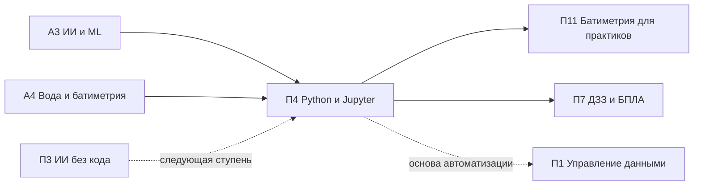

# П4. Python и Jupyter для специалистов

> **Тип:** Профессиональный, 24–40 ч · **Связь:** [А3](../a3/index.md), [А4](../a4/index.md) · **Компонент FOLUR:** 4 (развитие потенциала)
> **Аудитория:** технические специалисты хозяйств и МСБ, агрономы, фермеры с базовой компьютерной грамотностью; уровень ИИ-слоя — **Low-code**.

Модуль превращает специалиста-пользователя в специалиста-автора: вместо ожидания готового отчёта из чужого сервиса вы пишете **свой первый рабочий Python-скрипт под собственный датасет**. Никакой установки ПО: всё выполняется в бесплатном Google Colab. Логика платформы «от инструмента к применению» реализована на реальных данных: тем же датасетом из 80 000 эхолотных промеров, на котором студенты академического модуля [А4](../a4/index.md) строят карту глубин, здесь вы учитесь владеть на прикладном уровне — прочитать, почистить, посчитать, построить график, автоматизировать.

Если программирование вам пока не нужно вовсе — начните с [П3 «ИИ-инструменты без программирования»](../p3/index.md). П4 — следующая ступень: для тех, кому готовых сервисов уже мало.

## Цели модуля

После прохождения модуля слушатель сможет:

1. **[Bloom: понимать]** объяснять, что такое Jupyter-ноутбук, ядро и ячейки, чем воспроизводимый скрипт отличается от ручной работы в Excel и когда переход на Python оправдан для задач хозяйства.
2. **[Bloom: применять]** запускать Python-код в Google Colab без установки ПО: переменные, списки, циклы, функции, чтение файлов, разбор сообщений об ошибках.
3. **[Bloom: применять]** читать, фильтровать, чистить и агрегировать табличные данные в pandas и строить графики в matplotlib — на реальном датасете промеров водохранилища степной зоны Казахстана.
4. **[Bloom: применять]** открывать растровые данные (сетка глубин, спутниковый GeoTIFF) в rasterio/NumPy и запускать пакетную обработку серии файлов одним скриптом.
5. **[Bloom: анализировать]** проверять результат кода — своего и написанного ИИ-ассистентом — по контрольным точкам: число записей, физический диапазон значений, доля удалённых данных, сходимость с ручным расчётом.

## Уроки

| # | Урок | Трудозатраты ⏱ | Ключевой навык |
|---|---|---|---|
| 1 | [Запускаем Python без установки: первый ноутбук в Google Colab](lectures/01-zapuskaem-python-v-colab.md) | ~18 мин чтения + ~25 мин практики | ноутбук, ячейки, базовый синтаксис, чтение ошибок |
| 2 | [Читаем и чистим 80 000 промеров: pandas и matplotlib](lectures/02-pandas-matplotlib-chistka-tablic.md) | ~19 мин чтения + ~30 мин практики | DataFrame, фильтрация, чистка, графики |
| 3 | [Открываем растры и автоматизируем рутину: rasterio и пакетная обработка](lectures/03-rasterio-i-paketnaya-obrabotka.md) | ~18 мин чтения + ~30 мин практики | растр как массив, NDVI, цикл по файлам |
| П | [Практикум: первый рабочий скрипт — паспорт водоёма из 80 000 промеров](practicum/01-pervyj-rabochij-skript.md) | ~75 мин | прикладной продукт модуля |
| ИИ | [ИИ-ассистент в работе: первый скрипт с ИИ-напарником](ai-assistant.md) | ~45 мин | постановка задачи LLM → исполнение → верификация |
| А | [Итоговая аттестация](assessment/final.md) | ~45 мин | банк MCQ + сценарный кейс, порог 75 % |

Нагрузка соответствует нормативу платформы: ~2–2,5 часа контента в неделю; каждый микро-урок закрыт квизом сразу после материала.

## Прикладной продукт модуля

**Первый рабочий Python-скрипт под собственный датасет.** В практикуме вы собираете Colab-ноутбук «паспорт водоёма»: загрузка CSV с 80 000 промеров → протоколируемая чистка → статистики и доля мелководий → гистограмма и карта точек → сохранённые очищенный CSV и PNG. Затем — рамка «Проект на ВАШЕЙ земле»: тот же скрипт адаптируется под любой ваш CSV (журнал урожайности, взвешивания, показания датчиков, собственные промеры). Ноутбук воспроизводим: команда «Restart & Run all» повторяет результат с нуля.

## Данные модуля

- **Батиметрические промеры** — уникальный учебный ресурс платформы: `datasets/bathymetry-training-80k.csv` (уровень A: колонки `point_id, x_m, y_m, depth_m`, 80 000 точек, глубины 0–16,1 м, локальная система координат без геопривязки; водоём именуется «водохранилище степной зоны Казахстана»). Полный набор: Zenodo, `<DOI будет присвоен при публикации на Zenodo>`.
- **Сетка глубин 100 м** (уровень B): [`bathymetry-grid-100m.tif`](../a4/data/bathymetry-grid-100m.tif) — растровый пример для урока 3.
- **Внешние открытые данные:** Sentinel-2 (Copernicus Data Space / Browser), NASA POWER (агроклиматические ряды), OpenStreetMap.

Правовой режим батиметрических данных — трёхуровневая политика доступа: см. [Датасеты платформы](../../datasets.md). Все задания модуля решаются на открытых уровнях A и B.

## ИИ-ассистент в работе · уровень Low-code

«Первый скрипт с ИИ-напарником»: слушатель формулирует задачу по-русски, LLM-ассистент (встроенный помощник Colab или чат-ассистент — Claude и аналоги) пишет код, слушатель исполняет его и **проверяет по контрольным точкам** (число строк, диапазон глубин, сходимость с ручным расчётом). Подробности — в [ИИ-задании](ai-assistant.md); рамка ИИ-слоя платформы — [здесь](../../ai-tools.md).

*Правило: ИИ ускоряет — человек верифицирует. Задание выполнимо и без ИИ.*

## Место в архитектуре платформы

*Рис. 1. Связи модуля П4. Alt: П4 опирается на академические модули А3 и А4, продолжает П3 для тех, кому не хватает no-code-сервисов, и готовит слушателя к обработке данных в П11 и П7.*

Пререквизиты: уверенная работа с компьютером и таблицами (Excel/Google Sheets); опыт программирования **не требуется**. Полезно (не обязательно): [П1](../p1/index.md) — организация данных хозяйства, [П3](../p3/index.md) — готовые ИИ-сервисы.

## Оценивание

Тренировочные квизы (3–5 MCQ) — после каждой лекции. Итог: индивидуальный вариант из [банка модуля](assessment/final.md) (порог **75 %**) + сценарный кейс с экспертной проверкой + обязательные артефакты практикума (ноутбук, очищенный CSV, PNG).

## Библиография и рамки

Проверенные международные рамки и первичные источники (DOI не указываются там, где не верифицированы):

1. **FAO.** The 10 Elements of Agroecology: Guiding the transition to sustainable food and agricultural systems. FAO, Rome — рамка агроэкологического подхода; данные и их обработка — основа элемента «co-creation and sharing of knowledge».
2. **WOCAT** (World Overview of Conservation Approaches and Technologies) — глобальная база практик устойчивого землепользования; документирование практик требует навыков работы с данными, которые даёт модуль.
3. **ЦУР 15.3 / LDN** (Land Degradation Neutrality, UNCCD) — целевая рамка мониторинга деградации земель; расчёт индикаторов опирается на открытые данные и открытый программный стек.
4. **Каталог кейсов FOLUR Impact Program** (Food Systems, Land Use and Restoration, GEF/UNDP) — источник региональных примеров интегрированного управления ландшафтами.
5. Официальная документация **Python** (docs.python.org), **Project Jupyter** (jupyter.org), **Google Colab** (colab.research.google.com).
6. Официальная документация **pandas** (pandas.pydata.org), **matplotlib** (matplotlib.org), **NumPy** (numpy.org), **rasterio** (rasterio.readthedocs.io).
7. McKinney, W. (2010). Data Structures for Statistical Computing in Python. *Proceedings of the 9th Python in Science Conference* — первичная публикация pandas.
8. Hunter, J. D. (2007). Matplotlib: A 2D graphics environment. *Computing in Science & Engineering*, 9(3) — первичная публикация matplotlib.
9. Документация **Copernicus Data Space Ecosystem** (Sentinel-2) и **NASA POWER** (агроклиматические данные) — официальные описания используемых открытых данных.

Правовой режим батиметрических данных: [политика датасетов платформы](../../datasets.md); канонический каркас модуля: [шаблон](../../about/module-template.md).
