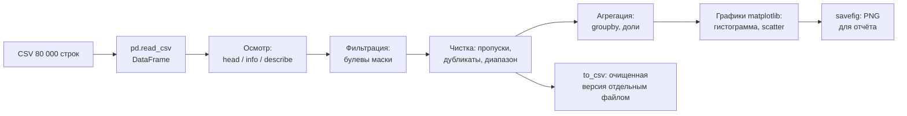

# Читаем и чистим 80 000 промеров: pandas и matplotlib

> ⏱ **Трудозатраты:** ~19 мин чтения + ~30 мин практики
>
> Модуль **П4: Python и Jupyter для специалистов**, лекция 2 из 3.
> Профессиональный уровень. Проект UNDP-KAZ, FOLUR.

## Цели лекции и место в модуле

Это центральная лекция модуля: здесь появляется главный рабочий инструмент специалиста по данным — библиотека pandas — и первый настоящий датасет: 80 000 сырых эхолотных промеров водохранилища степной зоны Казахстана, собранных полевыми экспедициями исполнителя. Данные реальные, со всеми дефектами реальной съёмки, и путь «прочитать → посмотреть → отфильтровать → почистить → посчитать → нарисовать → сохранить», который вы пройдёте, — это универсальный конвейер для любой вашей будущей таблицы: журнала урожайности, выгрузки датчиков, собственных промеров.

После изучения лекции слушатель сможет:

1. **[Bloom: понимать]** объяснять, что такое DataFrame, чем он отличается от списка словарей и листа Excel и почему операции в pandas применяются к целым колонкам сразу.
2. **[Bloom: применять]** читать CSV в DataFrame, осматривать данные (`head`, `info`, `describe`), выбирать колонки и фильтровать строки булевыми масками, агрегировать через `groupby`.
3. **[Bloom: применять]** проводить протоколируемую чистку: находить пропуски, дубликаты и физически невозможные значения, сохранять очищенную версию отдельным файлом.
4. **[Bloom: анализировать]** строить и интерпретировать гистограмму и диаграмму рассеяния в matplotlib: читать форму распределения глубин и структуру галсов съёмки.

> **Границы лекции.** Внутри: pandas для табличных данных, базовая чистка, гистограмма и диаграмма рассеяния. Снаружи: базовый синтаксис Python и работа в Colab — в [лекции 1](01-zapuskaem-python-v-colab.md); растры и пакетная обработка — в [лекции 3](03-rasterio-i-paketnaya-obrabotka.md); полный конвейер с сохранением артефактов — в [практикуме](../practicum/01-pervyj-rabochij-skript.md). Профессиональная фильтрация выбросов по локальной статистике соседей и интерполяция в карту глубин — предмет академического модуля [А4](../../a4/index.md) и профмодуля [П11](../../p11/index.md): здесь мы делаем честную базовую чистку, а не гидрографическую обработку.

---

## 1. DataFrame: таблица, у которой есть память и мускулы

### 1.1 Знакомимся с датасетом

Учебный датасет `datasets/bathymetry-training-80k.csv` — случайный сабсет в 80 000 точек из полного набора полевых промеров (~540 000 записей; полный набор публикуется на Zenodo: `<DOI будет присвоен при публикации на Zenodo>`). Четыре колонки: `point_id` — номер записи, `x_m` и `y_m` — координаты в **локальной метрической системе**, `depth_m` — глубина в метрах. Геопривязка удалена безвозвратно, название и расположение водоёма не раскрываются — это уровень A трёхуровневой политики данных платформы (см. [Датасеты](../../../datasets.md)); для всех учебных задач реальное положение водоёма и не нужно: геометрия и глубины полностью сохранены.

Читается всё это одной строкой:

```python
import pandas as pd

df = pd.read_csv("bathymetry-training-80k.csv")
df.head()        # первые 5 строк — быстрый взгляд
```

`df` — это **DataFrame**: таблица с именованными колонками и пронумерованными строками. Внешне похоже на лист Excel, но с принципиальной разницей: вы не редактируете ячейки мышкой, а описываете операции над целыми колонками, и pandas исполняет их над всеми 80 000 строк одновременно. Одна колонка (`df["depth_m"]`) называется Series — с ней работают те же приёмы.

Практическая деталь для ваших собственных файлов: экспорт из русскоязычного Excel часто использует точку с запятой как разделитель и запятую в дробях. Обе проблемы решаются аргументами чтения: `pd.read_csv(fajl, sep=";", decimal=",")`. Если после чтения вся таблица оказалась одной колонкой со странным именем — почти наверняка дело в разделителе, а не в «битом файле».

### 1.2 Три команды осмотра

Первое, что делает специалист с новой таблицей, — разведочный осмотр тремя командами:

```python
df.shape         # (80000, 4) — строк и колонок
df.info()        # имена колонок, типы, число непустых значений
df.describe()    # статистики по числовым колонкам
```

`info()` отвечает на вопросы «всё ли прочиталось числами?» и «есть ли пропуски?». Типы данных pandas стоит знать в лицо: `int64` — целые числа (номера точек), `float64` — числа с дробной частью (координаты, глубины), `object` — текст. Если колонка, которая обязана быть числовой, получила тип `object`, — где-то в данных мусор: текстовый комментарий оператора посреди чисел, запятая вместо точки в дробях, слово «нет» вместо пустой ячейки. Это надо найти и обезвредить **до** любых расчётов, иначе первая же арифметическая операция упадёт или, что хуже, молча посчитает не то.

`describe()` выдаёт минимум, максимум, среднее, медиану и квартили — и это уже проверка данных на здравый смысл. Для нашего датасета: глубины лежат в диапазоне от 0 до 16,1 м, средняя — около 3,4 м, медиана — около 3,0 м. Среднее заметно больше медианы — распределение скошено: мелководных точек больше, чем глубоких, что типично для равнинного водохранилища с обширными заливами. Уже три команды дали содержательный вывод о водоёме — без единого графика.

Выработайте рефлекс: эти три команды выполняются для **каждой** новой таблицы, которая попадает вам в руки, до любых действий с ней. Осмотр занимает минуту, а экономит часы: почти все неприятные сюрпризы данных (не тот разделитель, лишняя строка заголовка, перепутанные колонки, коды ошибок датчика вроде `-999`) видны уже на этом шаге.

> **Подробнее** о том, как этот же датасет превращается в карту глубин и расчёт объёма, — в [лекции 2 модуля А4](../../a4/lectures/02-karta-glubin-iz-promerov.md).

### 1.3 Конвейер лекции целиком



*Рис. 1. Конвейер обработки таблицы: от сырого CSV до очищенного файла и графиков. Alt: блок-схема — CSV читается в DataFrame, проходит осмотр, фильтрацию, чистку и агрегацию; результаты сохраняются как новый CSV и PNG-графики.*

---

## 2. Выбираем и фильтруем: булевы маски

### 2.1 Колонки и маски

```python
df["depth_m"]                  # одна колонка (Series)
df[["x_m", "y_m"]]             # несколько колонок — список имён

melko = df[df["depth_m"] < 2.0]        # строки мельче 2 м
nuli  = df[df["depth_m"] == 0.0]       # нулевые отсчёты
```

Выражение `df["depth_m"] < 2.0` вычисляется для всех строк сразу и даёт колонку из `True`/`False` — **булеву маску**. Подстановка маски в `df[...]` оставляет только строки с `True`. Это главный приём pandas: любые «найти все записи, где…» — одна строка кода. Условия комбинируются: `&` — «и», `|` — «или», каждое условие в скобках:

```python
sredniye = df[(df["depth_m"] >= 2.0) & (df["depth_m"] < 5.0)]
dolya_nulej = len(nuli) / len(df)
print(f"Нулевых отсчётов: {len(nuli)} ({dolya_nulej:.1%})")
```

На учебном датасете нулевых отсчётов около 4–5 % — и это не техническая мелочь, а содержательный вопрос: часть нулей — настоящий урез воды у берега, часть — потери дна эхолотом (заросли, аэрация, мелководье). Отличить одно от другого без пространственного анализа соседних точек нельзя — поэтому в этой лекции мы нули **не удаляем**, а честно считаем и документируем. Профессиональные правила разделения — в [А4](../../a4/lectures/02-karta-glubin-iz-promerov.md).

### 2.2 Сортировка и агрегация

```python
df.sort_values("depth_m", ascending=False).head(10)   # 10 самых глубоких точек

df["zona"] = pd.cut(df["depth_m"],
                    bins=[-0.01, 2, 5, 10, 17],
                    labels=["0–2 м", "2–5 м", "5–10 м", ">10 м"])
df.groupby("zona", observed=True)["depth_m"].agg(["count", "mean"])
```

`pd.cut` нарезает непрерывную глубину на зоны, `groupby` считает статистику по каждой зоне — за две строки получается таблица «сколько точек и какая средняя глубина в каждой зоне», готовая в отчёт. Тот же приём работает для любых категорий: урожайность по полям, привесы по группам, осадки по месяцам. Обратите внимание: мы **создали новую колонку** `df["zona"]` — DataFrame расширяется на лету, исходный CSV при этом не тронут.

Логика `groupby` заслуживает отдельного абзаца, потому что это самая мощная идея pandas. Схема всегда трёхчастная: **разбить** таблицу на группы по значению колонки → **применить** к каждой группе функцию (счёт, среднее, максимум) → **собрать** результаты в итоговую таблицу. Один вызов заменяет вложенный цикл с ручным накоплением сумм, который вы написали бы средствами лекции 1, — и работает быстрее и надёжнее. Если вы освоите только две конструкции из всей библиотеки — булевы маски и `groupby`, — вы уже закроете большинство табличных задач хозяйства.

Ещё один будничный инструмент — `value_counts()`: одна команда `df["zona"].value_counts()` выдаёт частоты категорий и мгновенно отвечает на вопросы вида «сколько записей по каждому полю/бригаде/прибору». Для журнала с текстовой колонкой «культура» это первый шаг осмотра: опечатки («пшеница» и «пшеница ») сразу видны как отдельные строки частот — и это тоже находка чистки, а не мелочь.

---

## 3. Чистка: протокол вместо «на глазок»

### 3.1 Пропуски и дубликаты

```python
df.isna().sum()              # пропуски по каждой колонке
df.duplicated().sum()        # полностью одинаковые строки
df = df.drop_duplicates()    # удалить дубликаты (если есть)
```

Пропуск (`NaN`) — пустая ячейка: датчик не сработал, оператор не заполнил. Стратегий три: удалить строки (`dropna()`), заполнить значением (`fillna()`), оставить и учитывать. Универсально правильной нет — решение зависит от задачи и **обязательно фиксируется** в тексте ноутбука. Дубликаты в выгрузках техники и журналах — частый гость (повторная выгрузка, двойное нажатие); проверка на них — обязательный пункт чистки любой таблицы.

### 3.2 Физический диапазон

Самая надёжная чистка — по физике задачи. Глубина не бывает отрицательной; глубина больше максимальной для данного водоёма — тоже дефект (эхо от рыбы, двойное отражение). Порог сверху берут из априорного знания о водоёме — с запасом, а не по самим данным, иначе можно отрезать законный максимум:

```python
was = len(df)
clean = df[(df["depth_m"] >= 0) & (df["depth_m"] <= 17.0)].copy()
print(f"Удалено {was - len(clean)} строк из {was}")
```

Мелочь в коде выше, о которую спотыкаются новички: метод `.copy()` в конце строки создаёт независимую копию отобранных строк. Без него pandas может вернуть «представление» исходной таблицы и выдать предупреждение `SettingWithCopyWarning` при следующей записи в колонку. Правило простое: отфильтровали строки для дальнейшей работы — добавьте `.copy()`.

Две детали профессиональной культуры. Первая: скрипт **сам печатает протокол** — сколько строк удалено и по какому правилу; чистка без протокола не отличается от порчи данных. Вторая: результат сохраняется **новым файлом**, сырые данные неприкосновенны (правило из [лекции 1](01-zapuskaem-python-v-colab.md), §4.3):

```python
clean.to_csv("bathymetry-clean.csv", index=False)
```

На учебном датасете правило диапазона не удалит ничего — глубины уже лежат в 0–16,1 м, — и это тоже результат: «проверили — дефектов диапазона нет» является строкой протокола, а не потерянным временем. В ваших собственных выгрузках этот же фильтр регулярно ловит `-999` (код ошибки датчика), опечатки операторов и сбои приборов.

### 3.3 Чего базовая чистка не делает

Честность метода — знать его пределы. Фильтр диапазона не найдёт **правдоподобный мусор**: одиночную точку 12 м среди соседних 4-метровых (эхо от косяка рыбы) — значение возможное, но в этом месте ложное. Такие выбросы ловятся только локальной статистикой соседних точек, и это уже гидрографическая обработка — модуль [А4](../../a4/index.md) для теории, [П11](../../p11/index.md) для практики на собственных съёмках. Базовая чистка этой лекции — необходимый первый эшелон, после которого данные пригодны для статистик и графиков, но ещё не для официальной карты глубин.

---

## 4. matplotlib: два графика, которые видят то, что скрывают числа

### 4.1 Гистограмма — форма распределения

```python
import matplotlib.pyplot as plt

fig, ax = plt.subplots(figsize=(8, 5))
ax.hist(clean["depth_m"], bins=40, edgecolor="white")
ax.set_xlabel("Глубина, м")
ax.set_ylabel("Число промеров")
ax.set_title("Распределение глубин: 80 000 промеров")
fig.savefig("gistogramma-glubin.png", dpi=150)
```

Гистограмма делит диапазон глубин на корзины (`bins`) и показывает, сколько промеров попало в каждую. На учебном датасете вы увидите скошенное вправо распределение (что предсказали числа из §1.2) и пик у нуля — те самые нулевые отсчёты из §2.1: график мгновенно делает видимым то, что в таблице пришлось бы искать. Три обязательных элемента любого графика в отчёт: подписи осей **с единицами измерения**, заголовок, читаемый размер. `savefig` сохраняет PNG — файл появляется в панели файлов Colab, откуда его можно скачать.

Число корзин — параметр с характером: слишком мало корзин (`bins=5`) замажет пик нулей, слишком много (`bins=400`) превратит форму в гребёнку шума. Правило практики — начать с нескольких десятков и подвигать: форма распределения должна быть устойчива к разумной смене `bins`. Чем это лучше диаграммы в Excel? Тем же, чем скрипт лучше ручной работы: график строится кодом, а значит, следующая выгрузка данных даст обновлённый график **тем же кодом** — без повторного накликивания мастера диаграмм.

### 4.2 Диаграмма рассеяния — карта точек съёмки

У нас есть координаты `x_m`, `y_m` — значит, можно нарисовать точки в плане, раскрасив по глубине:

```python
fig, ax = plt.subplots(figsize=(9, 7))
sc = ax.scatter(clean["x_m"], clean["y_m"],
                c=clean["depth_m"], s=1, cmap="viridis_r")
fig.colorbar(sc, label="Глубина, м")
ax.set_xlabel("x, м (локальная СК)")
ax.set_ylabel("y, м (локальная СК)")
ax.set_aspect("equal")          # метр по x равен метру по y
ax.set_title("Промеры: карта точек, цвет — глубина")
fig.savefig("karta-tochek.png", dpi=150)
```

Этот график — почти карта: видна форма акватории, параллельные линии галсов лодки с эхолотом, тёмные глубокие участки и светлые мелководья. «Почти» — потому что координаты локальные: наложить его на реальную карту нельзя, и для учебных задач не нужно. Обратите внимание на `set_aspect("equal")`: без него masshtab осей различен и форма водоёма искажается — частая ошибка в отчётах. Аргумент `s=1` делает точки мелкими: на 80 000 точек крупные маркеры сливаются в пятно.

Диаграмма рассеяния — это и инструмент контроля чистки: если после фильтрации на карте точек появились «дыры» в середине акватории — фильтр удалил не мусор, а данные.

Пара слов о цвете. `cmap` — цветовая шкала; `viridis_r` выбрана не случайно: шкала равномерна по восприятию (одинаковые перепады глубин выглядят одинаково контрастно), различима при цветоаномалии и корректно печатается в оттенках серого; суффикс `_r` разворачивает её так, чтобы глубокое было тёмным — интуитивная конвенция батиметрии. Радужные шкалы, любимые старыми программами, создают ложные визуальные границы там, где в данных их нет, — в отчётах их лучше избегать.

> **Подробнее** об оформлении карт по правилам картографии (легенда, масштаб, компоновка) — в модулях [П2](../../p2/index.md) и [А2](../../a2/index.md); matplotlib здесь — инструмент быстрой диагностики, а не картографии.

---

## Региональный кейс

**Ситуация:** Фермерское хозяйство в Костанайской области арендует пруд-накопитель для полива и водопоя и заказало эхолотную съёмку подрядчику. Подрядчик прислал CSV на десятки тысяч строк и короткое письмо: «сырые данные, чистите сами». Техническому специалисту хозяйства нужно за час дать руководителю ответ: корректны ли данные, какова структура глубин и какую долю акватории занимают мелководья, склонные к зарастанию и быстрому прогреву. В качестве тренировочного полигона специалист использует учебный датасет платформы — по формату и дефектам он идентичен реальной выгрузке эхолота.

**Данные:** `datasets/bathymetry-training-80k.csv` (уровень A: `point_id, x_m, y_m, depth_m`, 80 000 точек) — см. [Датасеты платформы](../../../datasets.md).

**Задача:**

1. Прочитать CSV, выполнить осмотр тремя командами (§1.2) и зафиксировать: число записей, диапазон и медиану глубин, число пропусков и дубликатов.
2. Посчитать долю нулевых отсчётов и долю точек мельче 2 м; разбить глубины на зоны `pd.cut` и получить таблицу «зона → число точек» (§2.2).
3. Построить гистограмму глубин и карту точек (§4); по карте оценить, где сосредоточены мелководья — по периметру или отдельными заливами.

**Разбор:** Ожидаемый ход: осмотр подтверждает 80 000 записей без пропусков, глубины 0–16,1 м; нулевых отсчётов — около двадцатой части датасета, точек мельче 2 м — порядка десятой части (точные значения слушатель вычисляет сам — они и есть ответ руководителю). Ключевой аналитический шаг — не числа, а их интерпретация: нулевые отсчёты нельзя молча удалять (часть из них — берег, §2.1), а «долю мелководий по точкам» нельзя выдавать за «долю площади» — промеры расположены неравномерно вдоль галсов, и честный пересчёт в площади требует интерполяции ([А4](../../a4/index.md)). Грамотный вывод специалиста звучит так: «по точкам съёмки — такая-то доля, оценка по площади требует построения сетки». Умение видеть эту разницу и есть цель кейса.

---

## Закрепление и применение

!!! example "Попробуйте в Colab"
    Ноутбук лекции (`<URL будет назначен при создании репозитория ноутбуков>`) содержит весь конвейер §1–§4 на учебном датасете. Минимальное задание на 20 минут: выполните осмотр тремя командами, посчитайте долю точек глубже 10 м, постройте обе картинки §4 и добейтесь, чтобы карта точек не была искажена (`set_aspect("equal")`).

!!! warning "Границы применимости"
    Базовая чистка (диапазон, пропуски, дубликаты) не заменяет гидрографическую обработку: правдоподобные локальные выбросы остаются в данных (§3.3), а доли по точкам — не доли по площади. Учебный датасет — в локальной системе координат: накладывать его на реальные карты нельзя. pandas держит таблицу в оперативной памяти: сотни тысяч строк — легко, сотни миллионов — уже инженерная задача за рамками модуля.

!!! tip "Что это даёт вашему хозяйству"
    Замените в коде лекции имя файла и имена колонок — и тот же конвейер обработает журнал урожайности по полям, выгрузку комбайна или показания датчиков влажности: осмотр, чистка с протоколом, зоны, гистограмма. Это и есть ваш «первый скрипт под собственный датасет» — прикладной продукт модуля, который вы соберёте в [практикуме](../practicum/01-pervyj-rabochij-skript.md).

!!! question "Кейс для размышления"
    В выгрузке датчика влажности почвы 3 % значений — ровно `-999`, ещё 2 % — пропуски. Коллега предлагает: «заполним всё средним, чтобы график был гладкий». Какие два разных решения требуются для этих двух групп и почему «заполнить средним» опасно для последующего расчёта норм полива? Рассуждайте от §3.1–3.2.

### Словарь урока

| Термин | Значение |
|---|---|
| **DataFrame** | таблица pandas с именованными колонками и пронумерованными строками; операции применяются к колонкам целиком |
| **Series** | одна колонка DataFrame; поддерживает те же маски и статистики |
| **Булева маска** | колонка `True`/`False`, полученная сравнением; подстановка в `df[...]` отбирает строки |
| **NaN** | «not a number» — пропуск, пустая ячейка; ищется командой `isna()` |
| **groupby** | схема «разбить → применить → собрать»: статистика по группам одной командой |
| **pd.cut** | нарезка непрерывной величины на зоны-категории по заданным границам |
| **value_counts()** | частоты значений колонки; первый инструмент осмотра текстовых колонок и поиска опечаток |
| **.copy()** | независимая копия отобранных строк; страховка от предупреждений при дозаписи колонок |

### Проверь себя

```quiz
[
  {
    "q": "Что вернёт выражение df[df[\"depth_m\"] < 2.0]?",
    "options": ["Новый DataFrame только из строк, где глубина меньше 2 м", "Число строк, где глубина меньше 2 м", "Колонку True/False без самих данных", "Исходный DataFrame с удалёнными навсегда строками"],
    "answer": 0,
    "explain": "§2.1: сравнение колонки с числом даёт булеву маску, а подстановка маски в df[...] отбирает строки с True в новый DataFrame; исходный df не меняется."
  },
  {
    "q": "describe() показал: средняя глубина ≈3,4 м, медиана ≈3,0 м. О чём говорит такое соотношение?",
    "options": ["Распределение скошено: мелководных точек больше, а немногочисленные большие глубины подтягивают среднее вверх", "В данных ошибка: среднее и медиана обязаны совпадать", "Половина точек глубже 3,4 м", "Датасет содержит пропуски, искажающие среднее"],
    "answer": 0,
    "explain": "§1.2: превышение среднего над медианой — признак правостороннего скоса; для равнинного водохранилища с обширными мелководьями это ожидаемая форма распределения."
  },
  {
    "q": "Почему нулевые глубины в датасете нельзя просто удалить одной командой?",
    "options": ["Часть нулей — настоящие точки у уреза воды, а часть — потери дна эхолотом; без анализа соседних точек их не различить", "Ноль — служебное значение pandas, его удаление ломает DataFrame", "Нулевые значения нужны для правильной работы гистограммы", "Удаление нулей запрещено политикой данных платформы"],
    "answer": 0,
    "explain": "§2.1: ноль у берега — законное измерение уреза, ноль среди больших глубин — дефект. Базовая чистка их честно документирует, а разделение по соседям — задача гидрографической обработки (А4/П11)."
  },
  {
    "q": "Какое правило нарушает команда df.to_csv(\"bathymetry-training-80k.csv\") после чистки?",
    "options": ["Сырые данные неприкосновенны: очищенную версию сохраняют новым файлом, не перезаписывая исходник", "Метод to_csv не умеет сохранять очищенные данные", "После чистки сохранять данные вообще не нужно", "CSV нельзя использовать для хранения числовых данных"],
    "answer": 0,
    "explain": "§3.2: перезапись исходного файла уничтожает возможность перепроверить и повторить чистку. Правильно: clean.to_csv(\"bathymetry-clean.csv\", index=False) — новый файл рядом с сырым."
  },
  {
    "q": "На карте точек (scatter) форма водоёма выглядит сплюснутой. Наиболее вероятная причина?",
    "options": ["Не задан равный масштаб осей — нужен ax.set_aspect(\"equal\")", "В данных перепутаны местами глубина и координата", "Точек слишком много для scatter", "Выбрана неудачная цветовая шкала"],
    "answer": 0,
    "explain": "§4.2: по умолчанию matplotlib растягивает оси независимо; для координат в метрах равный масштаб осей обязателен, иначе геометрия акватории искажается."
  }
]
```

### Контрольные вопросы

1. Назовите три команды первичного осмотра DataFrame и что именно проверяет каждая. *(Bloom: знать)*
2. Объясните разницу между «долей мелководий по точкам съёмки» и «долей мелководий по площади водоёма» и почему pandas-фильтром получается только первая. *(Bloom: понимать/анализировать)*
3. Составьте план чистки для CSV-журнала взвешиваний вашего хозяйства: какие проверки в каком порядке и что попадёт в протокол. *(Bloom: применять)*

## Что дальше?

Таблицы освоены — но половина данных специалиста живёт в другой форме: спутниковые снимки и сетки глубин — это растры. В [лекции 3 «Открываем растры и автоматизируем рутину»](03-rasterio-i-paketnaya-obrabotka.md) вы прочитаете GeoTIFF как числовой массив, посчитаете по нему NDVI и напишете первый пакетный скрипт — один код на папку файлов. А [практикум](../practicum/01-pervyj-rabochij-skript.md) уже ждёт: конвейер этой лекции — его сердцевина.
