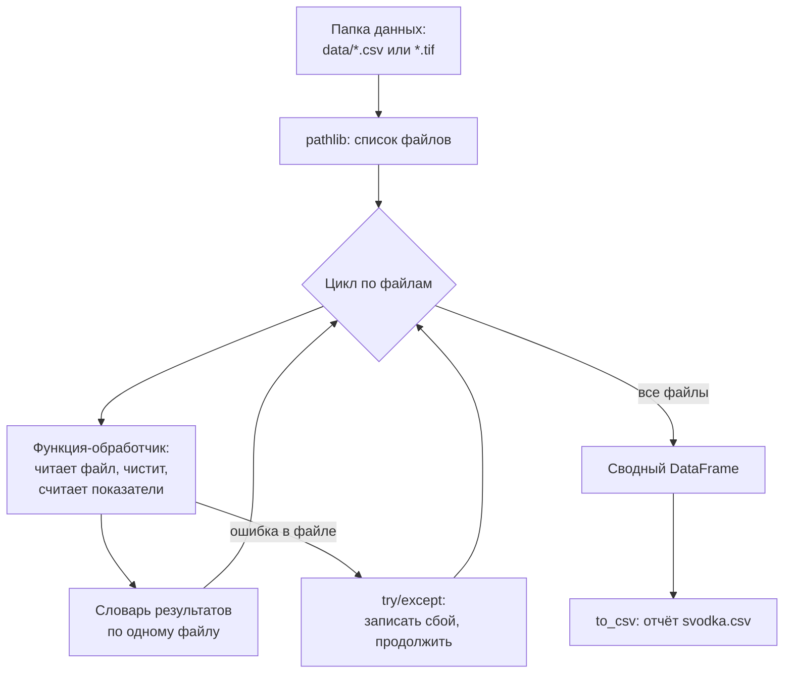

# Открываем растры и автоматизируем рутину: rasterio и пакетная обработка

!!! info "Доступность данных"
    Файлы уровней B и C сняты с публикации. Иллюстрации уроков сохранены. Контрольная сетка и полные промеры не выдаются сайтом; примеры с ними требуют собственного входного файла. Открытый набор уровня A доступен на [Zenodo](https://zenodo.org/records/23014446).


> ⏱ **Трудозатраты:** ~18 мин чтения + ~30 мин практики
>
> Модуль **П4: Python и Jupyter для специалистов**, лекция 3 из 3.
> Профессиональный уровень. Проект UNDP-KAZ, FOLUR.

## Цели лекции и место в модуле

Таблицы из [лекции 2](02-pandas-matplotlib-chistka-tablic.md) — половина мира данных; вторая половина — растры: спутниковые снимки, сетки глубин, карты индексов. Эта лекция показывает, что растр для Python — просто числовой массив, и открывает его теми же руками: NumPy для чисел, rasterio для файлов GeoTIFF. Финал лекции — навык, ради которого специалисты и учат Python: **пакетная обработка** — один скрипт, обрабатывающий целую папку файлов, будь то серия снимков за сезон или выгрузки эхолота по нескольким водоёмам.

После изучения лекции слушатель сможет:

1. **[Bloom: понимать]** объяснять устройство растра (пиксели, каналы, разрешение, nodata) и почему GeoTIFF читается как массив NumPy.
2. **[Bloom: применять]** открывать GeoTIFF в rasterio, читать метаданные и канал, маскировать значения по физическому диапазону и считать статистики и площади по ячейкам.
3. **[Bloom: применять]** вычислять NDVI по каналам Sentinel-2 и строить изображение растра в matplotlib.
4. **[Bloom: анализировать]** проектировать пакетный конвейер: функция-обработчик + цикл по файлам + сводная таблица результатов + защита от сбоя на одном файле.

> **Границы лекции.** Внутри: растр как массив, rasterio, NDVI по готовым каналам, пакетная обработка файлов. Снаружи: базовый Python — в [лекции 1](01-zapuskaem-python-v-colab.md); таблицы — в [лекции 2](02-pandas-matplotlib-chistka-tablic.md); поиск и заказ снимков, интерпретация NDVI по сезонам — в [П7](../../p7/index.md) и [П3](../../p3/index.md); проекции, привязка и настоящая картография — в [П2](../../p2/index.md)/[А2](../../a2/index.md); интерполяция промеров в сетку глубин — в [А4](../../a4/index.md). Здесь мы **читаем и считаем** растры, а не создаём их.

---

## 1. Растр — это массив чисел с паспортом

### 1.1 NumPy за пять минут

NumPy — библиотека числовых массивов, фундамент всего анализа данных в Python (pandas построен на ней). Массив похож на список, но все операции векторные — применяются ко всем элементам сразу, без цикла:

```python
import numpy as np

a = np.array([0.27, 2.87, 3.4, 16.1])
a * 2               # каждый элемент удвоен
a > 2.0             # булев массив — как маски в pandas
a[a > 2.0].mean()   # средняя по элементам глубже 2 м
```

Двумерный массив — таблица чисел `arr[строка, столбец]`. Именно так устроен растр: сетка пикселей, в каждом — число (глубина, яркость канала, значение индекса). Всё, что вы умеете с масками из лекции 2, работает и здесь — синтаксис тот же.

Почему не обойтись циклами из лекции 1? Из-за масштаба: фрагмент снимка Sentinel-2 на один сельский округ — это миллионы пикселей, а цикл Python обходит их поэлементно и мучительно долго. NumPy исполняет ту же операцию во внутреннем оптимизированном коде сразу над всем массивом — векторно, — и разница во времени составляет порядки. Отсюда практическое правило растровой работы: **если вы пишете цикл по пикселям — остановитесь и поищите векторную операцию**; почти всегда она есть и записывается короче.

У массива есть два свойства-паспорта, которые вы будете проверять постоянно: `arr.shape` — размерность (строки, столбцы), `arr.dtype` — тип чисел. Несовпадение `shape` двух массивов, которые вы собираетесь складывать или делить, — типовая ошибка (например, каналы разных разрешений); проверка `shape` перед арифметикой — секунда, а ловит она половину растровых недоразумений.

### 1.2 Что в «паспорте» растра

GeoTIFF — это массив плюс метаданные: размер в пикселях, число каналов, тип чисел (`float32`, `uint16`…), геопривязка (где сетка лежит на Земле и каков размер пикселя) и специальное значение **nodata** — код «здесь данных нет». Библиотека **rasterio** читает и то и другое:

```python
!pip install rasterio          # в Colab — один раз за сессию
import rasterio

src = rasterio.open("bathymetry-grid-100m.tif")
print(src.width, src.height)   # 211 x 166 пикселей
print(src.count, src.dtypes)   # 1 канал, float32
print(src.nodata)              # None — маски nodata нет!
arr = src.read(1)              # канал 1 -> массив NumPy 166x211
```

Наш пример — открытая **сетка глубин 100 м** (уровень B политики данных, [`bathymetry-grid-100m.tif`](../../a4/data/bathymetry-grid-100m.tif)): производный обобщённый продукт того же водохранилища степной зоны Казахстана, промеры которого вы чистили в лекции 2. Каждый пиксель — 100×100 м, значение — глубина в метрах.

### 1.3 Урок честности: не всё, что в файле, — данные

Выведите статистики массива — и получите сюрприз: минимальные значения глубоко отрицательные, максимальные — заметно больше 16,1 м, хотя таких глубин в водоёме нет. Причина в паспорте: `nodata = None`. Сетка построена интерполяцией по прямоугольнику, накрывающему водоём, и в ячейках **за пределами акватории** интерполятор экстраполировал — досочинил значения, не имеющие физического смысла. Файл честен по-своему: он нигде не утверждает, что все ячейки — вода; но специалист, посчитавший «среднюю глубину» по всему массиву, получит бессмыслицу.

Лечение — маска по физическому диапазону, знакомое движение из лекции 2:

```python
voda = arr[(arr >= 0) & (arr <= 16.1)]     # только правдоподобные ячейки
print(f"Ячеек воды: {voda.size}")
print(f"Средняя глубина: {voda.mean():.2f} м")

ploshchad_km2 = voda.size * 100 * 100 / 1e6   # ячейка 100x100 м
obem_mln_m3  = voda.sum() * 100 * 100 / 1e6   # метод призм: сумма глубин x площадь ячейки
print(f"Площадь ≈ {ploshchad_km2:.1f} км², объём ≈ {obem_mln_m3:.1f} млн м³")
```

Три строки — и у вас оценка площади и объёма водоёма (метод призм: объём = сумма по ячейкам глубины, умноженной на площадь ячейки). Это **оценка по обобщённой сетке с грубой маской**, а не гидрографический расчёт: у настоящей обработки маска акватории строится по береговой линии, а не по диапазону значений — границы применимости обсудим в конце. Но принцип «открой паспорт → проверь nodata → маскируй → считай» — универсален для любого растра, который вам пришлют.

Нарисовать растр — одна команда matplotlib:

```python
import matplotlib.pyplot as plt

masked = np.where((arr >= 0) & (arr <= 16.1), arr, np.nan)  # вне воды -> NaN
fig, ax = plt.subplots(figsize=(9, 7))
im = ax.imshow(masked, cmap="viridis_r")
fig.colorbar(im, label="Глубина, м")
ax.set_title("Сетка глубин 100 м (уровень B)")
fig.savefig("setka-glubin.png", dpi=150)
```

`np.where(условие, значение_да, значение_нет)` заменяет ячейки вне диапазона на `NaN` — matplotlib рисует их прозрачными, и на экране остаётся только акватория.

---

## 2. NDVI из каналов Sentinel-2: растровая арифметика

### 2.1 Откуда берутся файлы

Снимки Sentinel-2 бесплатны и открыты. Для специалиста без ГИС-подготовки самый простой путь — **Copernicus Browser** (browser.dataspace.copernicus.eu): найти свой участок, выбрать безоблачную дату, выгрузить нужные каналы как GeoTIFF. Альтернативы — Google Earth Engine и Microsoft Planetary Computer (работа с их каталогами — навык модулей [А3](../../a3/index.md) и [П7](../../p7/index.md)). Для NDVI нужны два канала: **B04** (красный) и **B08** (ближний инфракрасный), оба с разрешением 10 м.

Пара слов о размере. Полный тайл Sentinel-2 — почти 11 тысяч пикселей по стороне при разрешении 10 м, и в `float32` один такой канал занимает сотни мегабайт памяти; несколько подобных массивов способны исчерпать память сессии Colab. Практический приём: выгружайте из Copernicus Browser не весь тайл, а фрагмент по границе своего участка — интерфейс позволяет обвести область интереса, массивы получаются в сотни раз меньше, и весь конвейер лекции отрабатывает мгновенно. Если массив всё-таки велик, rasterio умеет читать растр «по окнам» (windowed reading) — тема за рамками модуля, но термин для поиска у вас теперь есть.

Две детали выбора, которые экономят часы. Первая — уровень обработки: берите продукты **L2A** (отражение у поверхности, атмосферная коррекция уже выполнена поставщиком) — для сравнения дат между собой это существенно. Вторая — облачность: даже лёгкая дымка или полупрозрачное перистое облако искажают индекс, а тень от облака на поле выглядит на NDVI-карте как «проблемная зона», которой нет. Правило специалиста: сначала посмотреть сцену глазами в браузере, потом выгружать. Пиксель 10 м означает, что на поле в сотни гектаров приходятся десятки тысяч пикселей — достаточно и для среднего по полю, и для карты неоднородности; а вот узкая лесополоса или край поля шириной в один-два пикселя всегда будут «смешанными» — интерпретировать их значения нужно осторожно.

### 2.2 Формула в четыре строки

NDVI = (NIR − RED) / (NIR + RED) — нормализованный вегетационный индекс: живая листва сильно отражает ближний инфракрасный свет и поглощает красный, поэтому у активной растительности NDVI высок (ближе к 1), у открытой почвы — низок, у воды — отрицателен. Смысл и сезонное поведение индекса подробно разобраны в [П3](../../p3/index.md) и [П7](../../p7/index.md); здесь — как посчитать его самому:

```python
red = rasterio.open("B04.tif").read(1).astype("float32")
nir = rasterio.open("B08.tif").read(1).astype("float32")

ndvi = (nir - red) / (nir + red + 1e-9)   # +1e-9 спасает от деления на 0
print(f"Средний NDVI участка: {np.nanmean(ndvi):.2f}")
```

Арифметика с массивами поэлементна: одна строка формулы обсчитывает миллионы пикселей. Мелкая, но важная деталь — `astype("float32")`: каналы Sentinel-2 хранятся целыми числами, и без преобразования деление целых даст мусор. Добавка `1e-9` в знаменатель защищает от деления на ноль в пустых пикселях. Результат `ndvi` — такой же массив: его можно маскировать, усреднять по зонам и рисовать `imshow`, как сетку глубин в §1.3.

Проверка на здравый смысл обязательна и здесь: NDVI по построению лежит в диапазоне −1…+1. Значения за пределами — признак ошибки (перепутаны каналы, не сделан `astype`). Привычка «посчитал → проверь диапазон» — та же, что с глубинами, и она станет обязательным шагом в [ИИ-задании](../ai-assistant.md).

> **Подробнее** о выборе дат, облачности, интерпретации NDVI-карт и переходе на съёмку БПЛА — в [П7](../../p7/index.md); о готовых сервисах NDVI-мониторинга без кода — в [П3](../../p3/index.md).

---

## 3. Пакетная обработка: один скрипт — вся папка

### 3.1 Задача, ради которой всё затевалось

Методология платформы называет этот навык прямо: «пакетная обработка батиметрических данных». Реальные сценарии: эхолот выгружает съёмку **несколькими CSV-файлами** (по дням или галсам); у хозяйства **несколько водоёмов** — по каждому свой файл промеров; мониторинг поля даёт **серию NDVI-файлов за сезон**. Обрабатывать их по одному, меняя имя файла руками, — значит потерять главное преимущество кода. Правильная конструкция всегда одна и та же: **функция-обработчик + цикл по файлам + сводная таблица**.



*Рис. 2. Пакетный конвейер: функция-обработчик применяется к каждому файлу папки, сбойный файл не останавливает остальные, результаты собираются в сводную таблицу. Alt: блок-схема — список файлов из папки поступает в цикл, каждый файл обрабатывается функцией, ошибки перехватываются, итог сводится в DataFrame и сохраняется в CSV.*

### 3.2 Скелет пакетного скрипта

```python
from pathlib import Path
import pandas as pd

def pasport_vodoema(fajl):
    """Показатели одного CSV с промерами: имя, число точек, чистка, статистики."""
    df = pd.read_csv(fajl)
    was = len(df)
    clean = df[(df["depth_m"] >= 0) & (df["depth_m"] <= 17.0)]
    return {
        "fajl": fajl.name,
        "tochek": was,
        "udaleno": was - len(clean),
        "sred_glubina": round(clean["depth_m"].mean(), 2),
        "maks_glubina": clean["depth_m"].max(),
        "dolya_melkovodij": round((clean["depth_m"] < 2).mean(), 3),
    }

rezultaty = []
for f in sorted(Path("data").glob("*.csv")):    # все CSV в папке data/
    try:
        rezultaty.append(pasport_vodoema(f))
    except Exception as e:                       # сбойный файл не валит весь прогон
        rezultaty.append({"fajl": f.name, "oshibka": str(e)})

svodka = pd.DataFrame(rezultaty)
svodka.to_csv("svodka.csv", index=False)
svodka
```

Разберём несущие элементы. `Path("data").glob("*.csv")` возвращает все CSV-файлы папки — добавили в папку десятый файл, скрипт обработает и его без единой правки. Функция `pasport_vodoema` — весь конвейер лекции 2, упакованный по правилу «функция = переиспользуемый инструмент» из лекции 1. Конструкция `try/except` — страховка пакетного прогона: один битый файл (пустой, с другими колонками) записывается в отчёт строкой с ошибкой, а остальные обрабатываются. Финал — сводный DataFrame: строка на файл, колонки-показатели, и это уже готовая таблица в отчёт руководителю.

Тот же скелет обрабатывает растры: замените `*.csv` на `*.tif`, а внутри функции — `pd.read_csv` на `rasterio.open(...).read(1)` и статистики §1.3. Скелет не меняется — меняется начинка функции. Это и есть признак выученного навыка: вы больше не пишете скрипты с нуля, вы подставляете обработчик в готовую конструкцию.

### 3.3 Порядок в папке — половина пакетной обработки

Пакетный скрипт хорош настолько, насколько предсказуемы имена и структура файлов. Три соглашения, которые стоит завести в хозяйстве до всякого кода. **Имена файлов несут данные:** `pole1_2026-06-01_B04.tif` разбирается кодом на поле, дату и канал; файл `новый снимок (копия 2).tif` — не разбирается ничем. Дату пишите в формате `ГГГГ-ММ-ДД` — такие имена корректно сортируются по алфавиту. **Структура папок фиксирована:** сырые файлы — в `data/`, результаты — в `output/`, скрипт не пишет ничего в `data/`. **Одна папка — один тип файлов:** если в `data/` вперемешку лежат CSV промеров и экселевские сводки, шаблон `*.csv` защитит скрипт, но лучше не создавать ситуацию вовсе. Эти правила — прямое продолжение системы учёта из модуля [П1](../../p1/index.md): пакетная обработка — первый потребитель наведённого там порядка.

### 3.4 Протокол и воспроизводимость в пакетном режиме

Пакетный скрипт обязан отчитываться: сколько файлов найдено, сколько обработано, сколько сбоев, сколько строк удалено чисткой в каждом. Всё это уже есть в сводной таблице — приучите себя смотреть её **до** содержательных колонок: колонка `udaleno` с аномально большим значением укажет на файл с проблемой данных быстрее любой гистограммы. И, как всегда: сырые файлы в `data/` неприкосновенны, все результаты — новыми файлами, финальная проверка ноутбука — Restart & Run all ([лекция 1](01-zapuskaem-python-v-colab.md), §4.3).

Когда пакетный конвейер перестаёт помещаться в ноутбук — файлов сотни, обработка занимает часы, снимки нужно не только считать, но и искать по каталогу автоматически, — это признак, что вы переросли уровень П4. Дальше два маршрута: Google Earth Engine, где каталог и вычисления живут в облаке ([А3](../../a3/index.md), [П7](../../p7/index.md)), либо полноценные скрипты вне ноутбука. Хорошая новость: конструкция «функция + цикл + сводка» остаётся той же на любом уровне — меняются только инструменты вокруг неё.

---

## Региональный кейс

**Ситуация:** Техническому специалисту зернового хозяйства в Северо-Казахстанской области поставили задачу: по трём проблемным полям отслеживать состояние посевов в течение сезона. Специалист раз в две недели выгружает из Copernicus Browser безоблачные фрагменты Sentinel-2 (каналы B04 и B08) по каждому полю — к середине сезона накапливается папка из десятков GeoTIFF, и ручной расчёт в калькуляторе индексов уже не масштабируется. Нужен пакетный скрипт: по каждому файлу дата и поле — средний NDVI, на выходе — таблица динамики.

**Данные:** Sentinel-2 L2A, каналы B04/B08 по выбранным полям (Copernicus Data Space / Browser, бесплатно); имена файлов вида `pole1_2026-06-01_B04.tif`.

**Задача:**

1. Написать функцию `sredniy_ndvi(fajl_b04, fajl_b08)`: чтение каналов, `astype("float32")`, формула NDVI (§2.2), проверка диапазона −1…+1, возврат среднего.
2. Собрать пакетный цикл по парам файлов папки (скелет §3.2) со страховкой `try/except`; дату и имя поля извлечь из имени файла.
3. Свести результаты в DataFrame «поле × дата → средний NDVI», сохранить CSV и построить график динамики по каждому полю.

**Разбор:** Ожидаемый ход: функция возвращает словарь `{поле, дата, ndvi_sred}`, цикл наполняет список, DataFrame сводит и рисует три линии динамики. Конкретные значения NDVI зависят от полей, культур и дат — их вычисляет слушатель; проверки правдоподобия: все значения в −1…+1, у вегетирующих посевов летом индекс существенно выше, чем у открытой почвы весной, а резкий провал одной даты на всех трёх полях сразу — почти наверняка облачность или дефект сцены, а не агрономия. Интерпретация провалов по одному полю (проблемная зона? уборка?) — предмет [П7](../../p7/index.md): наш скрипт — измерительный прибор, выводы делает агроном.

---

## Закрепление и применение

!!! example "Попробуйте в Colab"
    Ноутбук лекции (`<URL будет назначен при создании репозитория ноутбуков>`) содержит код §1–§3. Минимальное задание на 20 минут: откройте сетку глубин уровня B, воспроизведите «урок честности» §1.3 — статистики до и после маскирования — и получите свою оценку площади и объёма; затем прогоните пакетный скелет §3.2 на папке с двумя-тремя копиями учебного CSV.

!!! warning "Границы применимости"
    Маска «0–16,1 м» — учебное приближение: настоящая маска акватории строится по береговой линии, а расчёт объёма — по методике гидрографии ([А4](../../a4/index.md)); наши числа — оценка по обобщённой сетке 100 м. NDVI из §2.2 корректен для сцен L2A без облаков; сравнение дат требует одинаковой обработки. Сетка уровня B — обобщённый открытый продукт: реальная геопривязка полного датасета промеров относится к уровню C и доступна только как дополнительный материал после юридического подтверждения (см. [Датасеты](../../../datasets.md)).

!!! tip "Что это даёт вашему хозяйству"
    Пакетный скелет §3.2 — самый переносимый фрагмент модуля: папка выгрузок весовой, папка журналов по бригадам, папка снимков по полям — один и тот же цикл со своей функцией-обработчиком. Настроив его один раз, вы получаете еженедельную сводку по всем объектам хозяйства ценой запуска одной ячейки.

!!! question "Кейс для размышления"
    Подрядчик прислал «карту глубин вашего пруда» одним GeoTIFF без пояснений. Опираясь на §1.2–1.3, составьте список из четырёх проверок паспорта и значений файла, которые вы выполните до того, как поверить хоть одному числу из этой карты. Что вы сделаете, если nodata не задан?

### Словарь урока

| Термин | Значение |
|---|---|
| **Растр** | сетка пикселей со значениями; для Python — двумерный массив NumPy |
| **Канал (band)** | один слой растра; у Sentinel-2 каналы соответствуют диапазонам спектра (B04 — красный, B08 — ближний ИК) |
| **GeoTIFF** | формат «массив + паспорт»: размер, число каналов, тип чисел, геопривязка, nodata |
| **nodata** | служебное значение «данных нет»; если не задано — в файле могут жить нефизичные ячейки |
| **rasterio** | библиотека чтения/записи GeoTIFF: открывает паспорт и каналы как массивы NumPy |
| **Векторная операция** | действие сразу над всем массивом без цикла по элементам; основа скорости NumPy |
| **Маска по диапазону** | фильтр `(arr >= a) & (arr <= b)`, оставляющий только физически правдоподобные значения |
| **NDVI** | (NIR − RED) / (NIR + RED); лежит в −1…+1, у активной растительности высок |
| **L2A** | уровень обработки Sentinel-2 с атмосферной коррекцией — отражение у поверхности |
| **glob** | шаблонный отбор файлов папки: `Path("data").glob("*.csv")` |
| **try/except** | перехват ошибки: сбойный файл фиксируется в отчёте, пакетный прогон продолжается |

### Проверь себя

```quiz
[
  {
    "q": "В GeoTIFF сетки глубин nodata = None, а статистика по всему массиву даёт отрицательные «глубины». Что это означает и что делать?",
    "options": ["Ячейки вне акватории содержат экстраполяцию без физического смысла — перед расчётами нужна маска по правдоподобному диапазону", "Файл повреждён при скачивании — нужно скачать заново", "Отрицательные значения — это высоты берега, их надо прибавить к глубинам", "rasterio неправильно читает float32 — нужно читать через pandas"],
    "answer": 0,
    "explain": "§1.3: интерполятор заполнил прямоугольник целиком, а маска nodata не задана; честный расчёт начинается с фильтра (arr >= 0) & (arr <= 16.1) или маски акватории."
  },
  {
    "q": "Зачем при расчёте NDVI каналы приводят к float32 командой astype(\"float32\")?",
    "options": ["Каналы хранятся целыми числами, и деление без преобразования исказит результат", "float32 занимает меньше памяти, чем целые числа", "Без float32 rasterio не откроет файл", "Чтобы NDVI автоматически попал в диапазон 0…1"],
    "answer": 0,
    "explain": "§2.2: значения каналов Sentinel-2 — целые; формула NDVI — дробь, и для корректной поэлементной арифметики массивы приводят к вещественному типу до деления."
  },
  {
    "q": "Средний NDVI по сцене получился 4,7. Первое действие специалиста?",
    "options": ["Искать ошибку в коде: NDVI по построению лежит в −1…+1, значение вне диапазона — признак перепутанных каналов или пропущенного astype", "Принять результат: посевы в отличном состоянии", "Уменьшить площадь участка и пересчитать", "Сменить cmap на более контрастную"],
    "answer": 0,
    "explain": "§2.2: проверка «посчитал → сверь диапазон» обязательна; NDVI больше единицы математически невозможен, значит дефект в конвейере, а не в поле."
  },
  {
    "q": "Какова роль try/except в пакетном цикле по файлам?",
    "options": ["Один сбойный файл фиксируется в отчёте строкой с ошибкой, а обработка остальных продолжается", "Ускорение обработки за счёт пропуска больших файлов", "Автоматическое исправление битых файлов", "Отключение предупреждений pandas в выводе"],
    "answer": 0,
    "explain": "§3.2: без страховки исключение на одном файле останавливает весь прогон; с try/except пакет доходит до конца, а сбой виден в сводной таблице."
  },
  {
    "q": "Чем пакетный скрипт со структурой «функция + цикл по Path.glob + сводный DataFrame» лучше десятикратного ручного запуска одного скрипта с правкой имени файла?",
    "options": ["Новые файлы обрабатываются без правки кода, результаты сводятся в одну таблицу, а прогон воспроизводим и протоколируем", "Он работает быстрее на каждом отдельном файле", "Он не требует библиотеки pandas", "Он позволяет не проверять качество данных в файлах"],
    "answer": 0,
    "explain": "§3.1–3.3: glob подхватывает всё содержимое папки, сводка даёт отчёт (включая колонку удалённых строк и сбои), а ручная правка имён — источник ошибок и потерянных файлов."
  }
]
```

### Контрольные вопросы

1. Из чего состоит «паспорт» GeoTIFF и какие три поля вы проверяете первыми? *(Bloom: знать)*
2. Объясните, почему оценка объёма по сетке 100 м с маской по диапазону — приближение, и что делает её гидрографически корректной. *(Bloom: понимать/анализировать)*
3. Спроектируйте пакетный конвейер для папки из 12 CSV-выгрузок эхолота по трём прудам хозяйства: функция, цикл, сводка, страховка. *(Bloom: применять)*

## Что дальше?

Все три инструмента в руках: базовый Python, pandas с matplotlib, rasterio с пакетным циклом. Пора собрать из них прикладной продукт модуля — в [практикуме «Первый рабочий скрипт»](../practicum/01-pervyj-rabochij-skript.md) вы построите полный паспорт водоёма из 80 000 промеров и адаптируете скрипт под собственный датасет. Затем — [ИИ-задание](../ai-assistant.md): тот же класс задач, но код пишет ИИ-напарник, а верифицируете вы. Продолжение по темам: обработка собственных промеров — [П11](../../p11/index.md), мониторинг полей — [П7](../../p7/index.md).
