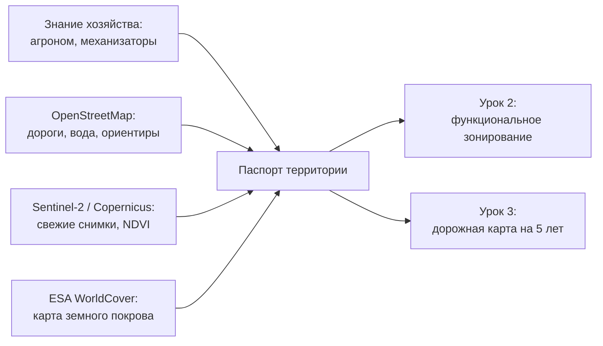

# Проводим инвентаризацию территории хозяйства на открытых данных

> ⏱ **Трудозатраты:** ~15 мин чтения + ~25 мин практики
> Модуль **П5: Ландшафтное планирование для МСБ**, урок 1 из 3.
> Профессиональный уровень (руководители). Проект UNDP-KAZ FOLUR. Компоненты FOLUR: **1**, **2**.

## Цели урока и место в модуле

Ландшафтный план начинается не с карты зон, а с честного ответа на вопрос: **что вообще есть на моей земле?** В этом уроке мы разберём, зачем руководителю смотреть на хозяйство как на ландшафт, а не как на список полей в севообороте; какие элементы территории обязаны попасть в инвентаризацию; и как за один вечер собрать «паспорт территории» на бесплатных открытых данных — без ГИС-специалиста в штате. Результат урока — заполненная таблица инвентаризации, которая станет первой страницей вашего ландшафтного плана.

После изучения урока слушатель сможет:

1. **[Bloom: знать]** перечислять элементы агроландшафта, подлежащие инвентаризации: пашня, кормовые угодья, лесополосы, водные объекты, деградированные и неудобные участки, инфраструктура.
2. **[Bloom: понимать]** объяснять, почему решения «по полям» без взгляда на территорию целиком приводят к потерям и как ландшафтный план работает на доходность хозяйства.
3. **[Bloom: применять]** находить и осматривать свою территорию на открытых данных — OpenStreetMap, Sentinel-2 (браузер Copernicus), ESA WorldCover — и заполнять паспорт территории.
4. **[Bloom: анализировать]** отличать по открытым снимкам благополучные участки от проблемных и формулировать вопросы для полевой проверки.

> **Границы урока.** Внутри: зачем нужен ландшафтный план, элементы территории и техника инвентаризации на открытых данных. За рамками: правила деления территории на функциональные зоны — подробнее в [Уроке 2](02-funkcionalnye-zony.md); сборка плана и дорожная карта на 5 лет — в [Уроке 3](03-plan-na-5-let.md); научная основа ландшафтного подхода и диагностика деградации — в академическом модуле [А5](../../a5/index.md); базовые навыки QGIS — в модуле [П2](../../p2/index.md).

---

## 1. Зачем руководителю ландшафтный план

Большинство хозяйств Северного Казахстана управляются «по полям»: у каждого поля есть культура, техника и план работ на сезон. Это необходимый уровень управления, но недостаточный. Поле не существует отдельно от территории: склон соседнего увала гонит на него талую воду, выпавшая лесополоса перестала держать снег и ветер, пересыхающее озеро меняет микроклимат окрестных участков. Решения, принятые для каждого поля в отдельности, могут быть по отдельности разумными — и вместе вести территорию к деградации.

**Ландшафтный план** — это управленческий документ, который отвечает на три вопроса: что есть на территории хозяйства (инвентаризация — этот урок), какую функцию выполняет каждый участок (зонирование — [Урок 2](02-funkcionalnye-zony.md)) и что мы делаем с этим в ближайшие пять лет (дорожная карта — [Урок 3](03-plan-na-5-let.md)).

Для руководителя у плана три практических выгоды:

- **Защита актива.** Земля — главный капитал хозяйства. Эрозия, дегумификация и засоление снижают его стоимость медленно и незаметно; план заставляет увидеть проблемные участки раньше, чем они станут убыточными. Как именно развиваются эти процессы, подробно разбирает [лекция А5 о деградации земель](../../a5/lectures/02-degradaciya-zemel.md).
- **Язык для партнёров.** Программа FOLUR в Казахстане развивает кооперацию с экспортёрами и ритейлом вокруг «зелёной пшеницы» — устойчиво выращенной продукции; подтверждать устойчивость нужно документами. Карта зонирования и дорожная карта — понятный аргумент для партнёра, консультанта или донора. Подготовку заявок на поддержку разбирает модуль [П14](../../p14/index.md).
- **Экономия управленческих усилий.** Один раз разделив территорию на зоны, вы перестаёте каждый сезон заново решать судьбу «того солонца за дорогой» — у него уже есть функция и план.

Международная рамка здесь та же, что и в академическом модуле: FAO описывает баланс производства и экосистем в «10 элементах агроэкологии», а ЦУР 15.3 задаёт принцип нейтрального баланса деградации земель (LDN) — не терять продуктивной земли больше, чем восстанавливаем. Ландшафтный план хозяйства — тот же принцип, уменьшенный до масштаба одного землепользователя.

!!! tip "Что это даёт вашему хозяйству"
    План — не «отчёт для галочки», а способ увидеть скрытые резервы: где вы тратите ресурсы на заведомо убыточные клинья пашни, где выпавшая лесополоса стоит вам снегозадержания, а где заброшенный участок может стать кормовым угодьем. Большинство находок инвентаризации конвертируются в решения без капитальных затрат.

---

## 2. Что инвентаризируем: элементы агроландшафта

Инвентаризация — это перепись всех элементов территории, а не только посевных площадей. Минимальный список для зернового хозяйства степной зоны выглядит так:

| Группа | Элементы | Что фиксируем |
|---|---|---|
| Производственные земли | Поля пашни, пары, залежи | Границы, состояние, известные проблемные места |
| Кормовые угодья | Пастбища, сенокосы | Границы, признаки сбитости, доступ к воде |
| Древесно-кустарниковый каркас | Лесополосы, колки, кустарники | Расположение, разрывы, состояние |
| Водные объекты | Озёра, реки, ручьи, пруды, плотины, скважины | Расположение, сезонность, прибрежные земли |
| Рельефные элементы | Склоны, увалы, ложбины стока, западины | Где вода идёт и где стоит |
| Проблемные участки | Солонцы, вымочки, эрозионные промоины, переуплотнение | Расположение, площадь «на глаз», динамика |
| Инфраструктура | Дороги, тока, склады, фермы, ЛЭП | Расположение, ограничения для работ |

Обратите внимание на два принципа. Первый: **инвентаризируются и «неудобья»** — солонцовые пятна, заболоченные западины, крутые склоны. Именно они чаще всего становятся буферными и природоохранными зонами в Уроке 2, и именно про них у хозяйства обычно нет никаких записей. Второй: **фиксируется состояние, а не только наличие**. Лесополоса «есть» и лесополоса «есть, но с разрывами в половину длины» — это два разных факта с разными последствиями для плана.

### 2.1 Знание людей — тоже данные

Часть инвентаризации не видна ни на одном снимке: «эта западина топит посевы раз в три-четыре года», «здесь при сильном ветре тянет позёмку», «этот край поля всегда убираем последним — не вызревает». Носители этих сведений — агроном, механизаторы, старожилы села. Правило простое: при инвентаризации опросите людей, работающих на земле, и запишите их наблюдения в тот же паспорт территории с пометкой «со слов, требует проверки». Как превращать такие наблюдения в полноценные записи с координатами и датой, разбирает модуль [П1](../../p1/index.md).

---

## 3. Открытые данные: смотрим на территорию бесплатно

Ещё десять лет назад для инвентаризации нужны были заказные аэрофотосъёмки. Сегодня три бесплатных источника закрывают большинство потребностей руководителя.

**OpenStreetMap (openstreetmap.org)** — открытая карта мира. Для степной зоны на ней обычно есть дороги, населённые пункты, крупные водные объекты и часть лесополос. Это ваша «векторная» основа: по ней удобно ориентироваться и на неё вы будете наносить зоны в [практикуме](../practicum/01-landshaftnyj-plan.md).

**Sentinel-2 через браузер Copernicus (dataspace.copernicus.eu)** — свежие спутниковые снимки с детальностью 10 метров, бесплатно и без программирования: открыли сайт, нашли свою территорию, выбрали дату. Снимки обновляются каждые несколько дней; в браузере доступны и готовые «раскраски», включая индекс вегетации NDVI, по которому видна неоднородность полей. Что NDVI показывает, а чего не показывает — тема модуля [П3](../../p3/index.md); для инвентаризации достаточно видеть контрасты: однородное поле против поля с пятнами.

**ESA WorldCover (esa-worldcover.org)** — открытая карта земного покрова мира с детальностью 10 метров: пашня, травянистые угодья, деревья, вода, застройка. Она полезна как «второе мнение»: если WorldCover считает часть вашего «пастбища» голой землёй — это повод присмотреться.

Четвёртый источник — **национальный портал открытых данных (data.egov.kz)**: наборы данных государственных органов РК. Состав и полнота наборов по конкретному району различаются, поэтому портал используется как дополнительный, а не основной источник: перед использованием проверьте актуальность конкретного набора.

Практический порядок первого сеанса — полчаса за компьютером:

1. Откройте OpenStreetMap, найдите свою территорию по названию села или визуально, оцените, какие элементы карта уже «знает» (дороги, вода, лесополосы), а какие отсутствуют.
2. Откройте браузер Copernicus (dataspace.copernicus.eu), найдите ту же территорию. Выберите летний безоблачный снимок Sentinel-2 текущего года — это ваш «портрет» территории. Затем переключитесь на апрель–май: появятся тёмные трассы влаги и стоячая вода.
3. Переключите визуализацию на NDVI и посмотрите на поля: однородны ли они, где устойчивые пятна.
4. Откройте ESA WorldCover, сверьте классы покрова с вашим представлением о территории. Расхождения выпишите — это вопросы для проверки.
5. Всё увиденное сразу заносите строками в паспорт территории (§4) с указанием источника и даты снимка.



*Рис. 1. Паспорт территории собирается из четырёх бесплатных источников и питает оба следующих урока. Alt: блок-схема — знание работников хозяйства, OpenStreetMap, снимки Sentinel-2 и карта ESA WorldCover сходятся в паспорт территории, из которого выходят стрелки к зонированию (урок 2) и дорожной карте (урок 3).*

### 3.1 Как «читать» снимок без специальной подготовки

Руководителю не нужно быть дешифровщиком — достаточно четырёх приёмов:

1. **Сравнивайте сезоны.** Один и тот же участок в мае, июле и сентябре. Западины, которые топит талыми водами, видны на весенних снимках тёмными пятнами; солонцы летом выделяются светлыми «лысинами» на фоне вегетации.
2. **Ищите постоянство.** Пятно, которое появляется на снимках каждый год в одном месте, — свойство земли (рельеф, засоление, переувлажнение). Пятно одного года — скорее событие сезона (огрех сева, локальный вымокший участок).
3. **Смотрите на границы.** Резкая граница пятна по прямой линии — почти всегда след техники или агротехники; извилистая «природная» граница — рельеф или почва.
4. **Не ставьте диагноз по снимку.** Снимок показывает, *где* проблема, но не *какая*. Светлое пятно может быть солонцом, песчаным участком или переуплотнённой разворотной полосой. Каждое пятно из инвентаризации — это точка для полевой проверки, а методика различения самих процессов — в [лекции А5 о диагностике деградации](../../a5/lectures/02-degradaciya-zemel.md).

### 3.2 Рельеф и вода: что видно и что придётся проверить ногами

Рельеф степной зоны обманчив: перепады в несколько метров не видны глазу с дороги, но именно они решают, куда идёт талая вода. На открытых снимках рельеф читается косвенно: по рисунку ложбин (тёмные извилистые полосы влажной почвы весной), по направлению эрозионных промоин, по цепочкам западин. Дополнительно существуют открытые глобальные цифровые модели рельефа (например, Copernicus DEM с детальностью около 30 м) — их использование с QGIS выходит за рамки этого модуля и разбирается в [П2](../../p2/index.md) и [А2](../../a2/index.md); для ландшафтного плана хозяйства обычно достаточно косвенных признаков плюс знание местности.

Водные объекты инвентаризируйте с особым вниманием: озеро или пруд — это и ресурс (водопой, орошение, пожарный запас), и источник обязательств (прибрежные земли имеют особый режим использования — подробнее в [Уроке 2](02-funkcionalnye-zony.md)). Зафиксируйте сезонность: постоянный это водоём или пересыхающий — весенние и осенние снимки Sentinel-2 отвечают на этот вопрос за пять минут. Если хозяйству нужна глубина и объём водоёма, это отдельная задача — батиметрия, модуль [П11](../../p11/index.md); учебные данные там используются в обезличенном виде («водохранилище степной зоны Казахстана», без геопривязки — см. [политику данных платформы](../../../datasets.md)).

---

## 4. Паспорт территории: собираем результат урока

Итог инвентаризации — **паспорт территории**: одна таблица, где каждый элемент ландшафта получает строку. Рекомендуемые колонки:

| Колонка | Пример записи |
|---|---|
| ID элемента | ЛП-03 (лесополоса), ПОЛЕ-12, ОЗ-01, СОЛ-02 |
| Тип | лесополоса / поле / озеро / солонцовое пятно / ложбина стока |
| Где | привязка к полю или ориентиру; в практикуме — контур на карте |
| Состояние | словарь: хорошее / удовлетворительное / проблемное |
| Источник сведений | снимок (дата) / WorldCover / со слов (кто) / полевой осмотр |
| Проблема или ресурс | «разрывы посадки», «топит раз в 3–4 года, со слов агронома» |
| Вопрос для проверки | «выехать после схода снега, уточнить границу вымочки» |

Три правила заполнения. Первое: **каждому элементу — постоянный ID**; на эти идентификаторы будут ссылаться зонирование и дорожная карта, как журналы хозяйства ссылаются на справочник полей в [П1](../../p1/index.md). Второе: **разделяйте факт и предположение** — колонка «источник сведений» обязательна, запись «со слов» не хуже других, но должна быть помечена. Третье: **паспорт не обязан быть полным с первого раза** — это живой документ; колонка «вопрос для проверки» превращает белые пятна в план полевых выездов, а не в повод отложить работу.

На типовое хозяйство паспорт собирается за один-два вечера: час на снимки и карты, час на опрос агронома и механизаторов, час на сведение таблицы. Это самая дешёвая часть ландшафтного планирования — и самая недооценённая: по опыту программ устойчивого землепользования (база практик WOCAT построена именно на стандартизированном описании территорий), качество плана определяется качеством инвентаризации.

### 4.1 Типичные ошибки инвентаризации

Четыре ошибки встречаются в первых паспортах почти всегда — проверьте себя по списку:

- **Переписаны только поля.** Паспорт из одних полей — это копия севооборотной ведомости, а не инвентаризация: без лесополос, воды и «неудобий» зонировать в Уроке 2 будет нечего.
- **«Состояние» без критерия.** Записи «нормальное», «так себе» несравнимы между собой и по годам. Договоритесь о словаре из трёх значений (хорошее / удовлетворительное / проблемное) и коротко зафиксируйте, что означает каждое — например, «проблемное» для лесополосы: разрывы либо усыхание, заметные на снимке или при осмотре.
- **Смешаны наблюдение и вывод.** «Светлое пятно на снимке 2026-07-14» — наблюдение; «солонец» — вывод, требующий полевой проверки. В паспорте наблюдение и предполагаемый диагноз живут в разных колонках; методика самой диагностики — в [лекции А5](../../a5/lectures/02-degradaciya-zemel.md).
- **Паспорт сделан и забыт.** Инвентаризация без даты следующего обновления мертвеет за пару сезонов. Правило модуля: паспорт обновляется минимум раз в год — удобнее всего вместе с осенней сверкой плана, которую введёт [Урок 3](03-plan-na-5-let.md), и после каждого события, меняющего территорию (новая промоина, выпавшая посадка, купленный участок).

### 4.2 Кто делает инвентаризацию и сколько это стоит

Ответ на частый вопрос руководителя: не нужно нанимать ГИС-специалиста. Роли распределяются внутри хозяйства: руководитель или его заместитель работает со снимками и сводит таблицу (навыков этого урока достаточно); агроном отвечает за колонку «состояние» и полевые проверки; механизаторы — источник знаний о воде, ветре и «вечных» проблемных местах. Из затрат — только время: все использованные источники данных бесплатны и не требуют регистрации с оплатой. Если в хозяйстве уже есть человек, прошедший модуль [П2](../../p2/index.md), паспорт сразу можно вести в QGIS как слой с атрибутами — но таблицы и распечатанного снимка для старта достаточно.

---

## Региональный кейс

**Ситуация.** Зерновое хозяйство в Северо-Казахстанской области (пшеница — ключевая культура и региона, и проекта FOLUR в Северном Казахстане) готовится к разговору с покупателем, который заявил интерес к «устойчиво выращенному» зерну. Руководитель решает начать с инвентаризации: территория осваивалась десятилетиями, часть лесополос выпала, у двух полей есть постоянно «слабые» края, к югу от пашни — пересыхающее озеро с полосой солончаков. Никаких карт, кроме схемы полей из документов, в хозяйстве нет.

**Данные.** Снимки Sentinel-2 за май, июль и сентябрь текущего и прошлого года (браузер Copernicus, dataspace.copernicus.eu — бесплатно, без программирования); OpenStreetMap — дороги, озеро, часть лесополос; ESA WorldCover — покров территории.

**Задача.**

1. Составьте для этого хозяйства список элементов инвентаризации по таблице §2: какие строки паспорта территории появятся обязательно?
2. По каким признакам на сезонных снимках Sentinel-2 руководитель отличит постоянно проблемные края полей от разовых огрехов сезона (§3.1)?
3. Какие сведения не даст ни один открытый источник — и у кого в хозяйстве их надо спросить?

**Разбор.** В паспорт обязательно попадут: все поля с пометками о «слабых» краях, лесополосы с указанием разрывов (их видно и на снимках, и на OpenStreetMap), озеро с пометкой о сезонности и полосой солончаков как отдельный элемент, ложбины стока, ведущие к озеру. Постоянство проблемы проверяется сравнением лет: пятна, повторяющиеся на снимках обоих лет в одних контурах, — свойство земли, кандидаты в особые зоны Урока 2; пятно одного сезона — событие. Не даст ни один снимок: историю «топит раз в несколько лет», причины выпадения лесополос, планы соседей — это знание агронома и механизаторов, которое фиксируется в паспорте с пометкой «со слов». Итог кейса: уже на этапе инвентаризации хозяйство получает аргументы для разговора с покупателем — не лозунг «мы за устойчивость», а перепись территории с зафиксированными проблемами и планом их проверки.

---

## Закрепление и применение

!!! tip "Что это даёт вашему хозяйству"
    Паспорт территории — это час-два работы и ноль тенге затрат, но он сразу меняет качество решений: споры «мне кажется, там всегда сыро» заканчиваются, начинаются факты с датами снимков. Он же — готовая основа для разговора с консультантом, банком или партнёром по «зелёной» цепочке: вы показываете не эмоции, а таблицу и снимки.

!!! warning "Границы применимости"
    Открытые снимки детальностью 10 м показывают пятна от десятков метров — межу, отдельное дерево или начало промоины вы на них не увидите. Снимок фиксирует *где*, но не *что*: диагноз ставится полевой проверкой. И помните о правовой стороне: паспорт территории с точными координатами — внутренний документ хозяйства; что и как можно передавать наружу, разбирает [Урок 3 модуля П1](../../p1/lectures/03-rezervnye-kopii-i-peredacha.md).

!!! question "Кейс для размышления"
    Механизатор говорит: «Зачем нам переписывать солонцы и западины — мы и так знаем, где они». Через два года хозяйство планирует расширяться и нанимать новых людей, а агроном собирается на пенсию. Что произойдёт со «знаем и так» и какие колонки паспорта территории защищают хозяйство от этой потери?

---

### Проверь себя

```quiz
[
  {
    "q": "Чем ландшафтный взгляд на хозяйство отличается от управления «по полям»?",
    "options": ["Он учитывает связи между участками: сток со склона, работу лесополос, влияние водоёмов — решения по отдельным полям могут быть разумными порознь и вредными вместе", "Он заменяет план полевых работ на сезон", "Он требует отказаться от деления территории на поля", "Он применим только к хозяйствам с орошением"],
    "answer": 0,
    "explain": "§1: поле не существует отдельно от территории; ландшафтный план дополняет, а не заменяет сезонное управление полями."
  },
  {
    "q": "Почему в инвентаризацию обязательно включают «неудобья» — солонцы, западины, крутые склоны?",
    "options": ["Именно они чаще всего становятся буферными и природоохранными зонами, и именно о них у хозяйства обычно нет записей", "Их требуется ежегодно распахивать", "Без них не откроется браузер Copernicus", "Они всегда приносят основной доход"],
    "answer": 0,
    "explain": "§2: инвентаризируется вся территория, а не только посевные площади; «неудобья» получат функцию в Уроке 2."
  },
  {
    "q": "На снимках Sentinel-2 за два разных года в одном и том же месте поля видно светлое пятно. О чём это говорит по методике урока?",
    "options": ["Повторяемость из года в год указывает на свойство земли (почва, рельеф) — участок заносится в паспорт как кандидат для полевой проверки", "Пятно можно сразу записать как солонец без выезда в поле", "Это точно огрех сева одного сезона", "Снимки с детальностью 10 м не показывают пятен на полях"],
    "answer": 0,
    "explain": "§3.1: постоянные пятна — свойство земли, разовые — событие сезона; но диагноз по снимку не ставится — нужна полевая проверка."
  },
  {
    "q": "Зачем в паспорте территории обязательна колонка «источник сведений»?",
    "options": ["Она разделяет факт и предположение: запись «со слов агронома» допустима, но должна быть помечена и проверена", "Она нужна только для научных публикаций", "Без неё файл не сохранится в GeoPackage", "Чтобы указать стоимость каждого элемента"],
    "answer": 0,
    "explain": "§4: знание людей — тоже данные, но с пометкой «со слов, требует проверки»; смешивать его с проверенными фактами нельзя."
  },
  {
    "q": "Что из перечисленного НЕЛЬЗЯ получить из открытых источников (OSM, Sentinel-2, WorldCover) при инвентаризации?",
    "options": ["Историю «эту западину топит раз в три-четыре года» и причины выпадения лесополосы", "Расположение крупных водных объектов", "Контрасты вегетации внутри поля по NDVI", "Сезонность водоёма по весенним и осенним снимкам"],
    "answer": 0,
    "explain": "§2.1 и §3.2: многолетняя история и причины событий — знание работников хозяйства; снимки дают расположение, контрасты и сезонность."
  }
]
```

---

## Что дальше?

У вас есть перепись территории — теперь каждому элементу нужно назначить функцию. В [Уроке 2 «Делим территорию на функциональные зоны»](02-funkcionalnye-zony.md) мы разберём три типа зон — производственные, буферные, природоохранные — и правила их выделения с учётом рельефа и водных объектов. Научная основа ландшафтного подхода — в [лекции А5](../../a5/lectures/01-landshaftnyj-podhod.md); свой паспорт территории вы превратите в карту в [практикуме модуля](../practicum/01-landshaftnyj-plan.md).
