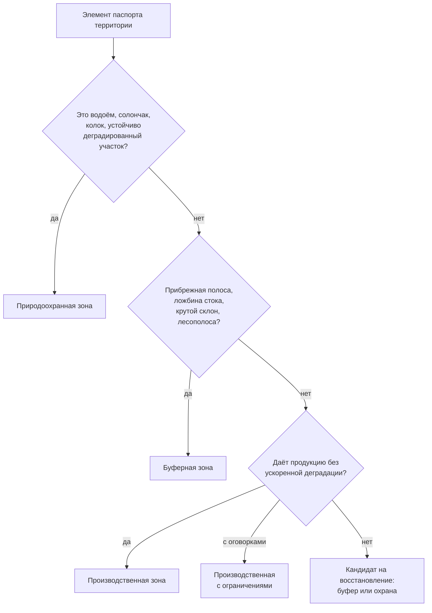

# Делим территорию на функциональные зоны: производство, буферы, охрана

> ⏱ **Трудозатраты:** ~14 мин чтения + ~25 мин практики
> Модуль **П5: Ландшафтное планирование для МСБ**, урок 2 из 3.
> Профессиональный уровень (руководители). Проект UNDP-KAZ FOLUR. Компоненты FOLUR: **1**, **2**.

## Цели урока и место в модуле

Инвентаризация из [Урока 1](01-inventarizaciya-territorii.md) ответила на вопрос «что есть на территории». Этот урок отвечает на главный вопрос ландшафтного плана: **какую функцию выполняет каждый участок**. Мы разберём три типа функциональных зон — производственные, буферные и природоохранные, — правила их выделения с учётом рельефа и водных объектов и типичные конфликты между функциями. Результат урока — черновое зонирование вашего паспорта территории, которое в [практикуме](../practicum/01-landshaftnyj-plan.md) превратится в карту.

После изучения урока слушатель сможет:

1. **[Bloom: знать]** перечислять три типа функциональных зон и их задачи в хозяйстве.
2. **[Bloom: понимать]** объяснять, как рельеф (склоны, ложбины стока) и водные объекты определяют границы зон и почему буферные зоны — не «потерянная земля», а защита производственных.
3. **[Bloom: применять]** назначать функцию каждому элементу паспорта территории по решающим правилам урока для условий Костанайской, Северо-Казахстанской или Акмолинской области.
4. **[Bloom: анализировать]** находить конфликты функций (пашня против стока, выпас против прибрежной полосы) и обосновывать их разрешение.

> **Границы урока.** Внутри: три типа зон, решающие правила зонирования, учёт рельефа и воды, разбор конфликтов. За рамками: техника рисования зон в QGIS — в [практикуме](../practicum/01-landshaftnyj-plan.md); наполнение производственных зон технологиями (no-till, севообороты, органика) — в модулях [П8](../../p8/index.md), [П9](../../p9/index.md), [П10](../../p10/index.md); детализация природоохранных зон и лесополос — в [П13](../../p13/index.md); научное обоснование функционального деления — в [лекции А5 о ландшафтном подходе](../../a5/lectures/01-landshaftnyj-podhod.md).

---

## 1. Три типа зон: производство, буфер, охрана

Функциональное зонирование — это назначение каждому участку территории **главной функции**, под которую подстраиваются все решения по этому участку. В модуле мы работаем с тремя типами зон.

**Производственные зоны** — земля, которая зарабатывает: пашня, продуктивные пастбища и сенокосы. Главная функция — устойчивый доход; критерий включения — участок способен давать продукцию без ускоренной деградации. Ключевое слово — «устойчивый»: клин пашни, который эродирует с каждым ливнем, формально производственный, а фактически проедает капитал хозяйства. Внутри производственных зон полезно сразу различать участки «без ограничений» и «с ограничениями» — вторые остаются в производстве, но с регламентом (например, обработка поперёк склона или обязательное сохранение стерни); это различие пригодится при нанесении зон на карту.

**Буферные зоны** — участки, чья работа — защищать: прибрежные полосы вдоль воды, полосы вдоль ложбин стока, лесополосы и примыкающие к ним ленты, залуженные полосы на склонах. Буфер принимает на себя то, что не должно дойти до воды или сойти с поля: смытую почву, остатки удобрений и средств защиты растений, ветровой поток, снег. Буферные зоны могут приносить ограниченный доход (сено, выпас по регламенту), но их главная функция — защитная.

**Природоохранные зоны** — участки, где хозяйственная деятельность сведена к минимуму: сам водоём и его ближайшее окружение, солончаки и солонцовые комплексы, колки, западины с околоводной растительностью, устойчиво деградированные участки, выведенные из оборота на восстановление. Их функция — поддерживать то, на чём стоит продуктивность остальной территории: воду, биоразнообразие, естественные механизмы восстановления. Рамка FAO «10 элементов агроэкологии» называет это балансом производства и экосистем; на уровне хозяйства это звучит проще: **часть территории должна работать на территорию, а не на бункерный вес**.

Сведём три типа зон в одну таблицу-шпаргалку:

| Зона | Главная функция | Что обычно входит | Что допустимо | Что исключено |
|---|---|---|---|---|
| Производственная | Устойчивый доход | Пашня, продуктивные угодья | Вся агротехника; на участках «с ограничениями» — по регламенту | Практики, ускоряющие деградацию участка |
| Буферная | Защита полей и воды | Прибрежные полосы, ложбины, склоны, лесополосы с лентами | Сено, регламентированный выпас, коридоры водопоя | Распашка, склад техники и химии, бесконтрольный выпас |
| Природоохранная | Поддержка воды, почв, биоразнообразия | Водоёмы с окружением, солончаки, колки, участки восстановления | Минимальное вмешательство, меры восстановления | Регулярная хозяйственная деятельность |

Важное управленческое следствие: зонирование — не про «отдать землю под природу», а про честный расчёт. Буфер шириной в одну ленту сеялки вдоль ложбины стоит хозяйству доли процента посевной площади, а защищает и поле ниже по склону, и водоём, и репутацию продукции. Обратный пример: распашка «до уреза воды» даёт разовые гектары и многолетние проблемы — заиление водоёма, потерю водопоя, претензии по режиму прибрежных земель.

Границы зоны — это всегда компромисс между точностью и управляемостью. Правило практики: границу удобно вести по устойчивым линиям, которые видит и снимок, и механизатор, — краю поля, дороге, лесополосе, трассе ложбины. Зона, границу которой нельзя объяснить трактористу за минуту, не будет соблюдаться независимо от её научной обоснованности.

### 1.1 Правовая рамка: что проверить до утверждения зон

Прибрежные земли — не только агрономический, но и правовой вопрос: водным законодательством РК для водных объектов устанавливаются водоохранные зоны и полосы с ограничениями хозяйственной деятельности. Конкретные размеры и режимы зависят от объекта и устанавливаются уполномоченными органами — **модуль намеренно не приводит числовых нормативов**: проверяйте действующую редакцию на официальном источнике (adilet.zan.kz) или у акимата/бассейновой инспекции. Правило для плана: буферные зоны хозяйства вдоль воды не могут быть *мягче* установленных законом ограничений — закон задаёт минимум, ваш план может быть строже.

---

## 2. Рельеф: вода решает, где пройдут границы

Степной рельеф пологий, но не плоский, и именно рельеф — первый диктатор зонирования: он определяет, куда идёт талая и ливневая вода, где она собирается и что уносит с собой.

Три рельефных элемента, которые обязаны отразиться в зонах:

- **Склоны.** Чем круче и длиннее склон под пашней, тем выше риск водной эрозии; на выраженных склонах производственная зона получает пометку «с ограничениями» (обработка поперёк склона, сохранение стерни, почвосберегающие технологии — их разбирает [лекция А5 о почвосбережении](../../a5/lectures/03-pochvosberegayushchee-zemledelie.md) и модуль [П8](../../p8/index.md)), а самые крутые участки уходят в залужение — буфер.
- **Ложбины стока.** Извилистые понижения, по которым весной идёт вода, — готовые трассы буферных полос. Распаханная ложбина — это конвейер, выносящий почву с поля в водоём; залуженная — фильтр, который её удерживает.
- **Западины.** Замкнутые понижения, где вода стоит: в паспорте территории они помечены «топит раз в несколько лет». Держать их в пашне — значит регулярно терять посев; функция западины — буфер или природоохранная зона в зависимости от размера и растительности.

Как увидеть рельеф без геодезиста, показал [Урок 1, §3.2](01-inventarizaciya-territorii.md): весенние снимки Sentinel-2 (тёмные полосы влажной почвы — ложбины), рисунок промоин, знание механизаторов. Для черновика зонирования этой точности достаточно; уточнение границ — по полевой проверке.

Полевая проверка рельефных границ проще, чем кажется, и не требует приборов. Весной, в период снеготаяния, объезд территории отвечает на большинство вопросов за полдня: где реально идёт вода (и совпадает ли это с трассой, намеченной по снимку), где она стоит, куда упирается. Каждую подтверждённую или сдвинутую границу фиксируйте фотографией с геометкой — правила такой записи даёт [модуль П1](../../p1/lectures/01-atributy-zamera.md). Один весенний объезд стоит больше, чем любой набор снимков: снимок показывает следы воды, объезд — саму воду.

!!! example "Попробуйте прямо сейчас (5 минут)"
    Откройте браузер Copernicus (dataspace.copernicus.eu), найдите свою территорию и выберите снимок за апрель–май. Найдите хотя бы одну тёмную извилистую полосу на пашне — кандидата в ложбину стока. Теперь переключитесь на июльский снимок того же года: полоса «исчезла»? Значит, это именно влага, а не почвенное пятно, — и у вас появился первый кандидат в буферную зону.

## 3. Водные объекты: ресурс с обязательствами

Каждый водный объект из паспорта территории порождает вокруг себя «луковицу» зон: сам водоём и ближайшее окружение — природоохранная зона; далее прибрежная буферная полоса (не мягче требований законодательства — §1.1); далее производственные земли. Для пересыхающих озёр и временных водотоков логика та же — граница проводится по максимальному сезонному урезу воды (его показывает сравнение весенних и летних снимков), а не по летнему остатку.

Отдельно о выпасе: водопой — законная функция, но сплошной бесконтрольный выпас по прибрежной полосе разрушает её быстрее распашки. Решение зонированием: оборудованные подходы к воде в отведённых местах — узкие «коридоры» через буфер, остальная полоса закрыта. Если хозяйству нужно понимать ёмкость водоёма (полив, водопой, зарыбление), глубины и объём считаются методами батиметрии — модуль [П11](../../p11/index.md); учебные данные платформы для этой темы обезличены (водохранилище степной зоны Казахстана, координаты не раскрываются — [политика данных](../../../datasets.md)).



*Рис. 1. Решающее дерево зонирования: каждый элемент паспорта проходит три вопроса. Alt: блок-схема — элемент паспорта территории последовательно проверяется: водоёмы, солончаки и деградированные участки уходят в природоохранную зону; прибрежные полосы, ложбины, склоны и лесополосы — в буферную; остальное становится производственной зоной, при оговорках — с ограничениями, при неспособности давать продукцию без деградации — кандидатом на восстановление.*

## 4. Лесополосы и кормовые угодья: два особых случая

Полезащитные лесополосы — особый случай буферной зоны: они работают не «вдоль воды», а «поперёк ветра» — снижают скорость ветра, задерживают снег, защищают почву от выдувания. В зонировании лесополосы фиксируются вместе с прилегающими лентами (полоса влияния, где меняется снегонакопление), а их разрывы из паспорта территории — прямые кандидаты в дорожную карту [Урока 3](03-plan-na-5-let.md): восстановление разрыва — типовая мера с понятным местом и результатом. Важно не считать лесополосу «ничьей землёй»: выпавшая посадка без хозяина деградирует до полного исчезновения, а вместе с ней хозяйство теряет снегозадержание на прилегающих полях. Уход, породный состав и восстановление лесополос детально разбирает модуль [П13](../../p13/index.md).

Второй особый случай — **пастбища и сенокосы**. Они производственные по функции, но ближе к буферным по уязвимости: травостой держит почву, пока нагрузка не превышает его способность восстанавливаться. Признаки перегрузки из паспорта территории (сбитость у водопоя и загонов, оголённые пятна, смена травостоя на непоедаемые виды) переводят участок в категорию «производственная с ограничениями» с регламентом: ротация участков выпаса, ограничение нагрузки, отдых сбитых участков. Кормовая сторона вопроса (ёмкость угодий, сеяные травы, интеграция с севооборотом) — предмет модуля [П9](../../p9/index.md); для зонирования достаточно честно отметить, где угодье уже работает на износ.

## 5. Конфликты функций и как их разрешать

Зонирование почти всегда вскрывает конфликты — места, где привычная практика противоречит функции земли. Разберём три типовых.

**Пашня против стока.** Поле распахано через ложбину; каждую весну по ней уходит почва. Конфликт разрешается не «отдать всё поле под буфер», а точечно: залуженная полоса по трассе ложбины, остальное поле остаётся производственным. Потеря площади — минимальная, эффект — прекращение выноса.

**Выпас против прибрежной полосы.** Скот пьёт «где привык», сбивая берег по всей длине. Решение из §3: коридоры водопоя плюс закрытая остальная полоса. Здесь важно управленческое оформление: зона без регламента («туда нельзя») не работает; зона с регламентом («водопой — здесь, с такого-то по такое-то») — работает.

**Доход против восстановления.** Солонцовый клин формально пашется, фактически даёт худший урожай на территории. Держать его в производственной зоне — значит ежегодно субсидировать убыток семенами и ГСМ. Перевод в зону восстановления (залужение солеустойчивыми травами, кормовое использование) — решение, которое в пятилетнем горизонте дешевле привычки. Как оценивать такие альтернативы системно, показывает [лекция А5](../../a5/lectures/03-pochvosberegayushchee-zemledelie.md); экосистемная сторона вопроса — модуль [П6](../../p6/index.md).

Общее правило разрешения конфликтов: **функция назначается по способности земли, а не по привычке использования**. Зонирование не отнимает землю — оно прекращает работу земли против хозяйства.

Ещё один класс конфликтов лежит за границей землепользования: сток не признаёт межевых знаков. Вода с полей соседа идёт по вашей ложбине; ваша прибрежная полоса защищает озеро, которым пользуются трое. Программа FOLUR называет это интегрированным управлением ландшафтами (ILM): устойчивость достигается на уровне территории, а не отдельного участка. На уровне хозяйства из этого следуют два практических правила. Первое — зонируйте с учётом того, что приходит извне: буфер на ложбине проектируется под весь её водосбор, а не только под свою часть. Второе — карта зон и есть инструмент разговора с соседями и акиматом: обсуждать общий водоём проще над одной картой, чем обмениваться претензиями. Кейсы такой кооперации собраны в каталоге FOLUR (см. библиографию [программы модуля](../index.md)).

### 5.1 Черновик зонирования: порядок работы

Соберём урок в методику из четырёх шагов — её вы выполните в практикуме:

1. **Сначала вода и охрана.** Нанесите природоохранные зоны: водоёмы с окружением, солончаки, колки, участки на восстановление. Они «неподвижны» — остальные зоны подстраиваются под них.
2. **Затем буферы.** Прибрежные полосы (не мягче закона), ложбины стока, крутые склоны, лесополосы с лентами влияния.
3. **Остальное — производство.** Пашня и угодья делятся на «без ограничений» и «с ограничениями» (склоны, примыкания к буферам).
4. **Пройдите конфликты.** Каждое место, где новая зона меняет привычную практику, выпишите отдельно: это будущие строки дорожной карты Урока 3 — с мерой, сроком и ответственным.

И правило документирования: каждая зона получает те же дисциплинированные атрибуты, что и элементы паспорта территории, — идентификатор, тип по словарю из трёх значений (производственная / буферная / природоохранная), пометку «с ограничениями» где нужно, ссылку на элементы паспорта, которые её обосновали, и одну фразу обоснования. Черновик можно рисовать на распечатанном снимке фломастером — это законный первый шаг; в [практикуме](../practicum/01-landshaftnyj-plan.md) тот же черновик станет аккуратным слоем GeoPackage с этими атрибутами, и его можно будет показать кому угодно.

---

## Региональный кейс

**Ситуация.** Хозяйство в Костанайской области — зерновой клин с включениями: через два поля тянется ложбина, впадающая в пресное озеро на границе землепользования; вдоль озера — полоса, которую местами распахивали «до воды»; на юге — солонцовый участок, который сеют «по традиции»; половина лесополос — с разрывами. Паспорт территории (Урок 1) готов; руководитель садится за зонирование.

**Данные.** Паспорт территории хозяйства; снимки Sentinel-2 за апрель–май и июль (браузер Copernicus) — трасса ложбины и сезонный урез озера; OpenStreetMap — озеро, дороги, часть лесополос; ESA WorldCover — контроль покрова.

**Задача.**

1. Проведите каждый элемент кейса через решающее дерево §3 (рис. 1): какая функция достаётся озеру, прибрежной полосе, ложбине, солонцовому участку, лесополосам?
2. Назовите два конфликта функций в этом хозяйстве и предложите их разрешение по логике §5.
3. Что руководитель обязан проверить по официальным источникам до утверждения границ прибрежных зон (§1.1)?

**Разбор.** Озеро с ближайшим окружением — природоохранная зона; прибрежная полоса — буфер с регламентом (распашка «до воды» прекращается, ширина полосы — не мягче требований водного законодательства, проверенных по adilet.zan.kz или в бассейновой инспекции); ложбина — буферная полоса по трассе весеннего стока, остальные части полей остаются производственными; солонцовый участок — кандидат на вывод из пашни в восстановление (конфликт «доход против восстановления»: урожай худший, затраты ежегодные); лесополосы — буферный каркас, разрывы — строки будущей дорожной карты. Конфликты: пашня против стока (решение — узкая залуженная полоса, а не отказ от поля) и распашка прибрежной полосы (решение — буфер с регламентом и коридором водопоя, если есть скот). Числовые размеры зон в разборе намеренно не названы: их источник — действующие нормативные документы и полевая проверка, а не лекция.

---

## Закрепление и применение

!!! tip "Что это даёт вашему хозяйству"
    Зонирование — это способ перестать платить за системные ошибки: залуженная ложбина экономит вам почву поля ниже по склону, буфер у озера — избавляет от претензий по прибрежному режиму, выведенный солонец — прекращает ежегодные убыточные посевы. Каждая зона — это решение, принятое один раз вместо ежесезонных споров.

!!! warning "Границы применимости"
    Решающее дерево урока — управленческий черновик, а не землеустроительный проект: границы зон по снимкам детальностью 10 м требуют полевой проверки, а юридически значимые границы (водоохранные зоны и полосы, земли лесного фонда, ООПТ) устанавливаются уполномоченными органами — сверяйте с официальными источниками. Урок не приводит числовых нормативов сознательно: они меняются, а привычка «проверить действующую редакцию» — нет.

!!! question "Кейс для размышления"
    Сосед говорит: «Буферные полосы — роскошь для больших агрохолдингов, у меня каждый гектар на счету». На его землях ложбина ежегодно промывается до глины, а озеро мелеет. Как объяснить ему экономику буфера на пятилетнем горизонте — какие потери он уже несёт и что из них прекращает узкая залуженная полоса?

---

### Проверь себя

```quiz
[
  {
    "q": "В чём главная функция буферных зон?",
    "options": ["Принимать на себя то, что не должно дойти до воды или сойти с поля: смытую почву, остатки химии, ветер и снег", "Давать максимальный урожай зерновых", "Полностью исключать любую хозяйственную деятельность", "Заменять лесополосы"],
    "answer": 0,
    "explain": "§1: буфер защищает производственные зоны и водные объекты; ограниченный доход (сено, регламентированный выпас) возможен, но функция — защитная."
  },
  {
    "q": "Почему распаханная ложбина стока — проблема для всего хозяйства, а не только для одного поля?",
    "options": ["Она работает конвейером: выносит почву с поля и доставляет её вместе с остатками химии в водоём ниже по стоку", "Она увеличивает урожайность соседних полей", "По ней нельзя проехать технике", "Она мешает только весной, а летом безвредна"],
    "answer": 0,
    "explain": "§2: ложбины — трассы талой и ливневой воды; залуженная полоса по трассе превращает конвейер выноса в фильтр."
  },
  {
    "q": "Как урок предлагает поступать с числовыми размерами водоохранных зон и полос?",
    "options": ["Проверять действующие требования по официальным источникам (adilet.zan.kz, бассейновая инспекция): закон задаёт минимум, план хозяйства может быть строже", "Использовать одинаковую ширину для всех водоёмов страны", "Назначать ширину на глаз по снимку", "Игнорировать: на землях хозяйства ограничений нет"],
    "answer": 0,
    "explain": "§1.1: конкретные размеры зависят от объекта и устанавливаются уполномоченными органами; модуль сознательно не приводит числовых нормативов."
  },
  {
    "q": "Солонцовый клин ежегодно засевается и даёт худший урожай в хозяйстве. Что предлагает логика зонирования?",
    "options": ["Рассмотреть перевод в зону восстановления: в пятилетнем горизонте залужение дешевле ежегодного субсидирования убыточного посева семенами и ГСМ", "Увеличить норму высева, чтобы поднять урожай", "Оставить как есть: любой посев лучше «пустой» земли", "Немедленно продать этот участок"],
    "answer": 0,
    "explain": "§5, конфликт «доход против восстановления»: функция назначается по способности земли, а не по привычке использования."
  },
  {
    "q": "В каком порядке методика урока рекомендует наносить зоны на черновик?",
    "options": ["Сначала природоохранные (вода, солончаки, восстановление), затем буферы, затем производственные, в конце — разбор конфликтов", "Сначала производственные — они важнее всего", "Порядок не имеет значения", "Сначала конфликты, потом все зоны сразу"],
    "answer": 0,
    "explain": "§5.1: природоохранные зоны «неподвижны», остальные подстраиваются под них; конфликты выписываются в конце и становятся строками дорожной карты."
  }
]
```

---

## Что дальше?

Территория разделена на зоны — осталось превратить деление в действия. В [Уроке 3 «Собираем ландшафтный план на 5 лет»](03-plan-na-5-let.md) вы соберёте карту, пояснительную записку и дорожную карту мер с индикаторами — готовый управленческий документ. Технологии для производственных зон — в модулях [П8](../../p8/index.md) (no-till) и [П9](../../p9/index.md) (севообороты); детализация природоохранных зон — в [П13](../../p13/index.md). Рисовать зоны на настоящей карте вы будете в [практикуме модуля](../practicum/01-landshaftnyj-plan.md).
