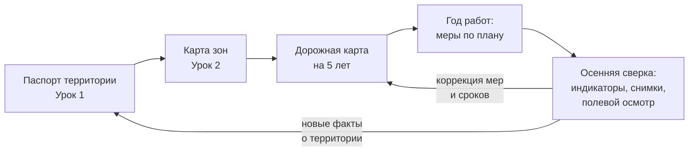

# Собираем ландшафтный план на 5 лет: от карты к дорожной карте

> ⏱ **Трудозатраты:** ~14 мин чтения + ~20 мин практики
> Модуль **П5: Ландшафтное планирование для МСБ**, урок 3 из 3.
> Профессиональный уровень (руководители). Проект UNDP-KAZ FOLUR. Компоненты FOLUR: **1**, **2**.

## Цели урока и место в модуле

Паспорт территории ([Урок 1](01-inventarizaciya-territorii.md)) и зонирование ([Урок 2](02-funkcionalnye-zony.md)) — это диагноз. Этот урок — про лечение по расписанию: как превратить карту зон в **ландшафтный план с горизонтом 5 лет**, то есть в таблицу конкретных мер с годами, ответственными и проверяемыми индикаторами. Разберём состав документа, логику пятилетнего горизонта, приоритизацию мер, индикаторы выполнения и использование плана во внешних отношениях — с партнёрами, консультантами и программами поддержки.

После изучения урока слушатель сможет:

1. **[Bloom: понимать]** объяснять, из чего состоит ландшафтный план (карта + записка + дорожная карта), почему его горизонт — пять лет и почему план — это цикл, а не разовый документ.
2. **[Bloom: применять]** составлять дорожную карту: распределять меры по годам и зонам, назначать ответственных и подбирать индикаторы, проверяемые бесплатными средствами.
3. **[Bloom: применять]** приоритизировать меры по матрице «эффект × стоимость», начиная с быстрых побед и защиты от необратимых потерь.
4. **[Bloom: анализировать]** оценивать реалистичность готового плана (своего, консультанта или ИИ-черновика): выполнимость по ресурсам, проверяемость индикаторов, отсутствие выдуманных цифр.

> **Границы урока.** Внутри: структура плана, пятилетний горизонт, приоритизация, индикаторы, план во внешних отношениях. За рамками: изготовление карты — в [практикуме](../practicum/01-landshaftnyj-plan.md); ИИ-черновик плана и его верификация — в [ИИ-задании модуля](../ai-assistant.md); экономические инструменты (субсидии, гранты, «зелёные» кредиты) — в [П14](../../p14/index.md); научная рамка индикаторов устойчивости — в [лекции А5 о мониторинге](../../a5/lectures/04-tochnoe-zemledelie-i-ustojchivost.md).

---

## 1. Состав документа: три части, которые работают вместе

Ландшафтный план хозяйства в этом модуле — три связанных документа:

1. **Карта функционального зонирования** — результат Урока 2, оформленный так, чтобы его понимал любой участник процесса: зоны тремя цветами, подписи, подложка со снимком или картой. Карта отвечает на вопрос «где».
2. **Пояснительная записка** — по одному короткому абзацу на каждую зону: почему граница проведена именно так (рельеф, вода, состояние земли — со ссылками на паспорт территории). Записка отвечает на вопрос «почему» и защищает план от пересмотра «по настроению»: если через два года кто-то предложит распахать буфер, аргументы уже записаны.
3. **Дорожная карта на 5 лет** — таблица мер. Это ядро плана и предмет этого урока; она отвечает на вопросы «что, когда, кто и как проверим».

Минимальный формат строки дорожной карты:

| Колонка | Пример |
|---|---|
| Год | 2027 |
| Зона / элемент (ID из паспорта) | ЛП-03 (лесополоса, разрыв) |
| Мера | Восстановление разрыва посадки |
| Ответственный | Агроном; подрядчик по посадке |
| Ресурсы | Саженцы, работы — оценить до конца 2026 |
| Индикатор выполнения | Разрыв закрыт посадкой; приживаемость — осмотр и фотоотчёт осенью |

Обратите внимание: колонка «Ресурсы» в учебном плане заполняется без выдуманных сумм — либо реальной сметой хозяйства, либо пометкой «оценить к [сроку]». Правдоподобная, но взятая с потолка цифра опаснее честного «предстоит посчитать»: на неё начинают опираться решения.

## 2. Почему пять лет

Горизонт в пять лет — не произвольная цифра, а пересечение трёх циклов, в которых живёт хозяйство:

- **Биологический.** Земля отвечает на меры медленно: залуженная ложбина начинает держать сток со второго года, восстановленная лесополоса — работать на снегозадержание через несколько лет, а севооборотная ротация ([П9](../../p9/index.md)) занимает три–пять лет. Годовой план просто не увидит эффекта собственных мер.
- **Экономический.** Меры плана — это инвестиции с разным сроком отдачи; пять лет позволяют чередовать затратные годы с годами отдачи и не пытаться сделать всё в один сезон.
- **Погодный.** В степной зоне соседние сезоны могут различаться радикально; вывод «мера сработала/не сработала» по одному году — почти всегда ошибка. Пятилетка сглаживает погодную лотерею.

При этом план на пять лет — **не обещание на пять лет вперёд, а цикл**: раз в год, после уборки, план сверяется с фактом и корректируется. Академическая версия этой логики — адаптивное управление — разобрана в [лекции А5 о мониторинге устойчивости](../../a5/lectures/04-tochnoe-zemledelie-i-ustojchivost.md); управленческая версия помещается в одно правило: *невыполненная строка дорожной карты — не позор, а информация; исчезнувшая из плана строка — потеря управления*.

### 2.1 Ежегодная сверка: как она проходит

Чтобы цикл не остался благим пожеланием, зафиксируйте процедуру сверки заранее — это одно совещание в год с постоянной повесткой:

1. **Факт по строкам.** Каждая строка дорожной карты текущего года получает статус: выполнена / частично / не начата — с причиной в одну фразу.
2. **Индикаторы.** Просматриваются фототочки года против прошлых лет, свежие снимки проблемных участков, полевые замеры по реперам. Смотрят все участники сверки, а не только руководитель: механизатор часто первым объясняет, *почему* картинка изменилась.
3. **Новые факты о территории.** Всё, что сезон добавил (новая промоина, вымочка, изменение у соседей), заносится в паспорт территории — сверка плана и обновление паспорта из [Урока 1](01-inventarizaciya-territorii.md) удобно совмещать.
4. **Коррекция.** Невыполненные строки переносятся с новой датой либо закрываются с обоснованием; при необходимости меняются приоритеты следующего года. Итог сверки — новая редакция дорожной карты с датой; старая редакция сохраняется: история изменений плана сама по себе документ для партнёров.

Час-два раз в год — вся цена «живого» плана. Хозяйства, пропустившие две сверки подряд, как правило, возвращаются уже не к коррекции, а к пересборке плана с нуля.



*Рис. 1. Ландшафтный план — годовой цикл, а не разовый документ. Alt: блок-схема цикла — паспорт территории ведёт к карте зон, та — к дорожной карте на пять лет; за годом работ следует осенняя сверка по индикаторам, стрелки от которой возвращаются к дорожной карте (коррекция) и к паспорту территории (новые факты).*

## 3. Приоритизация: с чего начинать

Типичная ошибка первого плана — попытка запланировать всё и сразу. Рабочий приём — разложить меры-кандидаты (конфликты из Урока 2, разрывы и проблемы из паспорта) по матрице «эффект × стоимость»:

| | Дёшево | Дорого |
|---|---|---|
| **Большой эффект** | Год 1–2: быстрые победы | Год 2–4: планируем ресурсы |
| **Малый эффект** | По остаточному принципу | Вычеркнуть или отложить |

Два корректирующих правила поверх матрицы. Первое — **необратимость важнее эффекта**: мера, останавливающая необратимую потерю (промоина растёт с каждым годом, разрушается берег), поднимается в приоритете независимо от стоимости, потому что цена промедления растёт сама собой. Второе — **первый год должен содержать хотя бы одну видимую победу**: залуженная ложбина, оборудованный водопой, закрытый разрыв лесополосы. Ландшафтный план делает команда, и команде нужно быстро увидеть, что «эта бумага» меняет реальность.

Типовые «быстрые победы» первого года в степном хозяйстве: регламент вместо запрета (коридоры водопоя — Урок 2, §5), залужение одной ложбины по трассе стока, прекращение обработки заведомо убыточного клина, фототочки и настройка бесплатного спутникового мониторинга (см. §4). Все они дёшевы, видимы и создают привычку жить по плану.

### 3.1 Стыковка с годовым производственным планом

Дорожная карта не живёт отдельно от сезонного планирования — она встраивается в него тремя стыками. **Техника и люди:** залужение полосы или посадка делаются той же техникой и теми же людьми, что и основные работы, поэтому меры плана заранее ставятся в график полевых работ, а не «когда будет время» (его не будет). **Семена и материалы:** травосмеси для залужения и саженцы заказываются в те же закупочные циклы, что и основные семена. **Севооборот:** вывод клина из пашни или появление буферной полосы меняет конфигурацию полей — это согласуется с ротацией заранее, иначе план и севооборот начнут противоречить друг другу (стыковка с кормовой базой и ротацией — модуль [П9](../../p9/index.md)). Практическое правило: у каждой строки дорожной карты на ближайший год должна быть «тень» в сезонном плане работ — дата, техника, исполнитель.

### 3.2 Типичные ошибки первых планов

- **План-максимум.** Двадцать мер на первый год; к осени выполнено три, команда считает план фантазией. Лекарство — матрица §3 и честный лимит: несколько мер в год, но выполненных.
- **Меры без места.** «Улучшать состояние пастбищ» — не мера: нет зоны, границы и индикатора. Каждая строка привязывается к ID элемента из паспорта территории.
- **Всё зависит от внешних денег.** План, где каждая мера начинается «после получения субсидии», не начнётся никогда. Ядро первого года — меры, выполнимые собственными силами; внешнее финансирование ускоряет план, а не запускает его.
- **Индикатор-отчёт вместо индикатора-факта.** «Проведена работа по…» проверить нельзя; «полоса залужена, фото с точки Ф-2 от [дата]» — можно. Формулируйте индикатор так, чтобы его мог проверить человек, не участвовавший в работе.

## 4. Индикаторы: как поймём, что план выполняется

Мера без индикатора — пожелание. Индикатор в дорожной карте обязан быть **проверяемым бесплатными средствами хозяйства**. Рабочий набор для степного хозяйства:

- **Индикаторы действия** — сделано/не сделано: полоса залужена, посадка проведена, регламент водопоя введён. Проверка — осмотр и фотофиксация.
- **Фототочки** — самый недооценённый инструмент: постоянные точки, с которых ежегодно в одну и ту же неделю делается снимок в одном направлении. Пять лет фототочек — наглядная история территории, понятная без всякой аналитики. Правила фиксации (координаты, дата, направление) — из модуля [П1](../../p1/index.md).
- **Спутниковые индикаторы** — динамика NDVI по проблемным участкам и буферам (настройка бесплатного мониторинга без программирования — модуль [П3](../../p3/index.md)), сезонная площадь водоёма по снимкам Sentinel-2.
- **Полевые индикаторы** — простые и регулярные: глубина промоины у репера, состояние приживаемости посадок, признаки сбитости пастбища.

Связь с большими рамками здесь прямая, но её не нужно усложнять: принцип ЦУР 15.3 (нейтральный баланс деградации земель) на уровне хозяйства означает одно проверяемое утверждение — **по итогам пятилетки площадь деградирующих участков не выросла, а по приоритетным элементам — сократилась**. Именно это и показывают ваши фототочки, снимки и полевые осмотры. Международная база WOCAT документирует практики устойчивого землепользования ровно в такой логике: место → мера → наблюдаемый результат.

Как это выглядит в заполненной дорожной карте — три строки для примера (суммы намеренно не проставлены — их источник только реальная смета):

| Год | Зона / элемент | Мера | Ответственный | Индикатор |
|---|---|---|---|---|
| 1 | ЛОЖ-01 (ложбина) | Залужение полосы по трассе стока | Агроном | Полоса засеяна; весенний снимок следующего года — трасса выноса не читается |
| 1 | ПРУД-01 (прибрежная полоса) | Регламент водопоя: два коридора, остальная полоса закрыта | Руководитель | Регламент подписан; фототочка Ф-3 — состояние полосы по годам |
| 2–3 | ЛП-04 (лесополоса) | Восстановление разрыва (смета — оценить в году 1) | Агроном + подрядчик | Посадка проведена; приживаемость по осеннему осмотру и фотоотчёту |

!!! example "Попробуйте прямо сейчас (5 минут)"
    Откройте браузер Copernicus (dataspace.copernicus.eu), найдите свою территорию и сохраните два снимка одного участка — весенний и летний. Подпишите файлы датами. Вы только что создали первую пару «спутниковых фототочек» для будущего индикатора динамики: через год снимки тех же недель покажут, меняется ли картина.

## 5. План во внешних отношениях: документ, который зарабатывает

Готовый ландшафтный план — это ещё и внешний документ. Три адресата:

**Программы поддержки.** Государственные программы и международные доноры (в том числе ПРООН, GEF, FAO) поддерживают меры устойчивого землепользования; заявка, за которой стоит карта зон и дорожная карта с индикаторами, выгодно отличается от заявки «дайте на посадки». Состав действующих программ, суммы и процедуры в этом модуле сознательно не приводятся — они меняются; их проверка по официальным источникам и сборка заявки — предмет модуля [П14](../../p14/index.md).

**Партнёры по цепочке поставок.** Проект FOLUR в Казахстане развивает кооперацию вокруг «зелёной пшеницы» — устойчиво выращенной продукции для экспортёров и ритейла. Ландшафтный план с фототочками и спутниковыми индикаторами — это доказательная база устойчивости, которую МСБ может предъявить без сертификационных затрат; следующий уровень (стандарты, маркировка, трассируемость) — модуль [П15](../../p15/index.md).

**Собственная команда и преемники.** План с запиской переживает смену агронома и передаётся новому руководителю как рабочий инструмент, а не как папка загадок. Это та же логика защиты хозяйства от потери знаний, что и в [П1](../../p1/index.md), — только на уровне территории.

Передавая план наружу, помните о правовой стороне: карта зон с точными контурами — детальные пространственные данные вашего хозяйства. Партнёру по цепочке или в заявку обычно достаточно обзорной карты и таблицы мер без точных координатных файлов; исходный GeoPackage остаётся внутренним документом. Правила передачи данных за пределы хозяйства разбирает [Урок 3 модуля П1](../../p1/lectures/03-rezervnye-kopii-i-peredacha.md), политика учебных данных платформы — на странице [Датасеты](../../../datasets.md).

### 5.1 Чек-лист готовности плана

Перед тем как считать план собранным (и перед [аттестацией модуля](../assessment/final.md)), проверьте его по шести пунктам:

1. Карта: все три типа зон нанесены, легенда и подложка читаемы.
2. Записка: у каждой зоны есть обоснование со ссылкой на паспорт территории.
3. Дорожная карта: каждая мера привязана к году, зоне (ID), ответственному и индикатору.
4. Индикаторы: каждый проверяем бесплатными средствами; есть фототочки.
5. Честность цифр: нет выдуманных сумм, нормативов и «требований» — либо проверенный источник, либо «оценить к [сроку]».
6. Цикл: назначена дата ежегодной сверки (например, первая неделя после уборки).

Этот же чек-лист — ваш инструмент верификации чужих черновиков: консультанта, сотрудника или ИИ-ассистента в [ИИ-задании модуля](../ai-assistant.md).

---

## Региональный кейс

**Ситуация.** Хозяйство в Акмолинской области завершило зонирование: буферная полоса по ложбине, прибрежный буфер у пруда с коридором водопоя, солонцовый клин — на вывод в залужение, две лесополосы с разрывами, остальное — производственные зоны. Руководитель составляет первую пятилетнюю дорожную карту. Бюджет ограничен; из «дорогих» мер в горизонте пятилетки реалистична одна — восстановление лесополос. Прошлой весной промоина у края одного из полей заметно удлинилась.

**Данные.** Карта зон и паспорт территории хозяйства; снимки Sentinel-2 (браузер Copernicus) за последние два года — динамика промоины и сезонность пруда; ESA WorldCover и OpenStreetMap — контроль элементов.

**Задача.**

1. Разложите меры-кандидаты по матрице §3 «эффект × стоимость» и определите состав первого года.
2. Какая мера поднимается в приоритете по правилу необратимости — и почему её нельзя откладывать до «дорогих» лет?
3. Предложите индикаторы для трёх мер первого года, проверяемые бесплатно (§4).

**Разбор.** Быстрые победы первого года: регламент водопоя (почти бесплатно, видимый результат), залужение ложбины (одна лента сеялки, прекращает вынос), прекращение посева на солонцовом клине с переводом в залужение. По правилу необратимости в первый год поднимается закрепление растущей промоины: каждая весна промедления удлиняет её и удорожает решение — это ровно тот случай, когда цена ожидания растёт сама. Восстановление лесополос — «большой эффект, дорого»: годы 2–4, с годом 1 на оценку ресурсов (без выдуманных смет — реальные расценки подрядчиков). Индикаторы: для водопоя — введённый регламент плюс фототочки берега (сравнение состояния полосы по годам); для ложбины — факт залужения плюс весенние снимки Sentinel-2 (тёмная трасса выноса должна перестать читаться); для промоины — репер и ежегодный замер длины/глубины с фотофиксацией. Ежегодная сверка — назначенной осенней датой; невыполненные строки не вычёркиваются, а переносятся с пометкой причины.

---

## Закрепление и применение

!!! tip "Что это даёт вашему хозяйству"
    Дорожная карта превращает «надо бы заняться» в управляемый процесс: у каждой проблемы территории есть год, ответственный и проверка. Побочный эффект не менее ценен: с готовым планом вы за один день собираете содержательную часть заявки на поддержку ([П14](../../p14/index.md)) и доказательную базу для партнёра по «зелёной» цепочке ([П15](../../p15/index.md)).

!!! warning "Границы применимости"
    Пятилетний план хозяйства — управленческий документ, а не землеустроительный проект и не гарантия финансирования: юридически значимые границы и режимы устанавливаются уполномоченными органами, а параметры программ поддержки проверяются по официальным источникам на момент подачи. Индикаторы урока показывают динамику, но не заменяют агрохимическое обследование и полевую диагностику причин.

!!! question "Кейс для размышления"
    Через два года выполнено 60% строк дорожной карты: часть мер сорвалась из-за засушливого года, зато промоина закреплена и ложбина держит сток. Один партнёр называет план «проваленным», консультант — «работающим». Кто прав с точки зрения логики цикла (§2) и что должно произойти со строками-«должниками» на осенней сверке?

---

### Проверь себя

```quiz
[
  {
    "q": "Из каких трёх частей состоит ландшафтный план модуля?",
    "options": ["Карта зонирования, пояснительная записка с обоснованием зон, дорожная карта мер на 5 лет", "Бизнес-план, штатное расписание, карта урожайности", "Только карта зон в трёх цветах", "Севооборот, план закупок, договор с элеватором"],
    "answer": 0,
    "explain": "§1: карта отвечает «где», записка — «почему», дорожная карта — «что, когда, кто и как проверим»."
  },
  {
    "q": "Почему горизонт плана — именно пять лет?",
    "options": ["Это пересечение биологического (отклик земли, ротация севооборота), экономического (чередование затрат и отдачи) и погодного (сглаживание контрастных сезонов) циклов", "Так требует отчётность перед акиматом", "Пять лет — срок действия спутниковых снимков", "Меньший срок запрещён донорами"],
    "answer": 0,
    "explain": "§2: годовой план не видит эффекта собственных мер, а вывод по одному сезону в степной зоне почти всегда ошибка; нормативных требований к сроку модуль не заявляет."
  },
  {
    "q": "Какая мера поднимается в приоритете независимо от стоимости?",
    "options": ["Останавливающая необратимую потерю — например, закрепление растущей промоины: цена промедления увеличивается сама собой", "Самая дешёвая из списка", "Самая заметная для соседей", "Любая мера с участием техники"],
    "answer": 0,
    "explain": "§3: правило необратимости корректирует матрицу «эффект × стоимость» — у необратимых процессов стоимость решения растёт с каждым сезоном ожидания."
  },
  {
    "q": "Каким требованиям должен отвечать индикатор дорожной карты?",
    "options": ["Быть проверяемым бесплатными средствами хозяйства: осмотр, фототочки, открытые снимки, простые полевые замеры", "Требовать ежегодного заказа платной аэрофотосъёмки", "Формулироваться как «улучшить состояние земель»", "Совпадать с показателями соседних хозяйств"],
    "answer": 0,
    "explain": "§4: мера без проверяемого индикатора — пожелание; набор урока — индикаторы действия, фототочки, NDVI-динамика и сезонная площадь водоёма по Sentinel-2, полевые реперы."
  },
  {
    "q": "Как правильно заполнить колонку «Ресурсы», если точная стоимость меры неизвестна?",
    "options": ["Записать «оценить к [сроку]» — честная пометка лучше правдоподобной выдуманной суммы, на которую начнут опираться решения", "Взять цифру из интернета без проверки", "Поставить ноль, чтобы план выглядел дешёвым", "Скопировать сумму из плана другого хозяйства"],
    "answer": 0,
    "explain": "§1: учебный план не содержит выдуманных сумм; источник цифр — реальная смета хозяйства или расценки подрядчиков, до тех пор — пометка со сроком оценки."
  }
]
```

---

## Что дальше?

Теория модуля закрыта — время собрать продукт. В [практикуме «Ландшафтный план модельного хозяйства»](../practicum/01-landshaftnyj-plan.md) вы построите карту зонирования в QGIS на открытых данных и заполните дорожную карту; в [ИИ-задании](../ai-assistant.md) — проверите черновик зонирования от чат-ассистента по чек-листу §5.1. Дальше по цепочке модулей: наполнение производственных зон — [П8](../../p8/index.md)/[П9](../../p9/index.md), экономика плана — [П14](../../p14/index.md), а академическая глубина — в [А5](../../a5/index.md). Завершает модуль [итоговая аттестация](../assessment/final.md).
