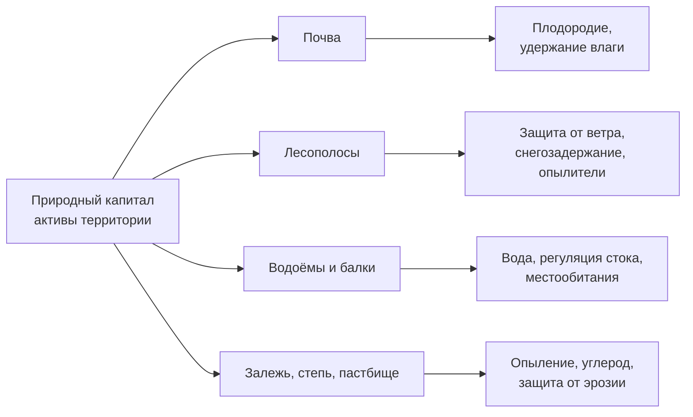

# Составляем инвентаризацию природного капитала хозяйства

> ⏱ **Трудозатраты:** ~18 мин чтения + ~25 мин практики
>
> Модуль **[П6: Оценка экосистемных услуг хозяйства](../index.md)**, урок 1.
> Профессиональный уровень (агрономы). Проект UNDP-KAZ-00683, FOLUR. Компоненты FOLUR: **3**.

## Цели урока и место в модуле

Весь модуль П6 отвечает на один практический вопрос: что, кроме зерна, производит ваша земля — и почему это стоит считать активом. Опыление рапса дикими пчёлами, защита пашни лесополосой от суховея, задержка талой воды залежью в верховье балки — это невидимая «работа» экосистем, которую агроном обычно не вносит в баланс, пока она не сломается. Первый урок ставит фундамент: научиться называть эти услуги правильными именами, различать их классы и составить **инвентаризацию природного капитала** — перечень и карту природных активов территории. Без инвентаризации отчёт об экосистемных услугах не на чем строить: нельзя оценить услугу элемента ландшафта, которого нет в списке. С ней у вас появляется рабочая основа, к которой уроки 2 и 3 добавят карты услуг и экономику.

После изучения урока вы сможете:

1. **[Bloom: знать]** называть четыре класса экосистемных услуг по классификации MEA (обеспечивающие, регулирующие, поддерживающие, культурные) и приводить примеры каждого класса для агроландшафта Северного Казахстана.
2. **[Bloom: понимать]** объяснять понятия «природный капитал» и «поток услуг» и различать сам актив (лесополоса, водоём, залежь) и услугу, которую он поставляет (защита от ветра, вода, местообитание опылителей).
3. **[Bloom: применять]** составлять инвентаризацию природных активов хозяйства по открытым данным — OpenStreetMap, Sentinel-2, рельеф — и заносить их в структурированную таблицу-реестр.
4. **[Bloom: анализировать]** определять, какие услуги реально производит конкретный актив территории, и отсеивать услуги, которых на ней нет, чтобы отчёт не превратился в общие слова.

> **Границы лекции.** Внутри: понятия природного капитала и экосистемных услуг, их классификация, инвентаризация активов и связь «актив → услуга». Снаружи: как измерять и картировать конкретные регулирующие услуги (опыление, эрозия, вода) — [урок 2](02-reguliruyushchie-uslugi.md); экономическое выражение и связь с рентабельностью — [урок 3](03-ekonomika-i-otchyot.md); научные методы количественной оценки и моделирование InVEST — академический модуль [А6](../../a6/index.md); зонирование территории на производственные/буферные/природоохранные зоны — [П5](../../p5/index.md); сохранение видов и местообитаний — [П13](../../p13/index.md).

---

## 1. Природный капитал: земля как актив, а не только площадь

Хозяйство привыкло измерять землю гектарами и баллами бонитета. Это взгляд на землю как на **производственную площадку**. Концепция природного капитала добавляет второй взгляд: та же территория — это ещё и **склад работающих активов**, каждый из которых бесплатно поставляет хозяйству полезные потоки.

Аналогия проста и точна. Финансовый капитал — деньги на счёте; поток от него — проценты. Природный капитал — экосистемы территории (почва, лесополосы, водоёмы, степные участки, залежь); поток от него — **экосистемные услуги**: то полезное, что эти экосистемы делают для хозяйства и людей. Как и с деньгами, важно не проедать капитал: если сжечь стерню и распахать балку, «процент» в виде защиты почвы и задержки влаги упадёт, а восстанавливать актив придётся годами.

Ключевое различение, на котором держится весь модуль: **актив — это не услуга**. Лесополоса — актив; услуги, которые она поставляет, — снижение скорости ветра над пашней, накопление снега, местообитание для птиц и опылителей, тень для скота. Один актив обычно даёт несколько услуг; одну услугу могут поставлять несколько активов. Инвентаризация начинается с активов, потому что их видно на карте и снимке, а услуги мы «навесим» на них в §4 и на уроке 2.



*Рис. 1. Природный капитал территории и потоки услуг от каждого актива. Alt: блок-схема — узел «природный капитал» ветвится на четыре актива (почва, лесополосы, водоёмы и балки, залежь/степь/пастбище); от каждого актива отходят стрелки к услугам, которые он поставляет: почва даёт плодородие и удержание влаги, лесополосы — защиту от ветра, снегозадержание и местообитание опылителей, водоёмы и балки — воду, регуляцию стока и местообитания, залежь и степь — опыление, накопление углерода и защиту от эрозии.*

Зачем агроному этот второй взгляд? Потому что решения, которые выглядят выгодными на языке гектаров, часто убыточны на языке капитала. Распахать лесополосу — плюс несколько гектаров пашни в этом году, минус защита от суховея и снегозадержание на десятилетия для всего прилегающего поля. Инвентаризация делает такие обмены видимыми **до** того, как бульдозер выехал.

## 2. Четыре класса услуг: классификация MEA

Чтобы не спорить о словах, отрасль пользуется общими классификациями. Базовая и самая простая — из доклада **Millennium Ecosystem Assessment (MEA, 2005)**: четыре класса услуг. Более детальные системы (**TEEB**, **CICES**) уточняют её, но для отчёта хозяйства достаточно четырёх классов — их и разберём подробно в [уроке 3](03-ekonomika-i-otchyot.md).

**Обеспечивающие услуги (provisioning)** — материальные продукты, которые экосистема отдаёт «в руки». Для хозяйства это зерно и корма (агроэкосистема), сено с сенокоса, выпас на пастбище, рыба и вода из водоёма, дрова и жерди из лесополосы, дикоросы. Это самый привычный класс — то, что и так продаётся или потребляется.

**Регулирующие услуги (regulating)** — «работа» экосистемы по поддержанию условий, в которых хозяйство вообще может работать. Именно этот класс — сердцевина модуля, потому что он невидим до поломки: опыление энтомофильных культур, защита почвы от ветровой и водной эрозии, удержание и очистка воды, регуляция местного микроклимата лесополосами, биологический контроль вредителей их естественными врагами, накопление углерода почвой и многолетней растительностью. Урок 2 целиком про три из них.

**Поддерживающие услуги (supporting)** — базовые процессы, на которых стоит всё остальное: почвообразование, круговорот питательных веществ, первичная продукция, поддержание местообитаний и биоразнообразия. Их не «потребляют» напрямую, но без них исчезают и обеспечивающие, и регулирующие услуги. Биоразнообразие как основу этого класса подробно разбирает [П13](../../p13/index.md).

**Культурные услуги (cultural)** — нематериальные ценности: эстетика ландшафта, рекреация и рыбалка на водоёме, охота, наследие и место, привязанность к «своей земле». Для сельского хозяйства класс кажется второстепенным, но он важен для агротуризма, «зелёного» бренда продукции ([П15](../../p15/index.md)) и социальной устойчивости села.

Таблица-памятка, которую мы будем использовать в инвентаризации:

| Класс услуг | Что это | Примеры для хозяйства Северного Казахстана |
|---|---|---|
| Обеспечивающие | Продукты «в руки» | Зерно, сено, выпас, вода, рыба, дрова из лесополосы |
| Регулирующие | «Работа» по поддержанию условий | Опыление рапса и подсолнечника, защита от суховея лесополосой, снегозадержание, удержание талой воды, контроль вредителей |
| Поддерживающие | Базовые процессы | Почвообразование, круговорот азота и фосфора, местообитания |
| Культурные | Нематериальные ценности | Рыбалка и отдых у водоёма, эстетика степи, «зелёный» бренд |

Практический смысл классификации — дисциплина полноты. Пройдя территорию по всем четырём классам, вы не забудете услугу, которая казалась «сама собой разумеющейся»: почти всегда именно регулирующие услуги выпадают из внимания хозяйства, пока лесополоса стоит, а пчёлы летают.

### 2.1 Почему классификаций несколько

MEA — не единственная система, и это иногда сбивает с толку. **TEEB** (The Economics of Ecosystems and Biodiversity) чуть иначе группирует услуги и добавляет отдельный класс «habitat services» (услуги местообитаний), выделяя их из поддерживающих; **CICES** (Common International Classification of Ecosystem Services) идёт дальше и строит детальную древовидную классификацию с сотнями конечных позиций, удобную для строгого учёта и денежной оценки. Разные системы созданы под разные задачи: MEA — для широкого разговора и полноты, CICES — для точного счёта, TEEB — для экономики.

Для отчёта хозяйства выбор простой: **берите MEA как рабочую рамку**. Четырёх классов достаточно, чтобы ничего не забыть, и они понятны без специальной подготовки. Более детальные системы (TEEB, CICES) и переход к денежной оценке — предмет академического [А6](../../a6/index.md); там же объясняется, почему для строгих расчётов CICES удобнее, а для управленческого разговора — MEA. Главное — не смешивать классификации в одном документе: выбрали MEA — держитесь её терминов на протяжении всего отчёта.

## 3. Что относят к природным активам хозяйства

Инвентаризация — это перечень активов с их характеристиками. Что заносить? Всё, что на территории хозяйства и вокруг него производит хотя бы одну услугу. Практический список для Северного Казахстана:

- **Пашня** — агроэкосистема; активна как источник обеспечивающих услуг, но её почва — отдельный поддерживающий актив.
- **Почвенный покров** — учитывается по типам (чернозёмы, тёмно-каштановые, солонцовые комплексы) и по состоянию (эродированность, дефляционная опасность). Тип почвы определяет и ценность, и уязвимость.
- **Лесополосы (полезащитные лесные насаждения)** — ключевой рукотворный природный актив степной зоны: их закладывали десятилетиями именно ради регулирующих услуг.
- **Водные объекты** — реки, озёра, водохранилища, пруды, старицы; поставляют воду, регулируют сток, дают местообитания и рекреацию.
- **Балки, овраги, лощины** — элементы гидрографической сети; одновременно зона эрозионного риска и естественный водосбор.
- **Залежь и естественная степь** — невозделываемые участки с восстановленным травостоем; сильны по регулирующим и поддерживающим услугам.
- **Пастбища и сенокосы** — обеспечивающие услуги плюс, при умеренной нагрузке, поддержание травостоя и почвы.
- **Водно-болотные угодья, тростниковые заросли** — фильтрация воды, местообитания, часто вокруг водоёмов.
- **Прилегающие природные территории** — соседние степные массивы, колки, ООПТ, влияющие на биоразнообразие и опылителей хозяйства.

Каждый актив в реестре описывается минимальным набором полей: **ID**, тип, местоположение (привязка к полю/участку), примерная площадь или протяжённость, состояние (хорошее/среднее/деградировано), источник данных. Этого достаточно, чтобы на уроке 2 «навесить» на активы услуги и оценить их состояние.

> **Подробнее** — научная типология экосистем и услуг, а также моделирование их в InVEST — в академическом [А6](../../a6/index.md); как активы ложатся в зоны территориального плана (производственные/буферные/природоохранные) — в [П5](../../p5/index.md).

## 4. Связка «актив → услуга»: как не написать общих слов

Главная ловушка отчёта об экосистемных услугах — общие фразы: «природа даёт нам чистый воздух и воду». Такой текст верен и бесполезен. Ценность отчёта в **конкретной связке**: этот актив на этом месте даёт эту услугу этому полю.

Работает простая процедура. Для каждого актива из реестра задайте три вопроса:

1. **Какие услуги он реально поставляет здесь?** Не «вообще лесополоса полезна», а «лесополоса вдоль северной границы поля №4 снижает скорость ветра над полем и накапливает снег на нём».
2. **Кто получатель услуги?** Конкретное поле, водозабор, пасека, село. Услуга без получателя — абстракция.
3. **Есть ли признаки, что услуга ослаблена?** Разреженная, усохшая лесополоса защищает хуже; заиленный пруд хуже регулирует сток; распаханная до бровки балка теряет противоэрозионную функцию.

Отсекайте услуги, которых на территории нет. Если в хозяйстве нет энтомофильных культур и медоносов, услуга опыления для товарного производства здесь второстепенна — не надо её раздувать. Честная инвентаризация называет и сильные, и отсутствующие услуги; именно это отличает рабочий отчёт от рекламного буклета. Навык отбраковки «услуг, которых нет» станет ещё важнее в [ИИ-задании](../ai-assistant.md): чат-ассистент охотно припишет территории красивые услуги, которых на ней не существует.

Результат этого шага — расширенный реестр, где к каждому активу привязаны его услуги и получатели. Это и есть каркас будущего отчёта; уроки 2 и 3 наполнят его картами и оценками.

---

## Региональный кейс

**Ситуация.** Агроном хозяйства в Костанайском районе Костанайской области получил задачу подготовить отчёт об экосистемных услугах территории для заявки на поддержку восстановительных работ. Территория типична для целинного земледелия: большие пшеничные массивы, разбитые старыми полезащитными лесополосами, в понижении — заросший пруд, по краю — балка с распаханными склонами и небольшой участок залежи, брошенный из-за солонцов. Агроном не знает, с чего начать: «услуги» звучат абстрактно, а отчёт нужен конкретный.

**Данные:** OpenStreetMap (границы, лесополосы, водные объекты, дороги — <https://www.openstreetmap.org/>); Sentinel-2 L2A через Copernicus Browser (<https://dataspace.copernicus.eu/>, бесплатная регистрация) — для распознавания залежи, состояния лесополос и покрова; открытая ЦМР Copernicus — для балки и понижений.

**Задача:**

1. Составить реестр природных активов территории (минимум пять типов) с привязкой к местности по открытым данным.
2. Для каждого актива определить один-два реальных потока услуг и его получателя.
3. Отметить активы с признаками ослабленной услуги.

**Разбор.** Ход решения: на снимке и в OSM агроном выделяет активы — пшеничную пашню (обеспечивающие услуги), лесополосы (регулирующие: защита от ветра, снегозадержание, местообитание опылителей — получатель — прилегающие поля), пруд (вода, регуляция стока, рекреация — получатель — водопой и село), балку (зона эрозионного риска и водосбор), залежь на солонцах (регулирующие и поддерживающие: защита от дефляции, местообитание, накопление углерода). По NDVI и внешнему виду он отмечает разреженные, усохшие звенья лесополос (ослабленная защита) и распаханные до бровки склоны балки (утраченная противоэрозионная функция). Итог — не эссе «о пользе природы», а таблица из пяти-шести активов, где у каждого есть услуга, получатель и отметка состояния. На этой таблице урок 2 построит три карты услуг, а урок 3 — экономику и рекомендации.

---

## Закрепление и применение

!!! example "Попробуйте в браузере"
    За 15 минут, без установки ПО: откройте OpenStreetMap (<https://www.openstreetmap.org/>) и Copernicus Browser (<https://dataspace.copernicus.eu/>) на территории своего района. Найдите и мысленно занесите в реестр пять типов активов: пашню, лесополосу, водный объект, балку/овраг и участок залежи или степи. Для каждого назовите одну услугу и её получателя. Обратите внимание, какие лесополосы выглядят разреженными на снимке — это кандидаты в «ослабленную услугу».

!!! warning "Границы применимости"
    Инвентаризация по открытым данным — это каркас, а не истина в последней инстанции. Космоснимок покажет наличие лесополосы, но не её высоту и продуваемость; OSM может быть неполным по мелким объектам. Классификация услуг помогает не забыть ни одну, но сама по себе не измеряет их — измерение начинается на [уроке 2](02-reguliruyushchie-uslugi.md). Не приписывайте территории услуги «по учебнику», если получателя на местности нет.

!!! tip "Что это даёт вашему хозяйству"
    Реестр природных активов — это первая страница разговора с самим собой и с фондами: он показывает, чем именно богата ваша земля помимо урожая, и где этот капитал проедается. Одна распаханная балка или усохшая лесополоса в реестре — это уже готовый пункт заявки на восстановление ([П14](../../p14/index.md)) и аргумент против сиюминутного решения «добавить пару гектаров пашни».

!!! question "Кейс для размышления"
    В хозяйстве предлагают выкорчевать старую полезащитную лесополосу вдоль поля, потому что она «съедает» полосу пашни и мешает технике. На языке гектаров решение выглядит выгодным. Какие услуги (и каким получателям) поставляет эта лесополоса по классификации MEA, и как их учесть, прежде чем принимать решение? Подсказка: пройдите по всем четырём классам услуг и назовите получателя для каждой.

### Проверь себя

```quiz
[
  {
    "q": "В чём различие между природным активом и экосистемной услугой?",
    "options": [
      "Актив — это элемент экосистемы (лесополоса, водоём), а услуга — полезный поток, который он поставляет (защита от ветра, вода)",
      "Актив и услуга — синонимы, разница только в термине",
      "Актив — это услуга, за которую платят деньгами, а услуга — бесплатная",
      "Актив — это пашня, а услуга — всё остальное на территории"
    ],
    "answer": 0,
    "explain": "§1: один актив обычно даёт несколько услуг; инвентаризация начинается с активов, потому что они видны на карте, а услуги на них «навешиваются»."
  },
  {
    "q": "К какому классу услуг по классификации MEA относится защита пашни лесополосой от суховея и снегозадержание?",
    "options": [
      "Регулирующие услуги",
      "Обеспечивающие услуги",
      "Культурные услуги",
      "Поддерживающие услуги"
    ],
    "answer": 0,
    "explain": "§2: регулирующие услуги — это «работа» экосистемы по поддержанию условий (защита от эрозии, регуляция микроклимата, удержание воды); именно они чаще всего невидимы до поломки."
  },
  {
    "q": "Почему в инвентаризации важно указывать получателя каждой услуги?",
    "options": [
      "Услуга без конкретного получателя (поле, водозабор, пасека) превращается в абстракцию и делает отчёт бесполезным",
      "Получатель нужен только для расчёта налога на землю",
      "Без получателя нельзя занести актив в OpenStreetMap",
      "Получатель определяет площадь актива"
    ],
    "answer": 0,
    "explain": "§4: ценность отчёта — в конкретной связке «этот актив на этом месте даёт эту услугу этому полю»; общие фразы верны, но бесполезны."
  },
  {
    "q": "Что из перечисленного — правильное действие при инвентаризации, если в хозяйстве нет энтомофильных культур и медоносов?",
    "options": [
      "Отметить, что услуга опыления для товарного производства здесь второстепенна, и не раздувать её",
      "Всё равно записать опыление как главную услугу — так солиднее выглядит отчёт",
      "Исключить из отчёта все регулирующие услуги",
      "Придумать медоносные культуры, чтобы отчёт был полнее"
    ],
    "answer": 0,
    "explain": "§4: честная инвентаризация называет и сильные, и отсутствующие услуги; отбраковка «услуг, которых нет» отличает рабочий отчёт от рекламного и тренируется далее в ИИ-задании."
  }
]
```

## Что дальше?

У вас есть каркас — реестр активов с привязанными услугами. В **[уроке 2 «Картируем регулирующие услуги: опыление, защита от эрозии, удержание воды»](02-reguliruyushchie-uslugi.md)** мы перейдём от перечня к картам: построим по открытым данным три тематических слоя услуг и превратим их в адресные рекомендации. Затем [урок 3](03-ekonomika-i-otchyot.md) добавит экономическое выражение и связь с рентабельностью, а [практикум](../practicum/01-otchyot-ob-ekosistemnyh-uslugah.md) соберёт всё в готовый отчёт по вашей территории. Как активы вписываются в территориальные зоны — в [П5](../../p5/index.md); научная глубина классификаций и оценки — в [А6](../../a6/index.md).
