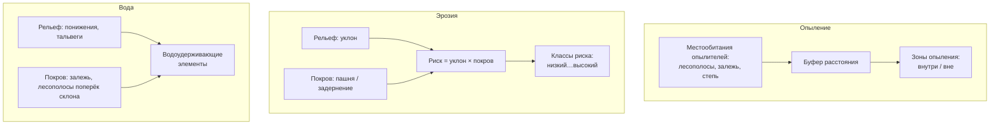

# Картируем регулирующие услуги: опыление, защита от эрозии, удержание воды

> ⏱ **Трудозатраты:** ~20 мин чтения + ~30 мин практики
>
> Модуль **[П6: Оценка экосистемных услуг хозяйства](../index.md)**, урок 2.
> Профессиональный уровень (агрономы). Проект UNDP-KAZ-00683, FOLUR. Компоненты FOLUR: **3**.

## Цели урока и место в модуле

На [уроке 1](01-inventarizaciya-prirodnogo-kapitala.md) вы составили реестр природных активов и привязали к ним услуги. Теперь пора превратить перечень в карты. Три регулирующие услуги решают судьбу степного земледелия сильнее прочих: **опыление** (энтомофильные культуры без насекомых недобирают урожай), **защита от эрозии** (ветровая дефляция и водный смыв — историческая беда целинной зоны) и **удержание воды** (в засушливой степи каждый задержанный миллиметр талой влаги на счету). Этот урок учит картировать все три по открытым данным — так, чтобы карта не осталась картинкой, а превратилась в адрес: где посадить, где не пахать, где задержать сток. Это ядро прикладного продукта модуля.

После изучения урока вы сможете:

1. **[Bloom: знать]** называть основные источники и получателей трёх регулирующих услуг агроландшафта и открытые данные, по которым каждую можно картировать.
2. **[Bloom: понимать]** объяснять механизм каждой услуги: как расстояние до медоноса влияет на опыление, как рельеф и покров определяют эрозионный риск, какие элементы ландшафта удерживают воду.
3. **[Bloom: применять]** строить в QGIS по открытым данным три тематических слоя — зоны опыления (буферы вокруг местообитаний опылителей), карту эрозионного риска (уклон × покров), водоудерживающие элементы — для территории СКО/Костанай/Акмола.
4. **[Bloom: анализировать]** переводить карты услуг в адресные рекомендации и выявлять «узкие места» — поля вне зоны опыления, склоны высокого риска без защиты, потерянные водоудерживающие элементы.

> **Границы лекции.** Внутри: механизмы и картирование трёх регулирующих услуг по открытым данным на качественном и полуколичественном уровне. Снаружи: экономическое выражение и связь с рентабельностью — [урок 3](03-ekonomika-i-otchyot.md); строгое моделирование услуг (InVEST, RUSLE с реальными коэффициентами) и валидация — академический [А6](../../a6/index.md); детальная работа с NDVI и облётами БПЛА для проблемных зон — [П3](../../p3/index.md) и [П7](../../p7/index.md); проектирование системы водосбережения участка — [П12](../../p12/index.md). Реальные коэффициенты эрозии, нормы отступов и денежные потери здесь не приводятся — модуль оперирует рангами и направлением эффекта.

---

## 1. От актива к карте услуги: общий принцип

Регулирующую услугу нельзя «сфотографировать» напрямую — спутник не видит опыление или защиту от ветра. Но каждую услугу можно картировать через **прокси** (заместитель) — наблюдаемый признак, который с ней связан:

- опыление ↔ близость к местообитаниям опылителей (буфер вокруг лесополос, залежи, естественной степи);
- защита от эрозии ↔ сочетание крутизны склона и типа покрова (открытая пашня на склоне — высокий риск; задернованный склон — низкий);
- удержание воды ↔ элементы рельефа и растительности, замедляющие сток (понижения, залежь в верховьях, лесополосы поперёк склона, водно-болотные полосы).

Общая логика картирования одинакова для всех трёх: берём открытый слой-основу (рельеф, покров, местообитания) → применяем простое пространственное правило (буфер, порог уклона, пересечение) → получаем зоны разного уровня услуги → накладываем поля-получатели и находим «узкие места». Мы работаем на **качественном** уровне (высокий/средний/низкий), без вымышленных коэффициентов — этого достаточно для адресных решений и честно по отношению к точности открытых данных.



*Рис. 1. Единая логика картирования трёх регулирующих услуг через прокси-признаки. Alt: схема из трёх блоков. Блок «Опыление»: местообитания опылителей (лесополосы, залежь, степь) → буфер расстояния → зоны опыления внутри и вне. Блок «Эрозия»: слой уклона рельефа и слой покрова (пашня или задернение) объединяются в правило «риск = уклон × покров», дающее классы риска от низкого до высокого. Блок «Вода»: рельеф (понижения, тальвеги) и покров (залежь, лесополосы поперёк склона) вместе выделяют водоудерживающие элементы ландшафта.*

## 2. Опыление: картируем зоны доступности опылителей

Опыление насекомыми — регулирующая услуга, от которой зависят энтомофильные культуры Северного Казахстана: **рапс, подсолнечник, гречиха, бобовые, многолетние травы на семена**. Пшеница ветроопыляема и в этой услуге не нуждается — важное уточнение, чтобы не приписать услугу не тому получателю.

Механизм услуги прост: дикие опылители (одиночные пчёлы, шмели, мухи-журчалки) живут не на пашне, а в **природных местообитаниях** — лесополосах, залежи, обочинах, естественной степи, у водоёмов. Оттуда они вылетают на посев. Чем дальше центр поля от местообитания, тем меньше опылителей до него долетает и тем ниже прибавка урожая от опыления. Отсюда прокси: **близость поля к местообитаниям опылителей**.

Картирование в QGIS (детальные шаги — в [практикуме](../practicum/01-otchyot-ob-ekosistemnyh-uslugah.md)):

1. Из OSM и снимка выделите слой местообитаний: лесополосы, залежь, естественную степь, водно-болотные полосы.
2. Постройте вокруг них **буфер** — зону, в пределах которой опыление ощутимо. Дальность лёта разных опылителей различается и зависит от вида; в учебной карте используйте несколько колец (ближнее/дальнее) как качественную градацию, не выдавая конкретный радиус за точную «норму».
3. Наложите поля энтомофильных культур. Части полей вне буферов — кандидаты в зону недоопыления.

Рекомендации, которые рождает такая карта: сохранять существующие местообитания рядом с рапсом и подсолнечником; разбивать слишком большие поля энтомофильных культур полосами медоносов или сохранять внутренние необрабатываемые островки; согласовывать сроки и способы обработки инсектицидами с периодом лёта опылителей. Статус услуги опыления и её значение для продовольствия обобщены в оценке **IPBES** — используйте её как авторитетный источник, но не переносите её глобальные проценты на своё поле.

## 3. Защита от эрозии: карта риска через рельеф и покров

Ветровая (дефляция) и водная эрозия — историческая рана целинной зоны. Массовая распашка целины в середине XX века без достаточной защиты обернулась пыльными бурями и сдувом гумусового горизонта — факт, ради которого впоследствии по всей степной зоне закладывали полезащитные лесополосы и внедряли почвозащитные севообороты. Защита от эрозии — регулирующая услуга, которую поставляют лесополосы, задернённые склоны, залежь, стерня и растительные буферы вдоль балок.

Картируем **риск** (где услуга особенно нужна и где её не хватает), а не саму услугу. Простейшая качественная модель риска — пересечение двух факторов:

- **Крутизна склона** (из открытой ЦМР): чем круче, тем выше потенциал водного смыва. Ровные водоразделы — низкий риск водной эрозии, но могут быть уязвимы к дефляции.
- **Тип и состояние покрова** (из снимка/OSM): открытая пашня и голая почва — высокий риск; многолетнее задернение, залежь, стерня, лесополоса — низкий.

Комбинируя два фактора в QGIS (реклассификация уклона на классы + реклассификация покрова + перемножение или матрица), получаем карту из нескольких классов риска: от «пологая залежь — низкий» до «открытый распаханный склон — высокий». Отдельно отмечаем **дефляционно-опасные** открытые массивы на ветроударных направлениях и распаханные до бровки склоны балок — классические очаги.

!!! warning "Это качественная модель, а не RUSLE"
    Строгие модели эрозии (USLE/RUSLE, WEQ) требуют коэффициентов почвы, дождевой эрозионной способности, длины склона и практик — их калибруют по полевым данным. Наша карта уклон × покров — **скрининг**: она честно указывает, куда смотреть и где услуга дефицитна, но не даёт тонн смыва с гектара. Количественную оценку и коэффициенты изучает [А6](../../a6/index.md); реальные цифры смыва не выдумывайте.

Рекомендации с карты риска: сохранять и восстанавливать лесополосы поперёк господствующих ветров; не распахивать крутые склоны и бровки балок, оставляя задернённые буферы; переходить на почвозащитные технологии (минимальная обработка, стерня — подробно в [П8](../../p8/index.md)) на дефляционно-опасных массивах; проектировать полосное размещение культур. Каждая рекомендация — адресная, привязанная к конкретному классу риска на карте.

## 4. Удержание воды: элементы ландшафта, что задерживают сток

В засушливой степи вода — лимитирующий ресурс, и услуга её удержания драгоценна. Речь о двух связанных функциях: **задержка талой и дождевой воды** (чтобы она впиталась, а не скатилась в балку и не ушла) и **регуляция стока** (замедление, снижение пиков, уменьшение эрозионного выноса). Поставщики услуги — понижения рельефа, залежь и естественная растительность в верховьях водосборов, лесополосы и буферы поперёк склона (задерживают снег и замедляют сток), водно-болотные полосы, сам почвенный покров с хорошей структурой.

Картирование опирается на рельеф и покров:

1. По открытой ЦМР выделите **пути стока и тальвеги** (линии, по которым стекает вода) и **понижения** (где вода задерживается). QGIS умеет строить направление стока и накопление стока стандартными инструментами гидрологического анализа.
2. Наложите покров: где на пути стока стоит залежь, лесополоса или буфер — там услуга удержания работает; где путь стока идёт по открытой распаханной ложбине — услуга потеряна, вода и почва уходят.
3. Отметьте **снегозадерживающие** элементы: лесополосы и кулисы накапливают снег, а с ним — весеннюю влагу на прилегающем поле.

Карта показывает, где вода удерживается, а где «протекает». Рекомендации: сохранять залежь и растительность в верховьях балок; размещать буферные полосы и лесополосы поперёк основных путей стока; восстанавливать заиленные пруды и водно-болотные полосы как накопители; сочетать со снегозадержанием. Проектирование конкретной системы водосбережения участка — тема [П12](../../p12/index.md); здесь мы даём карту-основу для таких решений.

> **Подробнее** — гидрологический анализ рельефа и водный баланс участка: [П12](../../p12/index.md); строгие модели услуг и их валидация: [А6](../../a6/index.md); чтение состояния покрова по NDVI: [П3](../../p3/index.md).

## 5. От трёх карт — к одному решению по территории

Три карты по отдельности полезны, вместе — сильнее. Наложив их, вы увидите места, где сходятся несколько дефицитов или, наоборот, где один актив закрывает сразу несколько услуг. Лесополоса поперёк склона на ветроударном направлении рядом с рапсом — это одновременно защита от эрозии, снегозадержание/удержание воды и местообитание опылителей: три услуги от одного актива. Восстановить такую лесополосу — приоритет №1, и карта это показывает наглядно.

Практический синтез: выделите на объединённой карте 3–5 приоритетных участков — «горячих точек», где восстановление или сохранение актива даёт максимум услуг сразу. Именно эти точки станут ядром рекомендаций отчёта и заявки на поддержку ([урок 3](03-ekonomika-i-otchyot.md), [П14](../../p14/index.md)). Так карта услуг перестаёт быть иллюстрацией и становится планом действий.

### 5.1 Синергии и компромиссы услуг

Услуги не всегда «дружат» между собой — важно видеть и **синергии**, и **компромиссы (trade-offs)**. Синергия — когда усиление одной услуги тянет за собой другую: восстановленная лесополоса одновременно защищает почву, задерживает снег и кормит опылителей; здоровый задернённый склон балки и держит почву, и удерживает воду. Такие связки — подарок: одно действие окупается трижды, и именно их подсвечивает объединённая карта.

Компромисс — когда усиление одной услуги ослабляет другую или обеспечивающую услугу пашни. Распахать залежь под зерно — рост обеспечивающей услуги (урожай) ценой утраты регулирующих (защита от эрозии, местообитания). Здесь и работает язык природного капитала: он делает цену компромисса видимой заранее. Задача агронома — не максимизировать одну услугу любой ценой, а держать баланс, при котором пашня продуктивна, а регулирующие услуги, от которых она сама зависит, не проедены. Рамка агроэкологии FAO (элемент «Synergies») прямо про это: устойчивый агроландшафт живёт за счёт синергий, а не за счёт выжимания одной функции.

---

## Региональный кейс

**Ситуация.** Хозяйство в Есильском районе Акмолинской области сеет пшеницу и рапс. Рапсовые поля крупные, часть удалена от лесополос и естественных угодий; вдоль восточной границы массива тянется балка с распаханными склонами, весной по ней уходит талая вода и вымывается почва; несколько старых лесополос разрежены. Агроному нужно на одной территории показать все три регулирующие услуги и предложить приоритеты.

**Данные:** OpenStreetMap (лесополосы, водные объекты, землепользование); Sentinel-2 L2A через Copernicus Browser (<https://dataspace.copernicus.eu/>) — покров, залежь, состояние лесополос по NDVI; открытая ЦМР Copernicus — уклоны, тальвеги, понижения. Все обрабатывается в QGIS.

**Задача:**

1. Построить карту зон опыления для рапсовых полей (буферы вокруг местообитаний) и найти части полей вне зоны.
2. Построить карту эрозионного риска (уклон × покров) и выделить очаги вдоль балки.
3. Отметить водоудерживающие элементы и места, где сток идёт по открытой пашне.
4. Наложить три слоя и назвать 3 приоритетных участка.

**Разбор.** Ход решения: буферы вокруг лесополос и залежи показывают, что удалённые углы крупных рапсовых полей выпадают из зоны опыления — кандидаты на внутренние медоносные полосы. Карта уклон × покров подсвечивает распаханные склоны балки как высокий риск, а разреженные лесополосы (низкий NDVI) — как ослабленную защиту. Гидрологический слой показывает, что главный тальвег идёт по открытой ложбине без буфера — здесь теряется и вода, и почва. Наложение выявляет «горячую точку»: восстановление лесополосы поперёк склона у балки закрывает сразу защиту от эрозии, удержание воды и опыление ближних полей. Итог — три карты и короткий список приоритетов, а не общий вывод «природа важна». Реальные объёмы смыва и прибавки урожая в кейсе не приводятся: карта указывает адрес, измерение эффекта — за пределами открытого скрининга.

---

## Закрепление и применение

!!! example "Попробуйте в QGIS"
    За 25–30 минут на своей территории: (1) загрузите OSM и ЦМР Copernicus в QGIS; (2) постройте буфер вокруг лесополос/залежи и наложите поля энтомофильных культур — где недоопыление?; (3) реклассифицируйте уклон на 3 класса, наложите покров — где высокий эрозионный риск?; (4) постройте направление стока и найдите тальвеги на открытой пашне. Даже без точных коэффициентов вы получите три рабочие карты. Пошаговые инструкции — в [практикуме](../practicum/01-otchyot-ob-ekosistemnyh-uslugah.md).

!!! warning "Границы применимости"
    Карты услуг из открытых данных — это **скрининг**, а не измерение. Буфер опыления — качественная градация, а не гарантированный радиус; карта уклон × покров указывает зоны риска, но не тонны смыва (это RUSLE и полевые данные — [А6](../../a6/index.md)); гидрологический слой по грубой ЦМР пропускает мелкие формы рельефа. Карты называют адреса и приоритеты — величину эффекта измеряют отдельно и не выдумывают.

!!! tip "Что это даёт вашему хозяйству"
    Три карты превращают невидимые услуги в управляемые объекты: вы видите, какие поля недобирают от нехватки опылителей, где почва под угрозой сдува и смыва, где протекает вода. Это прямые аргументы для точечных вложений — восстановить одну лесополосу поперёк склона у балки часто выгоднее, чем распахать ещё гектар, потому что один актив закрывает сразу три услуги.

!!! question "Кейс для размышления"
    На объединённой карте вашей территории нашлись две «горячие точки»: (а) распаханный склон балки — высокий эрозионный риск, но далеко от полей и опылителей; (б) разреженная лесополоса поперёк ветра рядом с рапсом и над тальвегом. Ресурсов хватает на восстановление одной. Какую выберете и почему? Подсказка: сравните, сколько услуг и каким получателям закрывает каждый вариант (§5).

### Проверь себя

```quiz
[
  {
    "q": "Почему регулирующие услуги картируют через прокси-признаки, а не напрямую?",
    "options": [
      "Спутник не видит саму услугу (опыление, защиту от ветра), но видит связанные с ней признаки — местообитания, уклон, покров",
      "Прокси-признаки точнее самой услуги",
      "Прямое картирование услуг запрещено законом РК",
      "Услуги вообще нельзя картировать, только описывать словами"
    ],
    "answer": 0,
    "explain": "§1: услугу замещают наблюдаемым признаком — близостью к местообитаниям, крутизной склона, элементами рельефа; это качественный скрининг по открытым данным."
  },
  {
    "q": "Для какой культуры услуга опыления насекомыми НЕ является значимой?",
    "options": [
      "Яровая пшеница — она ветроопыляема",
      "Рапс",
      "Подсолнечник",
      "Гречиха"
    ],
    "answer": 0,
    "explain": "§2: пшеница ветроопыляема и в опылении насекомыми не нуждается; приписывать ей эту услугу — ошибка адресации получателя."
  },
  {
    "q": "Какие два фактора перемножаются в качественной карте эрозионного риска этого урока?",
    "options": [
      "Крутизна склона (из ЦМР) и тип/состояние покрова (из снимка)",
      "Цена зерна и площадь поля",
      "Осадки и температура воздуха",
      "Балл бонитета и кадастровая стоимость"
    ],
    "answer": 0,
    "explain": "§3: открытая пашня на крутом склоне — высокий риск, задернённый пологий участок — низкий; это скрининг уклон × покров, а не RUSLE с коэффициентами."
  },
  {
    "q": "Почему восстановление одной лесополосы поперёк склона у балки часто становится приоритетом №1 на объединённой карте услуг?",
    "options": [
      "Один актив закрывает сразу несколько услуг: защиту от эрозии, снегозадержание/удержание воды и местообитание опылителей",
      "Лесополоса — самый дешёвый актив для восстановления",
      "Так требуют нормы РК по лесополосам",
      "Потому что балку всё равно нельзя использовать под пашню"
    ],
    "answer": 0,
    "explain": "§5: наложение трёх карт выявляет «горячие точки», где один актив даёт максимум услуг сразу — такие точки становятся ядром рекомендаций и заявки."
  },
  {
    "q": "Что корректно сказать о карте эрозионного риска, построенной по открытой ЦМР и снимку?",
    "options": [
      "Это скрининг: он указывает зоны и приоритеты, но не даёт тонн смыва с гектара",
      "Он точно рассчитывает годовой смыв почвы в т/га",
      "Он заменяет полевое обследование и модель RUSLE",
      "Он показывает денежные потери хозяйства от эрозии"
    ],
    "answer": 0,
    "explain": "§3, врезка: количественная оценка требует коэффициентов и полевых данных (А6); открытый скрининг честно называет адреса риска, но не величину эффекта."
  }
]
```

## Что дальше?

Три карты услуг и список приоритетных участков готовы. В **[уроке 3 «Связываем экосистемные услуги с рентабельностью и собираем отчёт»](03-ekonomika-i-otchyot.md)** мы переведём карты на язык хозяйства: покажем, где деградация услуги оборачивается издержками, а вложение в природный капитал окупается, и соберём все части в готовый отчёт. Затем [практикум](../practicum/01-otchyot-ob-ekosistemnyh-uslugah.md) проведёт вас через построение карт и отчёта на вашей территории. Строгие модели услуг — в [А6](../../a6/index.md); водосбережение участка — в [П12](../../p12/index.md); почвозащитные технологии — в [П8](../../p8/index.md).
