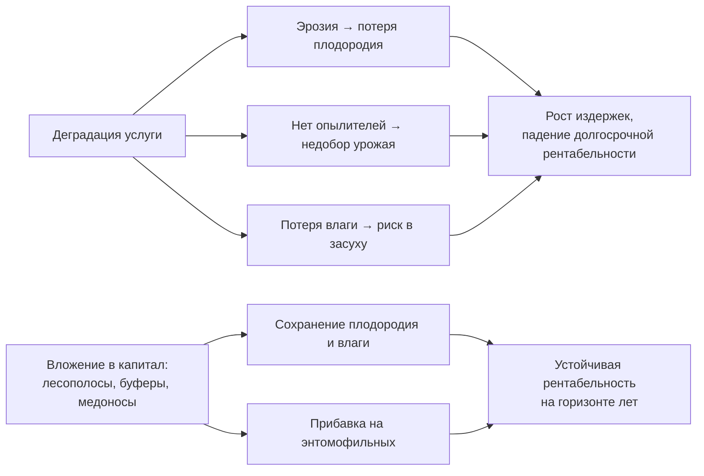

# Связываем экосистемные услуги с рентабельностью и собираем отчёт

> ⏱ **Трудозатраты:** ~18 мин чтения + ~25 мин практики
>
> Модуль **[П6: Оценка экосистемных услуг хозяйства](../index.md)**, урок 3.
> Профессиональный уровень (агрономы). Проект UNDP-KAZ-00683, FOLUR. Компоненты FOLUR: **3**.

## Цели урока и место в модуле

Инвентаризация ([урок 1](01-inventarizaciya-prirodnogo-kapitala.md)) и карты услуг ([урок 2](02-reguliruyushchie-uslugi.md)) отвечают на вопросы «что есть» и «где». Остаётся главный вопрос владельца: **и что мне с того?** Этот урок переводит экосистемные услуги на язык, который понимает хозяйство, — язык издержек, выгод и долгосрочной рентабельности. Мы разберём, как выразить ценность услуги честно и без выдуманных цифр, где деградация услуги превращается в реальные потери, а вложение в природный капитал окупается, и как собрать всё в готовый отчёт об экосистемных услугах — прикладной продукт модуля. После этого урока карты перестают быть красивыми и становятся аргументом в решении и в заявке на поддержку.

После изучения урока вы сможете:

1. **[Bloom: знать]** называть подходы к экономическому выражению ценности экосистемных услуг (качественный, полуколичественный, денежный) и понимать, какой из них уместен для отчёта хозяйства.
2. **[Bloom: понимать]** объяснять на примерах, как состояние регулирующей услуги влияет на издержки и долгосрочную рентабельность (сдув почвы, недоопыление, потеря влаги, потеря плодородия).
3. **[Bloom: применять]** оформлять отчёт об экосистемных услугах территории: инвентаризация → карты → оценка состояния → связь с рентабельностью → адресные рекомендации.
4. **[Bloom: анализировать]** отделять обоснованные экономические утверждения от выдуманных цифр и оценивать, какие вложения в природный капитал имеют долгосрочный смысл для конкретного хозяйства.

> **Границы лекции.** Внутри: подходы к экономическому выражению услуг, качественная и полуколичественная связь с рентабельностью, сборка отчёта. Снаружи: строгая денежная оценка услуг и методы TEEB/InVEST в цифрах — академический [А6](../../a6/index.md); субсидии, гранты и оформление заявки — [П14](../../p14/index.md); маркетинг «зелёной» продукции и культурные услуги в бренде — [П15](../../p15/index.md); экономика перехода на почвозащитные технологии — [П8](../../p8/index.md). Конкретные суммы, цены и субсидии в этой лекции не приводятся — только направление эффекта и качественные ранги.

---

## 1. Три способа выразить ценность услуги

Экономическое выражение экосистемной услуги не обязано быть суммой в тенге. Есть три уровня строгости, и для отчёта хозяйства чаще всего уместны первые два.

**Качественный.** Описываем ценность словами и направлением эффекта: «лесополоса снижает сдув почвы и потери всходов от суховея; её утрата увеличит эти потери». Никаких чисел — но утверждение проверяемо и полезно для решения. Это базовый уровень отчёта, и его достаточно для большинства рекомендаций.

**Полуколичественный (ранги, диапазоны).** Присваиваем услугам и активам сравнительные оценки: высокая/средняя/низкая ценность; приоритет 1/2/3; «эффект от восстановления этого участка выше, чем того». Здесь появляются относительные величины без выдуманной точности — ровно то, что дают карты урока 2. Такой уровень позволяет ранжировать вложения, не претендуя на бухгалтерскую цифру.

**Денежный.** Перевод услуги в деньги (стоимость замещения, готовность платить, предотвращённый ущерб) — уровень **TEEB** и специальных исследований. Он мощный, но требует данных и методик, которых у хозяйства обычно нет; выдуманная денежная оценка хуже честного качественного описания. Денежную оценку изучает [А6](../../a6/index.md); в отчёте П6 денежные цифры приводятся только если они взяты из проверяемого источника, иначе — качественно.

!!! warning "Почему мы не ставим цифры от себя"
    Соблазн написать «эрозия отнимает у хозяйства N тонн зерна и M тенге в год» велик — но без полевых измерений и калибровки это выдумка, а выдуманная цифра в отчёте обрушивает доверие ко всему документу. Принцип модуля: **лучше честный ранг, чем ложная точность**. Все количественные значения — только из официальных и проверяемых источников, всё остальное — качественно или с пометкой «оценка не проводилась».

## 2. Как услуга превращается в деньги хозяйства

Связь экосистемных услуг с рентабельностью работает в обе стороны: исправная услуга экономит и добавляет, деградированная — отнимает. Разберём механизмы качественно, на примерах Северного Казахстана.

**Защита от эрозии → сохранение плодородия и снижение затрат.** Ветровая и водная эрозия уносит верхний, самый плодородный горизонт почвы. Это медленная, но необратимая потеря капитала: восстановление гумуса измеряется десятилетиями. Исправная услуга (лесополосы, задернение, стерня) сохраняет плодородие, а значит — будущие урожаи и меньшие затраты на удобрения, которыми приходится компенсировать потерю. Эффект долгосрочный: он не виден в один сезон, но определяет рентабельность хозяйства на горизонте десятилетий.

**Опыление → прибавка урожая энтомофильных культур.** Достаточное число опылителей повышает завязываемость и урожай рапса, подсолнечника, гречихи, бобовых. Недоопыление на удалённых от местообитаний полях — недобор, который хозяйство обычно не замечает, потому что не с чем сравнить. Сохранение местообитаний и медоносных полос — вложение с прямой отдачей на энтомофильных культурах.

**Удержание воды → устойчивость к засухе.** В степной зоне влага — главный лимитирующий фактор. Услуга удержания талой и дождевой воды (снегозадержание лесополосами, залежь в верховьях, буферы поперёк стока) повышает запас продуктивной влаги и снижает риск потерь в засушливые годы. Это услуга-страховка: её ценность особенно видна в плохие по влаге сезоны.

**Поддерживающие услуги → фундамент всего.** Почвообразование и круговорот питательных веществ не продаются, но их деградация поднимает затраты на минеральное питание и снижает отзывчивость поля. Здоровая почвенная биота — это «бесплатное» плодородие, которое дорого замещать удобрениями.

Общий вывод для отчёта: регулирующие и поддерживающие услуги влияют на рентабельность **в долгую** — через сохранение плодородия, влаги и урожая энтомофильных культур и через снижение затрат на замещение утраченных функций. Именно долгосрочность делает их уязвимыми: их легко проесть ради сиюминутного гектара, а последствия проявятся не сразу.



*Рис. 1. Два сценария: деградация услуг ведёт к росту издержек, вложение в природный капитал — к устойчивой рентабельности. Alt: схема с двумя ветвями. Верхняя ветвь: деградация услуги разветвляется на эрозию (потеря плодородия), отсутствие опылителей (недобор урожая) и потерю влаги (риск в засуху), которые сходятся в рост издержек и падение долгосрочной рентабельности. Нижняя ветвь: вложение в природный капитал (лесополосы, буферы, медоносы) даёт сохранение плодородия и влаги и прибавку на энтомофильных культурах, что ведёт к устойчивой рентабельности на горизонте лет.*

## 3. Оценка состояния услуг: светофор

Прежде чем рекомендовать, оцените текущее **состояние** каждой услуги — насколько она исправна. Удобна простая «светофорная» шкала (полуколичественный уровень §1):

- **Зелёный** — услуга работает: лесополоса густая и продуваемая в меру, склоны задернены, местообитания опылителей рядом с полями, водоудерживающие элементы на месте.
- **Жёлтый** — услуга ослаблена: лесополоса разрежена, часть буферов распахана, местообитания удалены, пруд заилен. Функция ещё есть, но снижена.
- **Красный** — услуга утрачена или под угрозой: склон распахан до бровки, лесополоса выпала, тальвег идёт по открытой пашне.

Оценку ставьте по картам урока 2 и признакам с урока 1 (NDVI лесополос, крутизна и покров склонов, наличие буферов). «Светофор» по каждой услуге и активу — это ядро отчёта: он сразу показывает, где вкладываться. Красные и жёлтые позиции превращаются в рекомендации; зелёные — в раздел «сохранить».

## 4. Собираем отчёт об экосистемных услугах территории

Отчёт — прикладной продукт модуля и предмет аттестации. Его структура собирает всё, что вы сделали:

1. **Титул и краткое резюме** — территория, площадь, главные выводы в 3–5 предложениях (что сильного, что под угрозой, что рекомендуется).
2. **Инвентаризация природного капитала** (урок 1) — таблица активов с типом, местоположением, состоянием и привязанными услугами; обзорная карта активов.
3. **Карты регулирующих услуг** (урок 2) — три тематические карты (опыление, эрозионный риск, удержание воды) с подписями и легендами.
4. **Оценка состояния услуг** (§3) — «светофорная» таблица по услугам и активам.
5. **Связь с рентабельностью** (§2) — качественное описание, где деградация услуг грозит издержками, а вложения окупаются; без выдуманных сумм.
6. **Рекомендации** — 3–5 адресных, приоритизированных мероприятий (что, где, зачем, приоритет), опирающихся на «горячие точки» объединённой карты (урок 2, §5).
7. **Источники и оговорки** — использованные открытые данные, границы точности («скрининг, не измерение»), пометки о непроверенных величинах.

Хороший отчёт **конкретен и честен**: каждая рекомендация привязана к месту и услуге, каждая цифра — из источника или отсутствует, каждая карта имеет легенду. Такой отчёт работает в трёх ролях сразу: инструмент собственного планирования, приложение к заявке на поддержку восстановления ([П14](../../p14/index.md)) и элемент «зелёного» позиционирования продукции ([П15](../../p15/index.md)).

> **Подробнее** — денежная оценка услуг и методология TEEB/InVEST: [А6](../../a6/index.md); оформление заявки на грант или субсидию с опорой на отчёт: [П14](../../p14/index.md); связь отчёта с территориальным планом хозяйства: [П5](../../p5/index.md).

## 5. Отчёт как аргумент, а не как отписка

Частая судьба «экологического раздела» — стать формальной отпиской для галочки. П6 учит обратному: отчёт об экосистемных услугах — это **инструмент влияния на решения**. Когда встаёт выбор «распахать лесополозу ради двух гектаров» или «вложиться в её восстановление», именно отчёт кладёт на стол долгосрочную цену решения: три услуги, которые лесополоса поставляет, и получателей, которые их потеряют. Язык гектаров молчит об этом; язык природного капитала — говорит.

Поэтому финальный критерий качества вашего отчёта простой: **можно ли на его основе принять конкретное решение и обосновать его перед фондом или партнёром?** Если да — отчёт удался. Если это набор общих слов о важности природы — вернитесь к урокам 1 и 2 и сделайте связки «актив → услуга → получатель → состояние → рекомендация» конкретными.

### 5.1 Три роли одного отчёта

Один и тот же отчёт работает в трёх разговорах, и стоит держать в голове все три, когда его пишете. Первый — **разговор с самим собой**: куда направить ограниченные ресурсы, чтобы природный капитал не проедался, а восстанавливался в самых уязвимых точках. Здесь ценны «светофор» и приоритеты — они прямо отвечают на вопрос «с чего начать».

Второй — **разговор с фондом или государством**: отчёт становится телом заявки на поддержку восстановительных мероприятий ([П14](../../p14/index.md)). Фонд убеждают не эмоции, а конкретика: какой актив, в каком состоянии, какие услуги и каким получателям он вернёт, почему это приоритет. Отчёт, где каждое утверждение проверяемо и привязано к карте, проходит экспертизу; отчёт с выдуманными суммами — отбраковывается на первом же вопросе о методике.

Третий — **разговор с рынком**: состояние природного капитала — часть «зелёного» позиционирования продукции ([П15](../../p15/index.md)) и репутации хозяйства в кооперативе «зелёной» пшеницы FOLUR. Покупатель, который платит премию за устойчивость, хочет видеть не декларацию, а документ. Один отчёт — три аудитории; поэтому его стоит делать честно и конкретно с первого раза.

---

## Региональный кейс

**Ситуация.** Хозяйство в Тайыншинском районе Северо-Казахстанской области готовит заявку на поддержку восстановления деградированных элементов ландшафта. У агронома есть инвентаризация и три карты услуг из уроков 1–2: часть лесополос разрежена (жёлтый/красный), склоны одной балки распаханы (красный по эрозии), удалённые рапсовые поля частично вне зоны опыления (жёлтый). Нужно превратить это в отчёт, который убедит фонд и поможет самому хозяйству расставить приоритеты — без выдуманных сумм ущерба.

**Данные:** карты и инвентаризация, созданные в уроках 1–2 на открытых данных (OSM, Sentinel-2 через Copernicus Browser, ЦМР Copernicus); FOLUR Case Studies Catalogue Vol. I как источник сопоставимых кейсов восстановления.

**Задача:**

1. Составить «светофорную» таблицу состояния услуг по активам.
2. Качественно описать, как каждая красная/жёлтая позиция связана с долгосрочной рентабельностью — без денежных цифр «от себя».
3. Сформулировать 3 приоритетные рекомендации с обоснованием приоритета.

**Разбор.** Ход решения: агроном ставит «светофор»: распаханные склоны балки — красный (утрата защиты от эрозии и удержания воды), разреженные лесополосы — жёлтый (ослабленная защита и снегозадержание), удалённые углы рапса — жёлтый (недоопыление). В связке с рентабельностью он пишет качественно: эрозия на склонах балки ведёт к необратимой потере плодородного горизонта и будущих урожаев; разреженные лесополосы снижают снегозапас и защиту, что бьёт по влагообеспеченности; недоопыление — недобор на рапсе. Ни одной цифры «от себя» — только направление эффекта и ссылки на карты. Приоритет №1 — восстановление лесополосы поперёк склона у балки (закрывает эрозию, воду и опыление сразу — «горячая точка»); №2 — задернение бровок балки; №3 — медоносные полосы на удалённых рапсовых полях. Итог — отчёт, который одновременно служит планом хозяйства и телом заявки, и в котором каждое утверждение проверяемо.

---

## Закрепление и применение

!!! example "Попробуйте прямо сейчас"
    Возьмите инвентаризацию и карты своей территории (уроки 1–2) и составьте одну «светофорную» таблицу: строки — услуги/активы, столбец — цвет состояния (зелёный/жёлтый/красный), столбец — короткая фраза о связи с рентабельностью (направление эффекта, без цифр). За 20 минут вы получите скелет раздела 4 отчёта — самого убедительного его места.

!!! warning "Границы применимости"
    Экономическое выражение в отчёте П6 — качественное и полуколичественное. Не переводите услуги в тенге без проверяемого источника: выдуманная денежная оценка обрушивает доверие ко всему отчёту (§1, врезка). «Светофор» и ранги честно показывают приоритеты, но не заменяют строгую денежную оценку — она требует данных и методик уровня [А6](../../a6/index.md)/TEEB.

!!! tip "Что это даёт вашему хозяйству"
    Отчёт об экосистемных услугах — это ваш аргумент в двух разговорах: с самим собой (куда вложить ограниченные ресурсы, чтобы капитал не проедался) и с фондом ([П14](../../p14/index.md)) или покупателем «зелёной» продукции ([П15](../../p15/index.md)). Он делает видимой долгосрочную цену решений, которую язык гектаров скрывает, — и превращает «экологию» из статьи затрат в аргумент рентабельности.

!!! question "Кейс для размышления"
    Консультант принёс хозяйству отчёт, где сказано: «экосистемные услуги территории оцениваются в 47 млн тенге в год». Методика и источник цифры не приведены. Как вы оцените такой отчёт с точки зрения научной честности модуля, и что попросите добавить, прежде чем использовать эту цифру в заявке? Подсказка: §1, врезка «Почему мы не ставим цифры от себя».

### Проверь себя

```quiz
[
  {
    "q": "Какой уровень экономического выражения услуг наиболее уместен для отчёта хозяйства без специальных исследований?",
    "options": [
      "Качественный и полуколичественный (направление эффекта, ранги, «светофор»)",
      "Только денежный — иначе отчёт несерьёзен",
      "Никакой — услуги нельзя оценивать",
      "Только точная денежная оценка по методике TEEB"
    ],
    "answer": 0,
    "explain": "§1: денежная оценка требует данных и методик, которых у хозяйства обычно нет; лучше честный ранг, чем ложная точность — денежные цифры только из проверяемого источника."
  },
  {
    "q": "Почему влияние регулирующих услуг на рентабельность называют долгосрочным?",
    "options": [
      "Эффект (сохранение плодородия, влаги, урожая) проявляется на горизонте лет, а не в один сезон — поэтому услугу легко «проесть» ради сиюминутного гектара",
      "Потому что услуги приносят доход только через 20 лет",
      "Потому что регулирующие услуги вообще не влияют на деньги",
      "Потому что их ценность фиксирована законом на долгий срок"
    ],
    "answer": 0,
    "explain": "§2: эрозия, недоопыление и потеря влаги бьют по рентабельности в долгую; долгосрочность делает услуги уязвимыми к сиюминутным решениям."
  },
  {
    "q": "Что означает «красный» в светофорной оценке состояния услуги?",
    "options": [
      "Услуга утрачена или под угрозой — например, склон распахан до бровки, лесополоса выпала, тальвег идёт по открытой пашне",
      "Услуга работает идеально",
      "Услугу запрещено использовать",
      "Актив приносит максимальный доход"
    ],
    "answer": 0,
    "explain": "§3: красный — утрата или угроза; такие позиции превращаются в приоритетные рекомендации отчёта."
  },
  {
    "q": "Отчёт содержит фразу: «эрозия отнимает у хозяйства 1200 тонн зерна в год» без ссылки на измерения. Как поступить по принципу модуля?",
    "options": [
      "Убрать цифру или заменить качественным описанием: выдуманная величина без измерений и калибровки обрушивает доверие ко всему отчёту",
      "Оставить — звучит убедительно",
      "Удвоить цифру для надёжности",
      "Оставить, добавив слово «примерно»"
    ],
    "answer": 0,
    "explain": "§1, врезка: количественные значения — только из проверяемых источников; лучше честный ранг, чем ложная точность."
  },
  {
    "q": "Какой финальный критерий качества отчёта об экосистемных услугах предлагает урок?",
    "options": [
      "Можно ли на его основе принять конкретное решение и обосновать его перед фондом или партнёром",
      "Достаточно ли в нём красивых фотографий природы",
      "Превышает ли он 50 страниц",
      "Содержит ли он денежную оценку в тенге"
    ],
    "answer": 0,
    "explain": "§5: отчёт — инструмент влияния на решения через связки «актив → услуга → получатель → состояние → рекомендация», а не формальная отписка."
  }
]
```

## Что дальше?

Вы прошли путь от понятия природного капитала до готового отчёта. Теперь примените его целиком на своей территории в **[практикуме «Собираем отчёт об экосистемных услугах территории»](../practicum/01-otchyot-ob-ekosistemnyh-uslugah.md)** — с инвентаризацией, тремя картами и рекомендациями на открытых данных. Затем [ИИ-задание](../ai-assistant.md) научит ускорять инвентаризацию с чат-ассистентом и **проверять** его по чек-листу, а [итоговая аттестация](../assessment/final.md) закрепит модуль. Денежная оценка услуг — в [А6](../../a6/index.md); превращение отчёта в заявку на поддержку — в [П14](../../p14/index.md); «зелёный» маркетинг — в [П15](../../p15/index.md).
