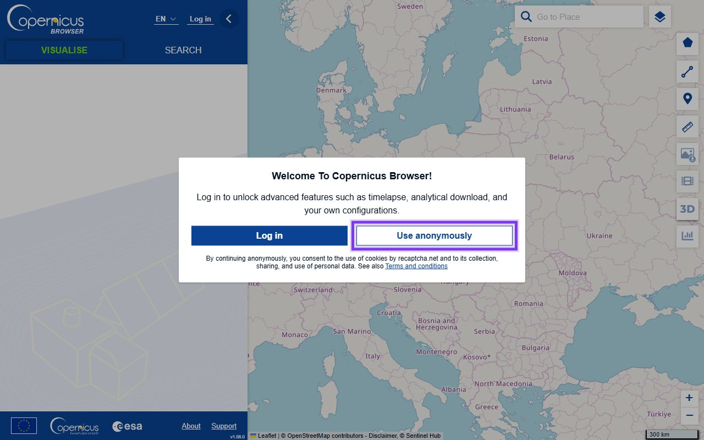
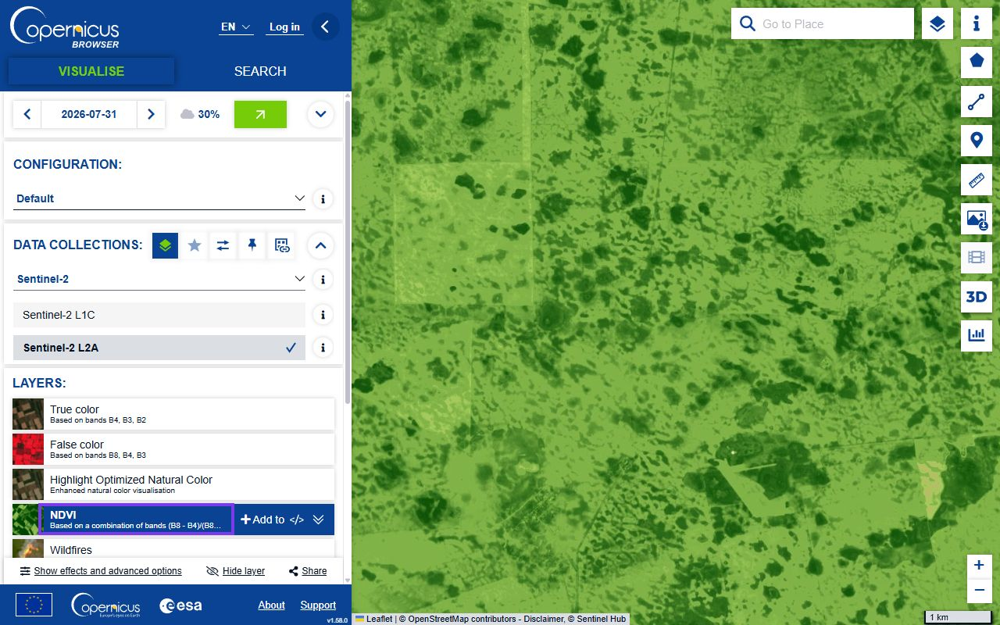
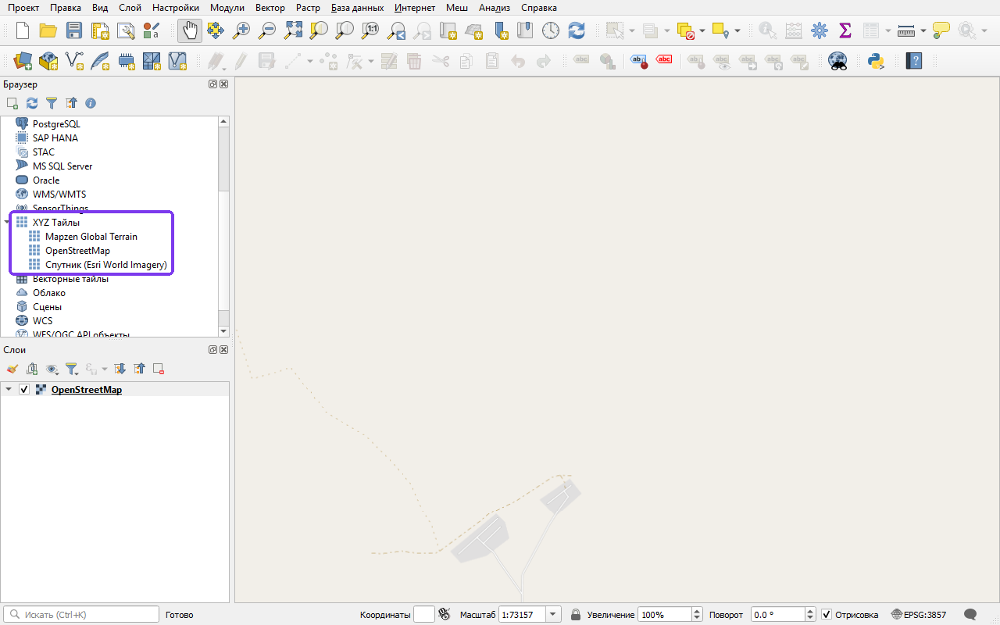
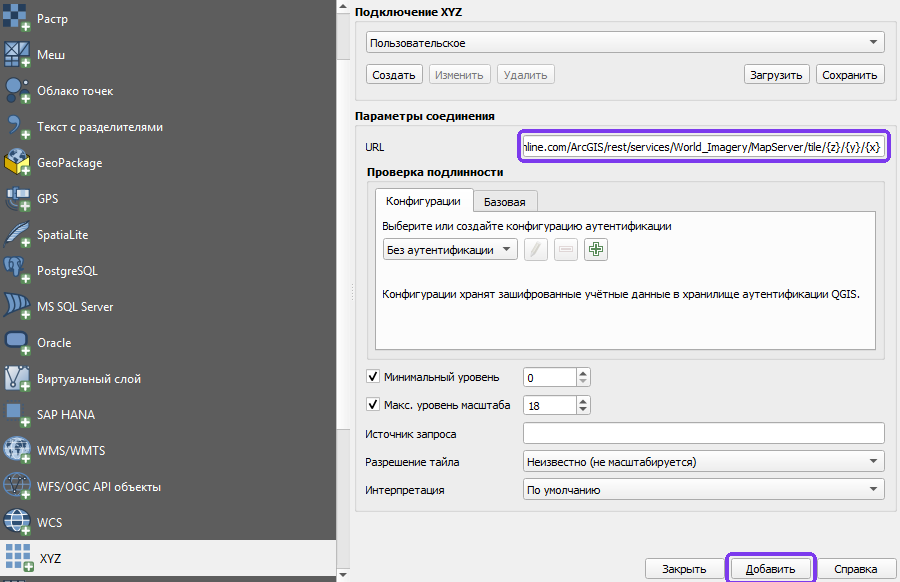
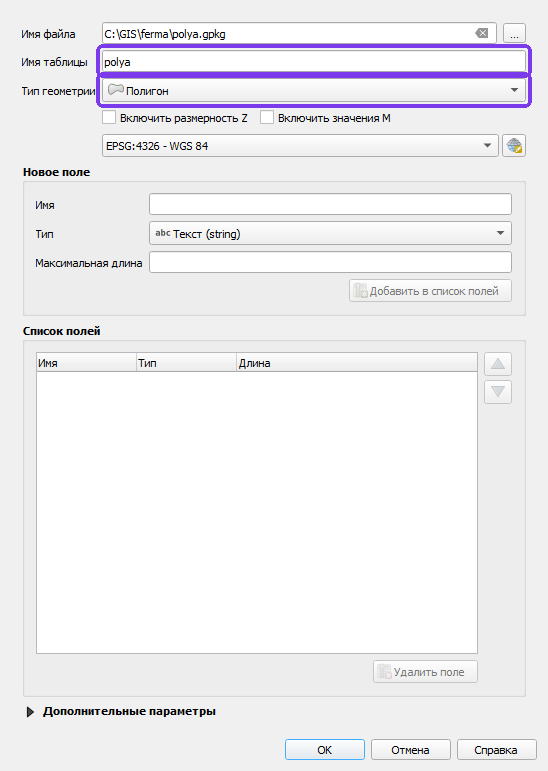
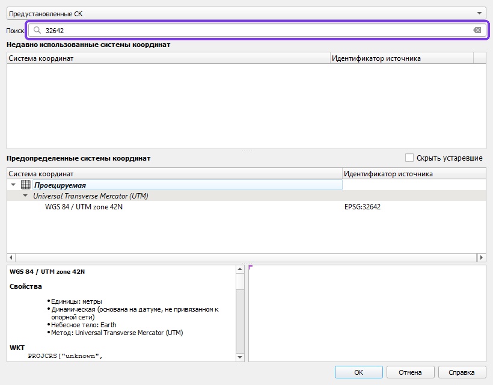
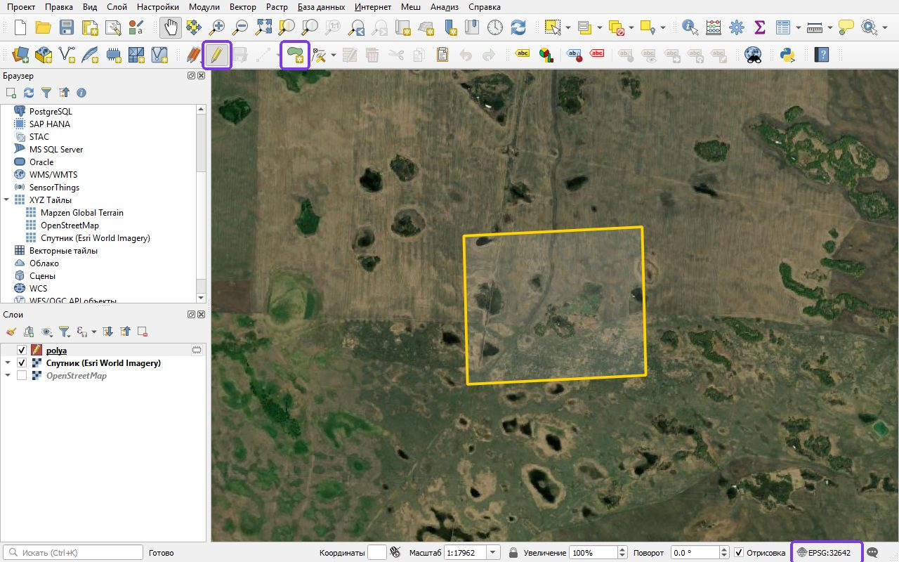
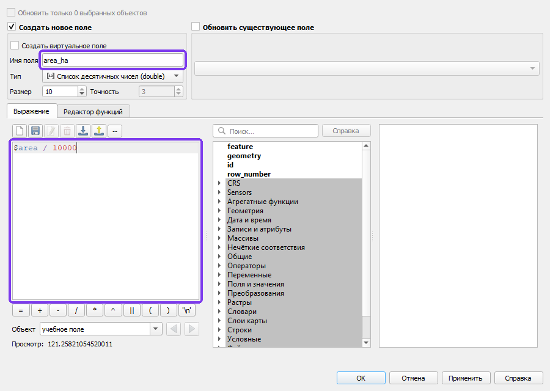

# Практикум: собираем отчёт об экосистемных услугах территории

<!-- folur-software:start -->

!!! tip "Что понадобится в этом уроке и где это взять"
    Нажмите на название программы и увидите, **где её взять, что нажать и как она выглядит в работе** (нужная кнопка на снимке обведена фиолетовым). Встроенный редактор Python установки не требует. Полная справка — [«Программы и сервисы»](../../../software.md).

??? example "Встроенный редактор Python — как запустить и что получится"
    { .folur-shot loading=lazy }

    1. Скачивать и устанавливать ничего не нужно: редактор находится в этом уроке, на шаге **«Практика в Python»**.
    2. Нажмите **«▶ Запустить»** под кодом (на снимке обведена). В первый раз подождите до минуты, пока загрузится Python.
    3. Ниже, в блоке «Результат», появятся таблицы и графики. Измените число в коде и запустите ещё раз.
    4. Вкладка **«Мой участок»** над редактором считает то же по вашим координатам, контуру поля или снимку.

    **Как это выглядит в работе.** Пример результата: таблицы под кодом и кнопки скачивания файлов.

    { .folur-shot loading=lazy }

    **Как это выглядит в работе.** Вкладка «Мой участок»: координаты поля, контур и снимок подставляются здесь.

    { .folur-shot loading=lazy }

    [Подробно о редакторе, своих данных и запросе для нейросети →](../../../software.md#python)

??? example "QGIS — скачать и установить"
    { .folur-shot loading=lazy }

    1. Откройте <https://qgis.org/download/>. Сайт сначала предложит пожертвование — оно необязательно: нажмите **«Skip it and go to download»**.
    2. Нажмите зелёную кнопку **«Download LTR»** (на снимке обведена). LTR — версия долгосрочной поддержки, она стабильнее. Скачается установщик размером около 1 ГБ.
    3. Запустите скачанный файл и нажимайте «Next», ничего не меняя. После установки откройте в меню «Пуск» ярлык **QGIS Desktop**.

    **Как это выглядит в работе.** QGIS в работе (русский интерфейс): слева панели «Браузер» и «Слои», в окне карты — спутниковая подложка, на которой видны поля.

    { .folur-shot loading=lazy }

    [QGIS по шагам в картинках: подложка, спутник, новый слой, система координат, площадь →](../../../software.md#qgis-steps)

    [Первые шаги в QGIS и русский интерфейс →](../../../software.md#qgis)

??? example "Copernicus Browser — открыть в браузере"
    { .folur-shot loading=lazy }

    1. Скачивать ничего не нужно: откройте <https://browser.dataspace.copernicus.eu/>.
    2. В первом окне нажмите **«Use anonymously»** (на снимке обведена) — смотреть снимки можно без регистрации.
    3. Чтобы **скачивать** снимки, нужна бесплатная учётная запись: кнопка **«Log in»** → регистрация → подтверждение по письму.

    **Как это выглядит в работе.** Copernicus Browser в работе: слева дата снимка и список слоёв, на карте — слой NDVI по участку.

    { .folur-shot loading=lazy }

    [Как найти своё поле и выбрать снимок →](../../../software.md#copernicus)

??? example "Таблицы: LibreOffice — скачать (или Google Таблицы без установки)"
    { .folur-shot loading=lazy }

    1. Если у вас есть Microsoft Excel или аккаунт Google (Google Таблицы работают в браузере) — ставить ничего не нужно.
    2. Иначе откройте <https://www.libreoffice.org/download/download-libreoffice/> и нажмите зелёную кнопку **«Windows (x86-64)»** (на снимке обведена).
    3. Запустите скачанный файл и нажимайте «Далее». Для таблиц открывайте программу **LibreOffice Calc**.

    [Как сохранять таблицу в CSV →](../../../software.md#office)

???+ example "QGIS по шагам в картинках — для этого практикума"
    **1. Подложка.** В панели «Браузер» раскройте «XYZ Тайлы» и дважды щёлкните OpenStreetMap.

    { .folur-shot loading=lazy }

    **2. Спутник, чтобы видеть само поле.** «Слой → Источники данных» → раздел XYZ → вставьте адрес спутниковой подложки в поле URL → «Добавить». Адрес — в справке по ссылке ниже.

    { .folur-shot loading=lazy }

    На спутниковой подложке видны поля, колки и дороги — на карте OpenStreetMap в степи их часто нет.

    { .folur-shot loading=lazy }

    **3. Новый слой.** «Слой → Создать слой → Создать слой GeoPackage…»: имя таблицы и тип геометрии.

    { .folur-shot loading=lazy }

    **4. Система координат.** «Проект → Свойства… → Система координат» или кнопка с кодом EPSG справа внизу; в поиске наберите код зоны UTM.

    { .folur-shot loading=lazy }

    **5. Обвести контур.** Карандаш «Режим редактирования», затем «Добавить полигональный объект».

    { .folur-shot loading=lazy }

    **6. Площадь.** Таблица атрибутов → «Калькулятор полей» → выражение `$area / 10000`. Считайте только для слоя в метрической проекции.

    { .folur-shot loading=lazy }

    Подробно, с адресом спутниковой подложки и разбором ошибки с площадью: [QGIS по шагам в картинках](../../../software.md#qgis-steps).

<!-- folur-software:end -->

!!! info "Вычисления в браузере"
    Для этого материала подготовлен [редактор Python](#python-practice). Он выполняет весь скрипт целиком; графики, изображения, таблицы и файлы появляются под кодом. Учебный пример запускается без аккаунта Google. Облачные API и полноценные настольные ГИС используются отдельно, когда этого требует исходное задание.

Порог сертификации — 75 %: квизы тем проверяли навыки по отдельности, ниже — связки, как в реальной работе. Сначала — практикум по шагам, затем ИИ-задание, банк и сценарный кейс. К аттестации предъявляются карта хозяйства из практикума и таблица верификации ИИ-задания.

## Практикум: отчёт об экосистемных услугах территории (по шагам)

Модуль П6: Оценка экосистемных услуг хозяйства. Время выполнения: 60–90 мин.

Инструменты: QGIS (свободная ГИС) + браузер (Copernicus Browser, OpenStreetMap). Только открытый бесплатный стек.

Данные: OpenStreetMap, Sentinel-2 L2A (Copernicus), открытая ЦМР Copernicus — всё бесплатно и открыто.

Цель практикума

<em>самостоятельно</em> собрать **отчёт об экосистемных услугах территории** — инвентаризацию природного капитала, три карты регулирующих услуг (опыление, эрозионный риск, удержание воды), «светофорную» оценку состояния и 3–5 адресных рекомендаций — на реальных открытых данных выбранной территории.

Практикум объединяет уроки 1–3 (инвентаризация, карты услуг, экономика и отчёт) и применяет их на территории СКО / Костанайской / Акмолинской области (или на вашей — см. рамку в конце).

Что нужно подготовить

QGIS (версия LTR) — установите бесплатно с &lt;<a href="https://qgis.org/&gt">https://qgis.org/&gt</a>; (Windows/macOS/Linux). Плагины: QuickMapServices (подложки) и QuickOSM (выборки OSM), устанавливаются в QGIS: Модули → Управление модулями…. Если ставить некуда — большинство шагов выполнимо в браузере Copernicus и вручную, но карты удобнее в QGIS.

Учётная запись Copernicus (бесплатная регистрация) — &lt;<a href="https://dataspace.copernicus.eu/&gt">https://dataspace.copernicus.eu/&gt</a>; для Sentinel-2 и Copernicus Browser.

Территория — выберите модельный участок в СКО/Костанай/Акмола (напр., окрестности Есильского района СКО) ИЛИ территорию своего хозяйства.

Шаблон отчёта — создайте документ (LibreOffice Writer/Google Docs) с семью разделами из урока 3, §4.

Границы полей из П1/П2, если вы их уже делали (необязательно).

Задание

Шаг 1: загрузите подложку и определите территорию (10 мин)

Откройте QGIS → установите плагин QuickMapServices (Модули → Управление модулями…) → добавьте базовую карту OSM (меню «Интернет» → QuickMapServices → OSM → OSM Standard).

Приблизьте карту к выбранной территории. Ориентируйтесь по OSM-объектам: пашня, лесополосы (<code>landuse</code>, линейные насаждения), водные объекты, дороги, населённые пункты.

Загрузите векторные данные OSM территории: меню «Вектор» → QuickOSM (плагин QuickOSM) или скачайте выборку с &lt;<a href="https://download.geofabrik.de/&gt">https://download.geofabrik.de/&gt</a>; (Kazakhstan). Отфильтруйте по ключам: <code>natural</code>, <code>landuse</code>, <code>waterway</code>, <code>water</code>, <code>barrier</code>.

Ожидаемый результат: проект QGIS с подложкой OSM и векторными слоями природных объектов территории.

Шаг 2: инвентаризация природного капитала (15 мин)

Создайте новый shapefile/GeoPackage-слой типа «полигон» с именем <code>aktivy</code> и полями: <code>id</code> (целое), <code>tip</code> (текст), <code>sostoyanie</code> (текст: хорошее/среднее/деградировано), <code>usluga</code> (текст), <code>poluchatel</code> (текст).

Оцифруйте (или выделите из OSM) не менее пяти типов активов: пашня, лесополоса, водный объект, балка/овраг, залежь/степь. Для каждого заполните атрибуты по уроку 1, §3–4: тип, состояние, одна-две услуги, получатель.

Экспортируйте таблицу атрибутов в CSV (правой кнопкой по слою → «Экспорт» → «Сохранить объекты как…», формат CSV) — это таблица инвентаризации для раздела 2 отчёта.

Ожидаемый результат: слой <code>aktivy</code> с ≥5 активами и заполненными услугами/получателями + CSV-таблица инвентаризации.

Шаг 3: карта опыления — буферы вокруг местообитаний (10 мин)

Выделите из <code>aktivy</code> местообитания опылителей (лесополосы, залежь, степь) в отдельный слой.

Вектор → Геообработка → Буфер: постройте два кольца (ближнее и дальнее) как качественную градацию доступности опылителей. Радиусы задайте как учебные пороги (например, кратные сотням метров) — это качественная шкала, не точная «норма» (урок 2, §2).

Наложите поля энтомофильных культур (рапс, подсолнечник — из OSM <code>landuse=farmland</code> + ваши знания). Части полей вне буферов пометьте как зону недоопыления.

Ожидаемый результат: карта опыления с зонами доступности и выделенными полями/частями полей вне зоны.

Шаг 4: карта эрозионного риска — уклон × покров (15 мин)

Скачайте открытую ЦМР на территорию: Copernicus DEM (GLO-30) через &lt;<a href="https://dataspace.copernicus.eu/&gt">https://dataspace.copernicus.eu/&gt</a>; или другой открытый источник (напр., OpenTopography). Загрузите растр в QGIS.

Растр → Анализ → Уклон (Slope) → получите растр крутизны склонов.

Растр → Калькулятор растров или Реклассификация: разбейте уклон на 3 класса (пологий / средний / крутой).

Постройте простой слой покрова: пашня и голая почва = «высокий вклад в риск», задернение/залежь/лесополоса = «низкий». Можно по OSM <code>landuse</code> + визуально по снимку.

Скомбинируйте уклон и покров (перемножение классов или матрица) → карта из нескольких классов эрозионного риска. Выделите очаги «крутой склон + открытая пашня» и распаханные бровки балок.

Ожидаемый результат: карта эрозионного риска (классы низкий…высокий) с выделенными очагами.

Шаг 5: карта удержания воды — сток и водоудерживающие элементы (10 мин)

По той же ЦМР постройте направление и накопление стока: QGIS → меню «Анализ» → «Панель инструментов» → SAGA/GRASS «Channel network» / «Flow accumulation», либо инструмент «r.watershed» (GRASS). Получите линии тальвегов и водосбор.

Наложите покров: где тальвег проходит по залежи/лесополосе/буферу — услуга удержания работает; где по открытой распаханной ложбине — услуга потеряна (урок 2, §4).

Отметьте лесополосы поперёк склона как снегозадерживающие/водоудерживающие элементы.

Ожидаемый результат: карта с тальвегами, отмеченными водоудерживающими элементами и «протекающими» участками.

Шаг 6: светофор состояния и наложение (10 мин)

Составьте «светофорную» таблицу (урок 3, §3): строки — услуги/активы, цвет состояния (зелёный/жёлтый/красный), короткая фраза о связи с рентабельностью (направление эффекта, без выдуманных цифр).

Наложите три карты услуг друг на друга и найдите 3–5 «горячих точек» — мест, где сходятся дефициты нескольких услуг или один актив закрывает сразу несколько (урок 2, §5).

Ожидаемый результат: светофорная таблица + список 3–5 приоритетных участков.

Шаг 7: соберите отчёт (10 мин)

Заполните семь разделов шаблона отчёта (урок 3, §4):

Резюме (3–5 предложений).

Инвентаризация (таблица + карта активов из шага 2).

Три карты услуг (шаги 3–5) с легендами.

Светофор состояния (шаг 6).

Связь с рентабельностью — качественно, без сумм «от себя».

3–5 адресных рекомендаций с приоритетами (из «горячих точек»).

Источники и оговорки («скрининг, не измерение»; непроверенные величины помечены).

Ожидаемый результат: готовый отчёт об экосистемных услугах территории.

Продукт задания

По итогам практикума у вас должен быть:

Проект QGIS со слоем инвентаризации <code>aktivy</code> и тремя картами услуг.

CSV-таблица инвентаризации и «светофорная» таблица состояния.

Готовый отчёт об экосистемных услугах территории (7 разделов) с картами и 3–5 рекомендациями.

Самопроверка: пройдитесь по отчёту с финальным критерием урока 3, §5: можно ли на его основе принять и обосновать конкретное решение перед фондом или партнёром? Каждая рекомендация должна быть привязана к месту, услуге и получателю; ни одной денежной цифры без источника; каждая карта — с легендой. Если хоть одна рекомендация звучит как «природа важна» — вернитесь к шагу 6 и сделайте связку конкретной.

Дополнительные задания (по желанию)

Динамика услуги: сравните состояние лесополос по NDVI на снимках Sentinel-2 за два разных года — усиливается или ослабевает защита (П3).

Другой район: повторите скрининг для соседнего района с другим рельефом (более расчленённым) и сравните структуру услуг.

Заявка: на основе рекомендаций набросайте раздел заявки на поддержку восстановления «горячей точки» (П14).

Применить к своему хозяйству — «Проект на ВАШЕЙ земле».

Повторите все семь шагов на территории вашего хозяйства. Загрузите границы своих полей (из П1/П2 или оцифруйте по снимку), внесите известные вам активы (реальные лесополосы, пруд, балку, залежь) в слой <code>aktivy</code>, постройте три карты услуг и составьте отчёт под свою землю. Результат — не учебное упражнение, а рабочий документ: план сохранения природного капитала и заготовка заявки на поддержку. Если у хозяйства есть водоём и вы захотите показать пример работы с промерами глубин, используйте только обезличенный учебный набор уровня A (Датасеты платформы) — без реальных координат вашего водоёма.

Связи

Лекция 1 (<code>lectures/01-inventarizaciya-prirodnogo-kapitala.md</code>) — инвентаризация активов (шаг 2).

Лекция 2 (<code>lectures/02-reguliruyushchie-uslugi.md</code>) — карты услуг (шаги 3–5).

Лекция 3 (<code>lectures/03-ekonomika-i-otchyot.md</code>) — оценка и сборка отчёта (шаги 6–7).

ИИ-задание — ускорение инвентаризации с чат-ассистентом и её верификация.

Датасеты и правовой режим: Датасеты платформы.

Заметки для автора практикума

Все данные реально бесплатны и открыты: OSM, Sentinel-2/Copernicus, открытые ЦМР — регистрация Copernicus бесплатна.

Каждый шаг имеет проверяемый ожидаемый результат — слушатель контролирует себя без инструктора.

Карты — качественный скрининг: не требовать точных коэффициентов эрозии или радиусов лёта опылителей; величины остаются учебными градациями.

Практикум выполним и без QGIS (частично — в браузере Copernicus и вручную), но QGIS даёт полноценный продукт; платные API и сервисы не используются.

<section class="folur-python-practice" id="python-practice">
<h3>Практика в Python — прямо в уроке</h3>
<ol class="folur-lab-steps"><li>Нажмите <strong>▶ Запустить</strong> под кодом. При первом запуске загружается Python — это занимает до минуты.</li><li>Таблицы, графики и файлы появятся ниже, в блоке «Результат».</li><li>Измените параметры в коде и запустите ещё раз. Кнопка «Восстановить пример» возвращает исходный код.</li></ol>

Устанавливать ничего не нужно: редактор работает прямо в браузере, без аккаунта. <a href="/python-lab/editor.html?exercise=p6-practice" target="_blank" rel="noopener">Открыть редактор в отдельной вкладке</a>.

<iframe class="folur-python-editor" src="/python-lab/editor.html?exercise=p6-practice" title="Python: p6-practice" loading="lazy" style="width:100%;height:1250px;border:1px solid #d4dfd0;border-radius:8px"></iframe>

<strong>О данных.</strong> Пример работает на синтетических (учебных) данных — скачивать ничего не нужно. Свои CSV, изображения и растры можно подключить в редакторе: раскройте блок «Свои данные и возможности среды».

<strong>Свой участок.</strong> Во вкладке «Мой участок» над редактором можно вставить координаты своего поля или загрузить его контур (GeoJSON, KML, GeoPackage, Shapefile в архиве .zip) и снимок (GeoTIFF) — и получить паспорт данных, площадь, систему координат и оценку съёмки. Данные остаются в вашем браузере и сохраняются для следующих уроков.

</section>

---

[Программа модуля](../index.md) · [Данные и условия использования](../../../datasets.md)
