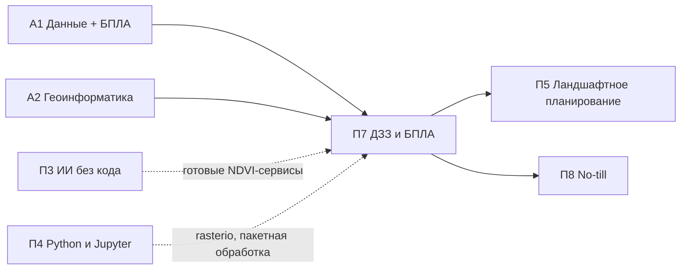

# П7. ДЗЗ и БПЛА для мониторинга земель

> **Тип:** Профессиональный, 24–40 ч · **Связь:** [А1](../a1/index.md), [А2](../a2/index.md) · **Компонент FOLUR:** 4 (развитие потенциала); данные мониторинга работают на компоненты 1–3
> **Аудитория:** технические специалисты хозяйств, фермеры, агрономы; уровень ИИ-слоя — **Low-code**.

Модуль ставит на поток главный измерительный инструмент современного земледелия — наблюдение поля сверху. Логика модуля повторяет логику реальной работы: **спутник дёшево находит, где проблема, — дрон дорого, но точно отвечает, почему**. Сначала вы научитесь читать поле из космоса — считать NDVI и производные индексы по бесплатным снимкам Sentinel-2 и Landsat; затем — строить многолетний ряд NDVI и отделять настоящие проблемные зоны от игры погоды и севооборота; наконец — планировать облёт проблемной зоны БПЛА, выбирать сенсор (RGB, мультиспектр, тепловизор) и обрабатывать снимки в открытом OpenDroneMap. Дрон для прохождения модуля **не обязателен**: все задания выполнимы на готовых открытых наборах снимков.

Академическая основа модуля — [А1 «Жизненный цикл данных» (+ БПЛА)](../a1/index.md) и [А2 «Геоинформатика»](../a2/index.md): П7 переиспользует их методику полётного планирования и картографическую грамотность на прикладном уровне. Если Python вам пока незнаком — параллельно или заранее полезен [П4](../p4/index.md); без кода обойтись тоже можно: готовые NDVI-сервисы разобраны в [П3](../p3/index.md).

## Цели модуля

После прохождения модуля слушатель сможет:

1. **[Bloom: понимать]** объяснять, почему живая растительность «светится» в ближнем инфракрасном диапазоне, что измеряют NDVI и производные индексы (SAVI, NDMI, NDWI) и чем снимки Sentinel-2 отличаются от Landsat по разрешению, повторяемости и глубине архива.
2. **[Bloom: применять]** находить и выбирать безоблачные снимки уровня L2A в Copernicus Browser, строить карту NDVI своего поля и выявлять на ней неоднородности.
3. **[Bloom: применять]** строить сезонный и многолетний ряд NDVI по полю (Colab + rasterio или средства браузера данных) и оформлять его в воспроизводимый продукт: таблица, график, карта устойчиво проблемных зон.
4. **[Bloom: анализировать]** разделять причины низкого NDVI — облачность и тени, фенофаза, погода года, севооборот и пар, действительная деградация участка — по поведению ряда во времени.
5. **[Bloom: применять/анализировать]** планировать досмотровый облёт проблемной зоны БПЛА (высота под целевой GSD, перекрытия, сенсор под задачу), обрабатывать снимки в OpenDroneMap/WebODM и совмещать ортофотоплан со спутниковым рядом для итогового вывода и решения.

## Уроки

| # | Урок | Трудозатраты ⏱ | Ключевой навык |
|---|---|---|---|
| 1 | [Читаем поле из космоса: NDVI и производные индексы по Sentinel-2 и Landsat](lectures/01-chitaem-pole-iz-kosmosa-ndvi.md) | ~17 мин чтения + ~30 мин практики | выбор снимков, расчёт и чтение карты NDVI |
| 2 | [Строим многолетний ряд NDVI и находим настоящие проблемные зоны](lectures/02-mnogoletnij-ryad-ndvi-problemnye-zony.md) | ~17 мин чтения + ~30 мин практики | временной ряд, маска облаков, анализ причин |
| 3 | [Досматриваем проблемную зону с воздуха: облёт БПЛА, сенсоры, OpenDroneMap](lectures/03-oblyot-bpla-i-opendronemap.md) | ~18 мин чтения + ~25 мин практики | планирование облёта, выбор сенсора, ортофотоплан |
| П | [Практикум: многолетний ряд NDVI поля + разбор готового облёта БПЛА](practicum/01-ryad-ndvi-i-razbor-oblyota.md) | ~90 мин | прикладной продукт модуля |
| ИИ | [ИИ-ассистент в работе: ряд NDVI по вашему полю с ИИ-напарником](ai-assistant.md) | ~45 мин | постановка задачи LLM → исполнение → верификация |
| А | [Итоговая аттестация](assessment/final.md) | ~45 мин | банк MCQ + сценарный кейс, порог 75 % |

Нагрузка соответствует нормативу платформы: ~2–2,5 часа контента в неделю; каждый микро-урок закрыт квизом сразу после материала.

## Прикладной продукт модуля

**Многолетний ряд NDVI + результаты облёта БПЛА по проблемной зоне.** В практикуме вы собираете по реальному полю Костанайской области: (а) ряд NDVI за несколько сезонов по снимкам Sentinel-2 — таблица, график динамики, карта устойчиво отстающих участков; (б) разбор готового набора БПЛА-съёмки — ортофотоплан открытого набора данных, сопоставленный со спутниковой картой, с выводом «что видно дрону и не видно спутнику». Рамка «Проект на ВАШЕЙ земле» переносит конвейер на поле слушателя: тот же ряд NDVI по вашему полю, верифицированный вашими полевыми наблюдениями.

## Данные модуля

- **Sentinel-2 L2A** — Copernicus Data Space Ecosystem / Copernicus Browser (browser.dataspace.copernicus.eu): бесплатно, каналы B04/B08 (10 м) для NDVI, слой SCL для маски облаков.
- **Landsat (архив с 1972 г.)** — USGS EarthExplorer / Google Earth Engine: многолетняя ретроспектива с разрешением 30 м.
- **Готовые наборы БПЛА-съёмки** — открытые ортофото OpenAerialMap (openaerialmap.org) и демонстрационные наборы проекта OpenDroneMap: «дрон не обязателен».
- **OpenStreetMap** — контуры полей и ориентиры для привязки.

Все данные открыты и бесплатны. Политика датасетов платформы: [Датасеты](../../datasets.md).

## ИИ-ассистент в работе · уровень Low-code

«Ряд NDVI с ИИ-напарником»: слушатель формулирует задачу по-русски, LLM-ассистент (встроенный помощник Colab или чат-ассистент — Claude и аналоги) пишет код расчёта ряда NDVI по выгруженным каналам Sentinel-2, слушатель исполняет и **верифицирует результат**: диапазон −1…+1, сезонная логика кривой, визуальная сверка с Copernicus Browser и — главное — сверка с собственными полевыми наблюдениями. Подробности — в [ИИ-задании](ai-assistant.md); рамка ИИ-слоя платформы — [здесь](../../ai-tools.md).

*Правило: ИИ ускоряет — человек верифицирует. Задание выполнимо и без ИИ.*

## Место в архитектуре платформы

*Рис. 1. Связи модуля П7. Alt: П7 опирается на академические модули А1 и А2, использует навыки П3 (готовые сервисы) и П4 (Python), а его продукты — ряд NDVI и материалы облёта — питают ландшафтное планирование П5 и агротехнологии П8.*

Пререквизиты: уверенная работа с компьютером; желательны [П2](../p2/index.md) (основы ГИС, QGIS) и [П4](../p4/index.md) (Python в Colab) — практикум использует оба навыка на базовом уровне и содержит запасные маршруты без кода.

## Оценивание

Тренировочные квизы (4–5 MCQ) — после каждой лекции. Итог: индивидуальный вариант из [банка модуля](assessment/final.md) (порог **75 %**) + сценарный кейс с экспертной проверкой + обязательные артефакты практикума (таблица и график ряда NDVI, карта проблемных зон, сопоставление с ортофото).

## Библиография и рамки

Проверенные международные рамки и первичные источники (DOI не указываются там, где не верифицированы):

1. **FAO.** The 10 Elements of Agroecology: Guiding the transition to sustainable food and agricultural systems. FAO, Rome — мониторинг состояния земель поддерживает элементы «efficiency» и «resilience».
2. **WOCAT** (World Overview of Conservation Approaches and Technologies) — глобальная база практик устойчивого землепользования; документирование эффекта практик требует объективного ряда наблюдений — ровно того, что производит модуль.
3. **ЦУР 15.3 / LDN** (Land Degradation Neutrality, UNCCD) — целевая рамка нейтральности деградации земель; продуктивность земель в ней оценивается по спутниковым вегетационным индексам.
4. **Каталог кейсов FOLUR Impact Program** (Food Systems, Land Use and Restoration, GEF/UNDP) — источник региональных примеров интегрированного управления ландшафтами.
5. Rouse, J. W., Haas, R. H., Schell, J. A., Deering, D. W. (1974). Monitoring vegetation systems in the Great Plains with ERTS. *Third ERTS-1 Symposium*, NASA — первичная публикация NDVI.
6. Huete, A. R. (1988). A soil-adjusted vegetation index (SAVI). *Remote Sensing of Environment*, 25(3) — первичная публикация SAVI.
7. Официальная документация **Copernicus Data Space Ecosystem** и **Sentinel-2 User Handbook** (ESA) — характеристики снимков, уровни обработки, слой SCL.
8. Официальная документация **USGS Landsat Missions** — характеристики и архив программы Landsat.
9. Официальная документация **OpenDroneMap / WebODM** (docs.opendronemap.org) — открытый фотограмметрический конвейер.
10. **OpenAerialMap** (openaerialmap.org) — открытый каталог аэрофотоснимков и ортофото.

Правовые условия полётов БПЛА в РК в модуле не пересказываются числами и пунктами: система ограничений и порядок проверки по официальным источникам разбираются в [А1, урок 3](../a1/lectures/03-bpla-ili-sputnik.md). Канонический каркас модуля: [шаблон](../../about/module-template.md).
