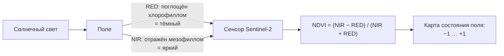

# Читаем поле из космоса: NDVI и производные индексы по Sentinel-2 и Landsat

> ⏱ **Трудозатраты:** ~17 мин чтения + ~30 мин практики
>
> Модуль **П7: ДЗЗ и БПЛА для мониторинга земель**, лекция 1 из 3.
> Профессиональный уровень. Проект UNDP-KAZ, FOLUR.

## Цели лекции и место в модуле

Мониторинг поля начинается не с дрона, а с бесплатного спутникового снимка: он покрывает всё хозяйство сразу, обновляется каждые несколько дней и хранит архив на годы назад. Эта лекция учит извлекать из снимка главное — карту состояния растительности. Вы поймёте, почему живой лист «светится» в невидимом ближнем инфракрасном свете, научитесь считать индекс NDVI и его родственников, выбирать пригодный снимок и читать карту неоднородности своего поля. Это фундамент всего модуля: [лекция 2](02-mnogoletnij-ryad-ndvi-problemnye-zony.md) превратит одиночную карту в многолетний ряд, а [лекция 3](03-oblyot-bpla-i-opendronemap.md) отправит дрон досмотреть то, что нашёл спутник.

После изучения лекции слушатель сможет:

1. **[Bloom: понимать]** объяснять физику вегетационных индексов — почему растительность отражает ближний инфракрасный (NIR) и поглощает красный (RED) свет — и что именно измеряет NDVI.
2. **[Bloom: понимать]** различать снимки Sentinel-2 и Landsat по разрешению, повторяемости и глубине архива и выбирать источник под задачу.
3. **[Bloom: применять]** находить безоблачный снимок L2A в Copernicus Browser и получать карту NDVI своего поля.
4. **[Bloom: анализировать]** читать карту NDVI: отличать неоднородность поля от артефактов съёмки и подбирать производный индекс (SAVI, NDMI, NDWI) под конкретный вопрос.

> **Границы лекции.** Внутри: физика индексов, характеристики Sentinel-2/Landsat, выбор снимка, расчёт и чтение одиночной карты NDVI. Снаружи: временной ряд и разбор причин низкого NDVI — в [лекции 2](02-mnogoletnij-ryad-ndvi-problemnye-zony.md); съёмка БПЛА — в [лекции 3](03-oblyot-bpla-i-opendronemap.md); техника расчёта NDVI кодом (rasterio, `astype`) — подробно в [П4, лекция 3](../../p4/lectures/03-rasterio-i-paketnaya-obrabotka.md); готовые no-code-сервисы NDVI-мониторинга — в [П3](../../p3/index.md); проекции и картография — в [А2](../../a2/index.md). Здесь мы **считаем и читаем** индекс, глубокий разбор динамики — дальше.

---

## 1. Почему поле видно из космоса: физика вегетационного индекса

### 1.1 Свет, который мы не видим, а спутник видит

Глаз человека воспринимает узкую полосу спектра — от синего до красного. Спутниковый сенсор видит шире: за красным идёт **ближний инфракрасный** диапазон (NIR, near infrared), невидимый нам, но ключевой для агронома. Здоровый зелёный лист устроен так, что его внутренняя ткань (мезофилл) сильно **отражает** NIR — почти как зеркало, — а пигмент хлорофилл жадно **поглощает красный** свет для фотосинтеза. Получается контраст: чем активнее и гуще живая листва, тем ярче она в NIR и темнее в красном.

Открытая почва, сухая стерня, вода, дорога ведут себя иначе: у них разница между NIR и красным мала или обратная. Именно на этом контрасте построены **вегетационные индексы** — простые формулы, превращающие два канала снимка в одно число, которое говорит: «здесь много живой биомассы» или «здесь голая земля».

### 1.2 NDVI: нормализованная разность

Самый известный индекс — **NDVI** (Normalized Difference Vegetation Index, нормализованный разностный вегетационный индекс), предложенный ещё в 1974 году по снимкам первого спутника ERTS (позже — Landsat). Формула проста:

$$ \text{NDVI} = \frac{\text{NIR} - \text{RED}}{\text{NIR} + \text{RED}} $$

Слово «нормализованный» здесь несёт смысл: деление на сумму приводит результат к диапазону от −1 до +1 независимо от абсолютной яркости съёмки, поэтому снимки разных дат становятся сравнимыми. Ориентиры чтения:

- **NDVI около 0,7–0,9** — плотная активная растительность (сомкнутый посев в фазе кущения-колошения, луг);
- **0,3–0,6** — разреженная или угнетённая растительность, всходы, редкий травостой;
- **0,1–0,2** — почти голая почва, стерня, пар;
- **около нуля и ниже** — вода (часто отрицательна), снег, облака, искусственные поверхности.



*Рис. 1. Физика NDVI: живой лист поглощает красный и отражает ближний инфракрасный, сенсор фиксирует оба канала, формула сводит их к одному числу. Alt: схема — солнечный свет падает на поле, красный канал поглощается и приходит на сенсор тёмным, ближний инфракрасный отражается и приходит ярким, формула NDVI превращает два канала в карту состояния со шкалой от минус единицы до плюс единицы.*

Важно с самого начала: NDVI — не «урожайность» и не «здоровье» напрямую, а **прокси плотности и активности зелёной биомассы** на момент съёмки. Связь с урожайностью есть, но она непрямая и зависит от культуры, фазы, сорта. Поэтому NDVI читают не абсолютным числом, а **сравнением**: этот участок против соседнего, эта дата против прошлого года, эта зона поля против среднего по полю.

### 1.3 Когда одного NDVI мало: производные индексы

NDVI универсален, но у него есть слабые места, и под конкретный вопрос берут производный индекс:

- **SAVI** (Soil-Adjusted Vegetation Index) — на всходах и разреженных посевах голая почва между растениями искажает NDVI; SAVI добавляет в формулу поправочный коэффициент на почву и точнее работает при слабом проективном покрытии. Полезен ранней весной.
- **NDMI** (Normalized Difference Moisture Index) — использует ближний и коротковолновый инфракрасный (SWIR) каналы и чувствителен к **влагосодержанию** листвы; помогает заметить водный стресс раньше, чем он проявится в NDVI.
- **NDWI** (Normalized Difference Water Index) — выделяет **открытую воду** и переувлажнение (разлив, подтопление низин), используя зелёный и NIR каналы. Смежный навык мониторинга водной поверхности — в [А4](../../a4/index.md).

Правило специалиста: **сначала вопрос, потом индекс**. «Ровно ли взошло поле?» — SAVI. «Не сохнет ли участок?» — NDMI. «Где стоит вода после снеготаяния?» — NDWI. «Общая картина неоднородности за сезон?» — NDVI.

> **Подробнее** о смысле и интерпретации NDVI без формул и кода, через готовые сервисы, — в [П3](../../p3/index.md); о технике вычисления индекса в Python (rasterio, приведение каналов к `float32`, защита от деления на ноль) — в [П4, лекция 3, §2.2](../../p4/lectures/03-rasterio-i-paketnaya-obrabotka.md).

---

## 2. Два рабочих спутника: Sentinel-2 и Landsat

### 2.1 Что выбрать под задачу

Для агромониторинга в открытом доступе есть два основных бесплатных источника, и у каждого своя ниша.

**Sentinel-2** (Европейское космическое агентство, программа Copernicus) — два спутника-близнеца, снимающие одну точку Земли раз в 5 дней, разрешение ключевых каналов **10 м**, богатый набор диапазонов (включая «красный край» и SWIR). Это рабочая лошадь современного полевого мониторинга: детальнее и чаще. Минус — архив с 2015 года, глубокую ретроспективу по нему не построить.

**Landsat** (NASA / USGS) — программа с историей: непрерывный архив с **1972 года**, разрешение 30 м, повторяемость 16 дней. Проигрывает Sentinel-2 в детальности и частоте, но незаменим там, где нужна **длинная история**: как выглядело поле или водоём 20–30 лет назад, как менялась граница пашни. Для многолетних трендов ([лекция 2](02-mnogoletnij-ryad-ndvi-problemnye-zony.md)) два источника часто комбинируют.

| Параметр | Sentinel-2 | Landsat 8/9 |
|---|---|---|
| Разрешение (RED/NIR) | 10 м | 30 м |
| Повторяемость | ~5 дней | 16 дней |
| Архив | с 2015 г. | с 1972 г. (непрерывно) |
| Стоимость | бесплатно | бесплатно |
| Ниша | детальный текущий мониторинг | длинная ретроспектива |

*Практический выбор: текущий сезон и внутриполевая неоднородность — Sentinel-2; «что было раньше» и многолетний тренд — Landsat или их связка.*

### 2.2 Уровень обработки и облачность — две детали, экономящие часы

Две настройки при выборе снимка решают судьбу анализа.

Первая — **уровень обработки**. Берите продукты **L2A** (для Landsat — Surface Reflectance): в них атмосферная коррекция уже выполнена поставщиком, и снимки разных дат корректно сравнивать между собой. Уровень L1C (top-of-atmosphere) для сравнения дат хуже. Это то же правило, что и в [П4, лекция 3](../../p4/lectures/03-rasterio-i-paketnaya-obrabotka.md): для временного ряда одинаковая обработка обязательна.

Вторая — **облачность**. Облако, дымка и особенно **тень от облака** — главный источник ложных выводов. Тень на поле выглядит на NDVI-карте как тёмная «проблемная зона», которой в реальности нет; полупрозрачное перистое облако занижает индекс по всей сцене. Правило: сначала посмотреть сцену глазами в браузере, отбросить облачные даты, и только потом считать индекс. Автоматическую маску облаков (слой **SCL** у Sentinel-2, помечающий облака, тени, воду) освоим в [лекции 2](02-mnogoletnij-ryad-ndvi-problemnye-zony.md) — для ряда без неё не обойтись.

### 2.3 Разрешение и «смешанные пиксели»

Пиксель Sentinel-2 — 10 м, то есть один отсчёт усредняет квадрат 10×10 м на земле. Для поля в сотни гектаров это десятки тысяч пикселей — достаточно и для среднего по полю, и для карты неоднородности. Но узкие объекты — лесополоса шириной в один-два пикселя, кромка поля, полевая дорога — попадают в **смешанные пиксели**, где в одном отсчёте намешаны трава, почва и дорога. Их значения интерпретируют осторожно, а если нужна детальность в метры и сантиметры — это уже вопрос к дрону ([лекция 3](03-oblyot-bpla-i-opendronemap.md)). Отсюда стратегия модуля: спутник даёт обзор поля дёшево и регулярно, дрон — детальный досмотр точечно.

---

## 3. От снимка к карте: рабочий процесс

### 3.1 Путь через браузер (без кода)

Самый доступный маршрут — **Copernicus Browser** (browser.dataspace.copernicus.eu), бесплатный веб-сервис Copernicus Data Space Ecosystem:

1. найти свой участок на карте, задать контур или ориентир (границы полей можно взять из OpenStreetMap);
2. выбрать период и отфильтровать сцены по низкой облачности;
3. выбрать безоблачную сцену Sentinel-2 L2A;
4. включить готовый слой визуализации **NDVI** — браузер посчитает и раскрасит индекс сам;
5. при необходимости выгрузить каналы **B04** (красный) и **B08** (NIR) как GeoTIFF для расчёта в Colab.

Этого маршрута хватает, чтобы получить карту NDVI поля за минуты и без единой строки кода. Готовые агросервисы (OneSoil и аналоги) идут ещё дальше — автоматизируют весь процесс; их критическое сравнение — в [П3](../../p3/index.md).

### 3.2 Путь через код (Colab)

Когда нужен ряд по многим датам или собственная логика — выгруженные каналы считают в Python. Ядро расчёта из [П4, лекция 3](../../p4/lectures/03-rasterio-i-paketnaya-obrabotka.md):

```python
import rasterio, numpy as np

red = rasterio.open("B04.tif").read(1).astype("float32")   # целые -> float обязательно!
nir = rasterio.open("B08.tif").read(1).astype("float32")

ndvi = (nir - red) / (nir + red + 1e-9)   # +1e-9 спасает от деления на 0
print(f"Средний NDVI участка: {np.nanmean(ndvi):.2f}")
```

Три обязательные детали, каждая — из [П4](../../p4/lectures/03-rasterio-i-paketnaya-obrabotka.md): приведение каналов к `float32` (иначе деление целых даст мусор), защита `+1e-9` от деления на ноль, и — контроль результата.

### 3.3 Проверка на здравый смысл

NDVI по построению лежит в диапазоне **−1…+1**. Значение вне него — не «супер-урожай», а признак ошибки: перепутаны каналы, пропущен `astype`, взяты не те файлы. Первое действие при NDVI = 1,8 — искать дефект в конвейере, а не радоваться посевам. Эта привычка «посчитал → сверь диапазон» станет обязательным шагом верификации в [ИИ-задании модуля](../ai-assistant.md).

Второй уровень проверки — **сверка с реальностью**: откройте карту NDVI рядом с обычным цветным снимком того же поля в браузере. Тёмная зона на NDVI совпала с явно затенённым облаком участком снимка? Значит, это артефакт, а не агрономия. Совпала с известным вам солончаком или подтопленной низиной? Значит, индекс поймал реальную проблему.

---

## Региональный кейс

**Ситуация:** Агроном зернового хозяйства в Костанайском районе Костанайской области жалуется: одно из полей озимой пшеницы «выглядит с дороги неровно», но объехать 300 гектаров и понять масштаб некогда. Он хочет за один вечер, без выезда в поле и без покупки софта, получить карту, которая покажет, где именно на поле проблема и насколько она велика.

**Данные:** Sentinel-2 L2A на выбранную безоблачную дату вегетационного сезона, каналы B04 и B08 (Copernicus Browser, бесплатно); контур поля — из OpenStreetMap или очерченный вручную в браузере.

**Задача:**
1. Найти в Copernicus Browser безоблачную сцену на нужную дату и убедиться, что над полем нет облаков и их теней.
2. Построить карту NDVI поля (готовым слоем браузера или расчётом по выгруженным B04/B08) и выделить зоны с заметно пониженным индексом.
3. Отделить настоящую неоднородность посева от артефактов: сравнить NDVI-карту с обычным цветным снимком той же даты.

**Разбор:** Ожидаемый ход мысли — не «низкий NDVI = плохое поле», а последовательность проверок. Сначала облачность: одна тёмная полоса через несколько соседних полей сразу — почти наверняка тень облака, а не общая беда поля. Затем — форма зоны: вытянутое пятно вдоль понижения рельефа намекает на переувлажнение (проверяется NDWI, §1.3), ровные геометричные границы — на разные предшественники или сроки сева, диффузное пятно в одном углу — на локальную деградацию или засолённость. Конкретные значения NDVI зависят от культуры, фазы и даты — их получает слушатель; фиксируется здесь метод: карта космоса **локализует и измеряет** проблему дёшево, а причину и решение даёт уже наземный (или дроновый) досмотр. Этот кейс продолжается в [практикуме](../practicum/01-ryad-ndvi-i-razbor-oblyota.md), где по этому полю строится многолетний ряд.

---

## Закрепление и применение

!!! example "Попробуйте в Colab"
    Ноутбук лекции (`<URL будет назначен при создании репозитория ноутбуков>`) содержит расчёт NDVI по паре каналов B04/B08 из §3.2. Минимальное задание на 20 минут: откройте Copernicus Browser, найдите безоблачную сцену Sentinel-2 L2A на любое поле Костанайской области, включите слой NDVI, затем выгрузите B04 и B08 и воспроизведите расчёт в Colab — сверьте среднее по полю с картинкой браузера.

!!! warning "Границы применимости"
    NDVI — прокси плотности зелёной биомассы, а не прямая мера урожайности или «здоровья»: связь с урожаем непрямая и зависит от культуры и фазы. Индекс корректно сравнивать между датами только на одинаковом уровне обработки (L2A / Surface Reflectance) и без облаков и теней. Пиксель 10 м не разрешает объекты уже 10–20 м (лесополосы, кромки) — там нужен дрон ([лекция 3](03-oblyot-bpla-i-opendronemap.md)). Одиночная карта фиксирует момент; вывод о деградации требует ряда ([лекция 2](02-mnogoletnij-ryad-ndvi-problemnye-zony.md)).

!!! tip "Что это даёт вашему хозяйству"
    Один бесплатный снимок раз в несколько дней заменяет объезд всех полей ради общей картины: вы заранее видите, какое поле и какой его угол требуют выезда, и не тратите топливо и время на осмотр благополучных участков. Это дифференцированный, а не сплошной контроль — и он ничего не стоит, кроме вечера за браузером.

!!! question "Кейс для размышления"
    Сосед показывает вам карту NDVI своего поля с ярко-красной «проблемной зоной» и уже собрался вносить туда удобрения по «проблеме». Опираясь на §1.2 и §3.3, назовите три вопроса, которые вы зададите о снимке, прежде чем согласиться, что зона реальна. Какой из них вы проверите первым и почему?

### Проверь себя

```quiz
[
  {
    "q": "Почему здоровая зелёная растительность даёт высокий NDVI?",
    "options": ["Мезофилл листа сильно отражает ближний инфракрасный свет, а хлорофилл поглощает красный — контраст этих каналов и даёт высокое значение", "Листья нагреваются на солнце и излучают тепло, которое ловит сенсор", "Зелёный цвет листвы напрямую пересчитывается в NDVI", "Растительность отражает больше красного света, чем почва"],
    "answer": 0,
    "explain": "§1.1–1.2: NDVI построен на контрасте — высокое отражение в NIR и сильное поглощение в красном у активной листвы; формула (NIR−RED)/(NIR+RED) превращает этот контраст в число."
  },
  {
    "q": "Средний NDVI по полю получился 1,8. Первое действие специалиста?",
    "options": ["Искать ошибку в конвейере: NDVI по построению лежит в −1…+1, значение вне диапазона — признак перепутанных каналов или пропущенного astype", "Зафиксировать рекордную густоту посева", "Уменьшить контур поля и пересчитать", "Сменить дату снимка на более раннюю"],
    "answer": 0,
    "explain": "§3.3: NDVI математически не может превышать 1; значение вне −1…+1 означает дефект расчёта (каналы, тип данных), а не состояние поля."
  },
  {
    "q": "Нужна ретроспектива состояния поля за последние 25 лет. Какой источник выбрать и почему?",
    "options": ["Landsat — непрерывный архив с 1972 года, несмотря на разрешение 30 м и повторяемость 16 дней", "Sentinel-2 — у него разрешение 10 м", "Только снимки БПЛА — они детальнее", "Любой платный сервис высокого разрешения"],
    "answer": 0,
    "explain": "§2.1: Sentinel-2 доступен лишь с 2015 года; для 25-летней истории нужен длинный архив Landsat, детальность здесь вторична."
  },
  {
    "q": "На NDVI-карте тёмная полоса пересекает сразу несколько соседних полей. Наиболее вероятная причина?",
    "options": ["Тень от облака или дымка на снимке — артефакт съёмки, а не общая проблема всех полей", "Одновременная деградация всех полей", "Ошибка спутника Sentinel-2", "Все поля засеяны одной культурой в один день"],
    "answer": 0,
    "explain": "§2.2 и §3.3: облака и их тени занижают NDVI и не считаются с границами полей; протяжённая полоса через разные поля — типичный облачный артефакт, проверяется сверкой с цветным снимком."
  },
  {
    "q": "Вопрос агронома: «ровно ли взошло поле ранней весной при разреженных всходах?». Какой индекс уместнее NDVI?",
    "options": ["SAVI — он вводит поправку на голую почву и точнее работает при слабом проективном покрытии", "NDWI — он выделяет открытую воду", "Только тепловой канал", "NDVI без изменений — он всегда лучший"],
    "answer": 0,
    "explain": "§1.3: на всходах открытая почва между растениями искажает NDVI; SAVI с почвенной поправкой корректнее для разреженного покрытия."
  }
]
```

### Контрольные вопросы

1. Что физически измеряет NDVI и почему его читают сравнением, а не абсолютным числом? *(Bloom: знать/понимать)*
2. Объясните, когда для той же задачи вы предпочтёте Landsat, а когда Sentinel-2. *(Bloom: понимать/анализировать)*
3. Опишите порядок получения карты NDVI своего поля в Copernicus Browser и две проверки, которыми вы отсеете артефакты. *(Bloom: применять)*

## Что дальше?

Одиночная карта отвечает на вопрос «как поле выглядит сейчас», но не отличает разовую засуху от год за годом отстающего участка. В [лекции 2 «Строим многолетний ряд NDVI»](02-mnogoletnij-ryad-ndvi-problemnye-zony.md) вы соберёте снимки за несколько сезонов, научитесь маскировать облака автоматически (слой SCL) и отделять устойчивые проблемные зоны от погоды и севооборота. Техника расчёта индексов кодом — в [П4, лекция 3](../../p4/lectures/03-rasterio-i-paketnaya-obrabotka.md); готовые сервисы без кода — в [П3](../../p3/index.md).
