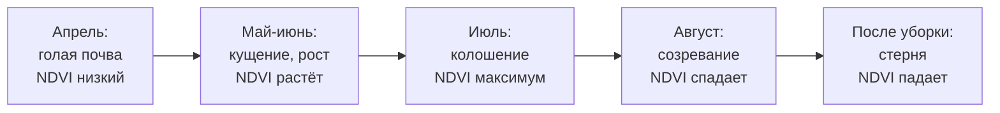
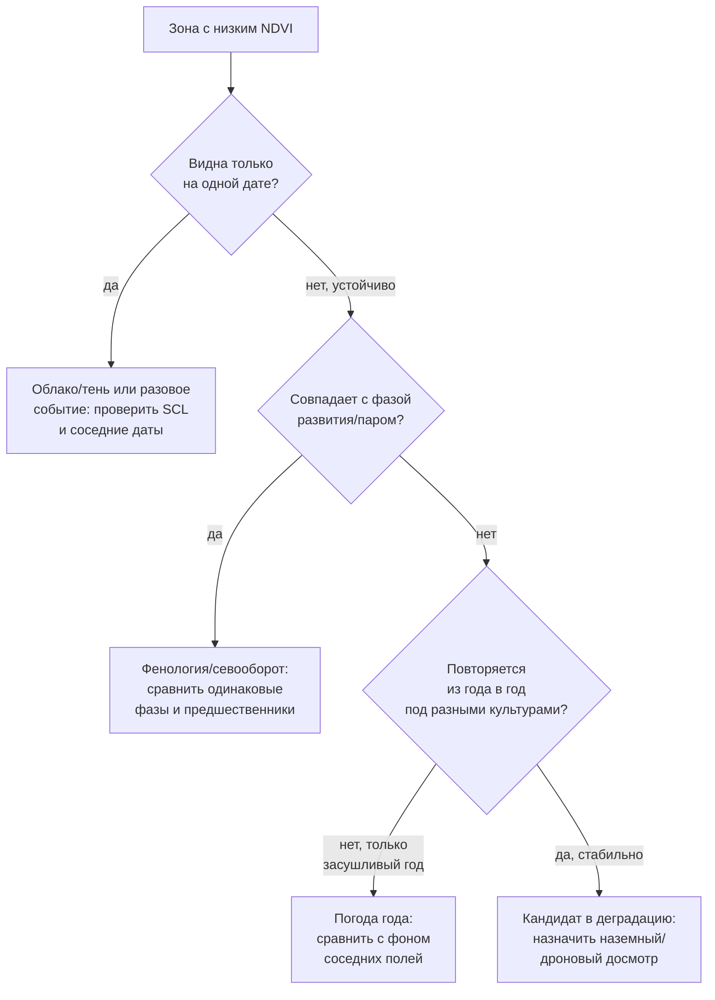

# Строим многолетний ряд NDVI и находим настоящие проблемные зоны

> ⏱ **Трудозатраты:** ~17 мин чтения + ~30 мин практики
>
> Модуль **П7: ДЗЗ и БПЛА для мониторинга земель**, лекция 2 из 3.
> Профессиональный уровень. Проект UNDP-KAZ, FOLUR.

## Цели лекции и место в модуле

Одиночная карта NDVI из [лекции 1](01-chitaem-pole-iz-kosmosa-ndvi.md) фиксирует момент, но не отвечает на главный вопрос агронома: этот угол поля отстаёт **всегда** или ему просто не повезло с погодой в этом году? Ответ даёт только время — ряд снимков за сезон и за несколько лет. Эта лекция учит собирать такой ряд, очищать его от облаков автоматически и — самое трудное — **разделять причины** низкого NDVI: тень облака, фаза развития, засушливый год, севооборот и пар, действительная деградация участка. Именно этот навык превращает красивую картинку в основание для решения.

После изучения лекции слушатель сможет:

1. **[Bloom: понимать]** объяснять устройство сезонной кривой NDVI (фенологический профиль) и почему сравнивать даты нужно на одинаковой фазе развития.
2. **[Bloom: применять]** строить временной ряд NDVI по полю из серии снимков и автоматически исключать облачные пиксели по слою SCL.
3. **[Bloom: анализировать]** отличать устойчиво проблемную зону от разового провала, сопоставляя ряды разных участков одного поля между собой и с фоном.
4. **[Bloom: анализировать]** формулировать и проверять гипотезы о причине аномалии (погода / фенофаза / севооборот / деградация) до того, как назначать полевой досмотр.

> **Границы лекции.** Внутри: сезонная кривая NDVI, маска облаков SCL, многолетний ряд, разбор причин, карта устойчивых проблемных зон. Снаружи: физика индексов и выбор снимка — в [лекции 1](01-chitaem-pole-iz-kosmosa-ndvi.md); наземный/дроновый досмотр найденной зоны — в [лекции 3](03-oblyot-bpla-i-opendronemap.md); техника пакетной обработки серии файлов кодом — в [П4, лекция 3, §3](../../p4/lectures/03-rasterio-i-paketnaya-obrabotka.md); интерпретация деградации в терминах ЦУР 15.3/LDN — обзорно в [А6](../../a6/index.md). Здесь мы **строим ряд и читаем его**, не поднимая дрон.

---

## 1. Сезонная кривая: NDVI живёт во времени

### 1.1 Фенологический профиль

Если считать NDVI поля на каждую доступную дату сезона и соединить точки, получится характерная кривая — **фенологический профиль**. Для ярового зерновых Северного Казахстана она узнаваема: низкий NDVI на голой почве до всходов весной, быстрый подъём в фазах кущения и выхода в трубку, максимум к колошению в начале-середине лета, спад при созревании и резкое падение после уборки. Форма кривой — «подпись» культуры и агротехники: озимая пшеница даёт ранний весенний подъём (перезимовавшие растения), пар — почти плоскую низкую линию всё лето, многолетние травы — свой профиль с укосами.



*Рис. 1. Фенологический профиль NDVI ярового зернового поля за сезон. Alt: линейная схема пяти фаз — голая почва весной с низким NDVI, рост в мае-июне, максимум в июле в фазу колошения, спад при созревании в августе, падение после уборки. Форма кривой — характерная подпись культуры.*

Практический вывод: **одну дату нельзя сравнивать с другой в лоб**. NDVI 0,4 в мае (растущий посев) и NDVI 0,4 в июле (посев, недобравший до максимума) — совершенно разные сигналы. Сравнивают либо одинаковые фазы разных лет, либо участки одного поля на **одну и ту же дату**.

У кривой полезны три читаемые характеристики. **Высота максимума** — насколько плотный полог набрал посев в пик сезона; систематически низкий максимум год за годом — тревожный признак. **Момент максимума** — сдвиг пика на более ранний или поздний срок сигналит о раннем созревании из-за стресса или, наоборот, о задержке развития. **Крутизна подъёма** весной отражает дружность и скорость всходов. Специалисту не нужно измерять эти величины формально: достаточно наложить кривые нескольких сезонов друг на друга — благополучные годы дадут похожие «колокола», а проблемный сразу выделится либо приплюснутым максимумом, либо смещённым пиком, либо вялым подъёмом. Именно это наложение, а не единичное число, и есть рабочий инструмент чтения ряда.

### 1.2 Зачем нужен ряд, а не карта

Из фенологического профиля следует ключевая идея модуля. Разовая карта смешивает три вещи в одном числе: фазу развития, погоду конкретной даты и постоянные свойства участка. **Ряд разделяет их**. Устойчиво проблемная зона отличается от здорового поля не разово, а систематически: её кривая ниже год за годом, в разные погодные условия, под разными культурами. Это почерк деградации (засолённость, солонцы, эрозия, уплотнение), а не невезения. Разовый провал — наоборот: одна аномальная дата на фоне нормальных лет — это, скорее всего, град, локальный вымочек или облачный артефакт, а не свойство земли.

---

## 2. Облака: главный враг ряда и как его победить

### 2.1 Почему без маски ряд врёт

В [лекции 1](01-chitaem-pole-iz-kosmosa-ndvi.md) (§2.2) мы отбрасывали облачные даты глазами. Для одной карты это работает, для ряда из десятков дат — нет: почти всегда часть пикселей поля под лёгким облаком или тенью, а вручную это не отследить. Необработанный облачный пиксель роняет NDVI до значений голой почвы или ниже, и в ряду появляется ложный «провал», который легко принять за проблему поля. Поэтому **автоматическая маска облаков — обязательное условие честного ряда**, а не опция.

### 2.2 Слой SCL у Sentinel-2

Sentinel-2 L2A поставляется вместе со слоем **SCL** (Scene Classification Layer) — картой классов, где каждый пиксель уже помечен: растительность, голая почва, вода, **облако**, **тень облака**, снег и т. д. Маска строится прямо по нему: для расчёта NDVI берут только пиксели «чистых» классов, а помеченные как облако/тень исключают (заменяют на NaN). Логика на псевдокоде:

```python
# SCL: коды облаков и теней (по документации Sentinel-2 L2A)
CLOUD_CODES = {3, 8, 9, 10, 11}   # тень облака, облака средней/высокой вероятности, перистые, снег

scl  = rasterio.open("SCL.tif").read(1)
ndvi = (nir - red) / (nir + red + 1e-9)

mask = np.isin(scl, list(CLOUD_CODES))
ndvi_clean = np.where(mask, np.nan, ndvi)     # облачные пиксели -> NaN
sred_ndvi = np.nanmean(ndvi_clean)            # среднее по чистым пикселям
```

Конкретные коды классов сверяйте с актуальной документацией Sentinel-2 — они заданы поставщиком, а не выдумываются. `np.nanmean` считает среднее, игнорируя NaN, — так облачные пиксели просто не участвуют. Техника пакетного применения этой функции ко всей папке снимков — [П4, лекция 3, §3.2](../../p4/lectures/03-rasterio-i-paketnaya-obrabotka.md): функция-обработчик + цикл по файлам + сводная таблица «дата → средний NDVI».

### 2.3 Правило достаточного покрытия

Если после маскирования на поле осталась лишь малая доля чистых пикселей (сцена была почти вся облачная), среднее по ним ненадёжно — эту дату из ряда лучше исключить целиком. Разумный порог качества — оставлять дату, только если чистыми осталась заметная часть пикселей поля; иначе точка ряда строится на случайных просветах между облаками и вводит в заблуждение. Всегда полезно рядом с рядом NDVI вести колонку «доля чистых пикселей» — она объясняет подозрительные точки быстрее любых догадок.

---

## 3. Читаем ряд: четыре причины низкого NDVI

Найдя в ряду или на карте зону с пониженным NDVI, специалист не бежит вносить удобрения — он проходит по списку причин, от самой частой и дешёвой к проверке до самой серьёзной.

### 3.1 Диагностическая решётка



*Рис. 2. Диагностическая решётка: последовательная проверка причин низкого NDVI от самой дешёвой к самой серьёзной. Alt: блок-схема — сначала проверяется, разовая ли аномалия (облако), затем связь с фенофазой и севооборотом, затем влияние засушливого года, и лишь устойчивое повторение из года в год под разными культурами выводит на гипотезу деградации и полевой досмотр.*

### 3.2 Как отделить погоду года от свойства участка

Ключевой приём — **сравнение с фоном, а не с абсолютом**. Засушливый год роняет NDVI по всему полю и по всей округе одинаково; деградировавший участок отстаёт **сильнее фона независимо от года**. Поэтому смотрят не на само значение NDVI зоны, а на её **разницу со средним по полю** (или с соседним благополучным полем той же культуры): если зона стабильно на условные «столько-то ниже фона» и в сухой, и во влажный год, и под пшеницей, и под ячменём — это свойство земли. Если разница со фоном пропадает во влажные годы — участок просто более чувствителен к засухе, что тоже полезно знать, но лечится иначе.

### 3.3 Севооборот — не проблема, а объяснение

Частая ошибка новичка — принять пар или иную культуру за «деградацию». Плоский низкий NDVI всё лето на части поля может означать чистый пар (голая почва по агротехнике), а не беду. Поэтому ряд читают **вместе с историей полей**: что и когда сеяли. Если «проблемная» зона аккуратно совпадает с границей другого севооборотного поля или пара — причина организационная, а не почвенная. Отсюда ценность связки мониторинга с журналом полей ([П1](../../p1/index.md)) и картой землепользования ([П2](../../p2/index.md)/[А2](../../a2/index.md)).

### 3.4 Связь с рамкой деградации земель

Устойчивое снижение продуктивности растительности — один из индикаторов деградации земель в международной рамке **ЦУР 15.3 / LDN** (Land Degradation Neutrality, UNCCD): динамика продуктивности там оценивается именно по спутниковым вегетационным индексам за длительный период. Ваш многолетний ряд NDVI — прикладная, полевая версия того же подхода: он даёт хозяйству доказательную карту устойчиво отстающих участков задолго до того, как деградация станет необратимой. Эта же карта — материал для заявки на поддержку восстановления земель ([П14](../../p14/index.md)) и вход в ландшафтное планирование ([П5](../../p5/index.md)). Смысл индикаторов LDN и восстановление деградированных участков разбираются в [А6](../../a6/index.md); здесь важно понимать, что ряд NDVI — не самоцель, а измерительный инструмент, встроенный в общую логику устойчивого землепользования FOLUR.

### 3.5 Когда поднимать дрон

Ряд сузил задачу: устойчивая, из года в год отстающая от фона под разными культурами зона — сильный кандидат в реальную деградацию. Но спутник 10 м не скажет **что именно** там: солончак, промоина, вымочка, очаг сорняка, вредитель. Здесь и наступает черёд [лекции 3](03-oblyot-bpla-i-opendronemap.md): досмотровый облёт БПЛА по локализованной спутником зоне даёт детальность в сантиметры и отвечает на «почему». Стратегия всего модуля: **спутник и ряд находят где и подтверждают устойчивость — дрон объясняет что**.

> **Подробнее** о технике сборки ряда кодом (пакетный цикл по файлам, сводный DataFrame) — в [П4, лекция 3](../../p4/lectures/03-rasterio-i-paketnaya-obrabotka.md); о делегировании этого расчёта ИИ-напарнику с верификацией — в [ИИ-задании модуля](../ai-assistant.md).

---

## Региональный кейс

**Ситуация:** То же поле озимой пшеницы в Костанайском районе из [лекции 1](01-chitaem-pole-iz-kosmosa-ndvi.md): в юго-западном углу карта NDVI показала пониженную зону. Агроном хочет понять, стоит ли вкладываться в её мелиорацию, или это разовая история конкретного года. Решение о затратах требует не одной карты, а ряда: как эта зона вела себя последние несколько сезонов под разными культурами.

**Данные:** Sentinel-2 L2A, серия безоблачных сцен за 4–5 вегетационных сезонов (Copernicus Data Space / Browser), каналы B04/B08 и слой SCL для маски облаков; при желании — Landsat для более глубокой ретроспективы (§лекция 1, §2.1).

**Задача:**
1. Собрать ряд среднего NDVI по всему полю и отдельно по подозрительной зоне за несколько сезонов, маскируя облака по SCL.
2. Построить для каждого сезона разницу «зона минус среднее по полю» и посмотреть, стабильна ли она между годами и культурами.
3. Отнести аномалию к одной из четырёх причин (§3.1) и решить, нужен ли дроновый досмотр.

**Разбор:** Ожидаемый ход — не абсолютные значения, а **поведение разницы с фоном**. Если зона отстаёт от среднего по полю примерно одинаково и в сухой, и во влажный сезон, и под пшеницей, и под предшествующей культурой — это устойчивый дефект земли, кандидат на мелиорацию и на дроновый досмотр ([лекция 3](03-oblyot-bpla-i-opendronemap.md)). Если же разница появляется только в засушливый сезон и исчезает во влажный — участок просто засухочувствителен, и вложение в мелиорацию преждевременно; вернее пересмотреть агротехнику или культуру. Конкретные числа NDVI и величину разницы вычисляет слушатель на реальных снимках; кейс задаёт не ответ, а метод принятия решения по ряду. Полный расчёт этого ряда — в [практикуме](../practicum/01-ryad-ndvi-i-razbor-oblyota.md).

---

## Закрепление и применение

!!! example "Попробуйте в Colab"
    Ноутбук лекции (`<URL будет назначен при создании репозитория ноутбуков>`) строит ряд «дата → средний NDVI» по папке сцен с маской SCL (§2.2) поверх пакетного скелета [П4, лекция 3](../../p4/lectures/03-rasterio-i-paketnaya-obrabotka.md). Минимальное задание на 25 минут: выгрузите из Copernicus Browser 4–5 безоблачных дат одного сезона по полю Костанайской области, постройте сезонную кривую NDVI (§1.1) и отметьте, на какую фазу приходится максимум.

!!! warning "Границы применимости"
    Ряд честен только с маской облаков и при достаточном покрытии чистыми пикселями (§2.3) — точка на паре просветов между облаками обманывает. Сравнивать даты можно лишь на одинаковом уровне обработки и, для абсолютных значений, на одинаковой фенофазе. NDVI-ряд **локализует и подтверждает устойчивость** проблемы, но не называет её причину — это делает наземный или дроновый досмотр ([лекция 3](03-oblyot-bpla-i-opendronemap.md)). Отнесение зоны к «деградации» без полевой проверки — гипотеза, а не диагноз.

!!! tip "Что это даёт вашему хозяйству"
    Многолетний ряд превращает субъективное «это поле всегда подводит» в объективную карту устойчиво проблемных зон с историей. С ней вы точечно направляете агрохимобследование и мелиорацию именно туда, где проблема повторяется годами, а не разово, — и не тратите средства на участки, которые «просели» лишь в засушливый сезон. Та же карта — доказательная база для заявки на поддержку восстановления земель.

!!! question "Кейс для размышления"
    Ряд показал, что «проблемная» зона отстаёт от поля только в один из пяти сезонов, а в остальные идёт вровень. Управляющий требует внести туда мелиорант «раз спутник показал проблему». Опираясь на §3.1–3.2, сформулируйте, что вы ответите и какой ещё срез данных запросите, прежде чем тратить деньги.

### Проверь себя

```quiz
[
  {
    "q": "Почему NDVI 0,4 в мае и NDVI 0,4 в июле нельзя считать одинаковым сигналом состояния посева?",
    "options": ["Это разные фенофазы: в мае посев растёт к максимуму, в июле уже должен быть у максимума — одинаковое значение означает разное благополучие", "В мае и июле разное разрешение снимка", "Летом NDVI всегда завышен на 0,2", "Майский снимок делает Landsat, а июльский Sentinel-2"],
    "answer": 0,
    "explain": "§1.1: фенологический профиль растёт к колошению; сравнивать значения корректно лишь на одинаковой фазе — иначе одно число описывает противоположные ситуации."
  },
  {
    "q": "Зачем при построении многолетнего ряда обязательна автоматическая маска облаков (слой SCL), хотя для одной карты хватало осмотра глазами?",
    "options": ["В ряду из десятков дат часть пикселей всегда под облаком или тенью, и необработанный облачный пиксель создаёт ложный провал NDVI", "SCL ускоряет загрузку снимков", "Без SCL нельзя посчитать среднее", "Маска повышает разрешение до 5 м"],
    "answer": 0,
    "explain": "§2.1–2.2: вручную отследить облачность на десятках дат невозможно; облачные пиксели роняют NDVI и имитируют проблему поля, поэтому их исключают по SCL."
  },
  {
    "q": "Как отличить устойчиво деградировавший участок от поля, просто пострадавшего в засушливый год?",
    "options": ["Деградировавший участок стабильно отстаёт от среднего по полю (фона) независимо от года и культуры; засуха роняет NDVI всего поля и округи одинаково", "Деградировавший участок всегда имеет отрицательный NDVI", "Засуха видна только на Landsat", "Различить их по спутнику невозможно"],
    "answer": 0,
    "explain": "§3.2: смотрят не абсолют, а разницу с фоном; стабильное отставание от фона в разные годы и под разными культурами — почерк деградации, а не погоды."
  },
  {
    "q": "Часть поля даёт плоский низкий NDVI всё лето. Прежде чем звать это деградацией, что нужно проверить?",
    "options": ["Историю полей: не пар ли это или другая культура севооборота — плоская низкая линия характерна для чистого пара, а не только для деградации", "Только разрешение снимка", "Исправность спутника", "Не идёт ли снег в июле"],
    "answer": 0,
    "explain": "§3.3: пар и иной предшественник дают закономерно низкий NDVI; ряд читают вместе с журналом полей (П1) и картой землепользования (П2/А2)."
  },
  {
    "q": "После маски SCL на поле осталось лишь несколько процентов чистых пикселей. Что делать с этой датой в ряду?",
    "options": ["Исключить дату целиком: среднее по случайным просветам между облаками ненадёжно", "Оставить — чем меньше пикселей, тем точнее среднее", "Заменить пропуски нулями", "Домножить NDVI на долю облачности"],
    "answer": 0,
    "explain": "§2.3: при малом покрытии чистыми пикселями точка ряда строится на случайных просветах и вводит в заблуждение; такую дату убирают, ведя колонку доли чистых пикселей."
  }
]
```

### Контрольные вопросы

1. Что такое фенологический профиль NDVI и почему он запрещает сравнивать произвольные даты в лоб? *(Bloom: понимать)*
2. Опишите роль слоя SCL и правило достаточного покрытия при сборке ряда. *(Bloom: понимать/применять)*
3. Пройдите диагностическую решётку §3.1 для зоны, отстающей от фона четыре года подряд под тремя разными культурами: к какой причине вы её отнесёте и какой следующий шаг назначите? *(Bloom: анализировать)*

## Что дальше?

Ряд локализовал устойчиво проблемную зону и отсёк погоду и севооборот — но спутник 10 м не скажет, солончак там или промоина. [Лекция 3 «Досматриваем проблемную зону с воздуха»](03-oblyot-bpla-i-opendronemap.md) научит планировать облёт БПЛА именно этой зоны, выбирать сенсор под вопрос и строить ортофотоплан в открытом OpenDroneMap, чтобы наконец ответить «почему». Затем всё соберётся в [практикуме](../practicum/01-ryad-ndvi-i-razbor-oblyota.md) — прикладном продукте модуля. Техника пакетной сборки ряда кодом — в [П4](../../p4/lectures/03-rasterio-i-paketnaya-obrabotka.md).
