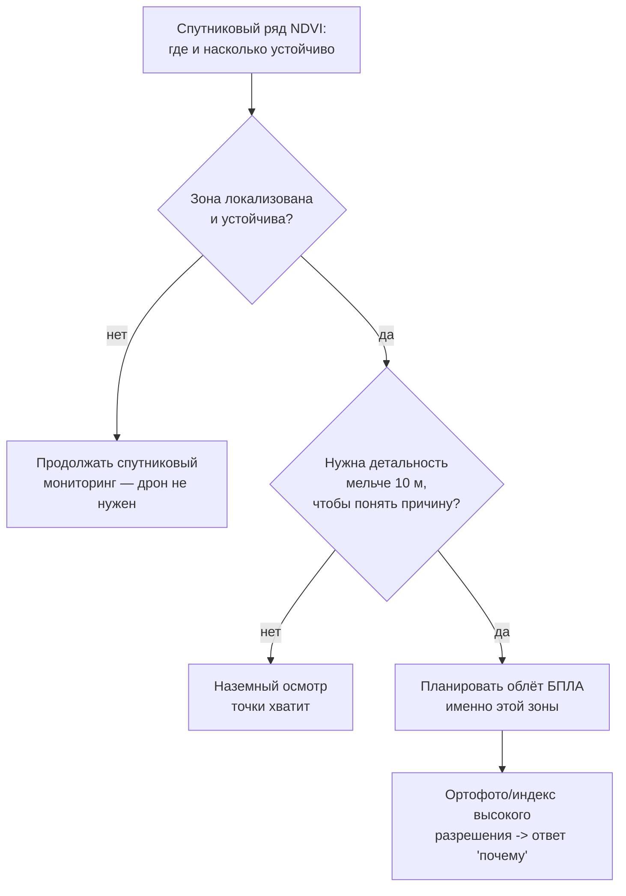
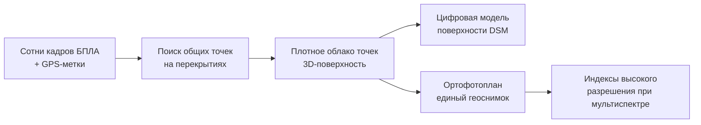

# Досматриваем проблемную зону с воздуха: облёт БПЛА, сенсоры, OpenDroneMap

> ⏱ **Трудозатраты:** ~18 мин чтения + ~25 мин практики
>
> Модуль **П7: ДЗЗ и БПЛА для мониторинга земель**, лекция 3 из 3.
> Профессиональный уровень. Проект UNDP-KAZ, FOLUR.

## Цели лекции и место в модуле

Спутник нашёл проблему и подтвердил, что она устойчива ([лекция 2](02-mnogoletnij-ryad-ndvi-problemnye-zony.md)), но 10-метровый пиксель не скажет, что именно там: солончак, промоина, очаг сорняка или вредителя. Ответ на «почему» даёт досмотр с воздуха — облёт беспилотника даёт детальность в сантиметры вместо метров. Эта лекция замыкает логику модуля: вы научитесь решать, **когда** дрон действительно нужен, планировать облёт под целевую детальность, выбирать сенсор под вопрос и превращать сотни отдельных снимков в единый ортофотоплан в открытом OpenDroneMap. Пилотирование как навык здесь не преподаётся, и дрон для прохождения не требуется: работаем на готовых открытых наборах снимков — «дрон не обязателен».

После изучения лекции слушатель сможет:

1. **[Bloom: анализировать]** решать, оправдан ли переход со спутника на БПЛА, сопоставляя целевую детальность, площадь и стоимость.
2. **[Bloom: применять]** оценивать высоту облёта под заданный целевой GSD и задавать перекрытия под тип поверхности.
3. **[Bloom: понимать]** выбирать сенсор (RGB, мультиспектр, тепловизор) под конкретный агровопрос.
4. **[Bloom: применять]** объяснять конвейер фотограмметрии в OpenDroneMap/WebODM и читать ортофотоплан, сопоставляя его со спутниковым рядом NDVI.

> **Границы лекции.** Внутри: критерий «дрон или спутник», планирование облёта под GSD, выбор сенсора, конвейер OpenDroneMap, чтение ортофото в связке со спутником. Снаружи: детальное устройство БПЛА-комплекса, аэродинамика носителей и полная методика полётного планирования — в [А1, урок 2](../../a1/lectures/02-bpla-kompleks-i-polyotnyy-plan.md); правовые условия полётов в РК (учёт/регистрация носителя, запретные зоны) — в [А1, урок 3](../../a1/lectures/03-bpla-ili-sputnik.md); космический мониторинг и NDVI-ряд — в [лекциях 1](01-chitaem-pole-iz-kosmosa-ndvi.md)–[2](02-mnogoletnij-ryad-ndvi-problemnye-zony.md); картографическая привязка ортофото — в [А2](../../a2/index.md). Здесь мы **планируем досмотр и читаем его результат**, а не учимся летать.

---

## 1. Дрон или спутник: решение до вылета

### 1.1 Разделение труда, а не конкуренция

Главный тезис модуля повторим в лоб: **спутник и дрон не конкуренты, а два звена одной цепи**. Спутник бесплатен, покрывает всё хозяйство, снимает регулярно и хранит архив — им дёшево находят *где* проблема и *устойчива* ли она. Дрон дорог (техника, оператор, обработка, время), покрывает малую площадь за вылет и не хранит историю — но даёт сантиметровую детальность и отвечает *почему*. Разумная последовательность одна: сначала спутниковый ряд локализует и подтверждает зону, затем дрон досматривает **именно её**, а не всё поле подряд.



*Рис. 1. Решение о переходе со спутника на БПЛА: дрон поднимают только для локализованной устойчивой зоны, где нужна детальность мельче спутникового пикселя. Alt: блок-схема — спутниковый ряд находит устойчивую зону, затем проверяется, нужна ли детальность мельче 10 метров; если нет — хватает наземного осмотра, если да — планируется облёт именно этой зоны, дающий ответ о причине.*

### 1.2 Когда дрон оправдан, а когда нет

Дрон оправдан, когда: зона локализована и устойчива по ряду; нужны объекты мельче спутникового пикселя (границы очага, отдельные растения, микрорельеф промоины); нужен индекс, которого нет у спутника в нужной детальности; или требуется свежий снимок «на сегодня» в обход расписания пролёта и облачности. Дрон **не** оправдан, когда достаточно обзора (спутник дешевле), когда нужна многолетняя история (у дрона её нет) или когда до участка проще дойти ногами. Экономический смысл прост: облёт всего хозяйства дроном ради общей картины — трата ресурса; облёт одной проблемной зоны ради диагноза — точное вложение.

---

## 2. Планирование облёта: высота, GSD, перекрытия

### 2.1 GSD — детальность на земле

Ключевая величина съёмки — **GSD** (Ground Sampling Distance), размер одного пикселя на земле в сантиметрах. Чем ниже летит дрон, тем мельче GSD и детальнее снимок. Связь GSD с высотой полёта задаётся геометрией камеры (полная формула и её вывод — в [А1, урок 2, §5](../../a1/lectures/02-bpla-kompleks-i-polyotnyy-plan.md)):

$$ \text{GSD} = \frac{H \cdot p}{f} $$

где $H$ — высота полёта, $p$ — физический размер пикселя матрицы, $f$ — фокусное расстояние. Практически из формулы следует правило: **сначала целевой GSD, потом высота**. Определите минимальный объект, который нужно различить (пятно сорняка от полуметра? отдельное растение? микропромоина?), задайте GSD в 2–3 раза мельче него — и формула даст высоту. Летать ниже необходимого — терять время и площадь ради лишней детальности; выше — не разглядеть искомое. Правило «переспросить заказчика о минимально различимом объекте дешевле, чем летать с избыточной детальностью» разобрано в [А1](../../a1/lectures/02-bpla-kompleks-i-polyotnyy-plan.md).

### 2.2 Перекрытия — условие сшивки

Дрон делает не один кадр, а сотни, и фотограмметрия сшивает их в единый ортофотоплан по общим точкам на соседних снимках. Чтобы сшивка удалась, кадры должны перекрываться: **продольное** перекрытие (вдоль маршрута) и **поперечное** (между соседними линиями). Отправные эвристики для равнины — порядка 80% продольного и 70% поперечного, — но их **увеличивают** над однородными текстурами: созревающая пшеница, свежий пар, вода выглядят на снимках одинаково, программе не за что «зацепиться», и на экономии перекрытий сшивка рвётся. Это прямая аналогия с проблемой «за что зацепиться» из [А1, урок 2](../../a1/lectures/02-bpla-kompleks-i-polyotnyy-plan.md). Степная зона Северного Казахстана добавляет своё ограничение — **ветер**: планирование здесь означает планирование *вокруг ветра*, с резервными днями на миссию.

### 2.3 Площадь, батарея и почему досмотр выгоднее сплошного облёта

Из высоты и перекрытий вытекает практический баланс. Чем ниже летит дрон ради мелкого GSD, тем уже полоса захвата одного кадра, тем больше линий маршрута и кадров, тем дольше миссия и тем чаще нужна замена батареи. Мультикоптер за один заряд покрывает малую площадь, самолётный тип — больше, но не зависает и требует площадки (детально — [А1, урок 2](../../a1/lectures/02-bpla-kompleks-i-polyotnyy-plan.md)). Отсюда прямой экономический вывод модуля: сплошной облёт хозяйства в тысячи гектаров на мелком GSD — это десятки вылетов, часы обработки и большой счёт, тогда как **досмотр одной локализованной спутником зоны в несколько гектаров** укладывается в один-два вылета и даёт ровно тот ответ, ради которого дрон и поднимали. Спутник берёт на себя обзор, дрон — точечную детализацию; смешивать их роли (гонять дрон вместо спутника ради обзора) экономически бессмысленно.

---

## 3. Сенсор под вопрос

Выбор сенсора определяется агровопросом — тем же принципом «сначала вопрос, потом инструмент», что и выбор индекса в [лекции 1, §1.3](01-chitaem-pole-iz-kosmosa-ndvi.md).

- **RGB** (обычная цветная камера) — самый дешёвый и распространённый. Даёт ортофотоплан и 3D-модель поверхности: границы очага, микрорельеф, промоины, полегание, подсчёт всходов, состояние края поля. Для большинства досмотровых задач его достаточно.
- **Мультиспектральный** — снимает отдельные каналы, включая ближний инфракрасный и «красный край», и позволяет строить **NDVI и индексы высокого разрешения** — тот же NDVI, что со спутника, но с сантиметровым пикселем внутри проблемной зоны. Нужен, когда вопрос именно про вегетацию, а спутникового разрешения не хватает.
- **Тепловизор** — фиксирует температуру поверхности; помогает увидеть **водный стресс** и неоднородность полива раньше, чем он проявится в видимых индексах, и находить очаги переувлажнения. Самый дорогой и требовательный к калибровке.

Практическое правило: начинайте с RGB — он отвечает на «что там физически» в большинстве случаев; мультиспектр и тепловизор берут, когда конкретный вопрос (детальная вегетация, водный стресс) этого требует и оправдывает затраты.

---

## 4. От снимков к ортофотоплану: OpenDroneMap

### 4.1 Открытый фотограмметрический конвейер

Сотни кадров дрона превращает в единый геопривязанный продукт **фотограмметрия**. Открытый бесплатный инструмент для этого — **OpenDroneMap** (ODM) и его веб-оболочка **WebODM**: полностью открытый стек, без платных лицензий (в отличие от коммерческих Agisoft Metashape / Pix4D, которые упоминаем лишь для сравнения). Конвейер стандартен:



*Рис. 2. Конвейер OpenDroneMap: перекрывающиеся кадры → общие точки → облако точек и модель поверхности → ортофотоплан и индексы. Alt: линейная схема — сотни кадров БПЛА с GPS-метками поступают на поиск общих точек по перекрытиям, из них строится плотное облако точек и 3D-поверхность, а из неё — цифровая модель поверхности, ортофотоплан и, при мультиспектральной съёмке, индексы высокого разрешения.*

**Ортофотоплан** — это сшитый и геометрически выправленный единый снимок всей зоны, где искажения перспективы и рельефа устранены, поэтому по нему можно измерять расстояния и площади. **Цифровая модель поверхности** (DSM) — карта высот, на которой видны микрорельеф, промоины, полегание. Именно наличие GPS-меток и корректных перекрытий (§2.2) позволяет конвейеру собрать всё правильно; недостаток перекрытий — причина номер один провалов сшивки.

Точность геопривязки ортофото определяется тем, как получены координаты кадров. Обычный бортовой GPS даёт привязку в несколько метров — этого достаточно, чтобы наложить ортофото на спутниковую карту и понять причину аномалии. Когда нужна привязка в сантиметры (точный обмер площадей, совмещение с кадастром), в поле раскладывают **опорные точки** (наземные маркеры с измеренными координатами) или применяют дрон с высокоточным приёмником — тема картографической точности подробно раскрыта в [А2](../../a2/index.md). Для досмотровой задачи П7 — «что физически в проблемной зоне» — метровой привязки бортового GPS, как правило, хватает, и усложнять её не нужно.

Ещё одна деталь конвейера — **ресурсы обработки**. Сшивка сотен кадров в WebODM требует времени и памяти; большие наборы обрабатывают частями или на облачных мощностях. Это ещё один довод в пользу досмотра узкой зоны, а не всего хозяйства: меньше кадров — быстрее и дешевле не только полёт, но и обработка.

### 4.2 Смыкание с космосом: совместный анализ

Ценность дрона раскрывается в **совмещении** его результата со спутниковым рядом. Ортофотоплан или дроновый NDVI зоны накладывают на спутниковую карту той же зоны — и получают ответ, недоступный по отдельности: спутник говорил «здесь устойчиво низкий NDVI четыре года», дрон показывает — «потому что это солончаковое пятно с характерным микрорельефом» или «потому что здесь промоина после стока». Это и есть «совместный анализ», названный в методологии модуля: спутник дал где и насколько устойчиво, дрон — что именно, а вместе они дают обоснованное решение (мелиорация, локальная агротехника, изменение севооборота). Совмещение слоёв — навык ГИС из [А2](../../a2/index.md)/[П2](../../p2/index.md).

> **Подробнее** о полном полётном планировании, отказных сценариях и предполётном чек-листе — в [А1, урок 2](../../a1/lectures/02-bpla-kompleks-i-polyotnyy-plan.md); о правовых условиях полётов в РК — в [А1, урок 3](../../a1/lectures/03-bpla-ili-sputnik.md). Оба вопроса в П7 не дублируются.

---

## Региональный кейс

**Ситуация:** По полю озимой пшеницы в Костанайском районе из [лекций 1](01-chitaem-pole-iz-kosmosa-ndvi.md)–[2](02-mnogoletnij-ryad-ndvi-problemnye-zony.md) многолетний ряд NDVI подтвердил: юго-западный угол (около 8 га) устойчиво отстаёт от фона четыре сезона подряд под разными культурами. Спутник исчерпал себя — 10-метровый пиксель не различает, солончак это, промоина или очаг. Агроном решает досмотреть зону дроном, но самого дрона у него нет; вместо реального вылета он разбирает готовый открытый набор ортофото похожей проблемной зоны, чтобы освоить чтение результата.

**Данные:** готовый открытый набор аэрофотоснимков/ортофото (OpenAerialMap, openaerialmap.org, или демонстрационные наборы OpenDroneMap) — «дрон не обязателен»; для совмещения — спутниковая NDVI-карта той же зоны из [лекции 2](02-mnogoletnij-ryad-ndvi-problemnye-zony.md).

**Задача:**
1. Оценить параметры гипотетического облёта 8-гектарной зоны: под целевой GSD «различить пятна от полуметра» прикинуть порядок высоты (формула §2.1) и задать перекрытия для однородной созревающей пшеницы (§2.2).
2. Выбрать сенсор под вопрос «что физически в зоне» и обосновать (§3).
3. Прочитать готовый ортофотоплан и DSM: найти на них признаки, объясняющие спутниковую аномалию (микрорельеф, пятна, границы очага), и наложить мысленно на спутниковую карту.

**Разбор:** Ожидаемый ход — начать с RGB (§3): вопрос «что физически там» в большинстве случаев решается ортофото и моделью поверхности без дорогого мультиспектра. Перекрытия для однородной пшеницы поднимают выше отправных 80/70 — иначе сшивка порвётся (§2.2, [А1](../../a1/lectures/02-bpla-kompleks-i-polyotnyy-plan.md)). Высоту не гонят к минимуму: детальности «пятна от полуметра» соответствует умеренный GSD и большая захватываемая площадь за вылет. На ортофото и DSM устойчивая спутниковая аномалия обретает физическое имя — и это имя, а не сам низкий NDVI, определяет решение. Конкретные значения высоты и числа перекрытий слушатель считает под характеристики выбранной камеры; кейс задаёт логику связки «ряд → облёт → диагноз». Полный разбор готового набора — в [практикуме](../practicum/01-ryad-ndvi-i-razbor-oblyota.md).

---

## Закрепление и применение

!!! example "Попробуйте в Colab"
    Ноутбук лекции (`<URL будет назначен при создании репозитория ноутбуков>`) открывает готовый ортофотоплан (GeoTIFF) из открытого набора и считает по нему NDVI/статистики теми же средствами rasterio, что и спутниковый снимок в [лекции 1](01-chitaem-pole-iz-kosmosa-ndvi.md). Минимальное задание на 20 минут: загрузите демонстрационный ортофотоплан OpenDroneMap или сцену OpenAerialMap, посмотрите GSD в метаданных и сравните детальность с 10-метровым Sentinel-2 на той же территории.

!!! warning "Границы применимости"
    Отправные перекрытия 80/70 — эвристика для равнины с текстурой; однородные поверхности (созревающая пшеница, пар, вода) требуют их увеличения, иначе сшивка рвётся. Формула GSD предполагает надирную съёмку и плоский участок — на склонах GSD меняется по кадру. Тепловизор и мультиспектр требуют калибровки; без неё их абсолютные значения ненадёжны. И главное: правовые требования к полётам БПЛА в РК меняются и в этой лекции **не пересказываются числами** — проверяйте актуальную редакцию НПА по официальным источникам перед каждым проектом ([А1, урок 3](../../a1/lectures/03-bpla-ili-sputnik.md)), а не по конспекту курса.

!!! tip "Что это даёт вашему хозяйству"
    Связка «спутник находит — дрон объясняет» экономит и топливо, и деньги на дроне: вы не облётываете всё хозяйство, а поднимаете дрон точечно над зоной, которую спутник уже подтвердил как устойчиво проблемную. Ортофотоплан 8-гектарной зоны с диагнозом (солончак / промоина / очаг) — это конкретное основание для решения о мелиорации и приложение к заявке на поддержку восстановления земель.

!!! question "Кейс для размышления"
    Подрядчик предлагает облетать дроном всё хозяйство (12 000 га) ежемесячно «для полного контроля» за существенные деньги. Опираясь на §1.1–1.2, сформулируйте, почему это неэффективная стратегия и какую роль в контроле должен играть спутник, а какую — дрон. Где проходит экономически разумная граница между ними?

### Проверь себя

```quiz
[
  {
    "q": "В чём правильная последовательность применения спутника и дрона в мониторинге поля?",
    "options": ["Спутниковый ряд локализует и подтверждает устойчивую зону, затем дрон досматривает именно её ради детальной причины", "Сначала облёт всего хозяйства дроном, спутник — для проверки", "Дрон и спутник применяют независимо и результаты не связывают", "Спутник нужен только когда нет дрона"],
    "answer": 0,
    "explain": "§1.1: спутник дёшево находит где и насколько устойчиво, дрон дорого, но точно отвечает почему; поднимать дрон над всем полем без локализации спутником — трата ресурса."
  },
  {
    "q": "Как правильно определить высоту облёта БПЛА?",
    "options": ["Сначала задать целевой GSD под минимально различимый объект, затем из формулы GSD = H·p/f получить высоту", "Лететь как можно ниже — так всегда детальнее и лучше", "Взять максимальную разрешённую высоту ради площади", "Высота не влияет на детальность"],
    "answer": 0,
    "explain": "§2.1: детальность на земле (GSD) задаёт задача; полёт ниже нужного теряет площадь ради лишней детальности, выше — не разглядеть искомое."
  },
  {
    "q": "Почему над однородной созревающей пшеницей перекрытия кадров увеличивают против отправных 80/70?",
    "options": ["Однородная текстура даёт мало общих точек для сшивки, и на экономии перекрытий фотограмметрия рвётся", "Пшеница отражает больше света и слепит камеру", "Чтобы уменьшить число кадров и сэкономить батарею", "Высокие перекрытия повышают разрешение матрицы"],
    "answer": 0,
    "explain": "§2.2: сшивка идёт по общим точкам соседних кадров; на однородной поверхности их мало, поэтому перекрытия поднимают, иначе ортофотоплан не соберётся."
  },
  {
    "q": "Для задачи «понять, что физически в устойчиво низкой зоне: промоина, солончак, полегание» с какого сенсора разумно начать?",
    "options": ["RGB — он даёт ортофотоплан и модель поверхности и отвечает на большинство вопросов о физике зоны дешевле прочих", "Сразу тепловизор — он самый информативный", "Только мультиспектр — без NDVI ничего не понять", "Любой платный сенсор высокого класса"],
    "answer": 0,
    "explain": "§3: принцип «сначала вопрос, потом сенсор»; RGB-ортофото и DSM показывают микрорельеф и границы очага, мультиспектр и тепловизор берут под специфический вопрос вегетации или водного стресса."
  },
  {
    "q": "Что такое ортофотоплан и почему он важнее набора отдельных кадров дрона?",
    "options": ["Это сшитый и геометрически выправленный единый снимок зоны, по которому можно измерять расстояния и площади и совмещать его со спутниковой картой", "Это самый резкий отдельный кадр из набора", "Это трёхмерная анимация облёта", "Это список GPS-координат снимков"],
    "answer": 0,
    "explain": "§4.1–4.2: фотограмметрия убирает искажения перспективы и рельефа; геопривязанный ортофотоплан можно измерять и накладывать на спутниковый ряд для совместного анализа."
  }
]
```

### Контрольные вопросы

1. Сформулируйте критерий, по которому вы решаете, оправдан ли переход со спутника на БПЛА. *(Bloom: анализировать)*
2. Как связаны целевой GSD, высота полёта и перекрытия, и что меняет однородная поверхность? *(Bloom: понимать/применять)*
3. Объясните, что даёт совмещение дронового ортофото со спутниковым рядом NDVI на конкретной проблемной зоне. *(Bloom: анализировать)*

## Что дальше?

Три инструмента модуля в руках: чтение поля из космоса ([лекция 1](01-chitaem-pole-iz-kosmosa-ndvi.md)), многолетний ряд и разбор причин ([лекция 2](02-mnogoletnij-ryad-ndvi-problemnye-zony.md)) и досмотр зоны дроном (эта лекция). Пора собрать их в прикладной продукт — в [практикуме «Многолетний ряд NDVI + разбор облёта»](../practicum/01-ryad-ndvi-i-razbor-oblyota.md) вы построите ряд по реальному полю и разберёте готовый набор БПЛА-съёмки, а затем перенесёте конвейер на своё поле. Затем — [ИИ-задание](../ai-assistant.md): ряд NDVI пишет ИИ-напарник, верифицируете вы. Продолжение по темам: результаты мониторинга — в ландшафтном планировании [П5](../../p5/index.md) и переходе на no-till [П8](../../p8/index.md); полное планирование БПЛА и право — в [А1](../../a1/index.md).
