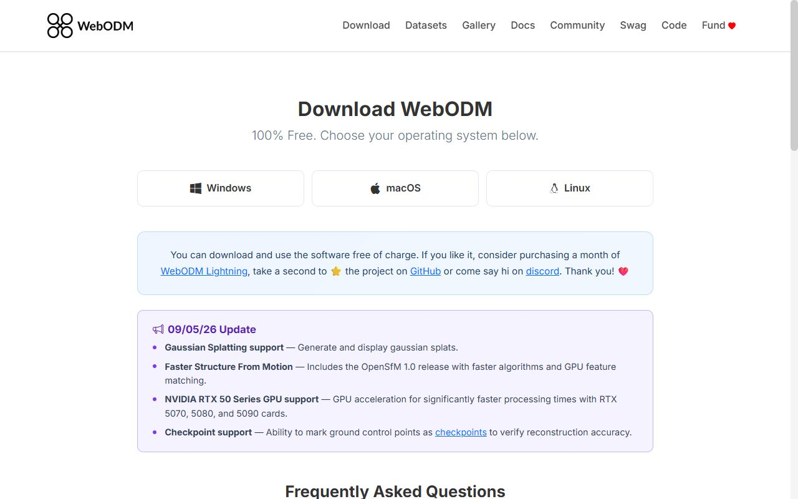

# Практикум: многолетний ряд NDVI поля + разбор готового облёта БПЛА

<!-- folur-software:start -->

!!! tip "Что понадобится в этом уроке и где это взять"
    Нажмите на название программы и увидите, **где её взять, что нажать и как она выглядит в работе** (нужная кнопка на снимке обведена фиолетовым). Встроенный редактор Python установки не требует. Полная справка — [«Программы и сервисы»](../../../software.md).

??? example "Встроенный редактор Python — как запустить и что получится"
    { .folur-shot loading=lazy }

    1. Скачивать и устанавливать ничего не нужно: редактор находится в этом уроке, на шаге **«Практика в Python»**.
    2. Нажмите **«▶ Запустить»** под кодом (на снимке обведена). В первый раз подождите до минуты, пока загрузится Python.
    3. Ниже, в блоке «Результат», появятся таблицы и графики. Измените число в коде и запустите ещё раз.
    4. Вкладка **«Мой участок»** над редактором считает то же по вашим координатам, контуру поля или снимку.

    **Как это выглядит в работе.** Пример результата: таблицы под кодом и кнопки скачивания файлов.

    { .folur-shot loading=lazy }

    **Как это выглядит в работе.** Вкладка «Мой участок»: координаты поля, контур и снимок подставляются здесь.

    { .folur-shot loading=lazy }

    [Подробно о редакторе, своих данных и запросе для нейросети →](../../../software.md#python)

??? example "Copernicus Browser — открыть в браузере"
    { .folur-shot loading=lazy }

    1. Скачивать ничего не нужно: откройте <https://browser.dataspace.copernicus.eu/>.
    2. В первом окне нажмите **«Use anonymously»** (на снимке обведена) — смотреть снимки можно без регистрации.
    3. Чтобы **скачивать** снимки, нужна бесплатная учётная запись: кнопка **«Log in»** → регистрация → подтверждение по письму.

    **Как это выглядит в работе.** Copernicus Browser в работе: слева дата снимка и список слоёв, на карте — слой NDVI по участку.

    { .folur-shot loading=lazy }

    [Как найти своё поле и выбрать снимок →](../../../software.md#copernicus)

??? example "Google Colab — открыть в браузере"
    { .folur-shot loading=lazy }

    1. Скачивать ничего не нужно: откройте <https://colab.research.google.com/>.
    2. Нажмите **«Sign in»** справа вверху и войдите под аккаунтом Google.
    3. Нажмите **«New notebook»** — откроется пустой блокнот, в ячейку которого вставляется код из урока.

    **Как это выглядит в работе.** Учебный блокнот «Welcome to Colab» открывается и без входа: текст и ячейки с кодом идут сверху вниз.

    { .folur-shot loading=lazy }

    [Как запускать ячейки и загружать свои файлы →](../../../software.md#colab)

??? example "WebODM — скачать (по желанию)"
    { .folur-shot loading=lazy }

    1. Для курса установка не обязательна: в уроках можно работать с готовым ортофотопланом.
    2. Если хотите обработать снимки сами, откройте <https://webodm.org/download/> и выберите свою операционную систему — **Windows**, **macOS** или **Linux**.
    3. Дальше следуйте инструкции, которая откроется на этой же странице.

    [Учебные наборы снимков с дрона →](../../../software.md#webodm)

<!-- folur-software:end -->

!!! info "Вычисления в браузере"
    Для этого материала подготовлен [редактор Python](#python-practice). Он выполняет весь скрипт целиком; графики, изображения, таблицы и файлы появляются под кодом. Учебный пример запускается без аккаунта Google. Облачные API и полноценные настольные ГИС используются отдельно, когда этого требует исходное задание.

<p>Порог сертификации — 75 %: квизы тем проверяли навыки по отдельности, ниже — связки, как в реальной работе. Сначала — практикум по шагам, затем ИИ-задание, банк и сценарный кейс. К аттестации предъявляются карта хозяйства из практикума и таблица верификации ИИ-задания.</p>

## Практикум: ряд NDVI поля и разбор готового облёта (по шагам)

<p>Модуль П7: ДЗЗ и БПЛА для мониторинга земель. Время выполнения: ~90 мин.</p>

<p>Инструменты: Google Colab (Python, rasterio) + Copernicus Browser; готовый набор ортофото — OpenAerialMap / OpenDroneMap. Всё бесплатно и открыто.</p>

<p>Данные: Sentinel-2 L2A (каналы B04/B08 + слой SCL) по полю Костанайской области; открытый набор БПЛА-съёмки.</p>

<p><a class="md-button md-button--primary" href="#python-practice">▶ Открыть редактор Python</a></p>

<p>Цель практикума</p>

<p><em>Самостоятельно</em> построить многолетний ряд NDVI по реальному полю, отделить устойчиво проблемную зону от погоды и севооборота и прочитать готовый ортофотоплан БПЛА, объяснив им спутниковую аномалию, — то есть собрать прикладной продукт модуля целиком.</p>

<p>Практикум объединяет лекцию 1 (расчёт NDVI), лекцию 2 (ряд, маска облаков, разбор причин) и лекцию 3 (досмотр дроном) на данных Костанайской области. Дрон не нужен: облёт разбирается по готовому открытому набору — «дрон не обязателен».</p>

<p>Что нужно подготовить</p>

<p class="upgraded-list-item">Браузер и встроенный редактор Python — аккаунт Google и установка ПО для учебного примера не требуются.</p>

<p class="upgraded-list-item">Бесплатный доступ к Copernicus Browser (browser.dataspace.copernicus.eu) — регистрация бесплатна.</p>

<p class="upgraded-list-item">Выбранное поле в Костанайской области (можно любое зерновое; контур — из OpenStreetMap или очерченный вручную).</p>

<p class="upgraded-list-item">Готовый набор ортофото/аэроснимков: демонстрационный датасет OpenDroneMap (docs.opendronemap.org) или сцена OpenAerialMap (openaerialmap.org).</p>

<p class="upgraded-list-item">Базовые навыки П4, лекция 3 (rasterio, NDVI кодом). Если Python незнаком — используйте запасной no-code-маршрут (шаг 2, вариант Б).</p>

<p>Задание</p>

<p>Шаг 1: выбор поля и дат (15 мин)</p>

<p>В Copernicus Browser найдите своё поле в Костанайской области. Соберите по одной безоблачной сцене Sentinel-2 L2A на сопоставимую фенофазу (например, колошение, начало-середина лета) за 4–5 разных сезонов. Для каждой сцены проверьте глазами: над полем нет облаков и их теней (лекция 1, §2.2). Запишите даты в таблицу.</p>

<p>Ожидаемый результат: список из 4–5 дат (по одной на сезон), все — одинаковая фенофаза, все безоблачные над полем.</p>

<p>Шаг 2: расчёт NDVI по каждой дате</p>

<p>Вариант А (Colab, основной). Для каждой даты выгрузите каналы B04, B08 и слой SCL, загрузите в Colab и посчитайте средний NDVI по полю с маской облаков:</p>

```python
import rasterio, numpy as np

def sredniy_ndvi(b04, b08, scl_path):
    red = rasterio.open(b04).read(1).astype("float32")
    nir = rasterio.open(b08).read(1).astype("float32")
    scl = rasterio.open(scl_path).read(1)
    ndvi = (nir - red) / (nir + red + 1e-9)
    CLOUD = [3, 8, 9, 10, 11]            # тень, облака, перистые, снег (сверьте с докой S2 L2A)
    ndvi = np.where(np.isin(scl, CLOUD), np.nan, ndvi)
    dolya_chistyh = np.mean(~np.isnan(ndvi))
    return round(float(np.nanmean(ndvi)), 3), round(float(dolya_chistyh), 3)

print(sredniy_ndvi("2022_B04.tif", "2022_B08.tif", "2022_SCL.tif"))
```

<p>Вариант Б (без кода, запасной). В Copernicus Browser включите готовый слой NDVI на каждую дату, снимите среднее по полю средствами браузера и занесите вручную в таблицу.</p>

<p>Ожидаемый результат: таблица «сезон → средний NDVI по полю → доля чистых пикселей». Проверьте: все NDVI в диапазоне −1…+1; даты с долей чистых пикселей ниже разумного порога (лекция 2, §2.3) исключите.</p>

<p>Шаг 3: ряд по полю и по подозрительной зоне (15 мин)</p>

<p>Выделите на поле подозрительную зону (по одиночной карте NDVI или визуально) и посчитайте средний NDVI отдельно по зоне и по всему полю за те же сезоны. Постройте два ряда и разницу «зона минус поле» для каждого сезона:</p>

```python
import pandas as pd, matplotlib.pyplot as plt

df = pd.DataFrame({
    "sezon": [2021, 2022, 2023, 2024, 2025],
    "pole":  [...],   # средние NDVI по полю из шага 2
    "zona":  [...],   # средние NDVI по зоне
    "dolya_chistyh": [...],  # доля чистых пикселей по полю из шага 2 (второй элемент, возвращаемый sredniy_ndvi)
})
df["raznica"] = (df["zona"] - df["pole"]).round(3)

fig, ax = plt.subplots(figsize=(9, 5))
ax.plot(df["sezon"], df["pole"], marker="o", label="поле")
ax.plot(df["sezon"], df["zona"], marker="s", label="зона")
ax.set_xlabel("сезон"); ax.set_ylabel("средний NDVI"); ax.legend()
fig.savefig("ryad-ndvi.png", dpi=150)
df.to_csv("ryad-ndvi.csv", index=False)
df
```

<p>Ожидаемый результат: файлы <code>ryad-ndvi.csv</code> и <code>ryad-ndvi.png</code>; колонка <code>raznica</code> показывает, стабильно ли зона отстаёт от фона.</p>

<p>Шаг 4: диагноз по ряду (10 мин)</p>

<p>Пройдите диагностическую решётку (лекция 2, §3.1). Ответьте письменно: разница «зона минус поле» стабильна между сезонами и культурами (кандидат в деградацию) или появляется только в засушливый год (засухочувствительность)? Сверьтесь с историей поля (что сеяли) — не пар ли объясняет провал.</p>

<p>Ожидаемый результат: абзац с отнесением зоны к одной из четырёх причин и решением «нужен ли дроновый досмотр».</p>

<p>Шаг 5: разбор готового облёта БПЛА (20 мин)</p>

<p>Загрузите готовый ортофотоплан из открытого набора (OpenDroneMap demo / OpenAerialMap). Откройте его в Colab через rasterio, посмотрите GSD в метаданных и сравните детальность с 10-метровым Sentinel-2. Прочитайте ортофото: какие физические признаки (микрорельеф, пятна, границы очага, промоины) видны на нём и не видны на спутнике? Мысленно наложите на спутниковую карту зоны из шага 3.</p>

<p>Ожидаемый результат: список 3–5 признаков, различимых на ортофото и неразличимых на Sentinel-2, и вывод «что именно дрон добавляет к спутниковому диагнозу».</p>

<p>Шаг 6: итоговый вывод (15 мин)</p>

<p>Сведите всё в короткий отчёт (10–15 строк): (1) как вела себя зона по ряду NDVI; (2) к какой причине вы её отнесли и почему; (3) что показал бы (или показал на аналоге) дроновый досмотр; (4) какое решение для хозяйства следует из связки «ряд → облёт» (мелиорация / агротехника / наблюдать дальше). Оговорите границы: NDVI — прокси, диагноз без полевой проверки — гипотеза (лекция 2).</p>

<p>Продукт задания</p>

<p>По итогам практикума у вас должны быть:</p>

<p class="upgraded-list-item"><code>ryad-ndvi.csv</code> — таблица «сезон → NDVI поля → NDVI зоны → разница → доля чистых пикселей»;</p>

<p class="upgraded-list-item"><code>ryad-ndvi.png</code> — график динамики поля и зоны;</p>

<p class="upgraded-list-item">карта/скриншот устойчиво проблемной зоны;</p>

<p class="upgraded-list-item">разбор готового ортофото: список признаков и вывод о вкладе дрона;</p>

<p class="upgraded-list-item">итоговый отчёт-вывод с решением и оговорками границ.</p>

<p>Самопроверка: все значения NDVI в −1…+1; облачные даты исключены по доле чистых пикселей; вывод о деградации опирается на разницу с фоном в разные годы, а не на абсолютное значение одной даты; отчёт содержит хотя бы одну явную оговорку границ применимости.</p>

<p>Применить к своему хозяйству — «Проект на ВАШЕЙ земле».</p>

<p>Повторите весь конвейер для своего реального поля: соберите ряд NDVI за доступные сезоны, найдите свою устойчиво проблемную зону, отнесите её к причине по решётке и — ключевой шаг — сверьте с тем, что вы знаете о поле сами: совпала ли спутниковая зона с местом, где урожай год за годом ниже, где стоит вода по весне, где солончак. Именно эта сверка спутникового вывода с вашими полевыми наблюдениями и есть верификация из ИИ-задания. Продукт — карта устойчиво проблемных зон вашего хозяйства, готовая как основание для агрохимобследования, мелиорации или заявки на поддержку восстановления земель.</p>

<p>Дополнительные задания (по желанию)</p>

<p>Добавьте в ряд Landsat для более глубокой ретроспективы (лекция 1, §2.1) — как менялась зона 15–20 лет назад.</p>

<p>Постройте для проблемной зоны NDMI (влага) и посмотрите, опережает ли водный стресс падение NDVI (лекция 1, §1.3).</p>

<p>Прикиньте параметры реального облёта этой зоны: целевой GSD, высота, перекрытия для однородной пшеницы (лекция 3, §2).</p>

<p>Связи</p>

<p>Лекции 1–3 — теоретическая основа.</p>

<p>ИИ-задание — тот же ряд NDVI, но код пишет ИИ-напарник, а верифицируете вы.</p>

<p>Техника расчёта индексов и пакетной обработки кодом — П4, лекция 3.</p>

<p>Полное планирование БПЛА и правовой режим полётов — А1; совмещение слоёв в ГИС — А2/П2.</p>

<p>Политика данных платформы: Датасеты.</p>


<section class="folur-python-practice" id="python-practice">
<h3>Практика в Python — прямо в уроке</h3>
<ol class="folur-lab-steps"><li>Нажмите <strong>▶ Запустить</strong> под кодом. При первом запуске загружается Python — это занимает до минуты.</li><li>Таблицы, графики и файлы появятся ниже, в блоке «Результат».</li><li>Измените параметры в коде и запустите ещё раз. Кнопка «Восстановить пример» возвращает исходный код.</li></ol>
<p class="folur-lab-note">Устанавливать ничего не нужно: редактор работает прямо в браузере, без аккаунта. <a href="/python-lab/editor.html?exercise=p7-practice" target="_blank" rel="noopener">Открыть редактор в отдельной вкладке</a>.</p>
<iframe class="folur-python-editor" src="/python-lab/editor.html?exercise=p7-practice" title="Python: p7-practice" loading="lazy" style="width:100%;height:1250px;border:1px solid #d4dfd0;border-radius:8px"></iframe>
<p class="folur-lab-data"><strong>О данных.</strong> Пример работает на синтетических (учебных) данных — скачивать ничего не нужно. Свои CSV, изображения и растры можно подключить в редакторе: раскройте блок «Свои данные и возможности среды».</p>
<p class="folur-lab-own"><strong>Свой участок.</strong> Во вкладке «Мой участок» над редактором можно вставить координаты своего поля или загрузить его контур (GeoJSON, KML, GeoPackage, Shapefile в архиве .zip) и снимок (GeoTIFF) — и получить паспорт данных, площадь, систему координат и оценку съёмки. Данные остаются в вашем браузере и сохраняются для следующих уроков.</p>
</section>

---

[Программа модуля](../index.md) · [Данные и условия использования](../../../datasets.md)
