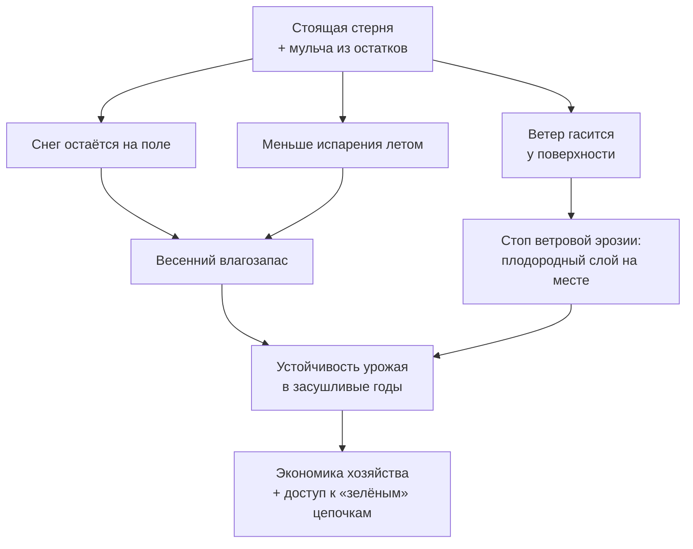
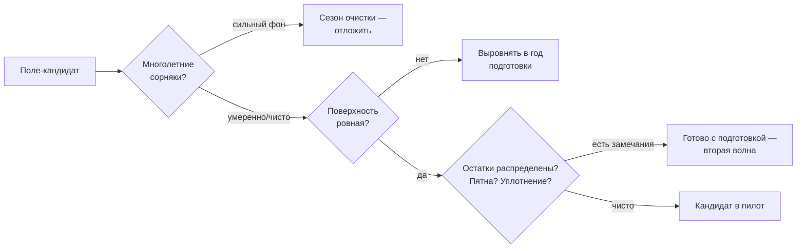

# Оцениваем готовность полей к no-till: стерня, сорняки, влага

> ⏱ **Трудозатраты:** ~17 мин чтения + ~20 мин практики
> Модуль **П8: Почвосберегающее земледелие, no-till**, урок 1 из 3.
> Профессиональный уровень (фермеры, специалисты хозяйств). Проект UNDP-KAZ FOLUR. Компоненты FOLUR: **1**, **2**.

## Цели урока и место в модуле

Этот урок — точка старта всего плана перехода. Прежде чем говорить о сеялках (урок 2) и деньгах (урок 3), нужно честно ответить на два вопроса: **что именно меняет no-till в жизни хозяйства** и **какие из ваших полей к этому готовы, а какие — нет**. Ошибка на этом шаге — самая дорогая: неудачно выбранное пилотное поле способно разочаровать хозяйство в системе, которая на другом поле сработала бы. Здесь мы разберём no-till глазами практика, поймём, почему степная зона Северного Казахстана — один из самых логичных регионов для прямого посева, и проведём диагностику полей по чек-листу из шести пунктов.

После изучения урока слушатель сможет:

1. **[Bloom: знать]** перечислять составные части системы прямого посева (сеялка, управление остатками, перестроенная защита растений, севооборот) и шесть пунктов чек-листа готовности поля.
2. **[Bloom: понимать]** объяснять, почему в сухой степи главные аргументы за no-till — влагосбережение через стерню и снег и защита от ветровой эрозии, а не «экономия на вспашке» сама по себе.
3. **[Bloom: применять]** оценивать каждое поле своего хозяйства по чек-листу готовности, используя знание истории поля и открытые снимки Sentinel-2.
4. **[Bloom: анализировать]** ранжировать поля хозяйства по готовности и обоснованно выбирать пилотное поле для первого сезона прямого посева.

> **Границы урока.** Внутри: no-till как система с точки зрения хозяйства, аргументы степной зоны, чек-лист готовности поля и выбор пилота. За рамками: научная теория трёх принципов сберегающего земледелия, история почвозащитной системы и типы деградации — подробнее в академическом модуле [А5, урок 3](../../a5/lectures/03-pochvosberegayushchee-zemledelie.md); конкретная техника и перестройка сезона работ — в [Уроке 2](02-tekhnika-i-sezon-pryamogo-poseva.md); календарь переходного периода и экономика — в [Уроке 3](03-perekhodnyy-period-i-ekonomika.md); проектирование севооборота под no-till — в модуле [П9](../../p9/index.md).

---

## 1. No-till глазами хозяйства: что на самом деле меняется

Начнём с главного заблуждения. «No-till — это когда перестают пахать и экономят солярку» — так систему описывают чаще всего, и это описание почти гарантирует неудачу. Прямой посев — не отказ от одной операции, а **замена одной системы земледелия другой**. Меняется не строчка в технологической карте, а логика целого сезона.

Что конкретно перестаёт делать хозяйство: пахать, культивировать, бороновать, то есть механически рыхлить и оборачивать почву. Что оно начинает делать вместо этого:

- **сеять специальной сеялкой прямого посева** — сквозь стерню, в необработанную почву, с точным выдерживанием глубины (какие бывают сеялки — [Урок 2](02-tekhnika-i-sezon-pryamogo-poseva.md));
- **управлять пожнивными остатками** — солома и стерня больше не «мусор, который надо заделать», а рабочий инструмент: они держат снег, укрывают почву от ветра и солнца, кормят почвенную биоту. Управление ими начинается с уборки — с равномерного распределения соломы за комбайном;
- **по-другому защищать посевы** — механической прополки больше нет, поэтому роль севооборота, покрытия и химических обработок перестраивается; сорняковый контроль становится плановой, а не аварийной работой;
- **строже относиться к севообороту** — монокультура пшеницы по пшенице в системе прямого посева накапливает болезни на остатках быстрее, чем при вспашке с заделкой; диверсификация — не пожелание, а условие работы системы.

Полезно проговорить и то, что no-till **не** обещает. Он не отменяет засуху, не заменяет агронома и не даёт «гарантированной прибавки урожая с первого года» — наоборот, первые сезоны обычно являются переходными, пока почва перестраивает структуру и биоту (что это значит и сколько длится — [Урок 3](03-perekhodnyy-period-i-ekonomika.md)). Любой, кто обещает вам конкретный процент прибавки без диагностики вашей земли, продаёт, а не консультирует. Эффект системы проверяется на своём поле мониторингом, а не берётся из рекламного буклета.

### 1.1 Лестница обработки: где на ней ваше хозяйство

Между «пашем как деды» и «не трогаем почву вовсе» есть промежуточные ступени, и знать их важно, потому что переход редко бывает прыжком через всю лестницу:

| Ступень | Что происходит с почвой | Что остаётся на поверхности |
|---|---|---|
| Отвальная вспашка | Пласт оборачивается, остатки заделываются | Открытая почва |
| Минимальная обработка (mini-till) | Рыхление без оборота пласта | Часть стерни |
| Плоскорезная (безотвальная) | Подрезание сорняков без оборота | Стерня сохранена |
| Прямой посев (no-till) | Почва не обрабатывается вовсе | Вся стерня и мульча |

Для Северного Казахстана эта лестница — не абстракция, а история региона: после пыльных бурь целинной эпохи земледелие здесь выжило именно благодаря переходу от отвала к безотвальной плоскорезной обработке с сохранением стерни (научная школа Шортандинского института им. А. И. Бараева; подробный разбор — в [А5, урок 3](../../a5/lectures/03-pochvosberegayushchee-zemledelie.md)). Поэтому многим хозяйствам региона на лестнице осталось сделать один шаг, а не четыре: от плоскореза к прямому посеву дистанция куда короче, чем от отвального плуга. Определите честно, на какой ступени ваше хозяйство сейчас, — от этого зависит и длина переходного периода, и список покупок.

---

## 2. Почему степная зона — аргументы влаги и ветра

В разных климатах у no-till разные главные выгоды. В сухой степи Северного Казахстана иерархия аргументов выстроена жёстко, и её стоит знать наизусть — она же будет скелетом вашего обоснования перед банком, партнёром или собственным скептицизмом.

**Аргумент первый — влага.** Осадков в степной зоне мало, и значительная их часть приходит зимой в виде снега. Открытое вспаханное поле снег не держит — его сдувает ветром в лесополосы и овраги. Стоящая стерня работает как миллионы маленьких снегозадержателей: снег остаётся на поле и весной уходит в почву. Летом мульча из остатков снижает испарение с поверхности — влага достаётся культуре, а не атмосфере. В регионе, где влага — главный лимитирующий фактор урожая, это и есть центральный экономический аргумент системы.

**Аргумент второй — ветровая эрозия.** Открытая, распылённая обработками почва в ветреной степи буквально улетает: самый плодородный верхний слой уносится с каждой пыльной позёмкой. Постоянное покрытие остатками гасит ветер у самой поверхности. Это не только про «экологию» — это про сохранение основного средства производства хозяйства.

**Аргумент третий — затраты и время.** Меньше проходов техники — меньше топлива, меньше моточасов, меньше механизаторов в пиковые окна. В степной зоне с её короткими агротехническими окнами скорость весенней кампании — самостоятельная ценность: сеялка прямого посева выходит в поле без ожидания предпосевной обработки. Но заметьте: этот аргумент в списке третий, а не первый. Хозяйства, которые идут в no-till только ради экономии солярки и игнорируют влагу, остатки и севооборот, чаще всего и пополняют ряды разочарованных.

**Аргумент четвёртый — устойчивость и доступ к «зелёным» рынкам.** Сберегающие практики сглаживают провалы урожая в засушливые годы (влагосбережение) и восстанавливают почву как актив. Для программы FOLUR в Казахстане устойчивые практики на пшеничных ландшафтах — целевое направление: в стране развивается кооперационная платформа «зелёной пшеницы» с экспортёрами и ритейлом и агроэкологические финансовые инструменты. Хозяйство с документированной сберегающей системой — кандидат в такие цепочки (как проверять конкретные действующие меры поддержки — [П14](../../p14/index.md)).



*Рис. 1. Цепочка выгод прямого посева в степной зоне: от стерни к устойчивости. Alt: блок-схема — стоящая стерня и мульча ведут к удержанию снега, снижению испарения и гашению ветра; это даёт весенний влагозапас и остановку эрозии, вместе — устойчивость урожая и экономический эффект с выходом на «зелёные» цепочки.*

---

## 3. Чек-лист готовности поля: шесть пунктов диагностики

Теперь — главный рабочий инструмент урока. Не каждое поле готово к прямому посеву прямо сейчас, и это нормально: диагностика нужна не для того, чтобы «запретить» no-till, а чтобы выстроить очередь и подготовить неготовые поля заранее. Проходите по шести пунктам для каждого поля хозяйства и ставьте оценку: «готово», «готово с подготовкой», «отложить».

### 3.1 Сорняки, особенно многолетние

Самый частый источник провала первого сезона. При вспашке корнеотпрысковые многолетники (осоты, вьюнок, молочай и подобные) механически подрезались; в системе прямого посева механики нет, и запущенное многолетними сорняками поле встретит вас стеной. **Правило: поле с сильным фоном многолетних корнеотпрысковых сорняков в пилотный сезон не берут** — его сначала очищают (обычно это сезон работы: пар с системной борьбой, конкурентная культура, плановые обработки — стратегии разберёт [Урок 2, §3](02-tekhnika-i-sezon-pryamogo-poseva.md)). Оцените фон по своим записям обследований и по памяти агронома; свежий летний снимок Sentinel-2 подскажет очаги — пятна, зеленеющие после уборки или на пару.

### 3.2 Ровность поверхности

Сеялка прямого посева выдерживает глубину заделки по поверхности поля. Глубокие колеи, свальные гребни и развальные борозды от многолетней вспашки, промоины — всё это превращается в брак посева: где-то семя ляжет на поверхность, где-то утонет. Неровное поле перед переходом выравнивают — и это, обратите внимание, последняя механическая обработка в его жизни, её надо спланировать в год подготовки. Поле после многих лет плоскорезной обработки обычно ровнее отвального — ещё одна причина, почему региональная лестница перехода короче.

### 3.3 Пожнивные остатки предшественника

Прямой посев любит остатки, но равномерные. Если прошлой осенью солома сошла с комбайна валками и так и осталась — весной сошник в валке не пробьётся к почве, семена лягут в солому, всходы будут рваными. Оцените: был ли на комбайне измельчитель-разбрасыватель, распределена ли солома равномерно, нет ли валков. Поле с неубранными валками — кандидат «готово с подготовкой»: либо равномерно распределить остатки до посева, либо начать правильную уборку с ближайшего сезона ([Урок 2, §2](02-tekhnika-i-sezon-pryamogo-poseva.md)).

### 3.4 Солонцы, блюдца и переувлажнённые пятна

Пятнистые поля со солонцовыми пятнами и западинами-«блюдцами», где весной стоит вода, ведут себя в прямом посеве неоднородно: на солонцах свои проблемы структуры, в блюдцах — вымочки. Это не запрет, но фактор ранжирования: однородное поле — лучший пилот, пятнистое — вторая волна, когда рука уже набита. Пятна хорошо видны на летних снимках Sentinel-2 как устойчивые из года в год аномалии окраски посева.

### 3.5 Уплотнение

Многолетняя обработка на одну и ту же глубину оставляет плужную подошву — уплотнённый слой, который корни и вода проходят с трудом. Простая полевая проверка: копните лопатой в нескольких местах до 25–30 см и посмотрите, есть ли резкая граница, где лопата упирается, а корни предыдущей культуры поворачивают горизонтально. Сильное уплотнение — аргумент за разовое глубокое рыхление в год подготовки (без оборота пласта) или за выбор другого пилотного поля; в самой системе no-till структуру дальше восстанавливают корни культур и биота, но стартовое состояние важно.

### 3.6 История поля и данные

Последний пункт — не про почву, а про ваши записи. По полю-кандидату нужно знать: предшественники за 3–5 лет, применявшиеся гербициды (последействие некоторых ограничивает выбор следующей культуры — сверьте с регистрационными ограничениями препаратов по их официальным документам), урожайность по годам, даты и виды обработок. Если записей нет — это само по себе диагноз: начните вести журналы ([П1](../../p1/index.md)) прямо сейчас, потому что весь [Урок 3](03-perekhodnyy-period-i-ekonomika.md) — экономика на ваших цифрах — без записей не работает.



*Рис. 2. Логика диагностики поля по чек-листу: от сорняков к пилоту. Alt: блок-схема последовательной проверки поля — сильный фон многолетних сорняков отправляет поле на сезон очистки; неровная поверхность — на выравнивание в год подготовки; замечания по остаткам, пятнам или уплотнению — во вторую волну; чистое по всем пунктам поле — кандидат в пилот.*

---

## 4. Ранжирование полей и выбор пилота

Итог диагностики — таблица по всем полям хозяйства: шесть пунктов, оценка каждого, итоговый статус. Дальше действует правило пилота, знакомое по [А5](../../a5/lectures/03-pochvosberegayushchee-zemledelie.md): **переходят не всем хозяйством сразу, а пилотом на части площади** — так ошибки первого сезона учат, а не разоряют.

Хороший пилот — это:

- **однородное, ровное, чистое от многолетников поле** со средней для хозяйства продуктивностью. Не лучшее (жалко рисковать) и не худшее (нечестный эксперимент — провал спишут на систему, а не на поле);
- **поле с известной историей** и полными записями — иначе эффект не с чем сравнивать;
- **поле удобной логистики** — за пилотом придётся наблюдать чаще обычного;
- разумная доля — обычно та часть площади, потерю урожая на которой хозяйство переживёт без катастрофы; конкретную долю каждый определяет по своей финансовой прочности, универсальной цифры здесь нет и быть не должно.

И одно организационное решение, которое стоит принять сразу: оставьте на пилотном поле **контрольную полосу** по прежней технологии. Полоса той же культуры, того же сорта, той же даты сева — но по старой обработке. Это ваш личный эксперимент: осенью вы сравните не «ощущения», а урожай, влажность почвы и затраты двух полос. Именно так хозяйство получает собственные цифры вместо чужих обещаний — и именно эти цифры лягут в экономический лист [Урока 3](03-perekhodnyy-period-i-ekonomika.md).

---

## Региональный кейс

**Ситуация:** Зерновое хозяйство в Есильском районе Северо-Казахстанской области решило переходить на прямой посев. В хозяйстве шесть полей; последние годы применялась смешанная обработка — часть полей по плоскорезу, часть по отвалу. Руководитель хочет выбрать пилотное поле на следующий сезон и понять, какие поля требуют подготовки.

**Данные:** записи хозяйства о предшественниках и обработках; летние и осенние снимки Sentinel-2 через браузер Copernicus (dataspace.copernicus.eu) за последние два сезона; чек-лист готовности из §3.

**Задача:**
1. По осеннему снимку после уборки определите, на каких полях видны валки соломы или открытая пашня (признак отвальной обработки), а где — равномерная стерня.
2. По летним снимкам двух сезонов найдите устойчивые пятна-аномалии (кандидаты в солонцы/блюдца) и очаги позднего зеленения (кандидаты в очаги многолетних сорняков).
3. Сведите наблюдения с записями хозяйства в таблицу готовности и предложите пилот с обоснованием по правилам §4.

**Разбор:** Поля после плоскореза с равномерной стернёй и без устойчивых аномалий — первые кандидаты в пилот: им нужен один шаг лестницы, а не четыре. Отвальные поля отправляются в год подготовки (выравнивание, накопление стерни с первой правильной уборки). Поле с очагами позднего зеленения — на полевую проверку: если подтверждаются корнеотпрысковые многолетники, оно получает сезон очистки независимо от прочих достоинств. Пилот выбирается средний по продуктивности, с полными записями, с закладкой контрольной полосы. Численные оценки (баллы, площади, доли) слушатель выставляет по данным своего хозяйства — готовых «правильных» цифр в кейсе нет намеренно.

> Этот кейс продолжается в [Практикуме](../practicum/01-plan-perekhoda-na-no-till.md) — там вы выполняете ту же диагностику для собственных полей и оформляете таблицу готовности как первый раздел плана перехода.

---

## Закрепление и применение

!!! example "Попробуйте прямо сейчас (10 минут)"
    Откройте браузер Copernicus (dataspace.copernicus.eu → Browser), найдите свои поля. Сравните два снимка Sentinel-2: летний (посев в вегетации) и осенний после уборки. Найдите хотя бы одно различие между своими полями — по равномерности окраски стерни, следам валков, пятнам. Вы только что сделали первый шаг диагностики §3, не выходя из дома.

!!! warning "Границы применимости"
    Чек-лист урока — инструмент ранжирования, а не приговор и не пропуск. «Готовое» по снимку поле может скрывать уплотнение или последействие гербицида — пункты 5 и 6 проверяются только на земле и по записям. И наоборот: «неготовое» поле — это лишь очередь на подготовку. Не заменяйте полевую проверку космоснимком: снимок направляет, лопата и журнал решают.

!!! tip "Что это даёт вашему хозяйству"
    Диагностика по чек-листу превращает «хотим no-till» в управляемый проект: вы знаете, какие поля идут первыми, какие ждут подготовки и почему. Контрольная полоса на пилоте даст вам собственные цифры эффекта — самый убедительный аргумент и для партнёров, и для банка, и для соседей.

!!! question "Кейс для размышления"
    Сосед выбрал пилотом своё лучшее поле — чистое, ровное, самое плодородное — и получил отличный результат. Теперь он уверен, что «система работает везде», и переводит всё хозяйство за один сезон. Какие два риска в его логике вы видите с позиции этого урока — и что бы вы сделали иначе?

### Проверь себя

```quiz
[
  {
    "q": "Хозяйство рассматривает no-till только как «отказ от вспашки ради экономии топлива». Что упускает такой взгляд?",
    "options": ["Ничего — экономия топлива и есть суть системы", "Что прямой посев — это система: сеялка, управление остатками, перестроенная защита растений и севооборот меняются вместе", "Что no-till требует обязательной покупки нового комбайна", "Что вспашку достаточно заменить боронованием"],
    "answer": 1,
    "explain": "§1: no-till — замена системы земледелия, а не удаление одной операции; аргумент затрат — лишь третий в степной иерархии (§2)."
  },
  {
    "q": "Почему в степной зоне Северного Казахстана главный аргумент за прямой посев — стерня, а не «чистое поле»?",
    "options": ["Стерня украшает ландшафт и требуется для сертификации", "Стерня мешает сорнякам расти зимой", "Стоящая стерня задерживает снег — ключевой источник влаги, и гасит ветер у поверхности, останавливая эрозию", "Стерня повышает температуру почвы весной"],
    "answer": 2,
    "explain": "§2, рис. 1: влага (снег + меньше испарения) и защита от ветровой эрозии — первые два аргумента региона; влага — главный лимитирующий фактор урожая."
  },
  {
    "q": "Поле с сильным фоном многолетних корнеотпрысковых сорняков (осоты, вьюнок). Правильное решение по чек-листу:",
    "options": ["Не брать в пилот: сначала сезон очистки, потом прямой посев", "Взять в пилот — no-till сам подавит сорняки мульчой", "Сразу перевести на no-till, но удвоить норму высева", "Исключить поле из хозяйства"],
    "answer": 0,
    "explain": "§3.1: механической прополки в системе больше нет; запущенное многолетниками поле в пилотный сезон не берут — его сначала очищают."
  },
  {
    "q": "Какое поле по правилам урока — лучший кандидат в пилот?",
    "options": ["Самое плодородное поле хозяйства", "Самое проблемное — чтобы проверить систему в худших условиях", "Однородное поле средней продуктивности с известной историей и полными записями", "Самое дальнее — там ошибки никто не увидит"],
    "answer": 2,
    "explain": "§4: пилот — средний по продуктивности, однородный, с записями и удобной логистикой; лучшее поле жалко, худшее — нечестный эксперимент, результат которого спишут на систему."
  },
  {
    "q": "Зачем на пилотном поле оставляют контрольную полосу по прежней технологии?",
    "options": ["Чтобы было куда отступить при неудаче", "Чтобы осенью сравнить урожай, влагу и затраты двух технологий на одном поле и получить собственные цифры эффекта", "Этого требуют правила субсидирования", "Чтобы сохранить механическую прополку хотя бы частично"],
    "answer": 1,
    "explain": "§4: контрольная полоса превращает переход в честный эксперимент; собственные цифры хозяйства — основа экономики урока 3 и лучший ответ на чужие обещания."
  }
]
```

### Контрольные вопросы

1. Назовите четыре ступени «лестницы обработки» и объясните, почему для многих хозяйств региона шаг к no-till короче, чем кажется. *(Bloom: знать)*
2. Объясните связку «стерня → снег → влагозапас → устойчивость урожая» своими словами, как объяснили бы соседу. *(Bloom: понимать)*
3. Пройдите по шести пунктам чек-листа для одного конкретного поля вашего хозяйства и вынесите статус: готово / с подготовкой / отложить. *(Bloom: применять)*

## Что дальше?

Вы знаете, **какие** поля пойдут в прямой посев первыми. Следующий вопрос — **чем и как** на них работать: какая сеялка справится с вашей стернёй, что поменять в уборке уже в этом сезоне и как перестроить защиту растений без механики. Об этом — [Урок 2. Перестраиваем технику и сезон работ под прямой посев](02-tekhnika-i-sezon-pryamogo-poseva.md). Теоретический фундамент трёх принципов сберегающего земледелия — в [А5, урок 3](../../a5/lectures/03-pochvosberegayushchee-zemledelie.md); севооборот, без которого система не раскроется, — в [П9](../../p9/index.md).
