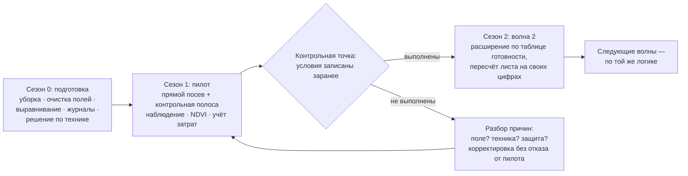

# Планируем переходный период и считаем экономику на своих цифрах

> ⏱ **Трудозатраты:** ~17 мин чтения + ~25 мин практики
> Модуль **П8: Почвосберегающее земледелие, no-till**, урок 3 из 3.
> Профессиональный уровень (фермеры, специалисты хозяйств). Проект UNDP-KAZ FOLUR. Компоненты FOLUR: **1**, **2**.

## Цели урока и место в модуле

Поля выбраны ([Урок 1](01-gotovnost-poley-k-no-till.md)), техника и операции понятны ([Урок 2](02-tekhnika-i-sezon-pryamogo-poseva.md)). Остались два вопроса, на которых чаще всего и спотыкаются: **сколько длится переход и что в это время происходит с полем** — и **сколько всё это стоит именно вашему хозяйству**. Урок отвечает на оба, но по-особому: вместо «средних цифр по отрасли» (которые для вашего поля почти всегда неверны) он даёт **методику расчёта на данных собственного учёта** и календарь переходного периода с волнами расширения. Это принципиальная позиция модуля: единственные цифры, на которых можно строить решение о переходе, — цифры вашего хозяйства.

После изучения урока слушатель сможет:

1. **[Bloom: знать]** перечислять этапы календаря перехода (подготовка → пилот → контрольная точка → волны) и четыре блока экономического листа (затраты «до», затраты «после», инвестиции и высвобождение, сравнение с консервативным сценарием).
2. **[Bloom: понимать]** объяснять, что происходит с почвой и полем в переходные годы (перестройка структуры и биоты, накопление мульчи, сдвиг фитосанитарной обстановки) и почему эффект системы накапливается, а не включается.
3. **[Bloom: применять]** составлять календарь переходного периода на три сезона с волнами «подготовка → пилот → расширение» и контрольными точками между волнами.
4. **[Bloom: применять]** заполнять экономический лист перехода данными своего учёта: операции и проходы до/после, топливо, труд, СЗР, инвестиция в сеялку, высвобождение старой техники.
5. **[Bloom: анализировать]** выявлять непроверяемые обещания в чужих расчётах («гарантированная прибавка», «окупится за год», выдуманные суммы субсидий) и заменять их проверяемыми величинами или честной пометкой «неизвестно, проверим пилотом».

> **Границы урока.** Внутри: динамика переходного периода, календарь волн, риски и меры, методика экономического листа, качественный обзор источников финансирования, мониторинг эффекта. За рамками: диагностика полей — [Урок 1](01-gotovnost-poley-k-no-till.md); выбор техники — [Урок 2](02-tekhnika-i-sezon-pryamogo-poseva.md); проверка действующих мер господдержки и подготовка заявок — в [П14](../../p14/index.md) (в этом уроке ни одной суммы субсидий нет и быть не может — они меняются и проверяются только по официальным источникам); NDVI-мониторинг как инструмент — [П3](../../p3/index.md); севооборот переходного периода — [П9](../../p9/index.md).

---

## 1. Что происходит с полем в переходные годы

Переходный период — не маркетинговая оговорка, а агрономическая реальность: почва, десятилетиями жившая под обработкой, перестраивается на новый режим не мгновенно. Понимать механику этой перестройки важно, чтобы не принять нормальные явления первых лет за провал системы — и не пропустить настоящие проблемы.

**Что перестраивается и почему это небыстро:**

- **Структура.** Без ежегодного рыхления почва сначала кажется плотнее — привычной рыхлой «пуховости» пахотного горизонта больше нет. Новую, устойчивую структуру строят корни культур, черви и микроорганизмы: каналы, поры, агрегаты. Это биологический процесс со скоростью биологии, а не техники.
- **Биота.** Мульча — корм для почвенной жизни, но её население нарастает постепенно. Вместе с ним постепенно включаются и бесплатные сервисы системы: переработка остатков, структурирование, подавление части патогенов.
- **Питание.** Микроорганизмы, разлагающие обильные остатки, сами потребляют азот — в первые годы часть почвенного азота может временно связываться ими (качественная закономерность; её масштаб на вашем поле покажут только ваши агрохимические анализы). Практический вывод: питание переходного периода планируют с агрономом по анализам, а не по прошлогодней привычке.
- **Фитосанитарная обстановка.** Спектр сорняков сдвигается (меньше тех, кого будила обработка, больше тех, кто любит покой и мульчу), болезни, живущие на остатках, при слабом севообороте накапливаются. Ответ системы — севооборот и плановая защита ([Урок 2, §3](02-tekhnika-i-sezon-pryamogo-poseva.md)), а не возврат к плугу при первой тревоге.

Общий рисунок таков: **затраты и риски системы сосредоточены в первых сезонах, выгоды — накапливаются и раскрываются позже**. Сколько именно длится переход — зависит от почвы, влагообеспеченности, севооборота и качества исполнения; называть универсальный срок было бы обманом. Планировать разумно горизонтом в несколько сезонов — и мерить свой прогресс собственным мониторингом (§5), а не чужим календарём.

---

## 2. Календарь перехода: подготовка → пилот → волны

Со времён [Урока 1](01-gotovnost-poley-k-no-till.md) мы знаем: переходят волнами. Теперь соберём это в календарь на три сезона — каркас, который вы заполните своими полями в [практикуме](../practicum/01-plan-perekhoda-na-no-till.md).

**Сезон 0 — подготовка (текущий).** Настройка уборки на всех полях: равномерное распределение остатков, высокий срез ([Урок 2, §2](02-tekhnika-i-sezon-pryamogo-poseva.md)). Очистка полей с фоном многолетних сорняков. Выравнивание будущих пилотов, где нужно. Решение по технике пилота: услуга, аренда, кооперация или покупка ([Урок 2, §4.1](02-tekhnika-i-sezon-pryamogo-poseva.md)). Заведение журналов, если их не было ([П1](../../p1/index.md)), — без них не будет ни экономики, ни сравнения.

**Сезон 1 — пилот.** Прямой посев на пилотном поле (полях) с контрольной полосой по старой технологии. Усиленное наблюдение: обходы, фиксация всходов, сорняков, влажности; NDVI-снимки пилота и контроля ([П3](../../p3/index.md)). Осенью — честное сравнение пилота и контроля по урожаю, влаге и затратам: эти цифры — главный продукт сезона, даже важнее самого урожая.

**Сезон 2 — решение и расширение.** Разбор пилота: что сработало, что нет и почему. Решение о второй волне — какие поля добавляются (по таблице готовности урока 1), что меняется в технологии по урокам пилота. Экономический лист пересчитывается уже не на прогнозах, а на собственных данных сезона 1.

**Контрольные точки между волнами** — заранее записанные условия расширения. Например: «расширяемся, если пилот дал всходы не хуже контроля, сорняковый фон удержан плановыми обработками, и фактические затраты уложились в лист ±20% допуска» (допуск выберите сами — важно записать его **до** сезона, а не подгонять после). Записанная заранее контрольная точка защищает от двух симметричных ошибок: бросить систему после первой трудности и слепо расширяться после первой удачи.



*Рис. 1. Календарь перехода волнами с контрольными точками. Alt: блок-схема — сезон подготовки ведёт к пилотному сезону с контрольной полосой; контрольная точка с заранее записанными условиями либо открывает волну расширения, либо возвращает на разбор причин и корректировку пилота; дальнейшие волны идут по той же логике.*

---

## 3. Риски переходного периода — и мера на каждый

Сведём типовые риски первых сезонов в таблицу «риск → ранний признак → мера». Она же — заготовка раздела рисков в вашем плане перехода.

| Риск | Ранний признак | Мера |
|---|---|---|
| Сорняковая волна | Очаги многолетников на пилоте, зеленение после уборки | Плановые обработки по окнам, а не по панике; поля с сильным фоном — не в пилот ([Урок 1, §3.1](01-gotovnost-poley-k-no-till.md)) |
| Рваные всходы | Полосы выпадов вдоль валков соломы | Настройка распределения остатков на уборке; проверка соответствия сошника полю ([Урок 2](02-tekhnika-i-sezon-pryamogo-poseva.md)) |
| Голодание посева по азоту | Бледность посева на фоне обильных остатков | Агрохимический анализ и планирование питания с агрономом (§1), внесение при посеве |
| Накопление болезней на остатках | Повторение зерновых по зерновым в схеме | Севооборот — обязателен, не опция ([П9](../../p9/index.md)) |
| Кассовый разрыв переходных лет | Затраты сезона 1 выше листа, выгоды ещё не пришли | Пилот в размере, который хозяйство переживёт; финансирование — §4.1; допуск в контрольной точке |
| Разочарование команды | «При деде пахали — и росло» | Контрольная полоса и цифры вместо споров; обучение людей — строка плана, а не остаток |

Отдельно — **риск информационный**: переходный период — время, когда хозяйство наиболее уязвимо для продавцов чудес и для уверенных «средних цифр» из интернета. Правило модуля: любое число, влияющее на ваше решение, либо взято из вашего учёта, либо из официального источника с датой, либо честно помечено «неизвестно — проверим пилотом». Тренировка этого навыка на ИИ-текстах — в [ИИ-задании модуля](../ai-assistant.md).

---

## 4. Экономический лист перехода: методика на своих цифрах

Теперь главное. В лекции не будет ни одной цены и ни одного тенге — и это не осторожность ради осторожности, а суть методики: цены техники, топлива, СЗР и зерна меняются и различаются по районам, а решения принимаются на актуальных цифрах **вашего** учёта и **ваших** коммерческих предложений. Что даёт урок — структуру листа, в который эти цифры подставляются. Лист состоит из четырёх блоков.

**Блок А. Операционные затраты «до».** Из технологической карты прошлого сезона по выбранному полю выпишите все операции с их фактическими затратами: топливо (литры × ваша цена), труд (часы × ваша ставка), семена, удобрения, СЗР, услуги. Источник — журналы хозяйства ([П1](../../p1/index.md)); если журналов нет, восстановите по накладным и памяти максимально честно и пометьте оценочные строки.

**Блок Б. Операционные затраты «после».** Та же карта, но по технологии прямого посева из [Урока 2, §4](02-tekhnika-i-sezon-pryamogo-poseva.md): вычеркнутые операции обнуляются, новые (допосевная обработка, химический пар) добавляются по коммерческим предложениям поставщиков СЗР и услуг **на сегодняшнюю дату**. Помните честную оговорку: в переходные годы затраты на защиту планируются с запасом (§1), а не по «целевому» уровню зрелой системы.

**Блок В. Инвестиции и высвобождение.** Сеялка/комплекс — по реальным коммерческим предложениям (или стоимость услуги/аренды на пилот — тогда инвестиция откладывается до решения о второй волне). Минус — высвобождение: продажа или консервация плугов, культиваторов, борон; сокращение потребности в тракторных моточасах. Инвестицию корректно разносить на площадь и годы использования, а не вешать целиком на пилотный сезон.

**Блок Г. Сравнение и порог.** Разница операционных затрат (А − Б) на гектар — ваша операционная экономия или удорожание; инвестиция из В, отнесённая к площади и сроку, — цена входа. Урожайную часть — изменится ли сбор и качество — **не прогнозируйте, а измерьте**: это даст контрольная полоса пилота. До пилота в листе на месте прибавки урожая стоит честный ноль (консервативный сценарий): если экономика сходится даже при нуле прибавки — решение устойчивое; если сходится только при обещанной кем-то прибавке — это ставка, и вы должны это видеть.

Такой лист — на одну страницу таблицы (Google Sheets/LibreOffice), и он честнее любого бизнес-плана на сорок листов, потому что в нём видно происхождение каждой цифры: журнал, коммерческое предложение с датой, или пометка «оценка/проверим пилотом».

Полезное упражнение поверх готового листа — **проверка чувствительности**: посмотрите, какие две-три строки сильнее всего влияют на итог (обычно это инвестиция в технику и расходы на защиту переходных лет), и прикиньте, что случится с решением, если каждая из них окажется хуже плана на выбранный вами допуск. Если решение переживает ухудшение ключевых строк — оно прочное; если рушится от первой же — вы нашли, что именно нужно уточнить до посева, а не после: запросить второе коммерческое предложение, пересчитать вариант с услугой вместо покупки, сузить пилот. Чувствительность считается на тех же своих цифрах — никакой новой информации со стороны она не требует.

### 4.1 Финансирование перехода: где смотреть (без цифр)

Источники, которые стоит изучить — **все проверяются по официальным данным на момент решения, суммы и условия в этом уроке намеренно не называются**:

- **Государственные меры поддержки** (инвестиционные субсидии на технику, льготное кредитование и лизинг сельхозтехники): действующие правила, ставки и перечни ищите только в официальных источниках — adilet.zan.kz, сайты Минсельхоза РК и операторов программ; методика проверки и подготовка заявки — [П14](../../p14/index.md).
- **Кооперация и услуги** — способ вообще отложить инвестицию до подтверждения пилота ([Урок 2, §4.1](02-tekhnika-i-sezon-pryamogo-poseva.md)).
- **«Зелёные» цепочки и агроэкологические инструменты.** Страновой проект FOLUR поддерживает кооперационную платформу «зелёной пшеницы» с экспортёрами и ритейлом и агроэкологические финансовые инструменты (форвардные закупки бобовых, товарный кредит на многолетние травы) — для хозяйства с документированной сберегающей системой это потенциальный канал сбыта и финансирования; актуальные условия уточняются у регионального офиса проекта.

Правило одно на все источники: «слышал, что дают 25%» — не информация. Информация — документ с номером и датой, найденный вами или подтверждённый оператором программы.

---

## 5. Мониторинг эффекта: чем закрывается план

План перехода заканчивается не посевом, а измерением. Минимальный набор мониторинга, целиком из бесплатных инструментов:

- **Контрольная полоса** — главный инструмент ([Урок 1, §4](01-gotovnost-poley-k-no-till.md)): урожай, влажность почвы, затраты — пилот против контроля, на одном поле, в один год.
- **NDVI-ряд по пилоту и контролю** — бесплатно в браузере Copernicus или сервисах из [П3](../../p3/index.md): динамика вегетации двух полос видна из космоса и не зависит от чьих-либо ощущений.
- **Журнал затрат по полю** ([П1](../../p1/index.md)) — заполняет блоки А/Б листа фактами вместо планов.
- **Простые полевые наблюдения по сезонам:** глубина промачивания весной, состояние стерни после зимы, лопата-тест структуры (§1), фото с геопривязкой одних и тех же точек.
- **Агрохимический анализ** пилота и контроля раз в несколько лет — динамика органики и питания.

Эти же измерения — ваш вклад в общее дело: документированный кейс хозяйства по стандартам, принятым в базах практик (WOCAT) и каталогах кейсов FOLUR, — то, чему учит вся платформа: данные, которым можно верить.

---

## Региональный кейс

**Ситуация:** Модельное хозяйство в Буландынском районе Акмолинской области (знакомое по кейсу [А5, урок 3](../../a5/lectures/03-pochvosberegayushchee-zemledelie.md)) прошло диагностику и выбрало пилотное поле. Руководителю на стол легли два документа: презентация поставщика («система окупается за один сезон за счёт прибавки урожая») и распечатка из интернета со «средними по Казахстану» цифрами экономии. Бухгалтерия хозяйства ведёт журналы затрат по полям второй год.

**Данные:** журналы операций и затрат хозяйства за два сезона; коммерческое предложение на посевной комплекс и на услугу посева (запрошены у поставщиков); календарь §2 и структура листа §4.

**Задача:**
1. Найдите в двух рекламных документах утверждения, которые по правилу модуля не могут использоваться в решении, и сформулируйте, чем каждое заменить.
2. Соберите блоки А и Б экономического листа для пилотного поля из журналов хозяйства и предложений с датами.
3. Постройте консервативный сценарий (прибавка урожая = 0): сходится ли операционная экономика? Что переносится в графу «проверим пилотом»?

**Разбор:** «Окупается за сезон за счёт прибавки» — ставка на неизмеренную величину: прибавка на конкретном поле до пилота неизвестна, в лист она входит нулём, а проверяется контрольной полосой. «Средние по Казахстану» цифры непригодны для решения по конкретному полю — их заменяют собственные журналы (благо они есть). Экономика собирается из проверяемого: перечень операций до/после, фактическое топливо и труд, предложения с датами; инвестиция сравнивается со стоимостью услуги на пилот. Итоговое решение кейса — не «переходить/не переходить», а корректно построенный лист, в котором видно, при каких собственных цифрах переход устойчив. Конкретные суммы в кейсе намеренно отсутствуют — их подставляет каждое хозяйство из своих документов.

> Кейс завершается в [Практикуме](../practicum/01-plan-perekhoda-na-no-till.md): календарь, таблица рисков и экономический лист вашего хозяйства становятся разделами 4–5 плана перехода.

---

## Закрепление и применение

!!! example "Попробуйте прямо сейчас (15 минут)"
    Откройте таблицу (Google Sheets или LibreOffice) и разметьте четыре блока листа §4: А «до», Б «после», В «инвестиции/высвобождение», Г «сравнение». Перенесите в блок А хотя бы три операции прошлого сезона с фактическими затратами из ваших записей. Пустые ячейки не заполняйте «примерными» числами — пометьте, откуда возьмёте факт: журнал, накладная, запрос поставщику.

!!! warning "Границы применимости"
    Методика листа даёт решение по операционной экономике и цене входа — она не предсказывает урожай и не заменяет агронома. Все внешние цифры (цены, ставки, меры поддержки) действительны на дату документа и требуют проверки при каждом пересчёте. Универсального срока окупаемости no-till не существует: любой источник, называющий его без ваших данных, ненадёжен — включая ИИ-ассистентов.

!!! tip "Что это даёт вашему хозяйству"
    Лист на своих цифрах — это разговор с банком, партнёром или семьёй на языке фактов: видно происхождение каждого числа и честная цена входа. Консервативный сценарий с нулевой прибавкой отделяет устойчивое решение от ставки. А контрольные точки между волнами защищают и от паники после первой трудности, и от эйфории после первой удачи.

!!! question "Кейс для размышления"
    Хозяйство провело пилот: урожай на пилотной полосе оказался равен контролю, операционные затраты — ниже, но команда разочарована: «обещали прибавку». Правильно ли считать такой пилот неудачей? Что говорит консервативный сценарий листа — и что бы вы записали в контрольную точку перед второй волной?

### Проверь себя

```quiz
[
  {
    "q": "Почему в первые годы прямого посева часть азота может быть менее доступна культуре?",
    "options": ["Азот вымывается через посевную щель", "Микроорганизмы, разлагающие обильные растительные остатки, временно связывают часть азота", "Стерня испаряет азот в атмосферу", "Сеялка прямого посева не умеет вносить удобрения"],
    "answer": 1,
    "explain": "§1: разложение мульчи — работа биоты, потребляющей азот; масштаб эффекта на конкретном поле показывает агрохимический анализ, а питание переходного периода планируется с агрономом."
  },
  {
    "q": "Что такое контрольная точка между волнами перехода?",
    "options": ["Дата в календаре, когда надо купить сеялку", "Заранее записанные условия расширения (всходы, сорняковый фон, попадание в лист затрат), проверяемые после пилотного сезона", "Точка отбора почвенной пробы", "Согласование плана с акиматом"],
    "answer": 1,
    "explain": "§2, рис. 1: условия записываются до сезона, чтобы решение о расширении не зависело от эмоций — ни от паники после трудностей, ни от эйфории после удачи."
  },
  {
    "q": "Как по методике модуля учитывается прибавка урожая в экономическом листе до проведения пилота?",
    "options": ["Берётся из презентации поставщика", "Берётся средняя по области", "Ставится ноль (консервативный сценарий); реальную величину измерит контрольная полоса пилота", "Оценивается ИИ-ассистентом"],
    "answer": 2,
    "explain": "§4, блок Г: если экономика сходится при нулевой прибавке — решение устойчиво; если только при обещанной кем-то прибавке — это ставка, и лист делает её видимой."
  },
  {
    "q": "Какое из утверждений соответствует правилу работы с цифрами в модуле?",
    "options": ["«Сосед говорил, субсидия 25%» — можно закладывать в расчёт", "«Средняя экономия топлива по стране» — достаточно для решения по полю", "Любое число в листе имеет источник: журнал хозяйства, документ с датой или пометку «проверим пилотом»", "Цифры из уверенного ответа ИИ-ассистента проверки не требуют"],
    "answer": 2,
    "explain": "§3–§4: информационный риск переходного периода закрывается происхождением каждой цифры; слухи, «средние» и неверифицированные ответы ИИ в решение не входят."
  },
  {
    "q": "Минимальный набор мониторинга эффекта перехода из бесплатных инструментов — это:",
    "options": ["Контрольная полоса + NDVI-ряд + журнал затрат + полевые наблюдения", "Платная метеостанция на каждом поле", "Ежемесячный заказ агрохимического анализа", "Опрос соседей о их урожае"],
    "answer": 0,
    "explain": "§5: сравнение пилота с контролем на одном поле, бесплатный NDVI (браузер Copernicus, П3), журналы П1 и простые сезонные наблюдения закрывают задачу без затрат."
  }
]
```

### Контрольные вопросы

1. Перечислите четыре процесса перестройки поля в переходный период и четыре блока экономического листа. *(Bloom: знать)*
2. Объясните, почему универсального срока окупаемости no-till не существует и что это меняет в оценке чужих обещаний. *(Bloom: понимать)*
3. Соберите блоки А и Б листа для одного своего поля и определите три самые весомые строки разницы. *(Bloom: применять/анализировать)*

## Что дальше?

Все три урока собраны — пора оформить их в документ. В [Практикуме](../practicum/01-plan-perekhoda-na-no-till.md) вы соберёте план перехода своего хозяйства: таблица готовности полей, карта очередности, перечень изменений техники, календарь волн и экономический лист. Затем — [ИИ-задание](../ai-assistant.md): чат-ассистент напишет свой черновик плана, а вы проверите его по правилам этого урока. Финал — [аттестация](../assessment/final.md) с порогом 75%. Севообороты под систему — [П9](../../p9/index.md), проверка мер поддержки — [П14](../../p14/index.md), NDVI-мониторинг — [П3](../../p3/index.md).
