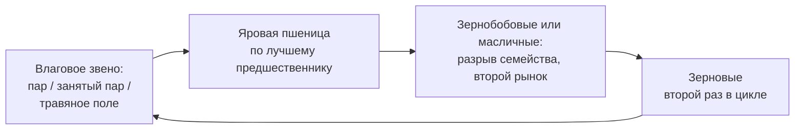

# Проектируем схему севооборота под влагообеспеченность своей зоны

> ⏱ **Трудозатраты:** ~14 мин чтения + ~25 мин практики
> Модуль **П9: Севообороты и кормовая база**, урок 1 из 3.
> Профессиональный уровень (агрономы, фермеры, МСБ). Проект UNDP-KAZ FOLUR. Компоненты FOLUR: **1**, **2**.

## Цели урока и место в модуле

Севооборот — не таблица из учебника, а главный многолетний договор агронома с полем: что, после чего и зачем растёт на каждом клине. Этот урок закладывает основу модуля: разбираем, что именно ломает бессменная пшеница, почему в степной зоне Северного Казахстана любое чередование культур проектируется «от влаги», как работает пара «предшественник → культура» и из чего собирается принципиальная схема севооборота. В [Уроке 2](02-kormovaya-baza.md) в схему войдут кормовые культуры, в [Уроке 3](03-sborka-i-perekhod.md) она превратится в ротационную таблицу конкретных полей.

После изучения урока слушатель сможет:

1. **[Bloom: знать]** перечислять четыре функции севооборота (влага, фитосанитария, плодородие, распределение рисков и работ) и основные группы культур зернового пояса.
2. **[Bloom: понимать]** объяснять, почему влагообеспеченность — главный ограничитель степного севооборота и чем химический пар и стерневой фон отличаются от механического пара по влаге и защите почвы.
3. **[Bloom: применять]** подбирать предшественников по качественной таблице урока и составлять принципиальную схему чередования для условий Костанайской, Северо-Казахстанской или Акмолинской области.
4. **[Bloom: анализировать]** находить в существующей структуре посевов признаки «усталости от пшеницы» и обосновывать, какое звено схемы их лечит.

> **Границы урока.** Внутри: функции севооборота, влага как ограничитель, пар и его альтернативы, предшественники, диверсификация зернового клина, принципиальная схема. За рамками: кормовые культуры и интеграция с животноводством — в [Уроке 2](02-kormovaya-baza.md); привязка схемы к конкретным полям и план перехода — в [Уроке 3](03-sborka-i-perekhod.md); технология no-till и техника для стерневых фонов — в модуле [П8](../../p8/index.md); научная механика деградации почв — в [лекции А5 о деградации земель](../../a5/lectures/02-degradaciya-zemel.md).

---

## 1. Что ломает бессменная пшеница: четыре функции севооборота

Пшеница — ключевая товарная культура региона и всего проекта FOLUR (её доля в посевных площадях и товарной выручке зернового пояса — ведущая; конкретные проценты `[UNVERIFIED]` — сверяйте по данным Бюро национальной статистики РК), поэтому соблазн сеять её «по пшенице» год за годом понятен: рынок знаком, техника настроена, элеватор рядом. Но бессменный посев — это кредит у собственного поля, и проценты по нему растут с каждым сезоном.

Севооборот выполняет четыре функции, и каждая из них — это конкретная статья, по которой монокультура платит.

**Влага.** Разные культуры по-разному расходуют почвенную влагу и по-разному оставляют поле после себя: одни иссушают глубокие горизонты, другие уходят рано и дают почве «дозарядиться» осадками второй половины лета, стерневой фон задерживает снег. Чередование позволяет управлять водным балансом поля, а не просто расходовать его.

**Фитосанитария.** Возбудители болезней, вредители и сорняки, «настроенные» на культуру, накапливаются при её повторных посевах. Смена культуры разрывает их цикл: патоген, зимующий на пожнивных остатках пшеницы, не находит хозяина в год гороха или льна. Это самая быстрая отдача севооборота — эффект виден уже на первой ротации.

**Плодородие.** Зернобобовые в симбиозе с клубеньковыми бактериями фиксируют азот воздуха и оставляют часть его в почве следующей культуре; многолетние травы восстанавливают структуру почвы корневой массой; разные по глубине корневые системы «работают» с разными горизонтами. Монокультура эксплуатирует один и тот же профиль одним и тем же способом — это прямой путь к дегумификации, разобранной в [лекции А5](../../a5/lectures/02-degradaciya-zemel.md).

**Риски и работы.** Разные культуры по-разному переносят засуху в разные фазы, убираются в разные сроки и продаются на разных рынках. Диверсифицированный севооборот распределяет погодный и ценовой риск, а заодно «растягивает» пики посевной и уборки — та же техника и те же люди успевают больше.

Итог для практика: бессменная пшеница проигрывает не в идеологии, а в бухгалтерии — рост затрат на защиту растений, постепенное падение отдачи от удобрений, уязвимость к одному рынку и одной погоде. Севооборот — способ вернуть эти статьи под контроль без капитальных вложений: чередование культур стоит хозяйству решения, а не денег.

## 2. Влага — главный проектировщик степного севооборота

Северный Казахстан — зона рискованного земледелия: влагообеспеченность ограничена, осадки распределены неравномерно по годам и по сезону, а значительная часть годовой влаги приходит снегом. Конкретные многолетние нормы осадков для своего района модуль сознательно не приводит — их следует брать из данных Казгидромета и региональных рекомендаций НИИ сельского хозяйства, а не из лекции. Для проектирования схемы важны не миллиметры, а три принципа.

**Принцип 1: влага накапливается зимой — храните её стернёй.** Снег — главный резервуар степного поля, а высокая стерня — главный бесплатный снегозадержатель: она держит снег там, где он выпал, и защищает почву от выдувания. Поэтому севооборот и технология обработки — неразделимая пара: схема чередования, при которой поле уходит в зиму чёрным и голым, теряет влагу ещё до посева. Подробно технику стерневых фонов и no-till разбирает модуль [П8](../../p8/index.md).

**Принцип 2: культуры делятся на «сушащие» и «щадящие».** Поздноубираемые культуры с глубокой корневой системой (подсолнечник — классический пример) оставляют после себя иссушенный профиль, и ставить после них влаголюбивую культуру — значит закладывать недобор ещё с осени. Рано освобождающие поле культуры (горох, ранние зерновые) дают почве накопить влагу остатком лета и осенью. Схема чередования — это в первую очередь расписание расхода и накопления влаги.

**Принцип 3: чем суше зона, тем короче и «осторожнее» ротация.** В более обеспеченных влагой районах лесостепной кромки работают длинные разнообразные ротации; в сухостепных — короткие схемы с паровым или выводным звеном и минимумом влагоёмких культур. Один и тот же севооборот не переносится между зонами копированием — переносится метод его проектирования.

### 2.1 Пар: зачем он нужен и чем за него платят

Пар — поле, которое сезон не занято культурой и работает на накопление влаги и очистку от сорняков. В засушливой степи паровое звено традиционно служило «страховым депозитом» влаги под последующую пшеницу. Но у классического механического пара (многократные обработки за лето) есть цена, которую агроэкология считает высокой: голая почва весь сезон открыта ветровой и водной эрозии, органическое вещество ускоренно минерализуется, а влага с открытой поверхности испаряется.

Современный компромисс — **химический пар**: сорная растительность контролируется гербицидами без механических обработок, стерня и мульча остаются на поверхности, почва защищена, влага сохраняется лучше. Ещё один путь — сокращать долю чистого пара, заменяя его «занятым» звеном: рано убираемой культурой или донниковым/травяным полем, которое и кормит, и восстанавливает. Выбор между этими вариантами — решение по конкретной зоне и полю: чем суше и чем засорённее поле, тем сильнее аргументы за паровое звено; чем лучше влагообеспеченность и техника, тем реальнее обойтись без чистого пара вовсе. Именно это решение вы обоснуете в пояснительной записке своего севооборота в [Уроке 3](03-sborka-i-perekhod.md).

!!! warning "Границы применимости"
    Спор «пар против беспарья» не решается лозунгом — только расчётом по своей зоне, засорённости и технике. Урок даёт критерии выбора, но не универсальный ответ: доля пара, схемы гербицидных обработок и сроки — предмет региональных рекомендаций НИИ и полевого опыта, а не лекции. Любое «правильное соотношение процентов», названное без привязки к вашей зоне (в том числе ИИ-ассистентом), считайте непроверенным.

## 3. Предшественники: пара «после чего → что»

Рабочая единица севооборота — не культура, а пара «предшественник → культура». Качественная логика подбора устойчива и переносима между зонами, даже когда числовые рекомендации различаются.

| Предшественник | Что оставляет полю | Кому хорош | Кого после него избегать |
|---|---|---|---|
| Пар (химический/механический) | Максимум влаги, чистое от сорняков поле | Наиболее требовательной товарной культуре (яровая пшеница) | «Тратить» пар на неприхотливые культуры расточительно |
| Зернобобовые (горох, чечевица, нут) | Азот, раннее освобождение поля, фитосанитарный разрыв | Зерновым | Другим бобовым (общие болезни) |
| Зерновые (пшеница, ячмень) | Стерня (снегозадержание), но общие болезни зерновых | Культурам других семейств | Повторным зерновым сверх допустимого — накопление инфекции |
| Масличные (лён, рапс, горчица) | Фитосанитарный разрыв для зерновых | Зерновым | Самим себе: возврат на поле только через несколько лет (капустные — из-за общих болезней) |
| Подсолнечник | Поздняя уборка, глубокое иссушение профиля | Полю нужен восстановительный интервал по влаге | Влаголюбивым культурам сразу после него |
| Многолетние травы (пласт) | Структура почвы, органика, чистота | Требовательным культурам по пласту | — (дефицитный, самый ценный предшественник) |

Таблица намеренно качественная: она отвечает на вопрос «почему», а допустимое число повторных посевов, сроки возврата культуры на поле и нормы — на совести региональных рекомендаций для вашей зоны. Два общих правила, которые нарушают чаще всего:

1. **Правило семейства.** Культуры одного семейства делят болезни и вредителей — их нельзя ставить друг за другом и нужно выдерживать интервал возврата на то же поле. Особенно строго это для капустных масличных (рапс, горчица) и для бобовых.
2. **Правило влажной очереди.** Самый влагообеспеченный предшественник отдаётся самой требовательной и самой ценной культуре. Пар «под ячмень на фураж» — типичная ошибка распределения: страховой запас влаги потрачен туда, где он меньше всего решает.

## 4. Диверсификация зернового клина: чем разбавлять пшеницу

Диверсификация — не отказ от пшеницы, а её защита: культуры-«разбавители» возвращают пшенице хороших предшественников и разгружают её рынок. Для зернового пояса Северного Казахстана в схему обычно претендуют три группы.

**Зернобобовые (горох, чечевица, нут).** Двойная работа: азотфиксация плюс фитосанитарный разрыв, раннее освобождение поля. Это направление прямо поддерживается страновым проектом FOLUR: среди агроэкологических финансовых инструментов проекта — **форвардные закупки бобовых** (подтверждённый инструмент — см. библиографию [программы модуля](../index.md)); проверка актуальных условий участия — предмет модуля [П14](../../p14/index.md).

**Масличные (лён, рапс, горчица, подсолнечник).** Рыночная альтернатива зерну и фитосанитарный разрыв. Требуют дисциплины возврата (правило семейства) и трезвой оценки влаги: подсолнечник в сухостепной зоне — решение с долгими последствиями для водного баланса поля.

**Кормовые (однолетние смеси, многолетние травы).** Их место и логику разберёт [Урок 2](02-kormovaya-baza.md): даже хозяйству без собственного поголовья травяное звено интересно как восстановитель почвы и рыночный продукт (сено), а проект FOLUR поддерживает многолетние травы товарным кредитом.

Как выбирать? Не «что модно», а по трём фильтрам: (1) культура агрономически проходит по влаге и предшественникам вашей зоны; (2) у неё есть реальный канал сбыта с досягаемой логистикой — культура без покупателя севооборот не лечит, а обременяет; (3) хозяйство технически готово (сеялка, уборка, подработка, хранение). Фильтр рынка и техники часто строже агрономического — честно проверяйте все три.

## 5. Принципиальная схема: от набора культур к чередованию

Собираем урок в метод. Принципиальная схема — это замкнутый цикл звеньев, где каждое звено обосновано через влагу и предшественника. Порядок проектирования:

1. **Определите влаговое звено.** Что будет «страховым депозитом» влаги и чистоты: чистый (лучше химический) пар, занятый пар, травяное поле? Это решение диктует зона (§2.1).
2. **Поставьте главную культуру на лучшее место.** Товарная пшеница получает самый влагообеспеченный и чистый предшественник (правило влажной очереди, §3).
3. **Добавьте разрыв другого семейства.** Зернобобовое или масличное звено между зерновыми — фитосанитарный разрыв и второй рынок (§4).
4. **Проверьте каждую пару стыков.** Пройдите цикл по кругу: каждая пара «предшественник → культура» должна проходить таблицу §3 — включая стык «последняя культура → первое звено», о котором забывают чаще всего.



*Рис. 1. Принципиальная схема четырёхзвенного цикла: влаговое звено → пшеница → разрыв другого семейства → зерновые → снова влаговое звено. Alt: блок-схема замкнутого цикла из четырёх звеньев — влаговое звено (пар, занятый пар или травы) передаёт влагу и чистое поле яровой пшенице; за пшеницей идёт зернобобовое или масличное звено как фитосанитарный разрыв; затем зерновые второй раз; цикл замыкается возвратом к влаговому звену.*

Схема на рис. 1 — учебный каркас, а не рецепт: в вашей зоне она может сжаться до трёх звеньев или растянуться до пяти, влаговое звено может оказаться донником, а «второй рынок» — чечевицей или льном. Важно другое: **каждая стрелка схемы должна иметь обоснование в одну фразу** («после гороха — пшеница: азот и раннее поле», «после подсолнечника — восстановительный интервал по влаге»). Схема, стрелки которой вы не можете объяснить, — это чужая схема.

### 5.1 Три типичных дефекта принципиальных схем

Проверяя чужие (и свои) схемы, чаще всего встречаете три дефекта. **Первый — «схема из другой зоны»:** чередование, взятое из журнала, у соседа с лесостепной кромки или из ответа ИИ-ассистента, где влаговое звено и набор культур не соответствуют вашей влагообеспеченности. Диагноз простой: автор схемы не может объяснить влаговое звено через вашу зону. **Второй — «забытый стык»:** цикл проверен по звеньям слева направо, но пара «последняя культура → первое звено» нарушает таблицу предшественников; схема разваливается на второй ротации. **Третий — «рынок по умолчанию»:** в схему поставлена культура, у которой нет ни покупателя в досягаемой логистике, ни техники под сев и уборку; агрономически звено безупречно, экономически — мёртвое. Все три дефекта ловятся вопросами из четырёх шагов этого параграфа — и именно их вы будете целенаправленно искать в вариантах ИИ-ассистента в [задании модуля](../ai-assistant.md).

> **Подробнее** — привязку схемы к реальным полям и ротационную таблицу строит [Урок 3](03-sborka-i-perekhod.md), а восстановить фактическую историю полей по снимкам поможет [практикум](../practicum/01-rotacionnaya-tablica.md).

---

## Региональный кейс

**Ситуация.** Зерновое хозяйство в Северо-Казахстанской области много лет работает по упрощённой схеме «пар — пшеница — пшеница — пшеница». Последние сезоны агроном фиксирует: затраты на фунгициды и гербициды растут, третья пшеница по пару заметно слабее первой, а весь доход хозяйства зависит от одной цены на одном элеваторе. Руководитель просит предложить схему диверсификации «без революции» — с сохранением пшеницы как главной культуры.

**Данные.** Снимки Sentinel-2 за последние три сезона (браузер Copernicus, <https://dataspace.copernicus.eu/>): сезонные NDVI-профили полей покажут фактическое чередование и состояние третьей пшеницы против первой; ESA WorldCover — контроль границ пашни; журналы полей хозяйства.

**Задача.**

1. По четырём функциям севооборота (§1) объясните, какие именно статьи затрат в этом хозяйстве «оплачивают» бессменную пшеницу.
2. Предложите, какое звено и куда вставить в схему «пар — пшеница — пшеница — пшеница», чтобы разорвать накопление инфекции и добавить второй рынок, — с обоснованием каждой пары стыков по таблице §3.
3. Какие два вопроса нужно проверить по региональным источникам до утверждения новой схемы?

**Разбор.** Рост затрат на защиту растений — прямое следствие накопления инфекции и сорняков при повторных посевах (§1, фитосанитария); ослабление третьей пшеницы — исчерпание влагового и азотного ресурса парового звена (§2, §3). Минимальное изменение без революции — замена третьей пшеницы звеном другого семейства: зернобобовым (горох/чечевица: азот, раннее поле, форвардные закупки бобовых как канал сбыта — проверить условия в П14) или масличным (лён: разрыв и второй рынок). Схема становится «пар — пшеница — зернобобовые/масличные — пшеница»: обе пшеницы получают хороших предшественников. Проверить по региональным источникам: (1) агрономическую пригодность выбранной культуры для влагообеспеченности своей подзоны (рекомендации областного НИИ/опытной станции); (2) реальный канал сбыта и требования покупателя. Урожайности и цены в разборе намеренно не названы: их источник — данные своего хозяйства и действующий рынок, а не лекция.

---

## Закрепление и применение

!!! tip "Что это даёт вашему хозяйству"
    Севооборот — единственный агрономический инструмент, который одновременно снижает затраты на химию (фитосанитарный разрыв), страхует влагу (звено-«депозит») и добавляет второй рынок (бобовые, масличные) — и всё это без капитальных вложений. Одна обоснованная схема чередования заменяет годы ежесезонных «пожарных» решений.

!!! example "Попробуйте прямо сейчас (10 минут)"
    Откройте браузер Copernicus (dataspace.copernicus.eu), найдите свои поля и включите NDVI-визуализацию. Пролистайте три последних сезона: поля, которые каждый год «зеленеют» и «созревают» синхронно по одному календарю, — кандидаты в повторные зерновые. Найдите поле, которое хотя бы один сезон стояло «пустым» (низкий NDVI всё лето), — это пар. Вы только что начали восстанавливать фактическую ротацию своего хозяйства — полная методика в [практикуме](../practicum/01-rotacionnaya-tablica.md).

!!! warning "Границы применимости"
    Урок даёт качественную логику проектирования, переносимую между зонами. Числовые параметры — допустимая доля пара, сроки возврата культур, нормы высева — зона-специфичны и берутся из рекомендаций региональных НИИ и опытных станций, а не из этого текста. Схема, скопированная из другой природной зоны (или сгенерированная ИИ без привязки к вашей), — черновик для проверки, а не решение.

!!! question "Кейс для размышления"
    Сосед возражает: «Каждый гектар не под пшеницей — это недополученные деньги, бобовые пусть сеют те, у кого земли много». При этом его затраты на фунгициды за последние годы выросли, а пшеница по пшенице всё слабее. Какие скрытые статьи расходов он не считает — и как показать ему экономику фитосанитарного разрыва на горизонте полной ротации, не называя ни одной выдуманной цифры?

---

### Проверь себя

```quiz
[
  {
    "q": "Какие четыре функции выполняет севооборот?",
    "options": ["Управление влагой, фитосанитарный разрыв, поддержание плодородия, распределение рисков и работ", "Повышение цены пшеницы, снижение налогов, экономия ГСМ, замена удобрений", "Только борьба с сорняками", "Только накопление влаги под пшеницу"],
    "answer": 0,
    "explain": "§1: влага, фитосанитария, плодородие, риски/работы — и каждая функция — конкретная статья, по которой платит монокультура."
  },
  {
    "q": "Чем химический пар отличается от классического механического?",
    "options": ["Сорняки контролируются гербицидами без обработок: стерня и мульча остаются на поверхности, почва защищена от эрозии, влага сохраняется лучше", "Он полностью исключает применение любых средств защиты", "Он требует больше механических обработок за лето", "Разницы нет — это синонимы"],
    "answer": 0,
    "explain": "§2.1: механический пар оставляет почву голой на весь сезон (эрозия, минерализация, испарение); химический сохраняет покров."
  },
  {
    "q": "Что такое «правило влажной очереди» при подборе предшественников?",
    "options": ["Самый влагообеспеченный предшественник отдаётся самой требовательной и ценной культуре — тратить пар на неприхотливый фураж расточительно", "Культуры сеют в порядке возрастания нормы полива", "Первым всегда сеют то поле, что ближе к водоёму", "Влажные годы чередуют с сухими"],
    "answer": 0,
    "explain": "§3: пар «под ячмень на фураж» — типичная ошибка распределения страхового запаса влаги."
  },
  {
    "q": "Почему рапс и горчицу нельзя часто возвращать на то же поле и ставить друг за другом?",
    "options": ["Они принадлежат одному семейству капустных и делят общие болезни — нарушается правило семейства", "Они несовместимы по срокам посева", "Они требуют разной техники", "Это запрещено требованиями элеваторов"],
    "answer": 0,
    "explain": "§3, правило семейства: культуры одного семейства накапливают общих патогенов; интервалы возврата — по региональным рекомендациям."
  },
  {
    "q": "По каким трём фильтрам урок предлагает отбирать культуру-«разбавитель» в зерновой клин?",
    "options": ["Агрономическая пригодность по влаге и предшественникам, реальный канал сбыта, техническая готовность хозяйства", "Мода, советы соседей, красота поля", "Только цена культуры на бирже", "Только минимальная норма высева"],
    "answer": 0,
    "explain": "§4: фильтр рынка и техники часто строже агрономического — проверяются все три."
  }
]
```

## Что дальше?

- [Урок 2. Встраиваем кормовую базу: связываем поле и ферму в одном севообороте](02-kormovaya-baza.md) — кормовые культуры, многолетние травы и интеграция с животноводством достроят принципиальную схему.
- [Практикум](../practicum/01-rotacionnaya-tablica.md) — восстановите фактическую историю полей модельного хозяйства по NDVI Sentinel-2 уже после Урока 1: таблица истории пригодится в Уроке 3.
- Смежные модули: [П8 (no-till и стерневые фоны)](../../p8/index.md) — технологическая пара севооборота; [А5](../../a5/index.md) — научная основа; [П14](../../p14/index.md) — проверка финансовых инструментов под диверсификацию.
