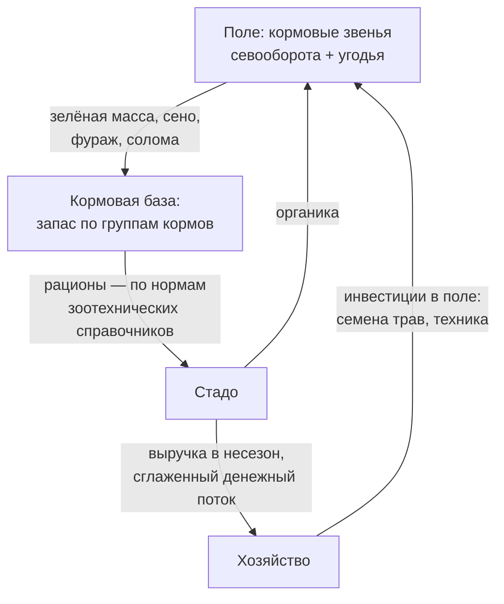

# Встраиваем кормовую базу: связываем поле и ферму в одном севообороте

> ⏱ **Трудозатраты:** ~14 мин чтения + ~25 мин практики
> Модуль **П9: Севообороты и кормовая база**, урок 2 из 3.
> Профессиональный уровень (агрономы, фермеры, МСБ). Проект UNDP-KAZ FOLUR. Компоненты FOLUR: **1**, **2**.

## Цели урока и место в модуле

[Урок 1](01-shema-pod-vlagu.md) собрал принципиальную схему севооборота «от влаги». Этот урок достраивает её вторым измерением — кормовым. Интеграция растениеводства и животноводства — не «два бизнеса на одной земле», а замкнутый контур, в котором поле кормит ферму, ферма возвращает полю органику и деньги в несезон, а многолетние травы работают сразу на три задачи: корм, почву и устойчивость. Разберём группы кормовых культур региона, качественный метод сведения кормового баланса и правила встраивания трав в севооборот. В [Уроке 3](03-sborka-i-perekhod.md) кормовое звено займёт своё место в ротационной таблице.

После изучения урока слушатель сможет:

1. **[Bloom: знать]** перечислять группы кормов (концентрированные, грубые, сочные, пастбищные) и основные кормовые культуры зернового пояса Северного Казахстана — однолетние смеси и многолетние травы.
2. **[Bloom: понимать]** объяснять, как замкнутый контур «поле → корм → скот → органика и доход → поле» повышает устойчивость хозяйства и почему многолетние травы — самый ценный и самый «медленный» элемент севооборота.
3. **[Bloom: применять]** сводить качественный кормовой баланс хозяйства: инвентаризация поголовья → структура годовой потребности → источники покрытия по группам кормов → кормовые звенья севооборота.
4. **[Bloom: анализировать]** находить дисбалансы («скот есть — кормового звена нет», перегруженное пастбище, травы без плана распашки пласта) и предлагать их разрешение.

> **Границы урока.** Внутри: логика интеграции, группы кормовых культур, качественный кормовой баланс, травы в севообороте, пастбища и сенокосы как часть кормовой базы. За рамками: нормы кормления и рационы — зоотехния, берутся из справочников и у зоотехника; сборка полной ротационной таблицы — в [Уроке 3](03-sborka-i-perekhod.md); экосистемная сторона трав, лесополос и пастбищ — в [П13](../../p13/index.md); зонирование угодий хозяйства — в [П5](../../p5/index.md); финансовые инструменты под травы и бобовые — проверка в [П14](../../p14/index.md).

---

## 1. Зачем зерновому хозяйству ферма (и ферме — севооборот)

Чисто зерновое хозяйство степной зоны живёт в жёстком ритме: один-два пика выручки в год, полная зависимость от урожая и цены, а всё, что не зерно (солома, отава, неудачные поля), — обуза. Животноводство меняет эту арифметику не столько добавкой второго продукта, сколько замыканием потоков.

**Что ферма даёт полю.** Во-первых, рынок для того, что иначе не продать: фуражное зерно нестандартных партий, солома, сено с выводных полей и залуженных участков, зелёная масса однолетних смесей. Во-вторых, органику: навоз — возврат углерода и питательных веществ в почву, самый старый инструмент против дегумификации ([лекция А5](../../a5/lectures/02-degradaciya-zemel.md)). В-третьих, экономическое оправдание для кормовых и восстановительных звеньев севооборота: травяное поле перестаёт быть «потерянным гектаром» и становится сырьевым цехом.

**Что поле даёт ферме.** Стабильную кормовую базу вместо закупок по рыночным ценам в худший момент (корма дорожают именно в неурожайные годы — когда они нужнее всего). Планируемое качество: агроном управляет составом смесей и сроками уборки под потребности стада.

**Что получает хозяйство в целом.** Сглаженный денежный поток (животноводческая выручка распределена по году), распределённый риск (засушливый для зерна год не обнуляет ферму), занятость людей и техники в несезон. Рамка FAO «10 элементов агроэкологии» называет это синергией и переработкой: отходы одного контура — ресурс другого. Страновой проект FOLUR поддерживает это направление конкретным финансовым инструментом — **товарным кредитом на многолетние травы** (подтверждённый инструмент — см. библиографию [программы модуля](../index.md); актуальные условия проверяются через [П14](../../p14/index.md)).

Важная оговорка масштаба: интеграция не обязана означать собственный откормочник. Контур замыкается и в кооперации — сосед-животновод покупает ваше сено и однолетние смеси, вы получаете канал сбыта кормового звена и, по договорённости, органику. Кормовая база — понятие территории, а не только одного землепользования (логика ILM программы FOLUR).



*Рис. 1. Замкнутый контур интеграции: поле формирует кормовую базу, стадо возвращает полю органику, а хозяйству — распределённую по году выручку. Alt: блок-схема цикла — кормовые звенья севооборота и угодья дают зелёную массу, сено, фураж и солому в кормовую базу; из неё по зоотехническим нормам кормится стадо; стадо возвращает органику полю и выручку хозяйству; хозяйство инвестирует в поле — цикл замыкается.*

## 2. Из чего состоит кормовая база: группы кормов и культуры региона

Чтобы разговаривать с зоотехником и сводить баланс, агроному достаточно четырёх групп кормов.

**Концентрированные** — фуражное зерно (ячмень, овёс, отчасти пшеница нестандартных партий) и высокобелковые добавки (зернобобовые, жмыхи и шроты масличных). Самая «дорогая» группа: именно её чаще всего докупают, и именно её закрывают фуражные и зернобобовые звенья севооборота.

**Грубые** — сено, сенаж, солома. Основа зимнего содержания жвачных. Источники: многолетние травы (сеяные поля и улучшенные сенокосы), однолетние травы на сено и сенаж, солома как побочный продукт зернового клина (с оговоркой: часть соломы должна оставаться на поле как мульча и защита — баланс «корм против почвы» решается по конкретному полю, см. [П8](../../p8/index.md)).

**Сочные и зелёные** — зелёная масса летом, силос там, где есть влагообеспеченные участки и техника. В сухостепной зоне ставка обычно смещена на пастбищный конвейер и сенаж, а не на классический силос.

**Пастбищные** — естественные и сеяные пастбища. Самый дешёвый корм сезона, но и самый уязвимый ресурс: перегрузка разрушает травостой быстрее любой засухи (§5).

Культуры-рабочие лошадки региона (перечень качественный — сортовой состав и нормы высева берите из региональных рекомендаций): **однолетние** — овёс и ячмень на зернофураж и зелёную массу, горохо-овсяные и другие бобово-злаковые смеси, суданская трава и просовидные на зелёный конвейер и сено, донник как двулетний «мост» между однолетними и многолетними звеньями; **многолетние** — житняк (засухоустойчивый злак, основа залужения в сухой степи), эспарцет и люцерна (бобовые травы — белок и азотфиксация, люцерна требовательнее к влаге), кострец в более обеспеченных влагой подзонах, бобово-злаковые травосмеси как штатное решение для долголетних полей.

Для сравнения питательности кормов зоотехния использует условные единицы — исторически распространена **кормовая единица**, приравненная к питательности килограмма овса, современные системы считают по обменной энергии. Агроному важно не значение коэффициентов (их берут из зоотехнических справочников), а сам принцип: **потребность стада и продуктивность угодий приводятся к общей мере** — только так их можно сравнивать и сводить в баланс.

## 3. Качественный кормовой баланс: метод четырёх шагов

Кормовой баланс отвечает на один вопрос: **закрывает ли земля хозяйства годовую потребность стада по каждой группе кормов — с запасом на плохой год?** Точный расчёт делается с зоотехником по справочным нормам; агроному для проектирования севооборота достаточно качественной процедуры.

**Шаг 1: инвентаризация стада.** Виды, половозрастные группы, поголовье сейчас и планируемое на горизонте севооборота (стадо растёт медленно, севооборот меняется ещё медленнее — планируйте на встречу). Результат — таблица поголовья.

**Шаг 2: структура потребности.** По каждой группе животных — какие группы кормов и в какой сезон нужны: зимнее стойловое содержание (грубые + концентраты), летний выпас (пастбища + зелёный конвейер), переходные периоды. Числовые нормы на голову — из зоотехнических справочников или от зоотехника; в проекте севооборота достаточно зафиксировать, **какие группы кормов и в каком относительном объёме** нужны хозяйству.

**Шаг 3: источники покрытия.** Против каждой группы кормов — чем она закрывается: пастбищные — угодьями (с честной оценкой их состояния, §5), грубые — травяными полями и сенокосами, концентраты — фуражным и зернобобовым звеном, дефицит — закупкой. Всё, что «закрывается закупкой», — кандидат на новое звено севооборота: посчитайте с экономистом, что дешевле на горизонте ротации.

**Шаг 4: страховой запас.** Степная зона не прощает планирования «впритык»: засушливый год снижает и урожай зерна, и укосы трав, и ёмкость пастбищ одновременно. Практика региона — переходящий запас грубых кормов и гибкие звенья (однолетние смеси, площадь которых можно нарастить решением одного сезона). Конкретный размер запаса — решение хозяйства по опыту своей зоны; правило урока: **в балансе должна быть строка «плохой год», и она не может быть пустой**.

Результат четырёх шагов — одна таблица «группа кормов → потребность (качественно: закрыта/дефицит) → источник → звено севооборота». Она и есть техническое задание кормовой части вашего севооборота для [Урока 3](03-sborka-i-perekhod.md).

### 3.1 Мини-пример: как читается сведённый баланс

Как выглядит результат на практике. Хозяйство со стадом КРС проходит четыре шага и получает такую картину: пастбищные корма — закрыты угодьями, но с поправкой на сбитый участок у лагеря (фактическая ёмкость ниже паспортной); грубые — дефицит, сено закупается, значит, кандидат на травяное выводное поле и однолетние смеси; концентраты — частично закрыты фуражным ячменём, белковая часть закупается, значит, кандидат на зернобобовое звено (которое заодно даст пшенице предшественника — двойная работа, [Урок 1, §3](01-shema-pod-vlagu.md)); строка «плохой год» — пуста, значит, первый же обильный укос уходит не в продажу, а в переходящий запас. Обратите внимание: баланс ни разу не потребовал точных коэффициентов — все решения о **звеньях** принимаются на качественном уровне, а точные площади под них считаются потом, с зоотехником и по нормам справочников. Именно в таком виде кормовое задание входит в ротационную таблицу [Урока 3](03-sborka-i-perekhod.md).

## 4. Многолетние травы в севообороте: самый ценный и самый медленный элемент

Многолетние травы — единственное звено, которое одновременно кормит (сено, сенаж, выпас), лечит почву (корневая масса, структура, для бобовых — азот) и защищает её (постоянный покров на эрозионно-опасных и засолённых участках). Но у трав своя механика времени, и её надо уважать.

**Травы — это обязательство на годы.** Поле под многолетними травами выходит из ежегодной ротации: год посева трава слаба и полноценного укоса обычно не даёт, продуктивное долголетие — несколько лет, затем травостой изреживается и пласт распахивается под требовательную культуру (пласт — дефицитный предшественник высшей ценности, [Урок 1, §3](01-shema-pod-vlagu.md)). Поэтому травы встраивают двумя способами:

- **Выводное поле** — участок, выведенный из ротации под травы на весь их продуктивный срок; остальные поля крутятся в короткой схеме. Это штатное решение для сухостепной зоны: короткий севооборот сохраняет гибкость, травы живут своим циклом.
- **Травяное звено в длинной ротации** — для более влагообеспеченных подзон: травы занимают своё место в цикле, и вся ротация удлиняется на их продуктивный срок.

**Травы — инструмент восстановления.** Залужение солеустойчивыми травами (житняк, донник) — типовое решение для солонцовых и деградированных клиньев, которые в пашне убыточны: участок переходит из статьи «ежегодный убыток» в статью «кормовое угодье» и одновременно в зону восстановления ландшафтного плана ([П5](../../p5/index.md)) — тот самый конфликт «доход против восстановления», разрешённый в пользу обоих.

**Травы требуют плана на всю жизнь травостоя.** Три решения принимаются до посева, а не после: чем закрыт кормовой поток в год посева (трава ещё не работает); каков план ухода (подсев, подкормка, режим использования); когда и подо что распахивается пласт. Травяное поле без этих трёх ответов — не звено севооборота, а отложенная проблема.

!!! example "Попробуйте прямо сейчас (10 минут)"
    Откройте браузер Copernicus (dataspace.copernicus.eu) и найдите вокруг своей территории поля, которые несколько сезонов подряд дают ранний невысокий пик NDVI со «ступенькой» вниз в середине лета (укос!) и без осеннего пика созревания. Это сигнатура многолетних трав и сенокосов — сравните её с профилем соседнего зернового поля. В [практикуме](../practicum/01-rotacionnaya-tablica.md) эта разница станет одним из ключей для восстановления истории полей.

## 5. Пастбища и сенокосы: кормовая база за пределами пашни

Естественные угодья — самая дешёвая часть кормовой базы и самая недоуправляемая. В кормовой баланс они входят с двумя честными поправками.

**Поправка на состояние.** Ёмкость угодья определяется состоянием травостоя, а не площадью в гектарах. Признаки перегрузки читаются без приборов: сбитые до земли участки у водопоя и загонов, оголённые пятна, замена ценных трав непоедаемыми и колючими видами. Перегруженное пастбище в балансе учитывается по фактической, а не паспортной ёмкости — иначе баланс сойдётся на бумаге и разойдётся в кормушке.

**Поправка на режим.** Главный инструмент управления угодьем — не вложения, а ротация выпаса: деление на загоны, очерёдность, отдых сбитых участков, регламент прибрежных полос (водопой — коридорами, полоса — закрыта; логика зонирования — [П5](../../p5/index.md), экосистемная сторона — [П13](../../p13/index.md)). Сеяные пастбища (житняковые и травосмеси) и улучшение сенокосов подсевом — следующая ступень, когда режим наведён: вкладываться в перегруженное угодье без смены режима — значит кормить проблему.

Связка с севооборотом двусторонняя: пашня страхует угодья (однолетний зелёный конвейер разгружает пастбища в критические периоды — ранняя весна, засушливая середина лета), а угодья разгружают пашню (меньше кормовых гектаров в ротации). Баланс между ними — решение шага 3 кормового баланса.

Про зелёный конвейер стоит сказать отдельно, потому что это самый гибкий кормовой инструмент агронома. Идея проста: несколько посевов однолетних культур и смесей с разными сроками сева и созревания выстраиваются так, чтобы зелёная масса поступала непрерывно с весны до осени — ранние смеси подхватывают стадо, пока пастбище ещё не окрепло, поздние закрывают провал засушливой середины лета, когда естественный травостой выгорает. Конвейер планируется на год и корректируется решением одного сезона — в отличие от многолетних трав, это «оперативный резерв» кормовой базы: в засушливый год его площадь наращивается, в благополучный — сокращается в пользу товарных культур. Состав культур конвейера для вашей подзоны — из региональных рекомендаций; логика встраивания в ротацию — та же таблица предшественников [Урока 1, §3](01-shema-pod-vlagu.md).

> **Подробнее** — нагрузочные нормы и ботанический состав угодий оценивайте с зоотехником и по региональным рекомендациям; ГИС-инвентаризация угодий — в [П2](../../p2/index.md) и [П5](../../p5/index.md).

---

## Региональный кейс

**Ситуация.** Хозяйство в Акмолинской области держит откормочное поголовье КРС и зерновой клин, но кормовое и зерновое планирование живут раздельно: концентраты закупаются зимой по пиковым ценам, сено возится издалека, ближнее пастбище у летнего лагеря сбито до пятен голой земли, а солонцовый клин продолжают сеять пшеницей «чтобы земля не гуляла». Агроном получает задачу: свести кормовой баланс и предложить кормовые звенья севооборота.

**Данные.** Снимки Sentinel-2 за три сезона (браузер Copernicus): NDVI-профили отличат зерновые поля от трав и покажут деградированные пятна пастбища; ESA WorldCover — слой травянистых угодий против пашни; инвентаризация стада и журналы закупки кормов хозяйства.

**Задача.**

1. Пройдите четыре шага кормового баланса (§3) по данным кейса: какие группы кормов в дефиците и чем это видно?
2. Предложите кормовые звенья: что закрывает концентраты, что — грубые корма, что делать с солонцовым клином и сбитым пастбищем (§4–§5)?
3. Какой финансовый инструмент проекта FOLUR имеет смысл проверить (через [П14](../../p14/index.md)) под предложенные звенья?

**Разбор.** Дефициты очевидны из закупок: концентраты (закрываются фуражным звеном — ячмень/овёс — и зернобобовыми, которые дают и белковый корм, и предшественника пшенице) и грубые корма (закрываются травяным выводным полем и однолетними смесями на сено/сенаж). Солонцовый клин — кандидат на залужение солеустойчивыми травами (житняк, донник): из ежегодного убытка — в кормовое угодье и зону восстановления. Сбитое пастбище лечится режимом раньше денег: загонная ротация, отдых сбитых участков, разгрузка зелёным конвейером с пашни в критические месяцы. Под многолетние травы стоит проверить условия товарного кредита на травы (инструмент странового проекта FOLUR — актуальные условия только из официальных источников). Числовые нормы кормления и площади звеньев в разборе намеренно не названы: они считаются с зоотехником по справочникам и поголовью конкретного хозяйства.

---

## Закрепление и применение

!!! tip "Что это даёт вашему хозяйству"
    Сведённый кормовой баланс превращает закупку кормов из ежегодного аврала в управляемое решение: вы заранее знаете, какая группа кормов в дефиците, каким звеном севооборота её закрыть и что оставить рынку. А замкнутый контур «поле → ферма → поле» даёт то, чего не даёт чистое зерно: выручку в несезон и органику в почву.

!!! warning "Границы применимости"
    Урок даёт агрономическую рамку, но не заменяет зоотехнию: нормы кормления, рационы и нагрузочные нормы пастбищ — из зоотехнических справочников и от специалиста. Любые «нормы» и «коэффициенты», названные по памяти или сгенерированные ИИ, считайте непроверенными до сверки со справочником. Перечень культур урока — типовой для зернового пояса; сортовой состав и нормы высева — по рекомендациям вашей зоны.

!!! question "Кейс для размышления"
    Руководитель говорит: «Скота у нас нет и не будет — зачем мне ваш Урок 2?» При этом в хозяйстве есть убыточный солонцовый клин, сосед-животновод в тридцати километрах и растущие затраты на защиту пшеницы от болезней. Какие минимум три аргумента за кормовое/травяное звено работают даже в хозяйстве без единой головы скота?

---

### Проверь себя

```quiz
[
  {
    "q": "Какие четыре группы кормов образуют кормовую базу?",
    "options": ["Концентрированные, грубые, сочные и зелёные, пастбищные", "Зимние, летние, весенние, осенние", "Покупные, собственные, обменные, страховые", "Белковые, жировые, углеводные, минеральные"],
    "answer": 0,
    "explain": "§2: концентраты (фураж, зернобобовые, шроты), грубые (сено, сенаж, солома), сочные/зелёные, пастбищные."
  },
  {
    "q": "Что такое кормовая единица и что из неё важно агроному?",
    "options": ["Условная мера питательности (исторически — питательность килограмма овса); важен принцип приведения потребности стада и продуктивности полей к общей мере, а коэффициенты берутся из справочников", "Единица веса комбикорма, равная одной тонне", "Норма кормления одной коровы в сутки, одинаковая для всех регионов", "Показатель влажности сена"],
    "answer": 0,
    "explain": "§2: агроному важен принцип общей меры для баланса; конкретные коэффициенты и нормы — зона ответственности зоотехнических справочников."
  },
  {
    "q": "Почему кормовой баланс обязан содержать строку «плохой год»?",
    "options": ["Засушливый год снижает урожай зерна, укосы трав и ёмкость пастбищ одновременно — планирование «впритык» оставляет стадо без кормов в момент пиковых цен", "Потому что этого требует форма отчётности", "Чтобы оправдать закупку лишней техники", "Строка нужна только хозяйствам без пашни"],
    "answer": 0,
    "explain": "§3, шаг 4: переходящий запас грубых кормов и гибкие однолетние звенья — страховка от синхронного провала всех источников."
  },
  {
    "q": "Что такое выводное поле?",
    "options": ["Участок, выведенный из ежегодной ротации под многолетние травы на весь их продуктивный срок, пока остальные поля крутятся в короткой схеме", "Поле, с которого выводят технику на зиму", "Поле у выезда из хозяйства", "Любое поле под паром"],
    "answer": 0,
    "explain": "§4: штатное решение сухостепной зоны — травы живут своим многолетним циклом, не удлиняя основную ротацию."
  },
  {
    "q": "Пастбище у летнего лагеря сбито до голых пятен. С чего начать по логике урока?",
    "options": ["С режима: загонная ротация, отдых сбитых участков, разгрузка зелёным конвейером — вкладываться в перегруженное угодье без смены режима бессмысленно", "С немедленного подсева дорогих травосмесей на сбитые пятна", "С увеличения поголовья, чтобы окупить угодье", "С распашки пастбища под пшеницу"],
    "answer": 0,
    "explain": "§5: главный инструмент управления угодьем — режим; ёмкость в балансе учитывается по фактическому состоянию, а не по площади."
  }
]
```

## Что дальше?

- [Урок 3. Собираем трёх- или пятипольный севооборот хозяйства и план перехода](03-sborka-i-perekhod.md) — принципиальная схема Урока 1 и кормовое задание Урока 2 станут ротационной таблицей конкретных полей.
- [Практикум](../practicum/01-rotacionnaya-tablica.md) — NDVI-сигнатуры трав и сенокосов из этого урока помогут отличить кормовые поля от зерновых в истории модельного хозяйства.
- Смежные модули: [П13](../../p13/index.md) — травы, лесополосы и угодья с экосистемной стороны; [П5](../../p5/index.md) — место кормовых угодий в ландшафтном плане; [П14](../../p14/index.md) — проверка инструментов поддержки (форвардные закупки бобовых, товарный кредит на травы) по официальным источникам.
