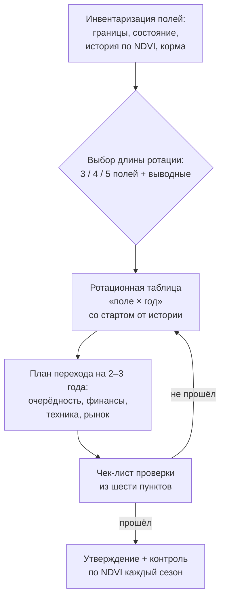

# Собираем трёх- или пятипольный севооборот хозяйства и план перехода

> ⏱ **Трудозатраты:** ~14 мин чтения + ~25 мин практики
> Модуль **П9: Севообороты и кормовая база**, урок 3 из 3.
> Профессиональный уровень (агрономы, фермеры, МСБ). Проект UNDP-KAZ FOLUR. Компоненты FOLUR: **1**, **2**.

## Цели урока и место в модуле

У вас есть принципиальная схема «от влаги» ([Урок 1](01-shema-pod-vlagu.md)) и кормовое задание ([Урок 2](02-kormovaya-baza.md)). Финальный урок превращает их в прикладной продукт модуля: трёх- или пятипольный севооборот конкретного хозяйства. Разберём, как провести инвентаризацию полей и восстановить их фактическую историю, чем трёхпольная схема отличается от пятипольной на практике, как строится ротационная таблица «поле × год», как спланировать переход от текущей структуры посевов без провала по деньгам и как проверить готовый севооборот по чек-листу — своему, консультантскому или сгенерированному ИИ.

После изучения урока слушатель сможет:

1. **[Bloom: понимать]** объяснять, чем трёхпольная и пятипольная схемы различаются по гибкости, требованиям к полям и месту кормового звена.
2. **[Bloom: применять]** проводить инвентаризацию полей с восстановлением фактической истории использования (журналы + NDVI-профили Sentinel-2) для хозяйства Костанайской, Северо-Казахстанской или Акмолинской области.
3. **[Bloom: применять]** строить ротационную таблицу «поле × год» на полный цикл и план перехода от текущей структуры посевов на 2–3 года.
4. **[Bloom: анализировать]** проверять готовый севооборот по чек-листу модуля из шести пунктов и обосновывать каждое отступление от предложенного варианта.

> **Границы урока.** Внутри: инвентаризация полей и их истории, выбор длины ротации, ротационная таблица, план перехода, чек-лист проверки, контроль выполнения по NDVI. За рамками: техника снятия NDVI-профилей по шагам — в [практикуме](../practicum/01-rotacionnaya-tablica.md); настройка регулярного NDVI-мониторинга — в [П3](../../p3/index.md); отбраковка ИИ-вариантов севооборота — в [ИИ-задании модуля](../ai-assistant.md); экономика перехода на no-till, часто сопутствующего смене ротации, — в [П8](../../p8/index.md).

---

## 1. Инвентаризация полей: севооборот привязывается к земле, а не к культуре

Принципиальная схема оперирует звеньями; севооборот — конкретными полями. Первый шаг сборки — паспорт каждого поля, и в нём четыре обязательные графы.

**Границы и площадь.** Ротация требует полей, сопоставимых по площади: если одно поле вдвое больше остальных, звено на нём «перекашивает» всю структуру посевов. Крупные неоднородные массивы на этом шаге иногда разумно разделить на рабочие участки (по логике зонирования [П5](../../p5/index.md): солонцовые пятна, ложбины и склоны — отдельные судьбы).

**Состояние.** Засорённость (какими сорняками — от этого зависит роль парового звена), известные болезни, деградированные и засолённые участки, рельефные ограничения. Честная графа «состояние» уже на этом шаге отправляет часть клиньев не в ротацию, а в залужение ([Урок 2, §4](02-kormovaya-baza.md)).

**Фактическая история за 3–5 лет.** Что реально росло на поле — а не что записано в планах. Источники: журналы хозяйства и — независимая проверка — сезонные NDVI-профили Sentinel-2. Логика проверки проста: у каждого типа использования своя годовая «подпись» вегетационного индекса. Яровые зерновые дают один выраженный пик с созреванием к уборке; пар — низкий NDVI весь сезон (с «зубцами» после обработок); многолетние травы и сенокосы — ранний старт и ступеньку укоса; подсолнечник — поздний, долго держащийся пик. По этим подписям история поля восстанавливается за вечер в браузере Copernicus — пошагово это делает [практикум](../practicum/01-rotacionnaya-tablica.md). История нужна не для отчёта: она определяет, с какой позиции каждое поле входит в новую ротацию (поле после трёх пшениц подряд и поле после гороха стартуют с разных звеньев).

**Кормовая нагрузка.** Из кормового баланса ([Урок 2, §3](02-kormovaya-baza.md)): какие поля уже работают на ферму, где выводные травяные поля, что закреплено за зелёным конвейером.

!!! example "Попробуйте прямо сейчас (10 минут)"
    Выберите одно своё (или любое знакомое) поле в браузере Copernicus (dataspace.copernicus.eu), включите NDVI и пролистайте помесячно два последних сезона. Запишите для каждого года одну строку: «пик — месяц, форма профиля, вывод о культуре». Сверьте с тем, что вы знаете о поле. Если сошлось — вы готовы к практикуму; если нет — тем интереснее: либо профиль прочитан неточно, либо журналы приукрашивают.

## 2. Три поля или пять: выбор длины ротации

«Трёх- или пятипольный» — это не про число гектаров, а про число позиций в цикле: сколько разных состояний проходит каждое поле, прежде чем цикл повторится.

**Трёхпольная схема** (например: влаговое звено → пшеница → вторая культура) — минимальная работающая ротация. Плюсы: проста в управлении, требует минимум разных технологий и рынков, легко объясняется любому механизатору, быстро разворачивается. Минусы: пшеница возвращается на то же поле часто; фитосанитарный разрыв короткий; каждая культура занимает треть площади — структура посевов жёсткая. Это типовой выбор для небольшого хозяйства, начинающего диверсификацию, и для сухостепной зоны с коротким списком уверенных культур.

**Пятипольная схема** добавляет два измерения свободы: длинный интервал возврата (пшеница видит одно и то же поле реже — фитосанитария выигрывает) и место для полноценного кормового или восстановительного звена (однолетние смеси, донник, выход на пласт). Цена — сложность: пять технологий, пять рынков или назначений, более тонкая логистика. Это выбор хозяйства с поголовьем ([Урок 2](02-kormovaya-baza.md)), устойчивыми каналами сбыта второй-третьей культуры или курсом на органику ([П10](../../p10/index.md)), где длинная диверсифицированная ротация — базовое требование.

Практическое правило выбора: **начинайте с самой короткой схемы, которую ваша земля терпит, — удлиняйте, когда упрётесь в её пределы.** Признаки «пора удлинять»: болезни не отпускают даже при соблюдении трёхполки; появился надёжный рынок третьей культуры; вырос кормовой заказ фермы. Обратный ход тоже легален: пятиполка, за которой хозяйство не успевает, хуже честной трёхполки. И помните про выводное поле ([Урок 2, §4](02-kormovaya-baza.md)) — травы не обязаны удлинять ротацию, они могут жить рядом с ней.

Частый практический вопрос: а если полей в хозяйстве не три и не пять, а, скажем, семь? Число рабочих полей не обязано равняться числу звеньев. Варианты решения: несколько полей «спариваются» и идут по циклу одним звеном (два поля пшеницы в каждый год четырёхзвенной схемы); часть полей выводится из основной ротации (травы, залужение, зелёный конвейер); или хозяйство ведёт две параллельные короткие ротации на разных группах полей — например, ближние поля с лучшей логистикой крутятся в интенсивной схеме, дальние — в упрощённой. Критерий выбора один: каждый год структура посевов должна оставаться управляемой и объяснимой (§3, правило 2), а каждое поле — знать своё следующее звено.

## 3. Ротационная таблица: «поле × год» на полный цикл

Ротационная таблица — главный рабочий документ севооборота: строки — поля, столбцы — годы, ячейка — что растёт. Правила заполнения:

1. **Стартовая колонка — фактическая история** (§1), а не желаемое состояние. Каждое поле входит в ротацию с того звена, которое допускает его предшественник.
2. **В каждый год представлены все звенья.** По столбцу таблицы структура посевов каждого года должна быть примерно постоянной: если в один год у вас три поля пшеницы, а в следующий — одно, севооборот спроектирован неверно (поля сдвигаются по циклу со сдвигом на одну позицию).
3. **Каждая ячейка проходит таблицу предшественников** [Урока 1, §3](01-shema-pod-vlagu.md) по вертикали времени: ячейка года N+1 — культура, допустимая после ячейки года N.
4. **Кормовые звенья закреплены** по заданию кормового баланса; выводные поля вынесены под таблицу отдельной строкой с годами залужения и распашки пласта.

Учебный пример четырёхпольной ротации (культуры условны, показан принцип диагонального сдвига):

| Поле | Год 1 | Год 2 | Год 3 | Год 4 |
|---|---|---|---|---|
| 1 | Химический пар | Пшеница | Горох | Ячмень |
| 2 | Пшеница | Горох | Ячмень | Химический пар |
| 3 | Горох | Ячмень | Химический пар | Пшеница |
| 4 | Ячмень | Химический пар | Пшеница | Горох |

Каждый столбец содержит все четыре звена (структура посевов стабильна), каждая строка проходит полный цикл, каждая вертикальная пара соседних лет — допустимая пара «предшественник → культура». Реальная таблица отличается от учебной ровно одним: стартовый столбец диктуется историей полей, поэтому первые год-два таблица «неидеальна» — это и есть план перехода.

## 4. План перехода: от текущей структуры к целевой ротации без провала

Севооборот нельзя «включить с понедельника»: поля находятся в разных состояниях, рынок новой культуры не появляется мгновенно, техника и люди учатся. План перехода — мост длиной 2–3 года, и у него четыре опоры.

**Очерёдность полей.** Первыми в новую ротацию входят поля, чей предшественник это допускает без натяжек; поля после многолетней бессменной пшеницы сначала «лечатся» (паровое или зернобобовое звено) и лишь затем занимают штатную позицию. Самые проблемные клинья (солонцы, деградированные) параллельно уходят в залужение — они не должны тормозить основную ротацию.

**Финансовая непрерывность.** Доля главной товарной культуры снижается постепенно: резкое сокращение пшеницы ради «правильной» структуры — типичная причина, по которой хозяйства бросают переход на втором году. Новая культура вводится с площади, потерю которой хозяйство переживёт при неудаче, — и наращивается по мере освоения агротехники и рынка.

**Технологическая готовность.** До первого сева новой культуры должны быть отвечены вопросы: чем сеять и убирать, где подрабатывать и хранить, кому продавать. Культура без ответа хотя бы на один вопрос остаётся в плане следующего года, а не текущего.

**Фиксация правил.** План перехода — документ: таблица «год → поле → звено → что для этого нужно → ответственный». Форматом он совпадает с дорожной картой ландшафтного плана [П5](../../p5/index.md) — и может быть её частью.

### 4.1 Три ошибки перехода, которые видно заранее

**«Всё и сразу».** Хозяйство одновременно меняет ротацию, вводит две новые культуры и переходит на no-till. Каждое изменение по отдельности разумно; вместе они не оставляют ни одного стабильного элемента, по которому можно понять, что именно сработало или сломалось. Правило: не больше одного крупного нововведения на поле в год; смену технологии обработки ([П8](../../p8/index.md)) и смену ротации разводите по полям или по годам.

**«Бумажный старт».** Ротационная таблица составлена от желаемого состояния полей («считаем, что поле 3 чистое»), а не от фактического. Первый же сезон вскрывает натяжку: культура по неподходящему предшественнику даёт слабый результат, и коллектив делает вывод «севообороты не работают». Лечится честной инвентаризацией §1 — включая независимую NDVI-проверку журналов.

**«Молчаливые отступления».** Отступление от таблицы в конкретный год — нормальная реакция на погоду и рынок; катастрофой его делает отсутствие записи. Незаписанное отступление через два года становится «фактической историей, которой никто не помнит», и хозяйство возвращается в исходную точку. Правило: любое отступление — строка в журнале с причиной и решением, как выправляется цикл.



*Рис. 1. Конвейер сборки севооборота: от инвентаризации через ротационную таблицу и план перехода к проверке по чек-листу; непрошедший проверку вариант возвращается на доработку таблицы. Alt: блок-схема — инвентаризация полей ведёт к выбору длины ротации, затем строится ротационная таблица от фактической истории, к ней план перехода на два-три года, далее проверка чек-листом из шести пунктов: прошедший вариант утверждается и контролируется по NDVI, непрошедший возвращается к таблице.*

## 5. Чек-лист проверки севооборота (и контроль выполнения)

Любой севооборот — свой, консультанта, соседа или ИИ-ассистента — перед утверждением проходит шесть проверок. Этот же чек-лист — рабочий инструмент [ИИ-задания модуля](../ai-assistant.md).

| № | Проверка | Источник |
|---|---|---|
| 1 | **Влага:** влаговое звено соответствует зоне; нет влагоёмких культур на иссушающих предшественниках | [Урок 1, §2](01-shema-pod-vlagu.md) |
| 2 | **Предшественники:** каждая вертикальная пара таблицы допустима; правило семейства и интервалы возврата соблюдены | [Урок 1, §3](01-shema-pod-vlagu.md) |
| 3 | **Фитосанитария:** повторные посевы одной культуры не превышают принятых для зоны; между зерновыми есть разрывы других семейств | [Урок 1, §3–4](01-shema-pod-vlagu.md) |
| 4 | **Корма:** звенья закрывают кормовой баланс, включая строку «плохой год»; травы имеют план на всю жизнь травостоя | [Урок 2, §3–4](02-kormovaya-baza.md) |
| 5 | **Реалистичность:** старт от фактической истории полей; переход без обрушения доли товарной культуры; техника и рынок готовы | §1, §4 этого урока |
| 6 | **Честность цифр:** в плане нет выдуманных урожайностей, цен и «сумм субсидий»; все числовые обещания либо со ссылкой на официальный источник, либо помечены «проверить» | правило платформы; проверка мер поддержки — [П14](../../p14/index.md) |

Утверждённый севооборот нуждается в контроле, и он у вас уже есть — тот же NDVI: раз в сезон профили полей сверяются с ротационной таблицей (то ли звено фактически на поле; как культура развивается против соседних лет). Настройка регулярного мониторинга без программирования — модуль [П3](../../p3/index.md). Отклонение от таблицы — не катастрофа, а событие для записи: севооборот — живой документ, но каждое отступление должно быть записано и обосновано, иначе через три года у хозяйства снова будет «фактическая история», не совпадающая с планами.

Последнее замечание о статусе чек-листа. Он не заменяет региональную агрономическую экспертизу — он гарантирует, что до экспертизы доходит внятный, внутренне непротиворечивый документ, а не набор пожеланий. Практика показывает, что большинство «севооборотов», которые разваливаются на второй-третий год, провалили бы ещё пункты 1, 5 или 6 — то есть были обречены до первого сева. Шесть вопросов чек-листа занимают полчаса; сезон, потерянный на непроверенной схеме, — год.

---

## Региональный кейс

**Ситуация.** Хозяйство в Костанайской области: шесть рабочих полей сопоставимой площади. По журналам и NDVI-истории: три поля — повторная пшеница несколько лет подряд, одно — под химическим паром в прошлом сезоне, одно — горох в прошлом году, одно — солонцовый клин с худшими профилями NDVI из года в год. Поголовья нет, но соседнее хозяйство стабильно закупает сено. Агроном собирает четырёхпольную ротацию «химпар → пшеница → зернобобовые → ячмень» плюс решения по «лишним» полям.

**Данные.** Sentinel-2 NDVI за 3 сезона (браузер Copernicus) — история и состояние полей; ESA WorldCover — контроль пашни и травянистых участков; журналы полей.

**Задача.**

1. Назначьте каждому из шести полей стартовое звено года 1 — от фактической истории (§3, правило 1) и по таблице предшественников.
2. Солонцовый клин в четырёхполку не помещается: какое решение предлагает логика модуля и как оно связано со спросом соседа на сено?
3. Пройдите собранный вариант по чек-листу §5: какие пункты требуют действий до утверждения?

**Разбор.** Поле после химпара — под пшеницу (лучший предшественник — самой ценной культуре); поле после гороха — под пшеницу или ячмень (азот, раннее поле); из трёх повторно-пшеничных полей одно уходит в химический пар (самое засорённое — по обработкам и «рваным» NDVI-профилям), одно — под зернобобовые (разрыв семейства), одно — под ячмень с планом лечения в следующем цикле. Солонцовый клин — шестое, выводное поле: залужение солеустойчивыми травами (житняк/донник) с продажей сена соседу — кормовое звено, работающее на рынок, а не на собственную ферму; параллельно это зона восстановления для ландшафтного плана ([П5](../../p5/index.md)). По чек-листу до утверждения остаются пункт 5 (канал сбыта зернобобовых: проверить покупателя и логистику; техника для мелкосемянных — если выбран лён) и пункт 6 (условия форвардных закупок бобовых и товарного кредита на травы — только из официальных источников через [П14](../../p14/index.md)). Площади и урожайности в разборе намеренно не названы — они принадлежат данным конкретного хозяйства.

---

## Закрепление и применение

!!! tip "Что это даёт вашему хозяйству"
    Ротационная таблица + план перехода — это севооборот, который можно предъявить: агроному-консультанту на проверку, партнёру по «зелёной» цепочке как основание качества сырья, в заявке на поддержку как план диверсификации. Внутри хозяйства она заменяет ежевесенний спор «что куда сеем» одним взглядом в таблицу.

!!! warning "Границы применимости"
    Учебная таблица §3 демонстрирует принцип, а не рецепт: набор культур, доля пара и длина ротации — решения по вашей зоне, полям и рынку. NDVI-подписи культур (§1) надёжно различают крупные классы (зерновые / пар / травы / поздние культуры), но не сорта и не всегда близкие культуры одного семейства — спорные годы сверяйте с журналами. Все числовые нормы — из региональных рекомендаций, а не из этого текста.

!!! question "Кейс для размышления"
    Через два года после утверждения ротации хозяйство дважды отступило от таблицы: в засушливый год вместо зернобобовых повторили пшеницу («жалко было пар»), а поле под ячмень отдали под подсолнечник («была цена»). NDVI-контроль показывает: оба поля теперь дают худшие профили в хозяйстве. Как оформить эти события в живом документе севооборота — и какое правило перехода (§4) было нарушено в момент каждого решения?

---

### Проверь себя

```quiz
[
  {
    "q": "Почему стартовая колонка ротационной таблицы заполняется от фактической истории полей, а не от целевой схемы?",
    "options": ["Каждое поле входит в ротацию только с того звена, которое допускает его реальный предшественник: поле после трёх пшениц и поле после гороха стартуют с разных позиций", "Так таблица выглядит солиднее для проверяющих", "История нужна только для отчётности и на ротацию не влияет", "Потому что целевую схему составлять необязательно"],
    "answer": 0,
    "explain": "§1, §3 (правило 1): «неидеальные» первые год-два таблицы — это и есть план перехода."
  },
  {
    "q": "Чем пятипольная схема принципиально выигрывает у трёхпольной?",
    "options": ["Длиннее интервал возврата культуры на поле (фитосанитария) и есть место полноценному кормовому или восстановительному звену", "Она всегда даёт больше валового сбора пшеницы", "Она не требует плана перехода", "Она позволяет не вести ротационную таблицу"],
    "answer": 0,
    "explain": "§2: цена выигрыша — сложность (пять технологий и рынков); правило урока — начинать с самой короткой схемы, которую терпит земля."
  },
  {
    "q": "Что означает правило «в каждый год представлены все звенья» для ротационной таблицы?",
    "options": ["Структура посевов по столбцу каждого года примерно постоянна: поля сдвигаются по циклу на одну позицию, и хозяйство не получает год с тремя полями пшеницы и год с одним", "Каждое поле должно быть засеяно всеми культурами одновременно", "Все поля в один год должны быть под одной культурой", "Звенья можно распределять по годам произвольно"],
    "answer": 0,
    "explain": "§3, правило 2: диагональный сдвиг обеспечивает стабильную структуру посевов и предсказуемую выручку."
  },
  {
    "q": "Какая ошибка перехода чаще всего заставляет хозяйства бросить новый севооборот на втором году?",
    "options": ["Резкое сокращение доли главной товарной культуры ради «правильной» структуры — провал по выручке до того, как новые культуры освоены", "Слишком медленное введение новых культур", "Ведение письменного плана перехода", "Начало перехода с самых благополучных полей"],
    "answer": 0,
    "explain": "§4: доля пшеницы снижается постепенно; новая культура вводится с площади, потерю которой хозяйство переживёт."
  },
  {
    "q": "Как используется NDVI после утверждения севооборота?",
    "options": ["Раз в сезон профили полей сверяются с ротационной таблицей: то ли звено фактически на поле и как культура развивается; отступления записываются и обосновываются", "NDVI нужен только один раз — при инвентаризации", "NDVI заменяет ротационную таблицу", "Для контроля севооборота требуется заказать платную съёмку"],
    "answer": 0,
    "explain": "§5: контроль выполнения — тем же бесплатным инструментом, что и восстановление истории; настройка мониторинга — модуль П3."
  }
]
```

## Что дальше?

- [Практикум: ротационная таблица модельного хозяйства по снимкам Sentinel-2](../practicum/01-rotacionnaya-tablica.md) — соберите продукт модуля своими руками на открытых данных.
- [ИИ-ассистент модуля](../ai-assistant.md) — получите варианты севооборота от чат-ассистента и отбракуйте неприменимые по чек-листу §5.
- [Итоговая аттестация](../assessment/final.md) — 10 вопросов + сценарный кейс, порог 75%.
- Смежные модули: [П8](../../p8/index.md) — стерневые технологии под новую ротацию; [П3](../../p3/index.md) — регулярный NDVI-мониторинг; [П10](../../p10/index.md) — если ротация станет первым шагом к органике; [П14](../../p14/index.md) — проверка мер поддержки.
