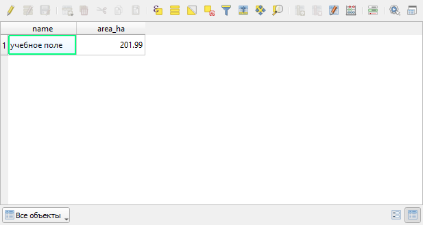
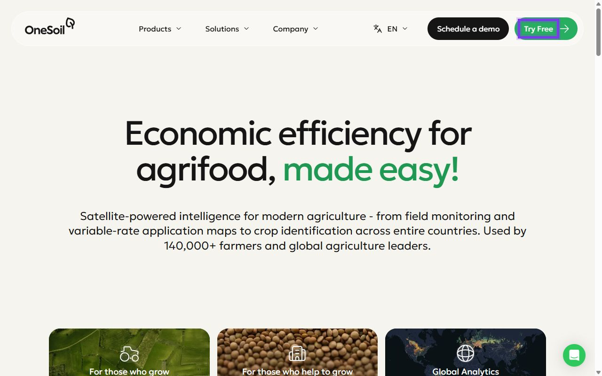
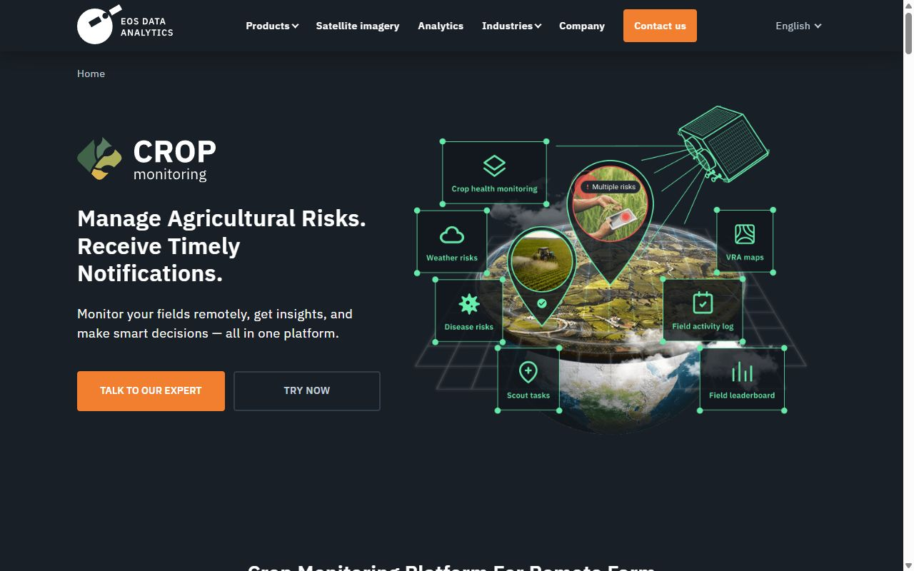
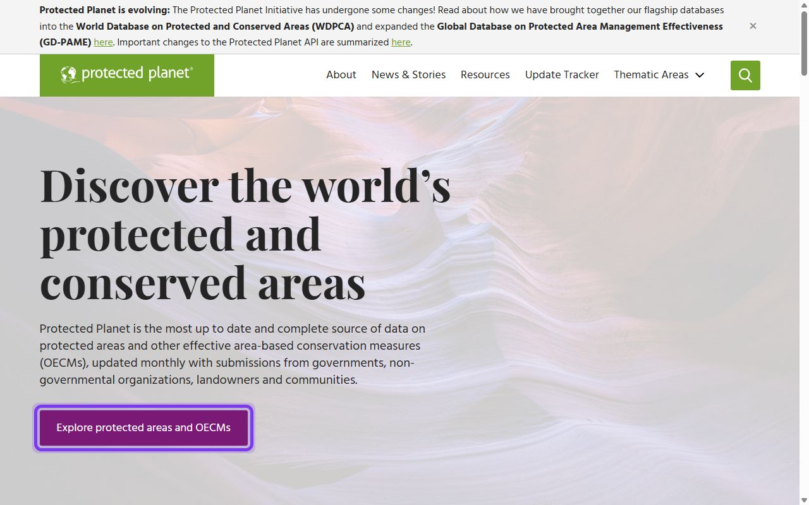
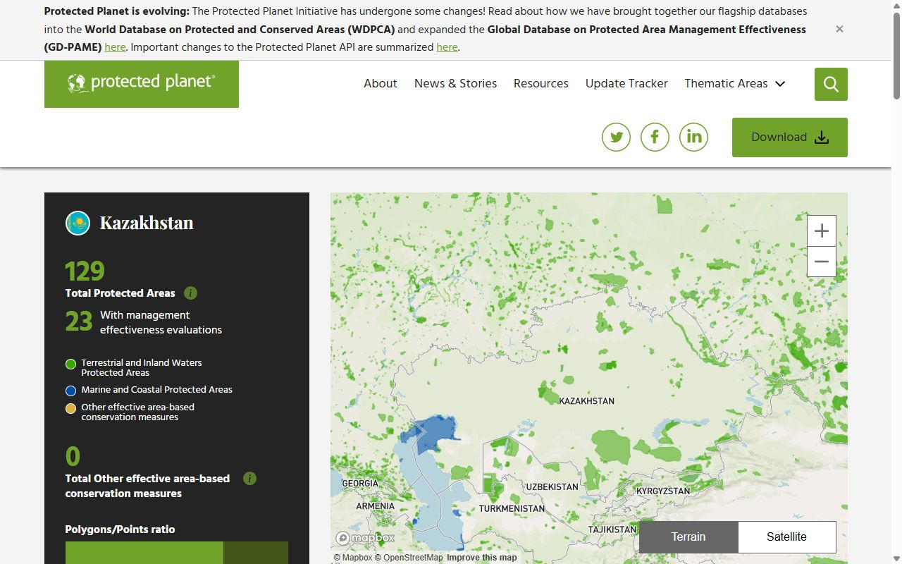
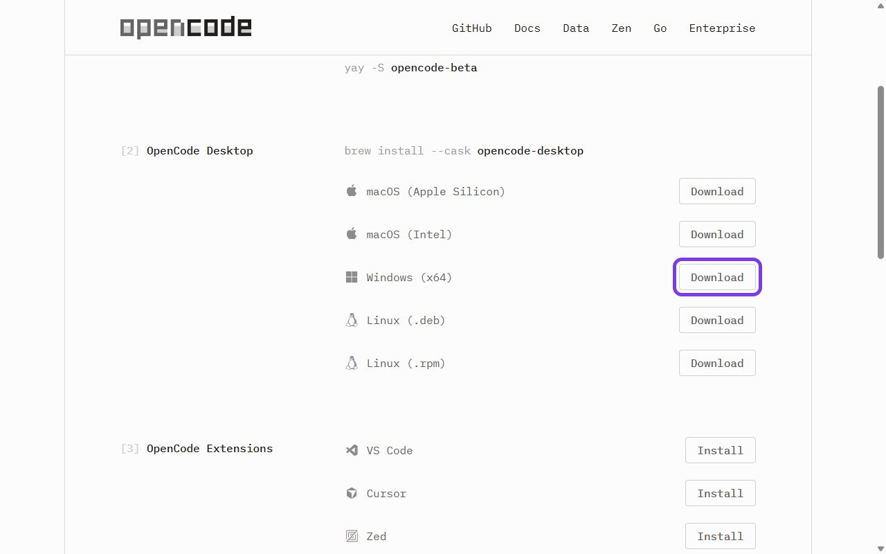
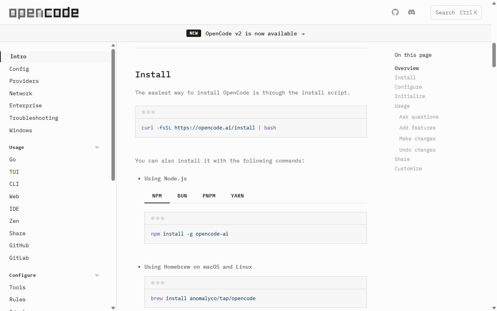
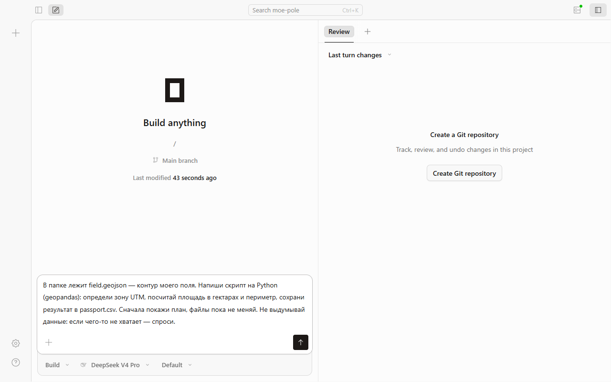
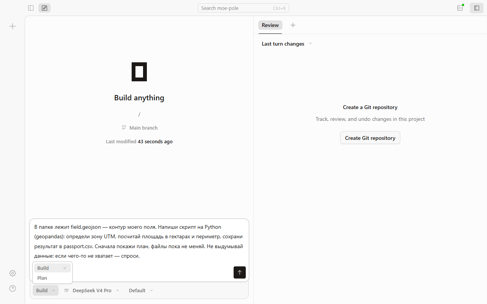

# Программы и сервисы курса: где взять и как начать

Эта страница — для тех, кто видит программу впервые. Снимки экрана сделаны 8 октября 2026 года; если сайт с тех пор изменился, ищите кнопку с тем же названием. По каждому инструменту: **зачем он нужен в курсе, где его взять, что нажать при первом запуске и как понять, что всё получилось.** Всё перечисленное бесплатно, если не сказано иное.

!!! info "Что нужно в любом случае"
    Компьютер с браузером (Chrome, Edge или Firefox) и интернет. Большая часть упражнений выполняется прямо на сайте — во встроенном редакторе Python, без установки и без регистрации. Отдельные программы нужны только в практикумах, и на странице каждого практикума перечислено, какие именно.

| Инструмент | Нужна установка | Нужна регистрация | Где используется чаще всего |
|---|---|---|---|
| [Встроенный редактор Python](#python) | нет | нет | все модули |
| [QGIS](#qgis) | да, ~1 ГБ | нет | А1, А2, А5, А6, П1, П2, П5, П6, П11–П13 |
| [Copernicus Browser](#copernicus) | нет | для скачивания | А1–А6, П2, П3, П6, П7, П13 |
| [Google Colab](#colab) | нет | аккаунт Google | А2–А6, П4, П7, П11 |
| [Google Earth Engine](#gee) | нет | аккаунт Google + регистрация проекта | А3–А6 |
| [QField](#qfield) | приложение на телефон | нет | П1 |
| [OpenDroneMap / WebODM](#webodm) | да (по желанию) | нет | А1, П7 |
| [OneSoil, EOSDA](#agro) | нет | да | П3 |
| [NASA POWER](#nasa-power) | нет | нет | П4, П12 |
| [GBIF, Protected Planet](#bio) | нет | для скачивания | П13 |
| [Таблицы: LibreOffice, Google Таблицы](#office) | по желанию | — | П1, П8–П10, П12, П14, П15 |
| [OpenCode — ИИ-агент](#opencode) | да (по желанию) | ключ доступа к модели | ИИ-задания А1–А6 |

---

## Встроенный редактор Python {#python}

**Зачем.** Запускать учебные расчёты прямо в уроке: таблицы, графики, карты точек.

**Где взять.** Ничего скачивать не нужно. Редактор находится в каждом уроке на шаге **«Практика в Python»** (квадратик с этим названием в полосе шагов над заголовком урока). Все упражнения одним списком — на странице [Python-практика](python-practice.md).

{ .folur-shot loading=lazy }

*Редактор в уроке: кнопка «Запустить» под кодом, ниже — готовый запрос для нейросети.*

{ .folur-shot loading=lazy }

*Пример результата: таблицы под кодом и кнопки скачивания файлов.*

{ .folur-shot loading=lazy }

*Вкладка «Мой участок»: координаты поля, контур и снимок подставляются здесь.*

**Первый запуск.**

1. Откройте шаг «Практика в Python» и прочитайте задание над редактором.
2. Нажмите кнопку **▶ Запустить** под кодом. В первый раз загружается сам Python — подождите до минуты, пока в строке состояния не появится «Готово к запуску».
3. Результат — таблицы, графики, файлы для скачивания — появится ниже, в блоке «Результат».
4. Измените число в коде (например, порог) и запустите ещё раз. Кнопка «Восстановить пример» возвращает исходный код.

**Свои данные.** Каждое упражнение сразу работает на учебном наборе. Если упражнение умеет читать ваш файл, в блоке **«Свои данные и возможности среды»** есть строка с именем файла и кнопка **«Подставить свой файл»**: выберите файл на компьютере — переименовывать его не нужно. Кнопка «Вернуть учебные данные» отменяет замену. Файлы остаются в вашем браузере и никуда не отправляются.

**Свой участок.** Над редактором есть вкладка **«Мой участок»**. В ней можно вставить координаты своего поля (по точке в строке: широта, долгота) или загрузить его контур — GeoJSON, KML, GeoPackage либо Shapefile одним архивом `.zip` — и снимок в формате GeoTIFF. В ответ вы получите паспорт данных, площадь в гектарах, систему координат и оценку съёмки. Загруженное сохраняется в вашем браузере и остаётся доступным в следующих уроках.

**То же самое — через нейросеть.** Под кодом каждого упражнения есть готовый запрос для любой нейросети: в нём названы задача, данные и параметры. Фиолетовым и в коде, и в запросе выделено главное — что стоит менять и какие данные используются. Кнопка «Скопировать запрос» копирует его вместе с кодом. Ответ нейросети сверяйте с результатом редактора.

**Как понять, что получилось.** Под кодом появились таблица или график, а в строке состояния нет слова «ошибка».

**Чего редактор не умеет.** Он работает без доступа в интернет: не скачивает спутниковые снимки и не входит в Google Earth Engine. Такие задания в уроках помечены как расширенные и выполняются в [Google Colab](#colab) или [QGIS](#qgis).

---

## QGIS — настольная ГИС {#qgis}

**Зачем.** Собирать карты: границы полей, снимки, рельеф, расчёт площадей, оформление карты для печати.

**Где взять.** Официальная страница загрузки — <https://qgis.org/download/>. Выбирайте версию с пометкой **LTR** (Long Term Release, версия долгосрочной поддержки) — она стабильнее.

{ .folur-shot loading=lazy }

*Страница загрузки QGIS: нужная кнопка — «Download LTR». Нужное место обведено фиолетовым.*

**Установка (Windows).**

1. Сайт сначала предложит пожертвование — оно необязательно: нажмите «Skip it and go to download». Затем скачайте установщик LTR-версии кнопкой «Download LTR» (файл `.msi`, около 1 ГБ).
2. Запустите скачанный файл и нажимайте «Next» / «Далее», ничего не меняя. Установка занимает 5–10 минут.
3. В меню «Пуск» появится папка QGIS. Запускайте ярлык **QGIS Desktop** (не «QGIS Server» и не «OSGeo4W Shell»).

Для macOS и Linux на той же странице есть свои инструкции.

**Русский интерфейс.** Если меню на английском: «Settings → Options → General» → поставьте галочку «Override System Locale» → выберите язык «Русский» → перезапустите QGIS. В русском интерфейсе этот путь называется «Настройки → Параметры → Общие → Переопределить системную локаль».

**Первые шаги.**

1. **Создайте и сохраните проект:** «Проект → Сохранить как…», выберите папку и имя, например `ferma.qgz`. Сохраняйте после каждого шага (Ctrl+S).
2. **Добавьте карту-подложку.** В левой панели «Браузер» раскройте «XYZ Тайлы» и дважды щёлкните «OpenStreetMap» — в окне появится карта мира.
3. **Установите модуль (плагин), когда его просит урок:** «Модули → Управление модулями…» → вкладка «Все» → в строке поиска наберите название (например, `QuickMapServices` или `QuickOSM`) → кнопка «Установить модуль».
4. **Откройте свой файл:** «Слой → Добавить слой → Добавить векторный слой…» (границы, точки) или «Добавить растровый слой…» (снимок, рельеф). Проще — перетащить файл мышью в окно карты.

**Что где находится.**

| Что нужно сделать | Где это в QGIS (русский интерфейс) |
|---|---|
| Создать свой слой для оцифровки полей | «Слой → Создать слой → Создать слой GeoPackage…» |
| Включить рисование | выделите слой в панели «Слои» → кнопка с карандашом «Режим редактирования» |
| Нарисовать контур поля | кнопка «Добавить полигональный объект» |
| Чтобы соседние поля не перекрывались | панель прилипания → «Избегать наложения» |
| Посмотреть таблицу слоя | правой кнопкой по слою → «Открыть таблицу атрибутов» |
| Посчитать площадь | в таблице атрибутов → «Калькулятор полей», выражение `$area / 10000` даёт гектары |
| Задать систему координат проекта | «Проект → Свойства…» → «Система координат» |
| Сохранить слой в другой файл или проекцию | правой кнопкой по слою → «Экспорт → Сохранить объекты как…» |
| Раскрасить слой по значениям колонки | правой кнопкой по слою → «Свойства…» → «Стиль» → «Уникальные значения» |
| Посчитать уклоны по рельефу | «Растр → Анализ → Уклон…» |
| Найти любой инструмент по названию | «Обработка → Панель инструментов» и строка поиска |
| Оформить карту для печати | «Проект → Создать макет…» |
| Сохранить вид карты картинкой | «Проект → Импорт/Экспорт → Сохранить карту как изображение…» |

**Частая ошибка.** Площадь получается вида `0,0002`: слой хранится в градусах (EPSG:4326). Сохраните его в метрической проекции зоны UTM вашего района («Экспорт → Сохранить объекты как…», для Северного Казахстана — EPSG:32641, EPSG:32642 или EPSG:32643, по долготе района) и посчитайте заново.

**Как понять, что получилось.** В окне карты видна подложка, в панели «Слои» слева есть ваш слой, проект открывается заново после закрытия программы.

{ .folur-shot loading=lazy }

*QGIS в работе (русский интерфейс): слева панели «Браузер» и «Слои», в центре — учебное поле на подложке OpenStreetMap с подписью площади, внизу справа — система координат проекта.*

{ .folur-shot loading=lazy }

*Таблица атрибутов слоя: в колонке area_ha — площадь в гектарах.*

!!! note "О названиях пунктов меню"
    Названия пунктов меню на этой странице и в уроках сверены с русским интерфейсом QGIS 3.40 LTR. На странице загрузки версия со временем меняется (на снимке от 8 октября 2026 года — LTR 3.44); в других версиях отдельные пункты могут называться немного иначе — ищите по смыслу или через «Обработка → Панель инструментов».

Справка на русском: <https://docs.qgis.org/latest/ru/docs/user_manual/>.

---

## Copernicus Browser — спутниковые снимки в браузере {#copernicus}

**Зачем.** Смотреть и скачивать бесплатные снимки Sentinel-2 по своему полю: обычное цветное изображение и готовые индексы, например NDVI.

**Где взять.** Откройте <https://browser.dataspace.copernicus.eu/> — устанавливать ничего не нужно.

{ .folur-shot loading=lazy }

*Первое окно Copernicus Browser: «Use anonymously» — смотреть без регистрации. Нужное место обведено фиолетовым.*

**Регистрация.** Нужна для скачивания снимков. Кнопка входа — в левом верхнем углу; выберите регистрацию, укажите почту и подтвердите её по ссылке из письма. Подробно: <https://documentation.dataspace.copernicus.eu/Registration.html>.

**Первые шаги.**

1. Найдите своё место на карте: строка поиска справа вверху или колёсико мыши.
2. В левой панели выберите источник **Sentinel-2 L2A** и задайте наибольшую допустимую облачность (например, 20 %).
3. Выберите дату в календаре: дни, когда есть снимки, в нём отмечены.
4. В списке слоёв переключайте «True color» (как видит глаз) и «NDVI».
5. Чтобы скачать картинку, нажмите кнопку загрузки в правой панели инструментов; для работы в QGIS выбирайте формат GeoTIFF.

**Как понять, что получилось.** На карте виден снимок без облаков над вашим участком, слева указана его дата.

**Что помнить.** Один пиксель Sentinel-2 — 10 × 10 метров: поля и крупные пятна видны, отдельные рядки и растения — нет.

---

## Google Colab — Python в облаке {#colab}

**Зачем.** Для расширенных заданий на реальных данных, которым нужен интернет: скачать снимки, обратиться к Google Earth Engine, обучить модель. Учебные примеры курса запускаются [во встроенном редакторе](#python) и Colab не требуют.

**Где взять.** <https://colab.research.google.com/> — работает в браузере. Нужен аккаунт Google.

{ .folur-shot loading=lazy }

*Начальная страница Google Colab: «Sign in» и «New notebook». Нужное место обведено фиолетовым.*

**Первые шаги.**

1. Войдите под своим аккаунтом Google и создайте новый блокнот (в меню «Файл»).
2. Блокнот состоит из ячеек. Вставьте код из урока в ячейку и нажмите кнопку ▶ слева от неё или Shift+Enter.
3. Чтобы загрузить свой файл, откройте значок папки в левой панели и нажмите кнопку загрузки.
4. Чтобы поставить недостающую библиотеку, выполните в ячейке строку вида `!pip install geopandas`.

**Что помнить.** Сессия временная: после перерыва загруженные файлы исчезают, а ячейки нужно выполнить заново сверху вниз. Готовые блокноты курса пока не опубликованы — код берётся из урока.

{ .folur-shot loading=lazy }

*Учебный блокнот «Welcome to Colab» открывается и без входа: текст и ячейки с кодом идут сверху вниз.*

---

## Google Earth Engine — спутниковые архивы и расчёты {#gee}

**Зачем.** Считать по многолетним архивам снимков без скачивания: композиты, ряды NDVI, маски воды. Нужен в расширенных заданиях академических модулей.

**Где взять.** <https://earthengine.google.com/> → кнопка начала работы. Редактор кода: <https://code.earthengine.google.com/>.

{ .folur-shot loading=lazy }

*Сайт Google Earth Engine: «Get Started» в меню справа вверху. Нужное место обведено фиолетовым.*

**Регистрация.** Нужны аккаунт Google и регистрация проекта: мастер регистрации спросит назначение — выбирайте некоммерческое использование (обучение, исследования), оно бесплатно. Условия доступа: <https://developers.google.com/earth-engine/guides/access>.

**Что помнить.** Earth Engine работает только через интернет и только после регистрации, поэтому во встроенном редакторе курса он недоступен. Из Python он вызывается в [Google Colab](#colab).

{ .folur-shot loading=lazy }

*Страница набора Sentinel-2 в каталоге Earth Engine: строка «Earth Engine Snippet» — имя набора, которое вставляют в код.*

---

## QField — карта в телефоне {#qfield}

**Зачем.** Записывать наблюдения в поле с автоматическими координатами и временем, в том числе без связи.

**Где взять.** Приложение **QField** в магазине приложений телефона (Google Play или App Store). Сайт: <https://qfield.org/>, справка для начинающих: <https://docs.qfield.org/get-started/>.

{ .folur-shot loading=lazy }

*Сайт QField: кнопка «Get started» ведёт к ссылкам на магазины приложений. Нужное место обведено фиолетовым.*

**Как это устроено.** Проект с картой и формой записи готовится на компьютере в [QGIS](#qgis) и переносится на телефон; в поле вы открываете его в QField, ставите точку и заполняете форму. Вечером данные возвращаются в QGIS.

{ .folur-shot loading=lazy }

*Раздел «Get started» в справке QField: шаги от проекта QGIS до сбора данных в поле.*

---

## OpenDroneMap и WebODM — обработка снимков с дрона {#webodm}

**Зачем.** Собирать из набора аэроснимков единую карту (ортофотоплан).

**Нужно ли ставить.** Для курса — не обязательно: в уроках можно работать с готовым ортофотопланом. Установка нужна, только если хотите пройти обработку сами. Страница загрузки: <https://webodm.org/download/> — выберите свою операционную систему и следуйте инструкции на этой же странице. Установка сложнее остальных программ курса и требует мощного компьютера. Документация: <https://docs.opendronemap.org/installation/>.

{ .folur-shot loading=lazy }

*Страница загрузки WebODM: выбор операционной системы.*

**Учебные снимки.** Открытые наборы для пробы: <https://github.com/OpenDroneMap/ODMdata>. Готовые ортофотопланы: <https://openaerialmap.org/>.

---

## OneSoil и EOSDA Crop Monitoring — готовые сервисы мониторинга {#agro}

**Зачем.** Смотреть NDVI по своим полям без программ и кода.

**Где взять.** OneSoil — <https://onesoil.ai/> (веб-версия и приложение на телефон). EOSDA Crop Monitoring — <https://eos.com/products/crop-monitoring/>. Оба требуют регистрации; у EOSDA часть функций платная — перед оплатой проверьте, что нужное есть в пробном доступе.

{ .folur-shot loading=lazy }

*Сайт OneSoil: вход — кнопка «Try Free». Нужное место обведено фиолетовым.*

{ .folur-shot loading=lazy }

*Страница EOSDA Crop Monitoring: вход — кнопка «Try now».*

**Первые шаги.** Зарегистрируйтесь, найдите своё хозяйство на карте, обведите или выберите поле — сервис сам покажет карту NDVI и график по сезону.

---

## NASA POWER — погода и климат по точке {#nasa-power}

**Зачем.** Получить осадки, температуру и испаряемость для любой точки за многие годы.

**Где взять.** <https://power.larc.nasa.gov/data-access-viewer/> — без регистрации.

{ .folur-shot loading=lazy }

*NASA POWER Data Access Viewer: данные по одной точке — «Single Point». Нужное место обведено фиолетовым.*

**Первые шаги.** Выберите сообщество данных «Agroclimatology», укажите точку на карте, период и нужные показатели, формат — CSV, и скачайте файл. Его можно открыть в таблицах или подставить в упражнение встроенного редактора.

{ .folur-shot loading=lazy }

*Панель «Single Point»: тип данных, период и поля Latitude / Longitude для координат точки.*

---

## GBIF и Protected Planet — виды и охраняемые территории {#bio}

**GBIF** — <https://www.gbif.org/>: открытая база находок видов. Искать и смотреть можно без регистрации; для скачивания нужна бесплатная учётная запись. В поиске находок задайте страну или обведите область на карте.

{ .folur-shot loading=lazy }

*Сайт GBIF: поиск находок видов — «Occurrences». Нужное место обведено фиолетовым.*

**Protected Planet** — <https://www.protectedplanet.net/>: карта охраняемых территорий мира. Найдите Казахстан и нужную территорию; границы можно скачать для некоммерческого использования.

{ .folur-shot loading=lazy }

*Сайт Protected Planet: кнопка «Explore protected areas and OECMs». Нужное место обведено фиолетовым.*

**Что помнить.** Список видов из GBIF показывает, что вид отмечали в районе, а не что он живёт на вашем поле; точные режимы и границы охраняемых территорий берутся из официальных источников Республики Казахстан.

{ .folur-shot loading=lazy }

*GBIF в работе: находки видов с фильтром «Country or area: Kazakhstan» на карте.*

{ .folur-shot loading=lazy }

*Protected Planet в работе: страница Казахстана с картой охраняемых территорий.*

---

## Таблицы: LibreOffice Calc и Google Таблицы {#office}

**Зачем.** Вести журналы, считать бюджеты и балансы там, где программирование не нужно.

**Где взять.** LibreOffice — бесплатный офисный пакет, устанавливается на компьютер: <https://www.libreoffice.org/download/download-libreoffice/>. Google Таблицы работают в браузере под аккаунтом Google. Подойдёт и Microsoft Excel, если он у вас есть.

{ .folur-shot loading=lazy }

*Страница загрузки LibreOffice: кнопка для Windows. Нужное место обведено фиолетовым.*

**Что помнить.** Чтобы таблицу прочитал встроенный редактор или QGIS, сохраняйте её в формате **CSV** («Файл → Сохранить как…» → тип файла «Текст CSV»).

---

## OpenCode — ИИ-агент, который пишет и запускает код {#opencode}

**Зачем.** В ИИ-заданиях академических модулей (А1–А6) нейросети поручают написать и проверить скрипт. OpenCode — открытый (open source) агент для такой работы: он читает файлы в выбранной папке, предлагает план, пишет код и запускает его. Работает как приложение, в терминале и как расширение редактора кода. Заменяем любым аналогом, а все задания курса выполнимы и без ИИ.

**Где взять.** Официальная страница загрузки — <https://opencode.ai/download>.

{ .folur-shot loading=lazy }

*Страница загрузки OpenCode. Нужное место обведено фиолетовым.*

**Установка.**

1. **Проще всего — приложение.** В разделе «OpenCode Desktop» в строке «Windows (x64)» нажмите «Download», запустите скачанный файл. Для macOS и Linux — соседние строки.
2. **Вариант для терминала.** Команды установки приведены на той же странице и в документации <https://opencode.ai/docs/>. Они меняются от версии к версии, поэтому копируйте их с сайта, а не из старых инструкций.

{ .folur-shot loading=lazy }

*Раздел «Install» в документации OpenCode: команды установки для терминала.*

**Подключение модели.** Сам OpenCode бесплатен, но ему нужна нейросеть-«двигатель». Команда `/connect` открывает список поставщиков моделей: выберите поставщика и вставьте свой ключ доступа (API key). Работа модели оплачивается у её поставщика по его тарифу — до начала проверьте стоимость и установите лимит расходов в кабинете поставщика.

**Первые шаги.**

1. Создайте **отдельную пустую папку** под задание и положите в неё только учебные файлы (например, контур поля `field.geojson`).
2. Откройте эту папку в OpenCode: в приложении — выбором папки, в терминале — перейдите в папку и наберите `opencode`.
3. Напишите задачу в поле внизу окна: какой файл взять, что посчитать, в каких единицах и куда сохранить результат.
4. Под полем ввода переключите режим с **Build** на **Plan** (в терминале — клавиша Tab). В режиме Plan агент только предлагает план и ничего не меняет.
5. Прочитайте план. Если он верен — переключитесь на Build и попросите выполнить.

{ .folur-shot loading=lazy }

*Окно OpenCode: запрос набран, под ним — режим (Build), выбранная модель и кнопка отправки.*

{ .folur-shot loading=lazy }

*Переключатель режимов: Plan — только план, Build — агент меняет файлы и запускает код.*

**Рекомендации для заданий курса.**

| Что делать | Зачем |
|---|---|
| Начинать с режима **Plan**, в Build переходить после проверки плана | вы видите, что агент собирается делать, до того как он изменит файлы |
| Называть в запросе **файл, нужный результат, единицы и систему координат** | это те же места, что выделены фиолетовым в запросах [встроенного редактора](#python); без них агент додумывает сам |
| Добавлять фразу «**Не выдумывай данные: если чего-то не хватает — спроси**» | агент иначе подставит правдоподобные, но несуществующие числа |
| Работать в **отдельной папке** с учебными файлами | агент читает и меняет всё, что лежит в открытой папке |
| Не класть в папку персональные данные, договоры и точные координаты чужих участков | содержимое файлов отправляется поставщику модели |
| **Сверять числа**: площадь — с QGIS или вкладкой «Мой участок», расчёты — со встроенным редактором | агент ошибается уверенно; в курсе засчитывается проверенный результат |
| Просить сохранить скрипт и объяснить каждую строку | результат можно повторить без ИИ и показать преподавателю |
| Если агент испортил файлы — команда `/undo` (вернуть обратно — `/redo`) | отменяет последнее изменение |
| Не использовать `/share` с непубличными данными | команда создаёт ссылку на весь разговор |
| В начале работы над проектом выполнить `/init` | агент изучит папку и запишет правила проекта в файл `AGENTS.md` |

**Как понять, что получилось.** В папке появился скрипт и файл с результатом, скрипт запускается повторно без агента, а числа совпадают с вашей проверкой.

Документация: <https://opencode.ai/docs/>.

---

## Если что-то не получается

- **Редактор Python долго «думает».** Первый запуск загружает Python — подождите минуту. Если ничего не изменилось, обновите страницу и запустите ещё раз.
- **QGIS показывает пустую карту.** Правой кнопкой по слою → «Увеличить до слоя».
- **Слои «разъезжаются».** У них разные системы координат: проверьте систему координат каждого слоя в его свойствах.
- **Снимок не скачивается из Copernicus Browser.** Проверьте, что вы вошли в учётную запись.
- **В уроке названа программа, которой нет на этой странице.** Напишите преподавателю — добавим.
